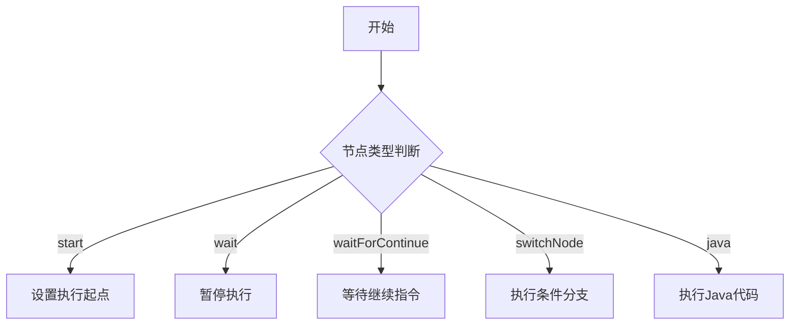
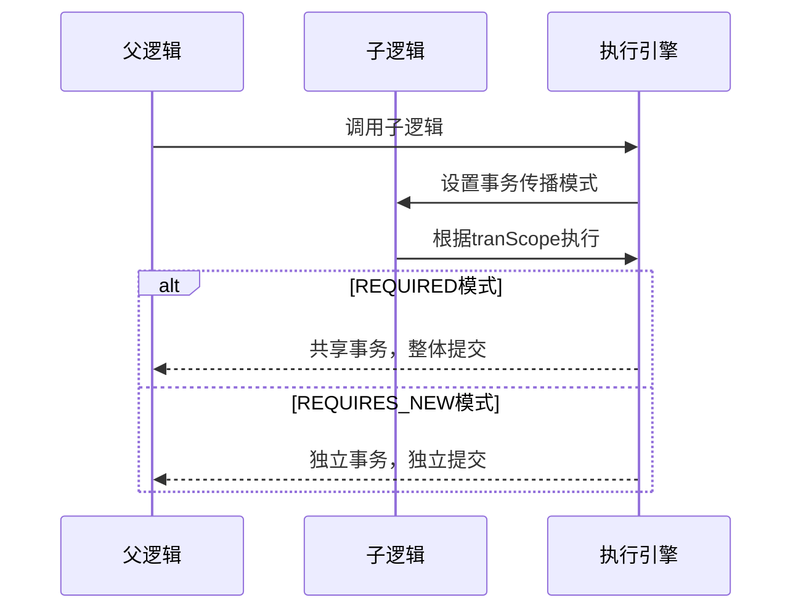
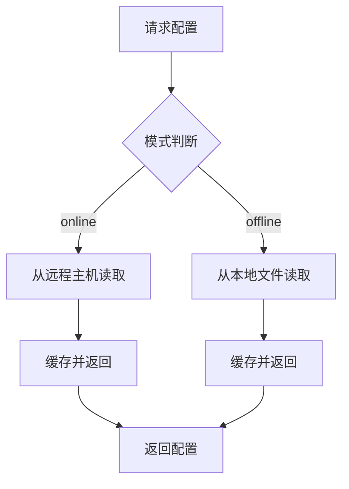
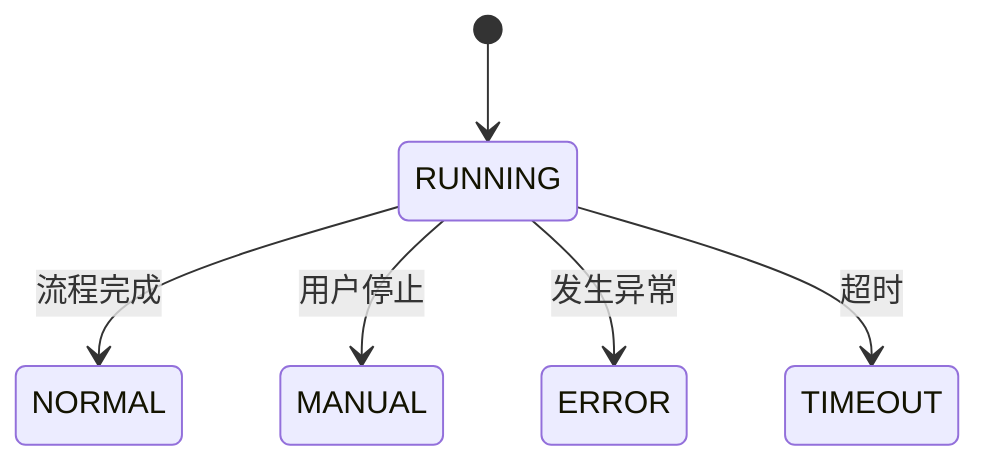

# 枚举类型模型

<cite>
**本文档中引用的文件**  
- [LogicItemType.java](file://logic-runtime/src/main/java/com/aims/logic/runtime/contract/enums/LogicItemType.java)
- [LogicItemTransactionScope.java](file://logic-runtime/src/main/java/com/aims/logic/runtime/contract/enums/LogicItemTransactionScope.java)
- [LogicConfigModelEnum.java](file://logic-runtime/src/main/java/com/aims/logic/runtime/contract/enums/LogicConfigModelEnum.java)
- [LogicStopModel.java](file://logic-runtime/src/main/java/com/aims/logic/runtime/contract/enums/LogicStopModel.java)
- [ConceptEnum.java](file://logic-runtime/src/main/java/com/aims/logic/runtime/contract/enums/ConceptEnum.java)
- [KeepBizVersionEnum.java](file://logic-runtime/src/main/java/com/aims/logic/runtime/contract/enums/KeepBizVersionEnum.java)
- [TypeKindEnum.java](file://logic-runtime/src/main/java/com/aims/logic/runtime/contract/enums/TypeKindEnum.java)
- [LogicSysEnvDto.java](file://logic-runtime/src/main/java/com/aims/logic/runtime/env/LogicSysEnvDto.java)
- [LogicRunnerServiceImpl.java](file://logic-sdk/src/main/java/com/aims/logic/sdk/LogicRunnerServiceImpl.java)
- [LogicConfigStoreServiceImpl.java](file://logic-runtime/src/main/java/com/aims/logic/runtime/store/impl/LogicConfigStoreServiceImpl.java)
- [LogicRunner.java](file://logic-runtime/src/main/java/com/aims/logic/runtime/runner/LogicRunner.java)
- [FunctionContext.java](file://logic-runtime/src/main/java/com/aims/logic/runtime/runner/FunctionContext.java)
- [LogicRunResult.java](file://logic-runtime/src/main/java/com/aims/logic/runtime/contract/dto/LogicRunResult.java)
- [LogicLog.java](file://logic-runtime/src/main/java/com/aims/logic/runtime/contract/logger/LogicLog.java)
- [BaseLASL.java](file://logic-runtime/src/main/java/com/aims/logic/runtime/contract/dsl/basic/BaseLASL.java)
- [TypeParamTreeNode.java](file://logic-runtime/src/main/java/com/aims/logic/runtime/contract/dsl/basic/TypeParamTreeNode.java)
- [TypeAnnotationTreeNode.java](file://logic-runtime/src/main/java/com/aims/logic/runtime/contract/dsl/basic/TypeAnnotationTreeNode.java)
</cite>

## 目录
1. [引言](#引言)
2. [节点类型枚举（LogicItemType）](#节点类型枚举logicitemtype)
3. [事务传播行为枚举（LogicItemTransactionScope）](#事务传播行为枚举logicitemtransactionscope)
4. [配置模式枚举（LogicConfigModelEnum）](#配置模式枚举logicconfigmodelenum)
5. [执行终止模型枚举（LogicStopModel）](#执行终止模型枚举logicstopmodel)
6. [概念建模枚举（ConceptEnum）](#概念建模枚举conceptenum)
7. [版本保留策略枚举（KeepBizVersionEnum）](#版本保留策略枚举keepbizversionenum)
8. [数据类型体系枚举（TypeKindEnum）](#数据类型体系枚举typekindenum)

## 引言
本文档系统梳理了逻辑执行引擎中的核心枚举类型模型，涵盖节点类型、事务传播、配置模式、执行终止、概念建模、版本保留及数据类型体系等关键设计。这些枚举在系统架构中承担着定义行为模式、控制流程路由、管理配置策略和确保数据一致性的核心职责，是理解系统运行机制的重要基础。

## 节点类型枚举LogicItemType
`LogicItemType` 定义了逻辑流程中各类节点的类型，用于在执行引擎中进行节点识别与路由分发。

### 枚举值及其业务含义
| 枚举值 | 对应值 | 业务含义 | 使用场景 |
|--------|--------|----------|----------|
| `start` | `"start"` | 流程起始节点 | 标识逻辑流程的入口，控制执行起点 |
| `wait` | `"wait"` | 等待节点 | 暂停执行，等待外部信号或条件满足 |
| `waitForContinue` | `"wait-for-continue"` | 等待继续节点 | 显式等待用户或系统指令以继续执行 |
| `switchNode` | `"switch"` | 条件分支节点 | 实现多路条件判断，控制流程走向 |
| `switchCaseNode` | `"switch-case"` | 分支条件节点 | `switch` 节点的分支选项 |
| `switchDefaultNode` | `"switch-default"` | 默认分支节点 | `switch` 节点的默认执行路径 |
| `java` | `"java"` | Java代码执行节点 | 执行内联Java代码逻辑 |

### 前后端交互与序列化
该枚举通过 `value` 字段进行序列化，前端通过字符串值（如 `"start"`）与后端交互，执行引擎通过 `equalsTo()` 方法进行类型匹配。

**图示来源**
- [LogicItemType.java](file://logic-runtime/src/main/java/com/aims/logic/runtime/contract/enums/LogicItemType.java#L4-L24)
- [LogicRunner.java](file://logic-runtime/src/main/java/com/aims/logic/runtime/runner/LogicRunner.java#L263)
- [LogicRunnerServiceImpl.java](file://logic-sdk/src/main/java/com/aims/logic/sdk/LogicRunnerServiceImpl.java#L412)

**本节来源**
- [LogicItemType.java](file://logic-runtime/src/main/java/com/aims/logic/runtime/contract/enums/LogicItemType.java#L4-L24)

## 事务传播行为枚举LogicItemTransactionScope
`LogicItemTransactionScope` 定义了逻辑执行过程中的事务传播行为，尤其在分布式或嵌套调用场景下控制数据提交策略。

### 枚举值及其应用场景
| 枚举值 | 对应值 | 业务含义 | 分布式事务应用 |
|--------|--------|----------|----------------|
| `off` | `"off"` | 关闭事务 | 不进行事务管理，适用于只读或非关键操作 |
| `def` | `"def"` | 默认事务 | 根据上下文自动选择事务策略 |
| `everyJavaNode` | `"everyJavaNode"` | 每个Java节点事务 | 已废弃，历史兼容 |
| `everyNode2` | `"everyNode2"` | 按节点提交，业务异常不中断 | 发生配置的业务异常时继续执行，其他异常中断 |
| `everyNode` | `"everyNode"` | 按节点提交，异常即中断 | 每个节点独立提交，任何异常均中断流程 |
| `everyRequest` | `"everyRequest"` | 每次请求事务 | 整个请求作为一个事务单元提交 |

### 事务传播机制
在嵌套调用中，事务传播行为由父逻辑决定：
- `REQUIRED`：默认行为，复用父事务，整体成功或失败。
- `REQUIRES_NEW`：开启新事务，独立提交。

**图示来源**
- [LogicItemTransactionScope.java](file://logic-runtime/src/main/java/com/aims/logic/runtime/contract/enums/LogicItemTransactionScope.java#L4-L26)
- [LogicRunnerServiceImpl.java](file://logic-sdk/src/main/java/com/aims/logic/sdk/LogicRunnerServiceImpl.java#L354-L447)
- [FunctionContext.java](file://logic-runtime/src/main/java/com/aims/logic/runtime/runner/FunctionContext.java#L58-L62)

**本节来源**
- [LogicItemTransactionScope.java](file://logic-runtime/src/main/java/com/aims/logic/runtime/contract/enums/LogicItemTransactionScope.java#L4-L26)
- [LogicRunnerServiceImpl.java](file://logic-sdk/src/main/java/com/aims/logic/sdk/LogicRunnerServiceImpl.java#L354-L447)

## 配置模式枚举LogicConfigModelEnum
`LogicConfigModelEnum` 用于区分逻辑配置的加载模式，控制配置的来源与版本策略。

### 枚举值与设计意图
| 枚举值 | 对应值 | 设计意图 | 使用场景 |
|--------|--------|----------|----------|
| `online` | `"online"` | 在线模式，从远程主机获取最新配置 | 生产环境，确保配置一致性 |
| `offline` | `"offline"` | 离线模式，从本地文件加载配置 | 开发调试，快速迭代 |

### 配置加载逻辑

**图示来源**
- [LogicConfigModelEnum.java](file://logic-runtime/src/main/java/com/aims/logic/runtime/contract/enums/LogicConfigModelEnum.java#L2-L15)
- [LogicConfigStoreServiceImpl.java](file://logic-runtime/src/main/java/com/aims/logic/runtime/store/impl/LogicConfigStoreServiceImpl.java#L70-L100)

**本节来源**
- [LogicConfigModelEnum.java](file://logic-runtime/src/main/java/com/aims/logic/runtime/contract/enums/LogicConfigModelEnum.java#L2-L15)
- [LogicConfigStoreServiceImpl.java](file://logic-runtime/src/main/java/com/aims/logic/runtime/store/impl/LogicConfigStoreServiceImpl.java#L70-L100)

## 执行终止模型枚举LogicStopModel
`LogicStopModel` 定义了逻辑执行终止的原因，用于记录和分析执行结果。

### 枚举值与控制机制
| 枚举值 | 业务含义 | 触发条件 |
|--------|----------|----------|
| `NORMAL` | 正常结束 | 流程顺利执行完毕 |
| `MANUAL` | 手动终止 | 用户主动停止执行 |
| `ERROR` | 错误终止 | 执行过程中发生异常 |
| `TIMEOUT` | 超时终止 | 执行超过预设时间限制 |

### 终止状态管理
该枚举作为 `LogicRunResult` 和 `LogicLog` 的字段，用于记录执行结果和日志。

**图示来源**
- [LogicStopModel.java](file://logic-runtime/src/main/java/com/aims/logic/runtime/contract/enums/LogicStopModel.java#L2-L7)
- [LogicRunResult.java](file://logic-runtime/src/main/java/com/aims/logic/runtime/contract/dto/LogicRunResult.java#L27)
- [LogicLog.java](file://logic-runtime/src/main/java/com/aims/logic/runtime/contract/logger/LogicLog.java#L109)

**本节来源**
- [LogicStopModel.java](file://logic-runtime/src/main/java/com/aims/logic/runtime/contract/enums/LogicStopModel.java#L2-L7)

## 概念建模枚举ConceptEnum
`ConceptEnum` 在概念建模中定义了系统中的核心抽象概念，用于DSL解析和结构化表示。

### 枚举值与作用
| 枚举值 | 作用 |
|--------|------|
| `TypeAnnotation` | 类型注解概念 |
| `Logic` | 逻辑单元概念 |
| `LogicItem` | 逻辑项概念 |
| `Param` | 参数概念 |
| `Return` | 返回值概念 |
| `Variable` | 变量概念 |
| `EnvParam` | 环境参数概念 |
| `TypeParam` | 类型参数概念（泛型） |

### 在DSL中的应用
该枚举作为 `BaseLASL` 和 `TypeParamTreeNode` 的 `concept` 字段，用于标识节点的语义类型。

**本节来源**
- [ConceptEnum.java](file://logic-runtime/src/main/java/com/aims/logic/runtime/contract/enums/ConceptEnum.java#L2-L14)
- [BaseLASL.java](file://logic-runtime/src/main/java/com/aims/logic/runtime/contract/dsl/basic/BaseLASL.java#L8)
- [TypeParamTreeNode.java](file://logic-runtime/src/main/java/com/aims/logic/runtime/contract/dsl/basic/TypeParamTreeNode.java#L9)

## 版本保留策略枚举KeepBizVersionEnum
`KeepBizVersionEnum` 管理业务实例的版本保留策略，控制是否保持版本一致性。

### 枚举值与管理策略
| 枚举值 | 对应值 | 策略说明 |
|--------|--------|----------|
| `on` | `"on"` | 开启版本保持，使用指定版本执行 |
| `off` | `"off"` | 关闭版本保持，获取最新配置执行 |

### 应用场景
在 `LogicRunnerServiceImpl.runBiz()` 中，根据此策略决定是否传入 `logicVersion`。

**本节来源**
- [KeepBizVersionEnum.java](file://logic-runtime/src/main/java/com/aims/logic/runtime/contract/enums/KeepBizVersionEnum.java#L2-L15)
- [LogicRunnerServiceImpl.java](file://logic-sdk/src/main/java/com/aims/logic/sdk/LogicRunnerServiceImpl.java#L354-L447)

## 数据类型体系枚举TypeKindEnum
`TypeKindEnum` 支持系统中的数据类型体系，用于类型推断和DSL解析。

### 枚举值与类型体系
| 枚举值 | 类型说明 |
|--------|----------|
| `primitive` | 基本类型 |
| `primitiveArray` | 基本类型数组 |
| `reference` | 引用类型 |
| `generic` | 泛型类型 |
| `typeParam` | 类型参数 |
| `function` | 函数类型 |
| `union` | 联合类型 |
| `anonymousStructure` | 匿名结构体 |
| `enumType` | 枚举类型 |

### 在类型系统中的作用
作为 `TypeAnnotationTreeNode` 的 `typeKind` 字段，用于表示类型节点的种类。

**本节来源**
- [TypeKindEnum.java](file://logic-runtime/src/main/java/com/aims/logic/runtime/contract/enums/TypeKindEnum.java#L2-L12)
- [TypeAnnotationTreeNode.java](file://logic-runtime/src/main/java/com/aims/logic/runtime/contract/dsl/basic/TypeAnnotationTreeNode.java#L16)