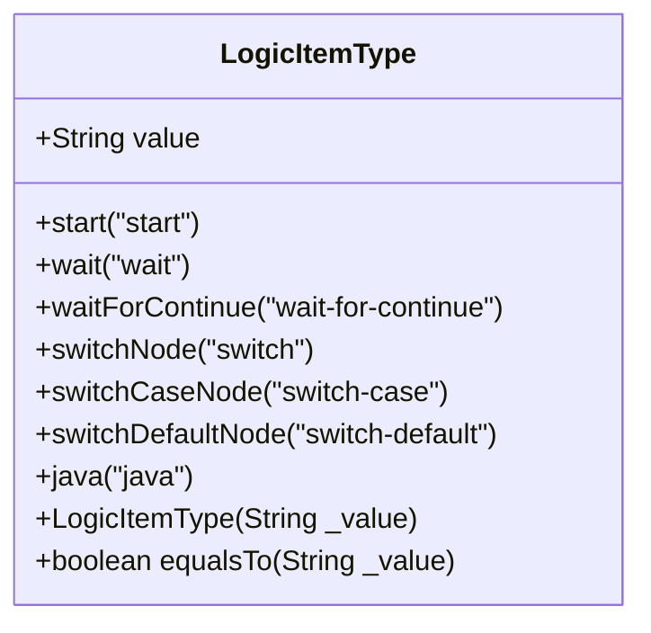
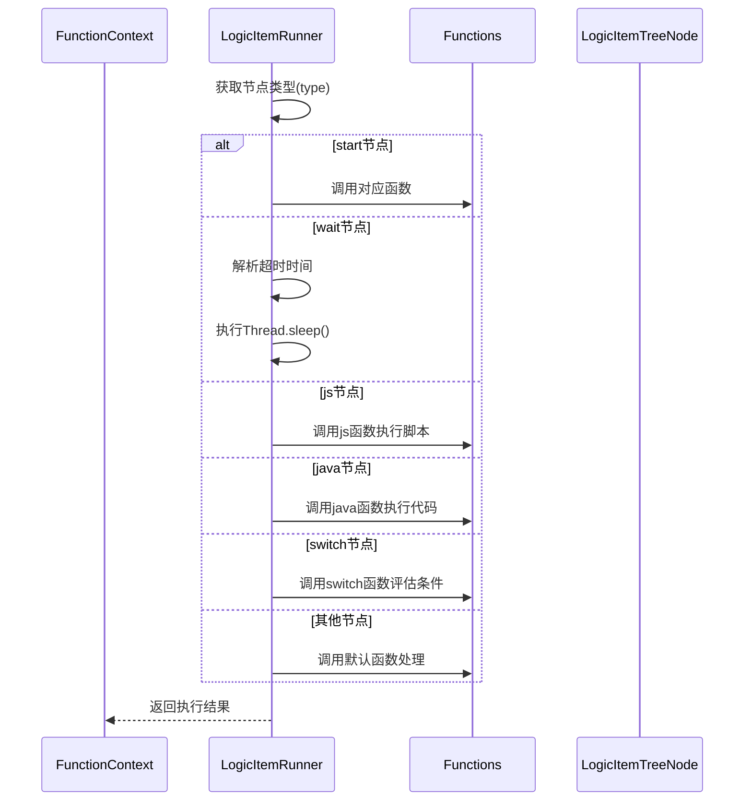
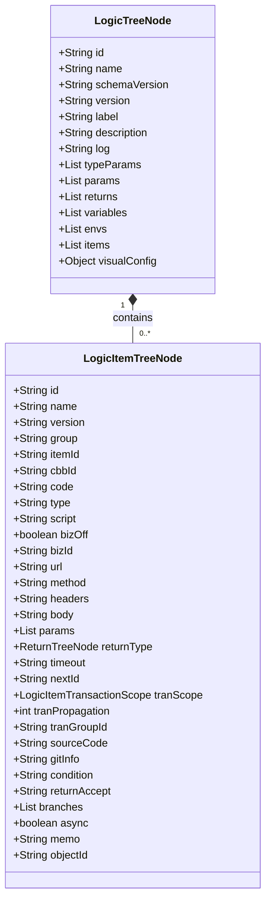

# 节点类型枚举

<cite>
**Referenced Files in This Document**   
- [LogicItemType.java](file://logic-runtime/src/main/java/com/aims/logic/runtime/contract/enums/LogicItemType.java)
- [LogicItemRunner.java](file://logic-runtime/src/main/java/com/aims/logic/runtime/runner/LogicItemRunner.java)
- [LogicItemTreeNode.java](file://logic-runtime/src/main/java/com/aims/logic/runtime/contract/dsl/LogicItemTreeNode.java)
- [start.json](file://logic-ide/src/main/resources/public/setting/forms/start.json)
- [switch.json](file://logic-ide/src/main/resources/public/setting/forms/switch.json)
- [java.json](file://logic-ide/src/main/resources/public/setting/forms/java.json)
</cite>

## 目录
1. [引言](#引言)
2. [核心枚举定义](#核心枚举定义)
3. [节点类型业务语义与执行行为](#节点类型业务语义与执行行为)
4. [执行引擎流程控制机制](#执行引擎流程控制机制)
5. [前后端交互中的序列化示例](#前后端交互中的序列化示例)
6. [类型匹配与处理策略](#类型匹配与处理策略)

## 引言
在可视化逻辑编排系统中，`LogicItemType` 枚举是驱动整个流程执行的核心元数据。该枚举定义了所有可执行节点的类型，为执行引擎提供了流程控制的依据。每个枚举值不仅代表一个图形化节点，更承载着特定的业务语义和执行逻辑，是连接前端配置与后端执行的关键桥梁。

## 核心枚举定义
`LogicItemType` 枚举位于 `logic-runtime` 模块中，定义了逻辑流程中所有可用的节点类型。每个枚举值都关联一个字符串值，该值用于在配置和执行过程中进行类型识别。



**Diagram sources**
- [LogicItemType.java](file://logic-runtime/src/main/java/com/aims/logic/runtime/contract/enums/LogicItemType.java#L4-L24)

**Section sources**
- [LogicItemType.java](file://logic-runtime/src/main/java/com/aims/logic/runtime/contract/enums/LogicItemType.java#L4-L24)

## 节点类型业务语义与执行行为
### start节点
`start` 节点是逻辑流程的入口点，标识流程的开始。它不执行具体业务逻辑，而是触发整个流程的初始化和执行。

### wait节点
`wait` 节点用于在流程中引入延迟。它会根据配置的超时时间（timeout）暂停执行，常用于模拟耗时操作或实现定时任务。

### waitForContinue节点
`waitForContinue` 节点表示流程需要外部信号才能继续执行。它将流程挂起，等待特定事件或用户操作，实现流程的暂停与恢复。

### switchNode节点
`switchNode` 节点实现条件分支路由功能。它根据配置的条件表达式（condition）的计算结果，决定流程的下一个执行路径，是实现复杂业务逻辑的关键。

### switchCaseNode节点
`switchCaseNode` 节点是 `switchNode` 的分支条件节点。每个 `switchCaseNode` 定义了一个具体的匹配条件，当条件满足时，流程将跳转到该分支。

### switchDefaultNode节点
`switchDefaultNode` 节点是 `switchNode` 的默认分支。当所有 `switchCaseNode` 的条件都不满足时，流程将执行默认分支。

### java节点
`java` 节点用于激活Java代码执行器。它通过反射机制调用指定的Java类和方法，执行具体的业务逻辑，是集成外部服务和复杂计算的核心。

## 执行引擎流程控制机制
`LogicItemType` 枚举通过 `LogicItemRunner` 类驱动执行引擎的流程控制。执行引擎根据当前节点的类型，采用不同的处理策略。



**Diagram sources**
- [LogicItemRunner.java](file://logic-runtime/src/main/java/com/aims/logic/runtime/runner/LogicItemRunner.java#L30-L90)

**Section sources**
- [LogicItemRunner.java](file://logic-runtime/src/main/java/com/aims/logic/runtime/runner/LogicItemRunner.java#L10-L91)

## 前后端交互中的序列化示例
在前后端交互中，节点类型通过JSON格式进行序列化。前端配置界面将用户选择的节点类型写入配置对象，后端执行引擎读取该类型并进行处理。

### start节点配置示例
```json
{
  "type": "page",
  "body": [
    {
      "type": "form",
      "title": "节点配置",
      "body": [
        {
          "type": "input-text",
          "label": "名称",
          "name": "name"
        }
      ]
    }
  ]
}
```

**Section sources**
- [start.json](file://logic-ide/src/main/resources/public/setting/forms/start.json)

### switch节点配置示例
```json
{
  "type": "page",
  "body": [
    {
      "type": "form",
      "title": "节点配置",
      "body": [
        {
          "type": "input-text",
          "label": "名称",
          "name": "name"
        },
        {
          "type": "editor",
          "label": "条件表达式",
          "name": "condition",
          "language": "javascript"
        }
      ]
    }
  ]
}
```

**Section sources**
- [switch.json](file://logic-ide/src/main/resources/public/setting/forms/switch.json)

### java节点配置示例
```json
{
  "type": "page",
  "body": [
    {
      "type": "form",
      "title": "节点配置",
      "body": [
        {
          "type": "input-text",
          "label": "名称",
          "name": "name"
        },
        {
          "type": "select",
          "label": "类路径",
          "name": "url"
        },
        {
          "type": "select",
          "label": "方法名",
          "name": "method"
        }
      ]
    }
  ]
}
```

**Section sources**
- [java.json](file://logic-ide/src/main/resources/public/setting/forms/java.json)

## 类型匹配与处理策略
### equalsTo方法
`LogicItemType` 枚举提供了 `equalsTo` 方法，用于与字符串值进行比较。该方法通过比较内部 `value` 字段实现类型匹配，是前后端类型校验的基础。

### LogicTreeNode结构
`LogicTreeNode` 类是逻辑流程的树形结构表示，其 `items` 字段包含一系列 `LogicItemTreeNode` 对象，每个对象代表一个可执行节点。



**Diagram sources**
- [LogicTreeNode.java](file://logic-runtime/src/main/java/com/aims/logic/runtime/contract/dsl/LogicTreeNode.java#L13-L55)
- [LogicItemTreeNode.java](file://logic-runtime/src/main/java/com/aims/logic/runtime/contract/dsl/LogicItemTreeNode.java#L15-L174)

**Section sources**
- [LogicTreeNode.java](file://logic-runtime/src/main/java/com/aims/logic/runtime/contract/dsl/LogicTreeNode.java#L13-L55)
- [LogicItemTreeNode.java](file://logic-runtime/src/main/java/com/aims/logic/runtime/contract/dsl/LogicItemTreeNode.java#L15-L174)

### LogicItemRunner处理策略
`LogicItemRunner` 类根据 `LogicItemTreeNode` 的 `type` 字段值，采用 `switch` 语句分发到不同的处理逻辑。对于 `java` 类型，通过 `Functions.get` 获取对应的执行器并调用 `invoke` 方法；对于 `switchNode`，则调用 `SwitchFunction` 进行条件评估和路由选择。