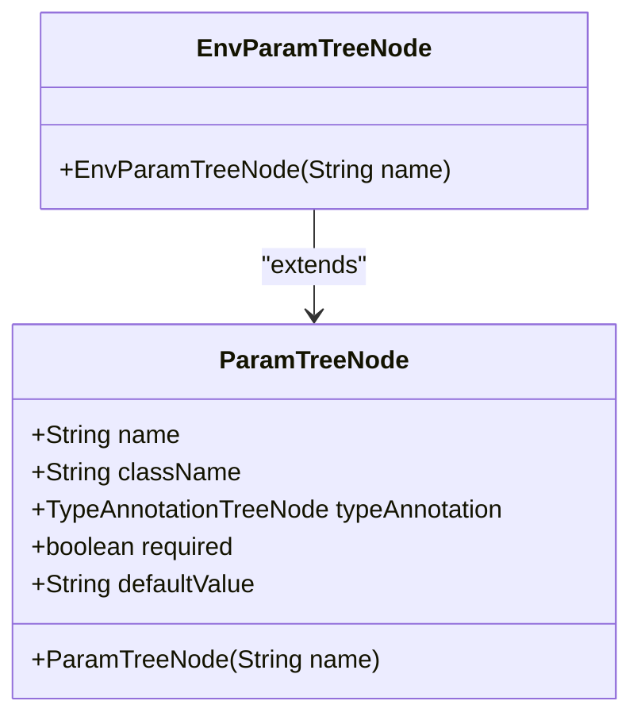
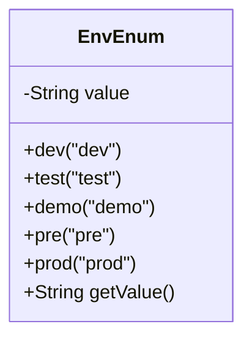
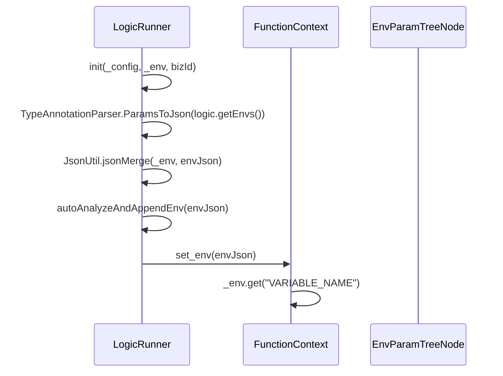
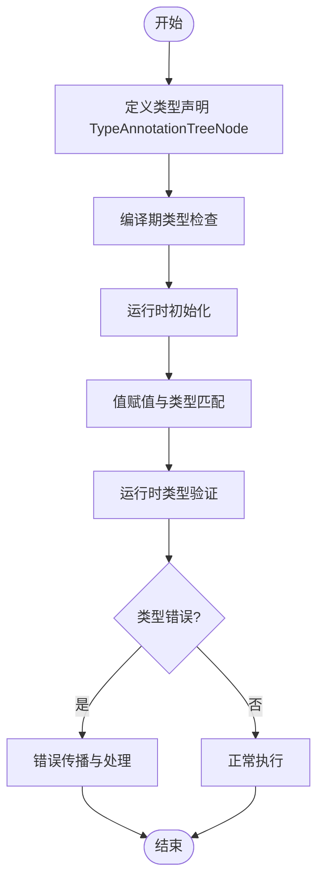
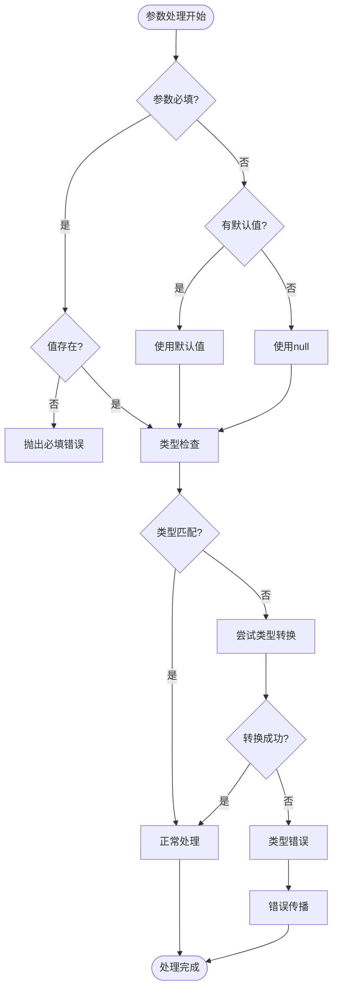

# 环境参数定义

<cite>
**Referenced Files in This Document**   
- [EnvParamTreeNode.java](file://logic-runtime/src/main/java/com/aims/logic/runtime/contract/dsl/EnvParamTreeNode.java)
- [EnvEnum.java](file://logic-runtime/src/main/java/com/aims/logic/runtime/contract/enums/EnvEnum.java)
- [ParamTreeNode.java](file://logic-runtime/src/main/java/com/aims/logic/runtime/contract/dsl/ParamTreeNode.java)
- [LogicRunner.java](file://logic-runtime/src/main/java/com/aims/logic/runtime/runner/LogicRunner.java)
- [FunctionContext.java](file://logic-runtime/src/main/java/com/aims/logic/runtime/runner/FunctionContext.java)
</cite>

## Table of Contents
1. [引言](#引言)
2. [EnvParamTreeNode类实现机制](#envparamtreenode类实现机制)
3. [EnvEnum环境类型定义](#envenum环境类型定义)
4. [环境变量引用语法与解析流程](#环境变量引用语法与解析流程)
5. [类型安全检查机制](#类型安全检查机制)
6. [参数校验与错误处理](#参数校验与错误处理)

## 引言
本文档详细说明了逻辑流程中环境参数的实现机制，包括EnvParamTreeNode类在DSL树中的位置、序列化方式和解析流程。同时解释了EnvEnum中定义的开发、测试、生产等环境类型及其对应的隔离策略，以及如何通过枚举值控制不同环境下的行为差异。文档还阐述了类型安全检查机制，确保环境参数在编译期和运行时的正确性。

## EnvParamTreeNode类实现机制

EnvParamTreeNode类是环境参数在DSL树中的核心表示，继承自ParamTreeNode类，专门用于处理环境相关的参数节点。该类在逻辑流程的DSL树中占据特定位置，用于标识和管理环境参数。

**Diagram sources**
- [ParamTreeNode.java](file://logic-runtime/src/main/java/com/aims/logic/runtime/contract/dsl/ParamTreeNode.java#L12-L33)
- [EnvParamTreeNode.java](file://logic-runtime/src/main/java/com/aims/logic/runtime/contract/dsl/EnvParamTreeNode.java#L4-L9)

当创建EnvParamTreeNode实例时，构造函数会调用父类ParamTreeNode的构造函数，并将概念类型(concept)设置为ConceptEnum.EnvParam，从而在DSL树中明确标识这是一个环境参数节点。

**Section sources**
- [EnvParamTreeNode.java](file://logic-runtime/src/main/java/com/aims/logic/runtime/contract/dsl/EnvParamTreeNode.java#L5-L8)
- [ParamTreeNode.java](file://logic-runtime/src/main/java/com/aims/logic/runtime/contract/dsl/ParamTreeNode.java#L16-L19)

## EnvEnum环境类型定义

EnvEnum枚举类定义了系统支持的各种环境类型，包括开发、测试、预发布和生产环境。每种环境类型都有对应的隔离策略，通过枚举值控制不同环境下的行为差异。

**Diagram sources**
- [EnvEnum.java](file://logic-runtime/src/main/java/com/aims/logic/runtime/contract/enums/EnvEnum.java#L2-L16)

EnvEnum定义了五种环境类型：dev（开发环境）、test（测试环境）、demo（演示环境）、pre（预发布环境）和prod（生产环境）。每个枚举实例都关联一个字符串值，通过getValue()方法获取。这些环境类型用于在运行时确定当前执行环境，并根据环境类型应用相应的配置和行为策略。

不同的环境类型对应不同的隔离策略：
- 开发环境(dev)：允许更宽松的调试和日志记录，便于开发人员排查问题
- 测试环境(test)：模拟生产环境但允许测试数据注入，用于功能验证
- 预发布环境(pre)：接近生产环境的配置，用于最终验证
- 生产环境(prod)：最严格的配置，确保系统稳定性和安全性

**Section sources**
- [EnvEnum.java](file://logic-runtime/src/main/java/com/aims/logic/runtime/contract/enums/EnvEnum.java#L2-L16)

## 环境变量引用语法与解析流程

在逻辑节点中引用环境变量使用特定的语法格式${env:VARIABLE_NAME}，系统通过解析流程将这些占位符替换为实际的环境变量值。

**Diagram sources**
- [LogicRunner.java](file://logic-runtime/src/main/java/com/aims/logic/runtime/runner/LogicRunner.java#L70-L90)
- [FunctionContext.java](file://logic-runtime/src/main/java/com/aims/logic/runtime/runner/FunctionContext.java#L14-L103)

解析流程如下：
1. 在LogicRunner初始化时，通过TypeAnnotationParser将DSL中的环境参数转换为JSON格式
2. 使用JsonUtil.jsonMerge方法将传入的环境变量与DSL中定义的环境变量合并
3. 调用autoAnalyzeAndAppendEnv方法进行特殊环境变量的解析和处理（如JWT token解析）
4. 将最终的环境变量JSON设置到FunctionContext的_env字段中
5. 在运行时通过FunctionContext的get方法获取环境变量值

**Section sources**
- [LogicRunner.java](file://logic-runtime/src/main/java/com/aims/logic/runtime/runner/LogicRunner.java#L70-L90)
- [FunctionContext.java](file://logic-runtime/src/main/java/com/aims/logic/runtime/runner/FunctionContext.java#L14-L103)

## 类型安全检查机制

系统通过多层次的类型安全检查机制，确保环境参数在编译期和运行时的正确性。这种机制结合了静态类型定义和运行时验证，提供了全面的类型安全保障。

**Diagram sources**
- [ParamTreeNode.java](file://logic-runtime/src/main/java/com/aims/logic/runtime/contract/dsl/ParamTreeNode.java#L12-L33)
- [LogicRunner.java](file://logic-runtime/src/main/java/com/aims/logic/runtime/runner/LogicRunner.java#L70-L90)

类型安全检查机制包括：
- 编译期检查：通过TypeAnnotationTreeNode定义参数的类型信息，在DSL解析阶段进行类型验证
- 运行时检查：在LogicRunner初始化时，对传入的环境变量值进行类型匹配验证
- 默认值处理：为可选参数提供默认值，确保即使缺少环境变量也能正常运行
- 错误传播：当类型不匹配时，通过LogicItemRunResult传递错误信息，便于上层处理

**Section sources**
- [ParamTreeNode.java](file://logic-runtime/src/main/java/com/aims/logic/runtime/contract/dsl/ParamTreeNode.java#L12-L33)
- [LogicRunner.java](file://logic-runtime/src/main/java/com/aims/logic/runtime/runner/LogicRunner.java#L70-L90)

## 参数校验与错误处理

系统实现了完整的参数校验和错误处理机制，确保环境参数的完整性和正确性。该机制包括参数校验、默认值处理和错误传播等多个方面。

**Diagram sources**
- [ParamTreeNode.java](file://logic-runtime/src/main/java/com/aims/logic/runtime/contract/dsl/ParamTreeNode.java#L12-L33)
- [LogicRunner.java](file://logic-runtime/src/main/java/com/aims/logic/runtime/runner/LogicRunner.java#L70-L90)

参数校验机制包括：
- 必填性检查：通过required字段标识参数是否为必填项
- 默认值处理：通过defaultValue字段提供可选参数的默认值
- 类型验证：确保传入的值与定义的类型相匹配
- 错误传播：使用LogicItemRunResult对象传递校验结果和错误信息

当参数校验失败时，系统会根据配置决定是否中断执行。对于非关键参数，系统可能继续执行并记录警告；对于关键参数，则会中断执行并返回错误。

**Section sources**
- [ParamTreeNode.java](file://logic-runtime/src/main/java/com/aims/logic/runtime/contract/dsl/ParamTreeNode.java#L12-L33)
- [LogicRunner.java](file://logic-runtime/src/main/java/com/aims/logic/runtime/runner/LogicRunner.java#L70-L90)