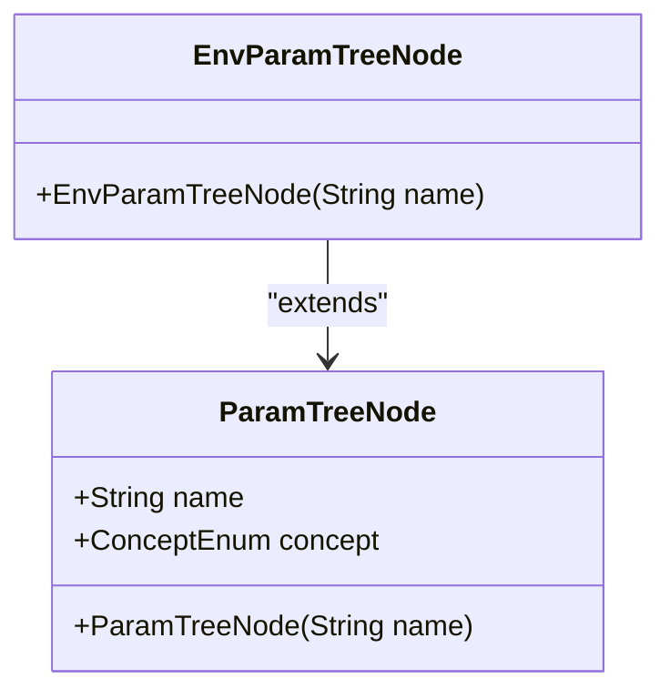
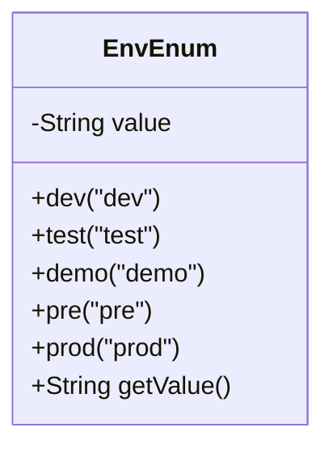
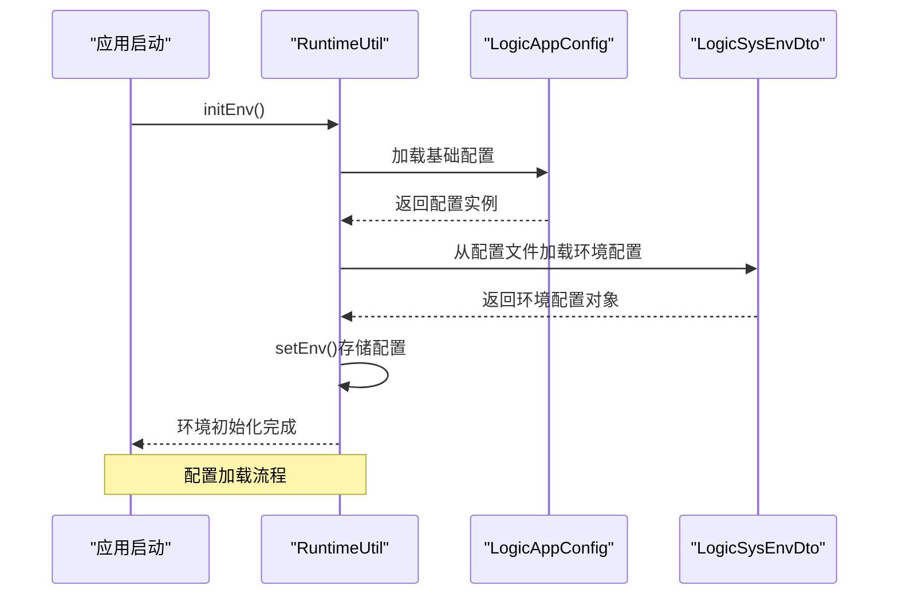
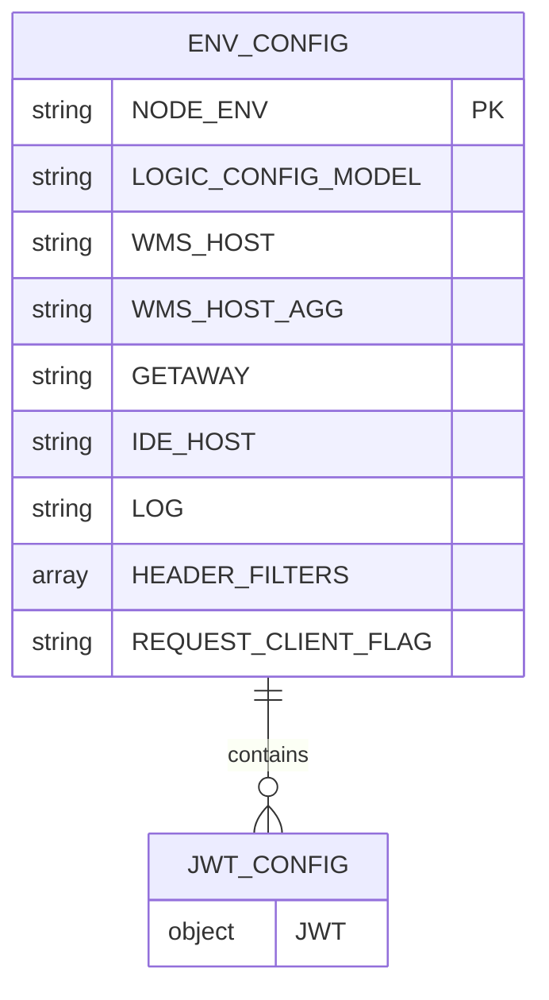
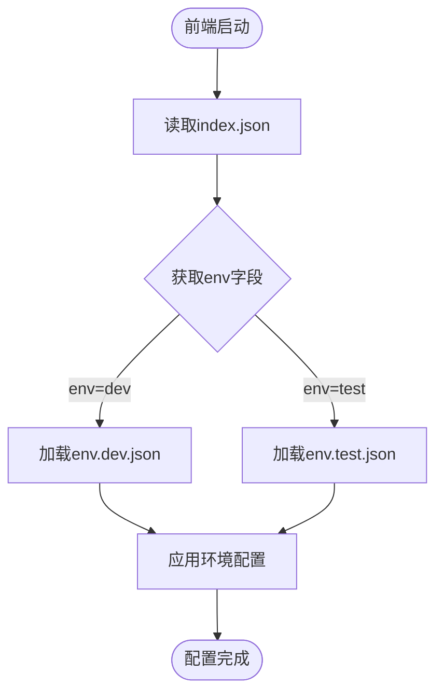
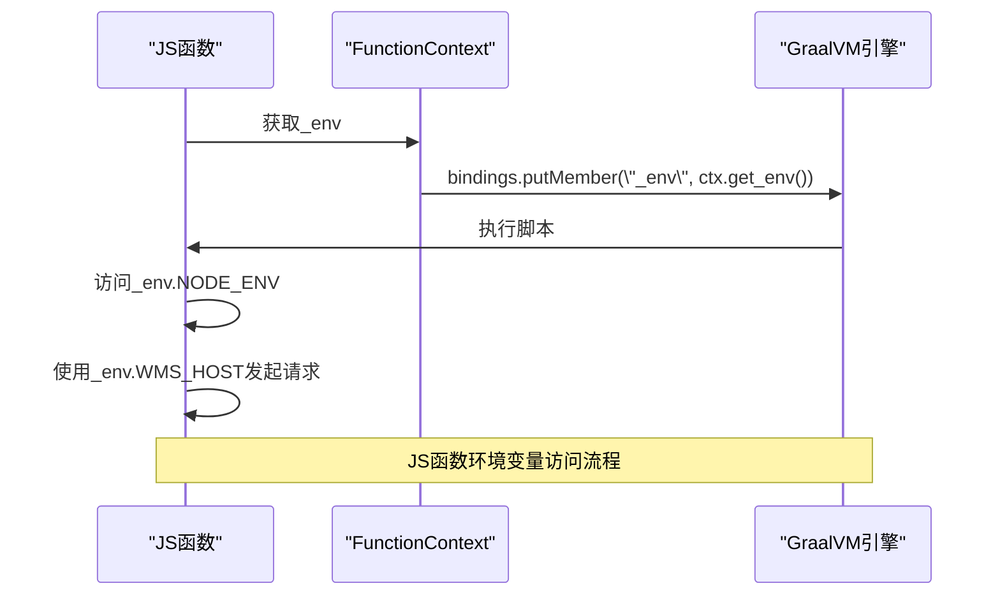
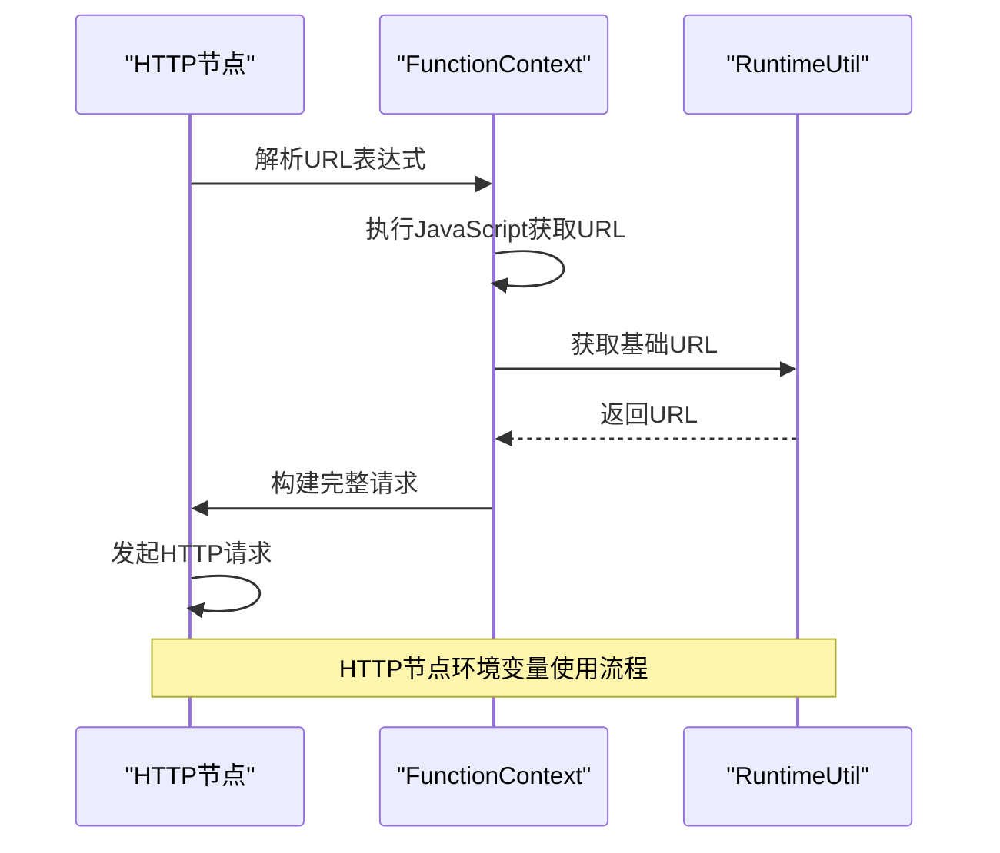

# 环境变量模型

<cite>
**Referenced Files in This Document**   
- [EnvParamTreeNode.java](file://logic-runtime/src/main/java/com/aims/logic/runtime/contract/dsl/EnvParamTreeNode.java)
- [EnvEnum.java](file://logic-runtime/src/main/java/com/aims/logic/runtime/contract/enums/EnvEnum.java)
- [LogicAppConfig.java](file://logic-runtime/src/main/java/com/aims/logic/runtime/env/LogicAppConfig.java)
- [LogicSysEnvDto.java](file://logic-runtime/src/main/java/com/aims/logic/runtime/env/LogicSysEnvDto.java)
- [env.dev.json](file://logic-sdk/logic-configs/envs/env.dev.json)
- [env.test.json](file://logic-sdk/logic-configs/envs/env.test.json)
- [index.json](file://logic-sdk/logic-configs/envs/index.json)
- [index.json](file://logic-ide/src/main/resources/public/setting/apps/index.json)
- [JsFunction.java](file://logic-runtime/src/main/java/com/aims/logic/runtime/runner/functions/impl/JsFunction.java)
- [HttpFunction.java](file://logic-runtime/src/main/java/com/aims/logic/runtime/runner/functions/impl/HttpFunction.java)
</cite>

## 目录
1. [引言](#引言)
2. [核心组件](#核心组件)
3. [环境类型与隔离策略](#环境类型与隔离策略)
4. [运行时配置加载机制](#运行时配置加载机制)
5. [配置文件结构设计](#配置文件结构设计)
6. [前端环境发现机制](#前端环境发现机制)
7. [环境变量使用示例](#环境变量使用示例)
8. [安全访问控制](#安全访问控制)

## 引言
本文档详细阐述了逻辑编排系统中的环境变量模型，重点介绍环境参数引用机制、环境类型定义、运行时配置加载流程、配置文件结构设计以及环境变量在不同节点类型中的使用方式和安全控制措施。

## 核心组件

环境变量模型的核心组件包括`EnvParamTreeNode`、`EnvEnum`、`LogicAppConfig`和`LogicSysEnvDto`，它们共同构成了环境配置的完整体系。

**Section sources**
- [EnvParamTreeNode.java](file://logic-runtime/src/main/java/com/aims/logic/runtime/contract/dsl/EnvParamTreeNode.java#L4-L9)
- [EnvEnum.java](file://logic-runtime/src/main/java/com/aims/logic/runtime/contract/enums/EnvEnum.java#L2-L16)
- [LogicAppConfig.java](file://logic-runtime/src/main/java/com/aims/logic/runtime/env/LogicAppConfig.java#L7-L21)
- [LogicSysEnvDto.java](file://logic-runtime/src/main/java/com/aims/logic/runtime/env/LogicSysEnvDto.java#L11-L45)

### EnvParamTreeNode逻辑流程引用机制
`EnvParamTreeNode`类继承自`ParamTreeNode`，专门用于在逻辑流程中引用环境参数。当创建`EnvParamTreeNode`实例时，其构造函数会将概念类型设置为`ConceptEnum.EnvParam`，从而标识该节点为环境参数节点。这种设计使得系统能够识别和处理环境相关的参数引用。

**Diagram sources**
- [EnvParamTreeNode.java](file://logic-runtime/src/main/java/com/aims/logic/runtime/contract/dsl/EnvParamTreeNode.java#L4-L9)

## 环境类型与隔离策略

### EnvEnum环境类型定义
`EnvEnum`枚举类定义了系统支持的五种环境类型：开发(dev)、测试(test)、演示(demo)、预发布(pre)和生产(prod)。每种环境类型都有对应的字符串值，用于标识当前运行环境。这种枚举设计确保了环境类型的类型安全和一致性。

**Diagram sources**
- [EnvEnum.java](file://logic-runtime/src/main/java/com/aims/logic/runtime/contract/enums/EnvEnum.java#L2-L16)

## 运行时配置加载机制

### LogicAppConfig与LogicSysEnvDto配置加载
运行时环境配置的加载流程由`LogicAppConfig`和`LogicSysEnvDto`两个类协同完成。`LogicAppConfig`通过Spring的`@Value`注解从系统属性或配置文件中加载基础配置，如配置目录、业务错误类列表和服务器端口等。这些配置在应用启动时初始化，并通过`RuntimeUtil.AppConfig`静态字段提供全局访问。

`LogicSysEnvDto`则封装了具体的环境配置属性，包括当前环境标识、逻辑配置模式、日志级别、IDE主机地址等。配置的加载优先级遵循从高到低的顺序：代码中硬编码的默认值 < 系统属性 < 配置文件。系统通过`RuntimeUtil`工具类的`initEnv()`方法初始化环境配置，并支持通过`mergeEnv()`方法动态合并自定义环境配置。

**Diagram sources**
- [LogicAppConfig.java](file://logic-runtime/src/main/java/com/aims/logic/runtime/env/LogicAppConfig.java#L7-L21)
- [LogicSysEnvDto.java](file://logic-runtime/src/main/java/com/aims/logic/runtime/env/LogicSysEnvDto.java#L11-L45)

**Section sources**
- [LogicAppConfig.java](file://logic-runtime/src/main/java/com/aims/logic/runtime/env/LogicAppConfig.java#L7-L21)
- [LogicSysEnvDto.java](file://logic-runtime/src/main/java/com/aims/logic/runtime/env/LogicSysEnvDto.java#L11-L45)
- [RuntimeUtil.java](file://logic-runtime/src/main/java/com/aims/logic/runtime/util/RuntimeUtil.java#L14-L60)

## 配置文件结构设计

### env.dev.json与env.test.json结构
环境配置文件采用JSON格式，结构清晰且易于维护。以`env.dev.json`为例，配置文件包含以下主要字段：
- `NODE_ENV`: 当前环境标识，值为"dev"
- `LOGIC_CONFIG_MODEL`: 逻辑配置模式，值为"offline"表示离线模式
- 各类服务主机地址，如`WMS_HOST`、`IDE_HOST`等
- 日志级别`LOG`，值为"error"
- 请求头过滤器`HEADER_FILTERS`，用于安全控制

配置文件支持参数分组，将相关的配置项组织在一起，提高可读性。对于敏感信息，系统通过空的JWT对象`{}`进行占位，实际的加密字段处理在运行时通过安全模块完成。

**Diagram sources**
- [env.dev.json](file://logic-sdk/logic-configs/envs/env.dev.json#L1-L22)
- [env.test.json](file://logic-sdk/logic-configs/envs/env.test.json#L1-L8)

## 前端环境发现机制

### index.json环境配置发现
前端通过读取`logic-sdk/logic-configs/envs/index.json`文件来发现可用的环境配置。该文件结构简单，仅包含一个`env`字段，其值指定了当前激活的环境（如"dev"）。这种设计使得环境切换变得简单，只需修改此文件的值即可。

此外，前端应用配置通过`logic-ide/src/main/resources/public/setting/apps/index.json`文件管理，其中定义了可用的应用列表及其URL路由。这种分离的设计使得环境配置与应用配置解耦，提高了系统的灵活性和可维护性。

**Diagram sources**
- [index.json](file://logic-sdk/logic-configs/envs/index.json#L1-L3)
- [index.json](file://logic-ide/src/main/resources/public/setting/apps/index.json#L1-L14)

## 环境变量使用示例

### JS函数节点中的环境变量使用
在JS函数节点中，环境变量通过`_env`上下文对象提供。执行JavaScript代码时，系统会将当前环境配置绑定到GraalVM JavaScript引擎的上下文中，使得脚本可以直接访问`_env`对象中的所有配置项。

**Diagram sources**
- [JsFunction.java](file://logic-runtime/src/main/java/com/aims/logic/runtime/runner/functions/impl/JsFunction.java#L19-L146)

### HTTP调用节点中的环境变量使用
在HTTP调用节点中，环境变量主要用于构建请求URL和设置请求头。系统通过`Functions.runJsByContext()`方法执行JavaScript表达式来解析URL，其中可以引用环境变量。例如，URL可以配置为`${_env.WMS_HOST}/api/data`，在运行时会被替换为实际的主机地址。

**Diagram sources**
- [HttpFunction.java](file://logic-runtime/src/main/java/com/aims/logic/runtime/runner/functions/impl/HttpFunction.java#L22-L117)

## 安全访问控制

### 敏感信息保护措施
系统通过多种机制保护敏感信息：
1. 配置文件中不直接存储明文密码，而是通过占位符或外部密钥管理服务
2. 请求头过滤器`HEADER_FILTERS`可以指定需要过滤的敏感头信息
3. 环境变量在JS引擎中的访问受到限制，防止恶意脚本获取敏感数据
4. 配置的动态刷新机制支持在不重启应用的情况下更新配置，减少敏感信息暴露风险

这些安全措施共同确保了环境变量模型的安全性，防止敏感信息泄露。

**Section sources**
- [env.dev.json](file://logic-sdk/logic-configs/envs/env.dev.json#L1-L22)
- [JsFunction.java](file://logic-runtime/src/main/java/com/aims/logic/runtime/runner/functions/impl/JsFunction.java#L19-L146)
- [HttpFunction.java](file://logic-runtime/src/main/java/com/aims/logic/runtime/runner/functions/impl/HttpFunction.java#L22-L117)