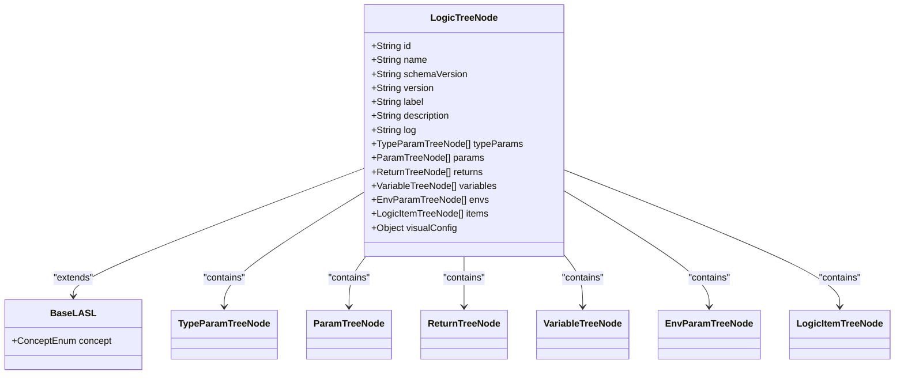
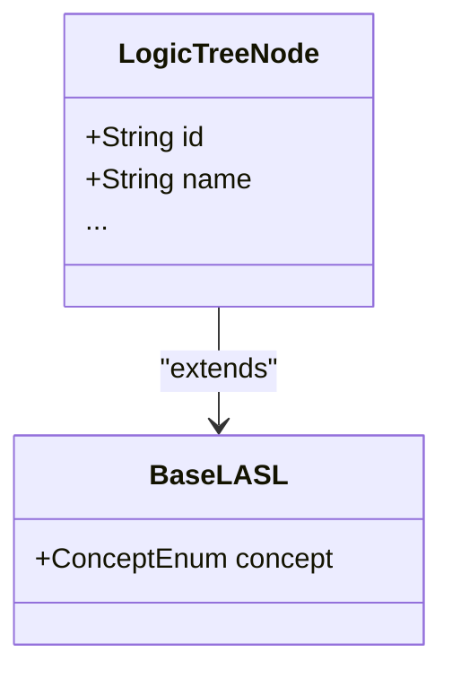

# 逻辑树节点（LogicTreeNode）

<cite>
**Referenced Files in This Document**   
- [LogicTreeNode.java](file://logic-runtime/src/main/java/com/aims/logic/runtime/contract/dsl/LogicTreeNode.java)
- [BaseLASL.java](file://logic-runtime/src/main/java/com/aims/logic/runtime/contract/dsl/basic/BaseLASL.java)
- [ConceptEnum.java](file://logic-runtime/src/main/java/com/aims/logic/runtime/contract/enums/ConceptEnum.java)
</cite>

## 目录
1. [引言](#引言)
2. [核心结构设计](#核心结构设计)
3. [元数据字段详解](#元数据字段详解)
4. [集合字段语义分析](#集合字段语义分析)
5. [可视化配置支持](#可视化配置支持)
6. [领域特定语言继承体系](#领域特定语言继承体系)
7. [典型JSON示例](#典型json示例)
8. [序列化与版本管理](#序列化与版本管理)
9. [结论](#结论)

## 引言
`LogicTreeNode` 是逻辑编排系统中的根节点实体，作为整个流程定义的顶层容器，承载了逻辑配置的核心元数据、参数定义、变量声明以及流程项序列。该节点采用领域特定语言（DSL）的设计范式，通过结构化的JSON格式实现逻辑的可读性、可维护性和可迁移性。本文档将深入解析其设计原理与各字段的语义含义。

**Section sources**
- [LogicTreeNode.java](file://logic-runtime/src/main/java/com/aims/logic/runtime/contract/dsl/LogicTreeNode.java#L1-L12)

## 核心结构设计
`LogicTreeNode` 类采用Lombok注解（`@Getter` 和 `@Setter`）自动生成属性的访问器和修改器，简化了代码的冗余。其核心设计是一个树形结构的根节点，通过聚合多个集合字段来组织逻辑流程的各个组成部分。



**Diagram sources**
- [LogicTreeNode.java](file://logic-runtime/src/main/java/com/aims/logic/runtime/contract/dsl/LogicTreeNode.java#L13-L55)
- [BaseLASL.java](file://logic-runtime/src/main/java/com/aims/logic/runtime/contract/dsl/basic/BaseLASL.java#L4-L9)

**Section sources**
- [LogicTreeNode.java](file://logic-runtime/src/main/java/com/aims/logic/runtime/contract/dsl/LogicTreeNode.java#L13-L55)

## 元数据字段详解
`LogicTreeNode` 的元数据字段为逻辑配置提供了身份标识和版本控制能力。

- **`id`**: 逻辑配置的全局唯一标识符，用于在系统中精确引用和定位特定的逻辑实例。
- **`name`**: 逻辑配置的名称，提供一个人类可读的标签，便于在管理界面中识别。
- **`schemaVersion`**: Schema格式版本号，标识了当前JSON结构遵循的DSL规范版本，确保解析器能够正确理解数据结构。
- **`version`**: 配置版本号，表示该逻辑定义的修订版本，用于支持版本管理和回滚。
- **`label` 和 `description`**: 分别提供简短标签和详细描述，增强配置的可理解性。
- **`log`**: 指定日志配置，可能关联到日志级别或日志输出策略。

**Section sources**
- [LogicTreeNode.java](file://logic-runtime/src/main/java/com/aims/logic/runtime/contract/dsl/LogicTreeNode.java#L21-L37)

## 集合字段语义分析
`LogicTreeNode` 通过一系列泛型集合字段来定义逻辑流程的各个组成部分，这些字段共同构成了完整的业务逻辑。

- **`params`**: `List<ParamTreeNode>` 类型，定义了逻辑执行时所需的输入参数列表，明确了调用方需要提供的数据契约。
- **`returns`**: `List<ReturnTreeNode>` 类型，定义了逻辑执行完成后返回给调用方的输出结果列表，形成了输出契约。
- **`variables`**: `List<VariableTreeNode>` 类型，声明了逻辑内部使用的局部变量，用于在流程项之间传递和存储临时数据。
- **`items`**: `List<LogicItemTreeNode>` 类型，这是最核心的字段，包含了按执行顺序排列的流程项（如开始、结束、条件判断、服务调用等），定义了业务逻辑的执行路径。
- **`envs`**: `List<EnvParamTreeNode>` 类型，定义了逻辑运行所依赖的环境变量，支持跨环境配置。
- **`typeParams`**: `List<TypeParamTreeNode>` 类型，用于支持泛型逻辑模板，允许定义可参数化的类型。

**Section sources**
- [LogicTreeNode.java](file://logic-runtime/src/main/java/com/aims/logic/runtime/contract/dsl/LogicTreeNode.java#L41-L53)

## 可视化配置支持
`visualConfig` 字段是一个类型为 `Object` 的通用容器，专门用于存储前端可视化编辑器所需的布局信息。该字段不参与后端的逻辑执行，其内容完全由前端编辑器生成和消费，通常包含节点的坐标（x, y）、连接线信息、样式属性等，使得逻辑流程图能够在不同会话中保持一致的视觉呈现。

**Section sources**
- [LogicTreeNode.java](file://logic-runtime/src/main/java/com/aims/logic/runtime/contract/dsl/LogicTreeNode.java#L55)

## 领域特定语言继承体系
`LogicTreeNode` 继承自 `BaseLASL` 基类，这构成了其DSL的核心继承关系。



**Diagram sources**
- [LogicTreeNode.java](file://logic-runtime/src/main/java/com/aims/logic/runtime/contract/dsl/LogicTreeNode.java#L13)
- [BaseLASL.java](file://logic-runtime/src/main/java/com/aims/logic/runtime/contract/dsl/basic/BaseLASL.java#L4)

`BaseLASL` 类定义了一个关键的 `concept` 字段，其类型为 `ConceptEnum` 枚举。`LogicTreeNode` 在其无参构造函数中将 `concept` 显式设置为 `ConceptEnum.Logic`，这正是其 **`concept` 标识机制** 的体现。通过这个枚举值，系统可以识别出该DSL节点属于“逻辑编排”这一特定领域，从而应用相应的解析、验证和执行策略。

```mermaid
classDiagram
enum ConceptEnum {
TypeAnnotation
Logic
LogicItem
Param
Return
Variable
EnvParam
TypeParam
}
LogicTreeNode --> ConceptEnum : "concept = Logic"
```

**Diagram sources**
- [ConceptEnum.java](file://logic-runtime/src/main/java/com/aims/logic/runtime/contract/enums/ConceptEnum.java#L2-L14)
- [LogicTreeNode.java](file://logic-runtime/src/main/java/com/aims/logic/runtime/contract/dsl/LogicTreeNode.java#L17-L19)

**Section sources**
- [LogicTreeNode.java](file://logic-runtime/src/main/java/com/aims/logic/runtime/contract/dsl/LogicTreeNode.java#L17-L19)
- [BaseLASL.java](file://logic-runtime/src/main/java/com/aims/logic/runtime/contract/dsl/basic/BaseLASL.java#L4-L9)
- [ConceptEnum.java](file://logic-runtime/src/main/java/com/aims/logic/runtime/contract/enums/ConceptEnum.java#L2-L14)

## 典型JSON示例
一个典型的 `LogicTreeNode` 序列化后的JSON结构如下所示：

```json
{
  "id": "logic_demo_001",
  "name": "示例业务逻辑",
  "schemaVersion": "1.0",
  "version": "1.0.0",
  "label": "Demo",
  "description": "一个演示用的逻辑流程",
  "log": "INFO",
  "params": [
    {
      "name": "inputData",
      "type": "object",
      "required": true
    }
  ],
  "returns": [
    {
      "name": "result",
      "type": "string"
    }
  ],
  "variables": [
    {
      "name": "tempValue",
      "type": "string"
    }
  ],
  "items": [
    {
      "id": "start_1",
      "type": "start"
    },
    {
      "id": "process_1",
      "type": "java",
      "config": {
        "className": "com.example.Processor"
      }
    },
    {
      "id": "end_1",
      "type": "end"
    }
  ],
  "visualConfig": {
    "nodes": [
      { "id": "start_1", "x": 100, "y": 100 },
      { "id": "process_1", "x": 300, "y": 100 },
      { "id": "end_1", "x": 500, "y": 100 }
    ],
    "edges": [
      { "source": "start_1", "target": "process_1" },
      { "source": "process_1", "target": "end_1" }
    ]
  }
}
```

**Section sources**
- [LogicTreeNode.java](file://logic-runtime/src/main/java/com/aims/logic/runtime/contract/dsl/LogicTreeNode.java#L13-L55)

## 序列化与版本管理
`LogicTreeNode` 的设计天然支持JSON序列化，使其能够轻松地在数据库、配置中心或消息队列中进行持久化和传输。`schemaVersion` 和 `version` 字段是实现版本管理的关键。

- **`schemaVersion`** 保证了DSL结构的向后兼容性。当DSL规范升级时，解析器可以根据此版本号选择不同的解析策略。
- **`version`** 用于管理同一逻辑配置的不同修订版，支持灰度发布、A/B测试和快速回滚。
- **跨环境迁移** 通过 `envs` 字段和外部配置中心实现，`visualConfig` 等非功能性字段的存在不影响核心逻辑的迁移。

**Section sources**
- [LogicTreeNode.java](file://logic-runtime/src/main/java/com/aims/logic/runtime/contract/dsl/LogicTreeNode.java#L25-L35)

## 结论
`LogicTreeNode` 作为逻辑编排的根节点，通过继承 `BaseLASL` 并利用 `ConceptEnum` 进行领域标识，构建了一个清晰的DSL体系。其丰富的元数据和集合字段定义了逻辑的完整契约，而 `visualConfig` 字段则巧妙地分离了执行逻辑与可视化需求。这种设计使得逻辑配置既具备强大的功能性，又拥有良好的可维护性和可移植性，是整个逻辑编排系统的核心基石。