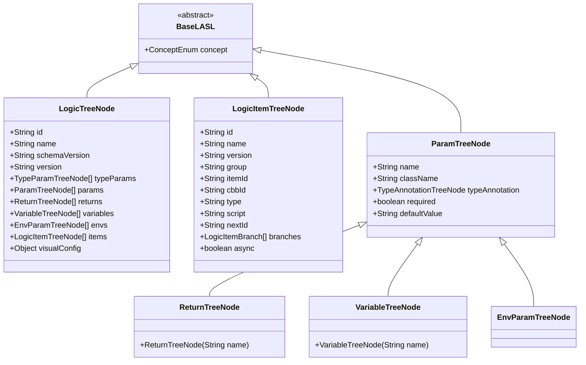
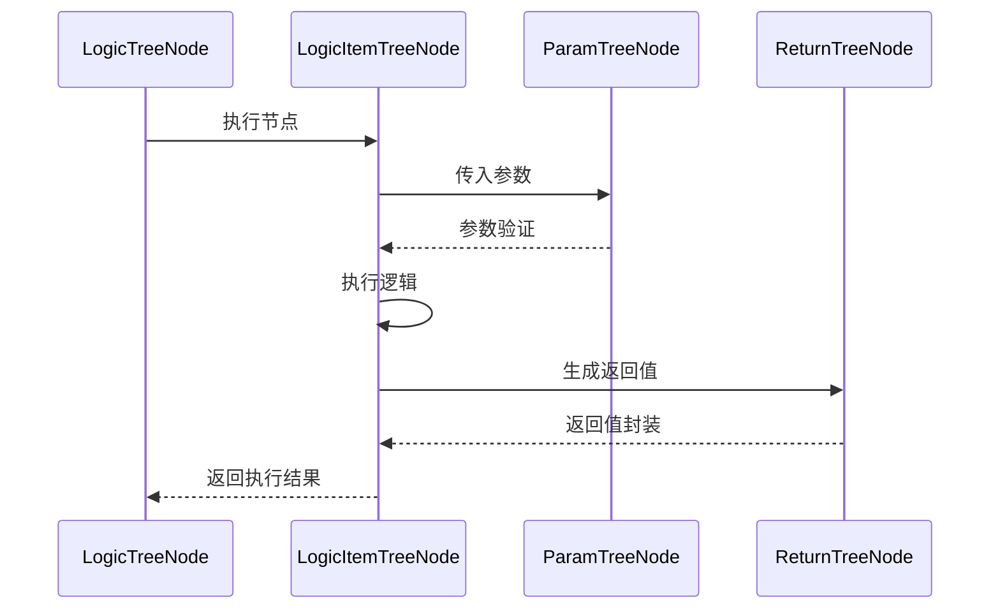
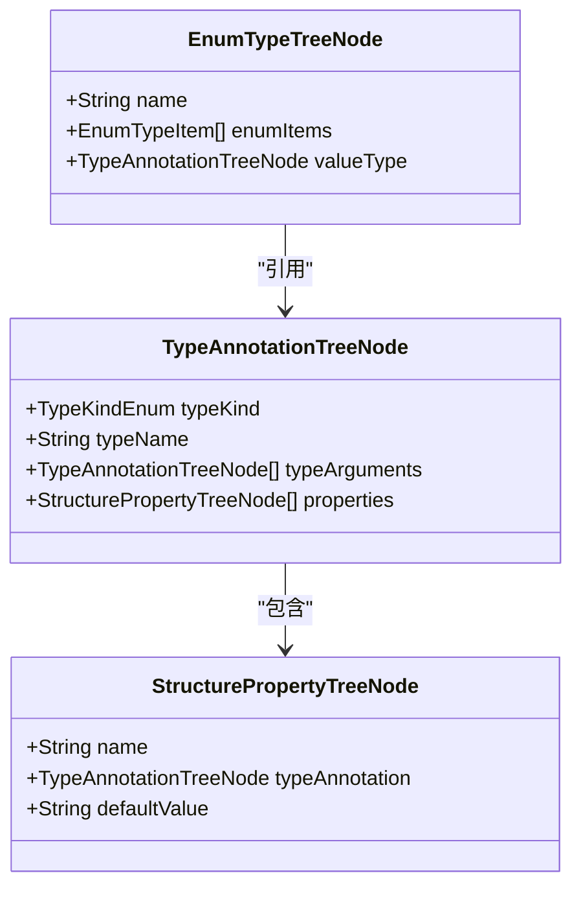

# 逻辑配置模型

<cite>
**本文档中引用的文件**
- [LogicTreeNode.java](file://logic-runtime/src/main/java/com/aims/logic/runtime/contract/dsl/LogicTreeNode.java)
- [LogicItemTreeNode.java](file://logic-runtime/src/main/java/com/aims/logic/runtime/contract/dsl/LogicItemTreeNode.java)
- [LogicItemBranch.java](file://logic-runtime/src/main/java/com/aims/logic/runtime/contract/dsl/LogicItemBranch.java)
- [ParamTreeNode.java](file://logic-runtime/src/main/java/com/aims/logic/runtime/contract/dsl/ParamTreeNode.java)
- [ReturnTreeNode.java](file://logic-runtime/src/main/java/com/aims/logic/runtime/contract/dsl/ReturnTreeNode.java)
- [VariableTreeNode.java](file://logic-runtime/src/main/java/com/aims/logic/runtime/contract/dsl/VariableTreeNode.java)
- [EnumTypeTreeNode.java](file://logic-runtime/src/main/java/com/aims/logic/runtime/contract/dsl/basic/EnumTypeTreeNode.java)
- [StructurePropertyTreeNode.java](file://logic-runtime/src/main/java/com/aims/logic/runtime/contract/dsl/basic/StructurePropertyTreeNode.java)
- [BaseLASL.java](file://logic-runtime/src/main/java/com/aims/logic/runtime/contract/dsl/basic/BaseLASL.java)
- [TypeAnnotationTreeNode.java](file://logic-runtime/src/main/java/com/aims/logic/runtime/contract/dsl/basic/TypeAnnotationTreeNode.java)
- [TypeParamTreeNode.java](file://logic-runtime/src/main/java/com/aims/logic/runtime/contract/dsl/basic/TypeParamTreeNode.java)
- [EnvParamTreeNode.java](file://logic-runtime/src/main/java/com/aims/logic/runtime/contract/dsl/EnvParamTreeNode.java)
- [LogicItemTransactionScope.java](file://logic-runtime/src/main/java/com/aims/logic/runtime/contract/enums/LogicItemTransactionScope.java)
</cite>

## 目录
1. [引言](#引言)
2. [核心节点结构设计](#核心节点结构设计)
3. [层级关系与继承体系](#层级关系与继承体系)
4. [分支逻辑实现机制](#分支逻辑实现机制)
5. [参数传递与返回值管理](#参数传递与返回值管理)
6. [上下文变量管理](#上下文变量管理)
7. [复杂数据结构支持](#复杂数据结构支持)
8. [DSL解析架构基础](#dsl解析架构基础)
9. [完整逻辑配置结构示例](#完整逻辑配置结构示例)
10. [序列化与反序列化约束](#序列化与反序列化约束)
11. [动态更新与版本控制](#动态更新与版本控制)
12. [跨环境迁移支持](#跨环境迁移支持)

## 引言
本文档详细阐述逻辑配置模型的核心设计，重点介绍基于树形结构的可视化编排系统。该模型通过定义一系列标准化的节点类型，实现业务逻辑的可配置化、可复用和可追溯。模型支持从简单流程到复杂嵌套逻辑的完整表达，并为动态更新、版本管理和跨环境部署提供基础支撑。

## 核心节点结构设计

逻辑配置模型采用树形结构组织业务逻辑，其中`LogicTreeNode`作为根节点，代表一个完整的逻辑单元。每个`LogicTreeNode`包含多个`LogicItemTreeNode`，表示具体的执行步骤或操作节点。

`LogicTreeNode`定义了逻辑单元的基本元信息，包括唯一标识`id`、名称`name`、描述`description`以及版本控制相关的`schemaVersion`和`version`字段。此外，还包含参数列表`params`、返回值列表`returns`、变量列表`variables`和环境参数列表`envs`，用于声明该逻辑单元的输入输出契约。

`LogicItemTreeNode`则代表具体的执行节点，包含节点类型`type`、执行脚本`script`、超时时间`timeout`等执行相关属性。通过`nextId`字段实现节点间的线性连接，形成执行链路。

**节段来源**
- [LogicTreeNode.java](file://logic-runtime/src/main/java/com/aims/logic/runtime/contract/dsl/LogicTreeNode.java#L13-L55)
- [LogicItemTreeNode.java](file://logic-runtime/src/main/java/com/aims/logic/runtime/contract/dsl/LogicItemTreeNode.java#L15-L174)

## 层级关系与继承体系

整个逻辑配置模型建立在统一的抽象基类`BaseLASL`之上，该类定义了`concept`字段，用于标识节点的语义类型。所有具体节点类型均继承自`BaseLASL`，形成清晰的继承体系。



**图示来源**
- [BaseLASL.java](file://logic-runtime/src/main/java/com/aims/logic/runtime/contract/dsl/basic/BaseLASL.java#L4-L9)
- [LogicTreeNode.java](file://logic-runtime/src/main/java/com/aims/logic/runtime/contract/dsl/LogicTreeNode.java#L13-L55)
- [LogicItemTreeNode.java](file://logic-runtime/src/main/java/com/aims/logic/runtime/contract/dsl/LogicItemTreeNode.java#L15-L174)
- [ParamTreeNode.java](file://logic-runtime/src/main/java/com/aims/logic/runtime/contract/dsl/ParamTreeNode.java#L12-L33)
- [ReturnTreeNode.java](file://logic-runtime/src/main/java/com/aims/logic/runtime/contract/dsl/ReturnTreeNode.java#L7-L15)
- [VariableTreeNode.java](file://logic-runtime/src/main/java/com/aims/logic/runtime/contract/dsl/VariableTreeNode.java#L4-L9)
- [EnvParamTreeNode.java](file://logic-runtime/src/main/java/com/aims/logic/runtime/contract/dsl/EnvParamTreeNode.java#L4-L10)

## 分支逻辑实现机制

分支逻辑通过`LogicItemBranch`类实现，该类包含`when`和`nextId`两个字段。`when`字段存储条件表达式，通常为JavaScript表达式，用于判断是否满足跳转条件；`nextId`字段指定满足条件时的下一个执行节点ID。

在`LogicItemTreeNode`中，通过`branches`字段维护一个`LogicItemBranch`列表，实现多路分支。当执行到包含分支的节点时，系统会依次评估每个分支的`when`表达式，选择第一个为真的分支进行跳转。此外，`condition`字段支持简单的条件判断，而`async`字段控制节点是否异步执行。

**节段来源**
- [LogicItemTreeNode.java](file://logic-runtime/src/main/java/com/aims/logic/runtime/contract/dsl/LogicItemTreeNode.java#L15-L174)
- [LogicItemBranch.java](file://logic-runtime/src/main/java/com/aims/logic/runtime/contract/dsl/LogicItemBranch.java#L5-L10)

## 参数传递与返回值管理

参数传递通过`ParamTreeNode`类实现，每个参数包含名称`name`、类型注解`typeAnnotation`、是否必填`required`和默认值`defaultValue`等属性。`typeAnnotation`字段使用`TypeAnnotationTreeNode`描述复杂类型信息，支持泛型和嵌套结构。

返回值管理通过`ReturnTreeNode`实现，该类继承自`ParamTreeNode`，额外设置了`concept`为`Return`。通过`returnAccept`字段指定接收返回值的变量名，实现执行结果的捕获和传递。



**图示来源**
- [ParamTreeNode.java](file://logic-runtime/src/main/java/com/aims/logic/runtime/contract/dsl/ParamTreeNode.java#L12-L33)
- [ReturnTreeNode.java](file://logic-runtime/src/main/java/com/aims/logic/runtime/contract/dsl/ReturnTreeNode.java#L7-L15)
- [LogicItemTreeNode.java](file://logic-runtime/src/main/java/com/aims/logic/runtime/contract/dsl/LogicItemTreeNode.java#L15-L174)

**节段来源**
- [ParamTreeNode.java](file://logic-runtime/src/main/java/com/aims/logic/runtime/contract/dsl/ParamTreeNode.java#L12-L33)
- [ReturnTreeNode.java](file://logic-runtime/src/main/java/com/aims/logic/runtime/contract/dsl/ReturnTreeNode.java#L7-L15)

## 上下文变量管理

上下文变量通过`VariableTreeNode`类管理，该类继承自`ParamTreeNode`，但`concept`设置为`Variable`。变量在逻辑执行过程中创建和修改，用于存储中间状态和共享数据。

变量的作用域由其声明位置决定，可以在整个逻辑单元内访问。通过`defaultValue`字段支持变量的初始化，确保执行环境的确定性。变量的类型由`typeAnnotation`字段定义，支持基本类型和复杂对象类型。

**节段来源**
- [VariableTreeNode.java](file://logic-runtime/src/main/java/com/aims/logic/runtime/contract/dsl/VariableTreeNode.java#L4-L9)
- [ParamTreeNode.java](file://logic-runtime/src/main/java/com/aims/logic/runtime/contract/dsl/ParamTreeNode.java#L12-L33)

## 复杂数据结构支持

对于复杂数据结构，模型提供了`EnumTypeTreeNode`和`StructurePropertyTreeNode`支持。`EnumTypeTreeNode`用于定义枚举类型，包含枚举项列表`enumItems`和值类型`valueType`。

`StructurePropertyTreeNode`用于描述数据结构的属性，包含属性名`name`、类型注解`typeAnnotation`和默认值`defaultValue`。通过`properties`字段在`TypeAnnotationTreeNode`中维护属性列表，实现对匿名数据结构的支持。



**图示来源**
- [EnumTypeTreeNode.java](file://logic-runtime/src/main/java/com/aims/logic/runtime/contract/dsl/basic/EnumTypeTreeNode.java#L6-L11)
- [StructurePropertyTreeNode.java](file://logic-runtime/src/main/java/com/aims/logic/runtime/contract/dsl/basic/StructurePropertyTreeNode.java#L7-L17)
- [TypeAnnotationTreeNode.java](file://logic-runtime/src/main/java/com/aims/logic/runtime/contract/dsl/basic/TypeAnnotationTreeNode.java#L9-L25)

## DSL解析架构基础

整个逻辑配置模型基于`BaseLASL`抽象基类构建，该类定义了`concept`字段作为类型标识符。通过`concept`字段的值（如`Logic`、`LogicItem`、`Param`等），解析器能够识别节点的语义类型并进行相应的处理。

这种设计实现了领域特定语言（DSL）的抽象语法树（AST）表示，为逻辑的解析、验证和执行提供了统一的基础。`concept`字段的枚举值来自`ConceptEnum`，确保了类型系统的完整性和一致性。

**节段来源**
- [BaseLASL.java](file://logic-runtime/src/main/java/com/aims/logic/runtime/contract/dsl/basic/BaseLASL.java#L4-L9)
- [LogicTreeNode.java](file://logic-runtime/src/main/java/com/aims/logic/runtime/contract/dsl/LogicTreeNode.java#L17-L19)
- [LogicItemTreeNode.java](file://logic-runtime/src/main/java/com/aims/logic/runtime/contract/dsl/LogicItemTreeNode.java#L19-L21)

## 完整逻辑配置结构示例

一个完整的逻辑配置JSON Schema示例如下：

```json
{
  "id": "string",
  "name": "string",
  "schemaVersion": "string",
  "version": "string",
  "params": [
    {
      "name": "string",
      "typeAnnotation": {
        "typeKind": "Primitive",
        "typeName": "string"
      },
      "required": true,
      "defaultValue": "string"
    }
  ],
  "returns": [
    {
      "name": "result",
      "typeAnnotation": {
        "typeKind": "Primitive",
        "typeName": "string"
      }
    }
  ],
  "variables": [
    {
      "name": "temp",
      "typeAnnotation": {
        "typeKind": "Primitive",
        "typeName": "string"
      }
    }
  ],
  "items": [
    {
      "id": "node1",
      "type": "java",
      "script": "System.out.println('Hello');",
      "nextId": "node2"
    },
    {
      "id": "node2",
      "type": "if",
      "condition": "true",
      "branches": [
        {
          "when": "true",
          "nextId": "node3"
        }
      ]
    }
  ]
}
```

该结构展示了逻辑单元的完整组成，包括元数据、参数声明、返回值定义、变量声明和执行节点序列。

## 序列化与反序列化约束

在序列化和反序列化过程中，模型遵循以下约束与验证规则：
1. 所有节点必须包含有效的`concept`标识
2. `id`字段必须全局唯一
3. 参数和变量的`name`在各自作用域内必须唯一
4. 类型注解必须符合`TypeKindEnum`定义的类型体系
5. 节点间的连接必须形成有向无环图（DAG）
6. 必填参数必须提供值或默认值
7. 版本号必须遵循语义化版本规范

这些约束通过`JsonUtil`等工具类在序列化前后进行验证，确保配置的完整性和正确性。

**节段来源**
- [LogicTreeNode.java](file://logic-runtime/src/main/java/com/aims/logic/runtime/contract/dsl/LogicTreeNode.java#L13-L55)
- [ParamTreeNode.java](file://logic-runtime/src/main/java/com/aims/logic/runtime/contract/dsl/ParamTreeNode.java#L12-L33)
- [TypeAnnotationTreeNode.java](file://logic-runtime/src/main/java/com/aims/logic/runtime/contract/dsl/basic/TypeAnnotationTreeNode.java#L9-L25)

## 动态更新与版本控制

模型通过`version`字段实现版本控制，每个逻辑单元和组件节点都有独立的版本号。`cbbId`字段通过`generateId`方法基于`name`、`group`和`version`生成唯一标识，确保不同版本的组件能够共存。

动态更新时，系统会比较新旧版本的`cbbId`，只有当`cbbId`变化时才会触发重新加载。这种设计支持热更新，允许在不中断服务的情况下更新业务逻辑。`schemaVersion`字段用于管理配置格式的演进，确保向后兼容性。

**节段来源**
- [LogicItemTreeNode.java](file://logic-runtime/src/main/java/com/aims/logic/runtime/contract/dsl/LogicItemTreeNode.java#L15-L174)
- [LogicTreeNode.java](file://logic-runtime/src/main/java/com/aims/logic/runtime/contract/dsl/LogicTreeNode.java#L13-L55)

## 跨环境迁移支持

跨环境迁移通过环境参数`EnvParamTreeNode`实现，该类继承自`ParamTreeNode`，`concept`设置为`EnvParam`。环境参数用于声明环境相关的配置，如数据库连接、服务地址等。

通过`envs`字段在`LogicTreeNode`中集中管理所有环境参数，支持在不同环境（开发、测试、生产）间进行配置替换。`visualConfig`字段存储可视化编辑器相关的布局信息，不影响逻辑执行，便于在不同环境中保持一致的编辑体验。

**节段来源**
- [EnvParamTreeNode.java](file://logic-runtime/src/main/java/com/aims/logic/runtime/contract/dsl/EnvParamTreeNode.java#L4-L10)
- [LogicTreeNode.java](file://logic-runtime/src/main/java/com/aims/logic/runtime/contract/dsl/LogicTreeNode.java#L13-L55)