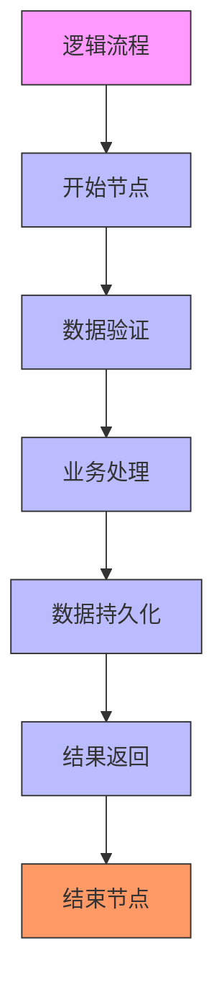
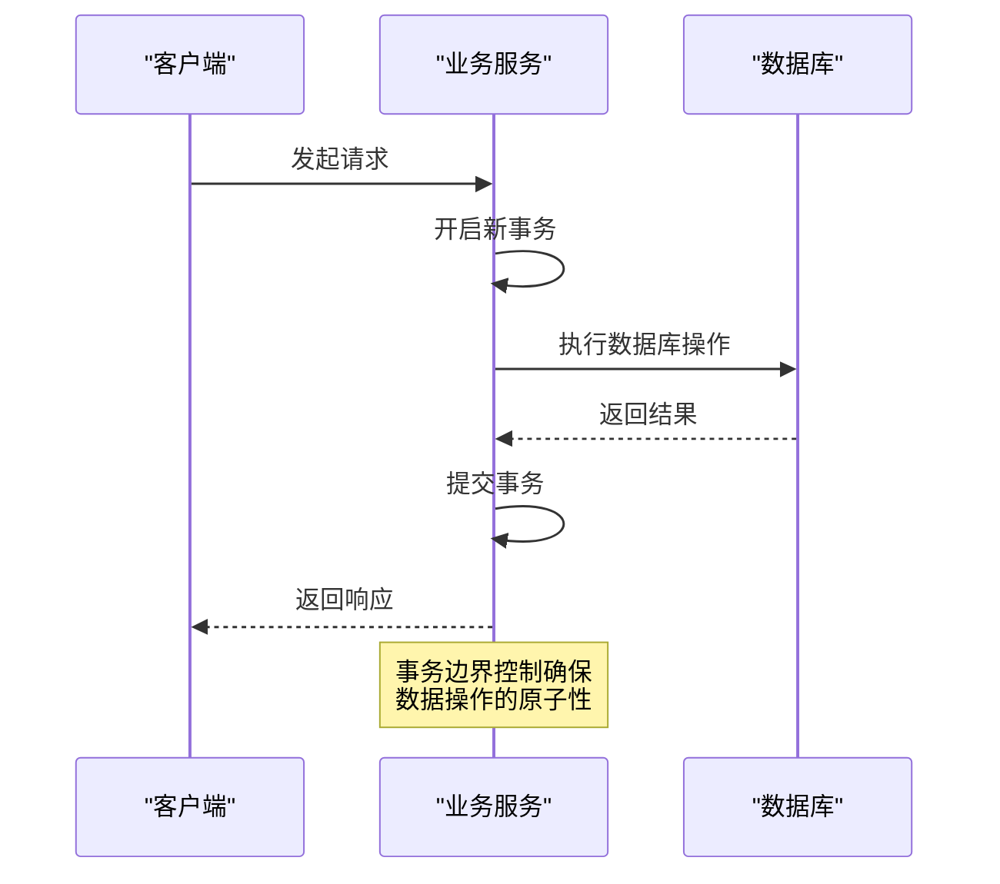
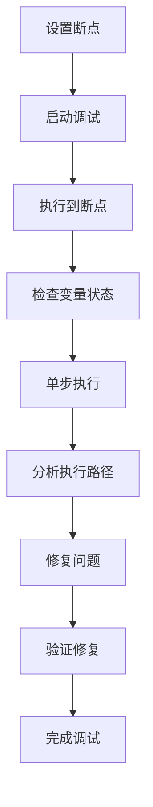
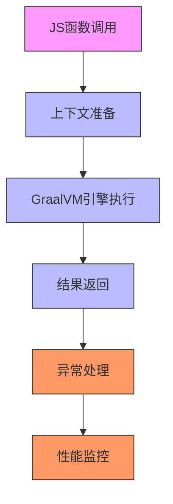
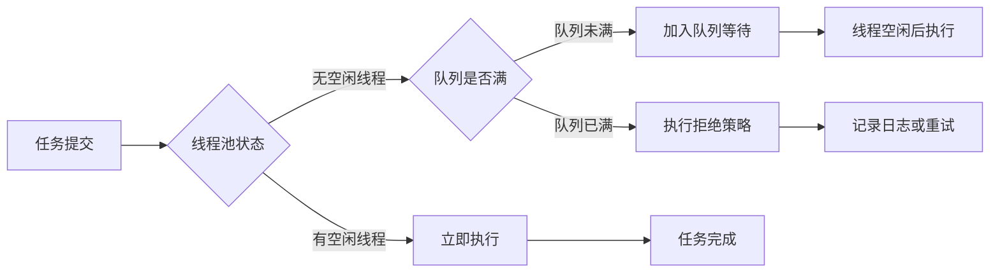
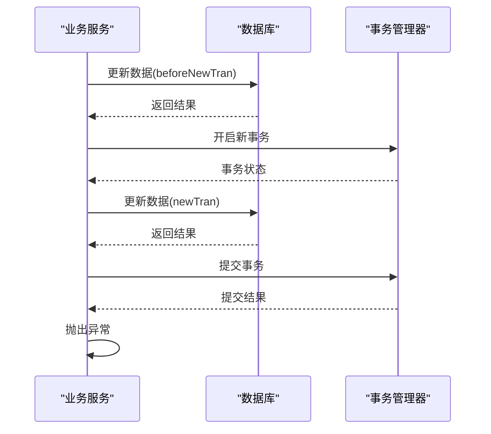
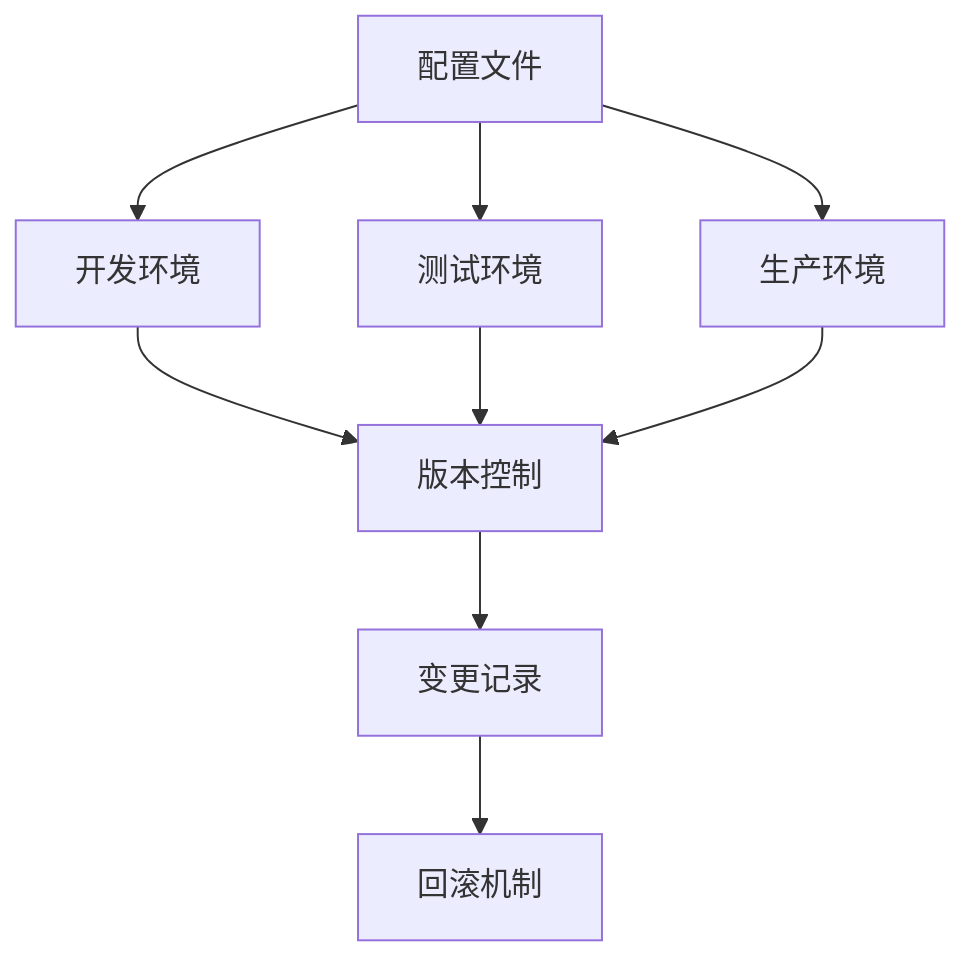
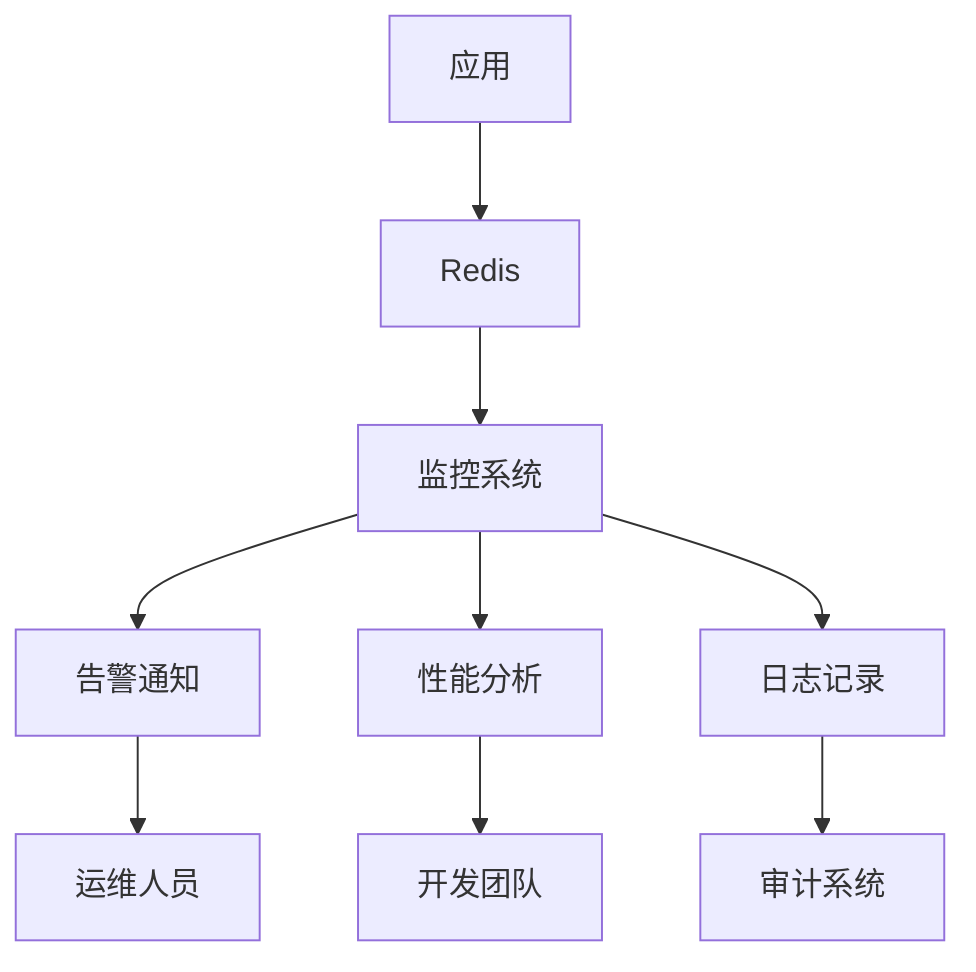

# 最佳实践

<cite>
**本文档引用的文件**
- [TestTranService.java](file://test-suite/src/main/java/com/aims/logic/testsuite/demo/TestTranService.java)
- [TestTran2Service.java](file://test-suite/src/main/java/com/aims/logic/testsuite/demo/TestTran2Service.java)
- [LogicItemTransactionScope.java](file://logic-runtime/src/main/java/com/aims/logic/runtime/contract/enums/LogicItemTransactionScope.java)
- [LogicRunnerServiceImpl.java](file://logic-sdk/src/main/java/com/aims/logic/sdk/LogicRunnerServiceImpl.java)
- [Functions.java](file://logic-runtime/src/main/java/com/aims/logic/runtime/runner/Functions.java)
- [LoggerHelperServiceImpl.java](file://logic-sdk/src/main/java/com/aims/logic/sdk/service/impl/LoggerHelperServiceImpl.java)
- [application.yml](file://test-suite/src/main/resources/application.yaml)
- [redis.java](file://test-suite/src/main/java/com/aims/logic/testsuite/config/redis.java)
</cite>

## 目录
1. [引言](#引言)
2. [高内聚低耦合的逻辑流程设计](#高内聚低耦合的逻辑流程设计)
3. [事务边界设置与数据一致性](#事务边界设置与数据一致性)
4. [断点调试与开发效率提升](#断点调试与开发效率提升)
5. [JS函数性能优化](#js函数性能优化)
6. [避免线程阻塞的最佳实践](#避免线程阻塞的最佳实践)
7. [复杂场景下的正确使用方式](#复杂场景下的正确使用方式)
8. [配置管理与版本控制](#配置管理与版本控制)
9. [监控集成策略](#监控集成策略)
10. [结论](#结论)

## 引言
本文档总结了在使用logic-solution过程中积累的最佳实践，涵盖了逻辑流程设计、事务管理、调试效率、性能优化等多个方面。通过分析test-suite中的测试用例和核心代码实现，为开发者提供了一套完整的实践指南，旨在提升系统的稳定性、可维护性和开发效率。

## 高内聚低耦合的逻辑流程设计

在logic-solution中，设计高内聚低耦合的逻辑流程是确保系统可维护性和扩展性的关键。通过合理划分逻辑单元和明确职责边界，可以有效降低模块间的耦合度。

**逻辑单元划分原则**：
- 每个逻辑节点应具有单一职责，专注于完成特定的业务功能
- 相关功能应组织在同一个逻辑组中，提高内聚性
- 使用`@LogicItem`注解明确标识逻辑节点，便于管理和调用



**Diagram sources**
- [TestTranService.java](file://test-suite/src/main/java/com/aims/logic/testsuite/demo/TestTranService.java#L1-L141)

**Section sources**
- [TestTranService.java](file://test-suite/src/main/java/com/aims/logic/testsuite/demo/TestTranService.java#L1-L141)

## 事务边界设置与数据一致性

合理的事务边界设置是保证数据一致性的核心。logic-solution提供了灵活的事务管理机制，支持多种事务传播行为和隔离级别。

### 事务范围配置
系统支持多种事务范围配置，通过`LogicItemTransactionScope`枚举定义：

```java
public enum LogicItemTransactionScope {
    off("off"),
    def("def"),
    everyNode2("everyNode2"),
    everyNode("everyNode"),
    everyRequest("everyRequest");
}
```

其中`everyRequest`为默认事务范围，确保每个请求都在独立的事务中执行。

### 事务传播机制
通过`@Transactional`注解配置事务传播行为，支持`REQUIRES_NEW`等传播机制：



**Diagram sources**
- [LogicItemTransactionScope.java](file://logic-runtime/src/main/java/com/aims/logic/runtime/contract/enums/LogicItemTransactionScope.java#L1-L26)
- [LogicRunnerServiceImpl.java](file://logic-sdk/src/main/java/com/aims/logic/sdk/LogicRunnerServiceImpl.java#L657-L686)

**Section sources**
- [LogicItemTransactionScope.java](file://logic-runtime/src/main/java/com/aims/logic/runtime/contract/enums/LogicItemTransactionScope.java#L1-L26)
- [LogicRunnerServiceImpl.java](file://logic-sdk/src/main/java/com/aims/logic/sdk/LogicRunnerServiceImpl.java#L657-L686)

## 断点调试与开发效率提升

logic-solution提供了强大的断点调试功能，帮助开发者快速定位和解决问题，显著提升开发效率。

### 调试配置
通过配置文件启用调试模式：

```yaml
logic:
  debug: true
  log-level: DEBUG
```

### 调试流程
1. 在关键节点设置断点
2. 启动调试模式执行逻辑流程
3. 查看变量状态和执行路径
4. 分析并修复问题



**Section sources**
- [application.yml](file://test-suite/src/main/resources/application.yaml)

## JS函数性能优化

JS函数的性能直接影响系统的整体响应速度。通过合理的优化策略，可以显著提升执行效率。

### 性能优化策略
1. **减少全局变量访问**：尽量使用局部变量
2. **避免重复计算**：缓存计算结果
3. **优化循环结构**：减少循环内的复杂操作
4. **合理使用异步操作**：避免阻塞主线程

### JS函数执行
系统使用GraalVM JS引擎执行JS代码，通过`Functions`类提供执行接口：

```java
public static Object runJsByContext(FunctionContext ctx, String script) {
    var res = Functions.get("js").invoke(ctx, script);
    if (res.isSuccess())
        return res.getData();
    else {
        var msg = String.format("执行js脚本报错：%s,异常的脚本：%s", res.getMsg(), script);
        log.error(msg);
        throw new RuntimeException(msg);
    }
}
```



**Diagram sources**
- [Functions.java](file://logic-runtime/src/main/java/com/aims/logic/runtime/runner/Functions.java#L0-L51)

**Section sources**
- [Functions.java](file://logic-runtime/src/main/java/com/aims/logic/runtime/runner/Functions.java#L0-L51)

## 避免线程阻塞的最佳实践

长时间运行的操作可能导致线程阻塞，影响系统性能。通过合理的异步处理和线程管理，可以有效避免这一问题。

### 线程池配置
系统使用线程池处理异步任务，通过`ThreadPoolExecutor`进行配置：

```java
private final static ExecutorService logExecutor = new ThreadPoolExecutor(
    2,
    4,
    60L,
    TimeUnit.SECONDS,
    new LinkedBlockingQueue<>(200),
    customDiscardOldestPolicy
);
```

### 异步处理策略
1. **合理设置线程池大小**：根据系统负载调整核心线程数和最大线程数
2. **设置适当的队列容量**：避免内存溢出
3. **配置合理的超时时间**：防止任务长时间等待
4. **使用拒绝策略**：处理超出容量的任务



**Section sources**
- [LoggerHelperServiceImpl.java](file://logic-sdk/src/main/java/com/aims/logic/sdk/service/impl/LoggerHelperServiceImpl.java#L20-L68)

## 复杂场景下的正确使用方式

通过分析test-suite中的测试用例，可以了解在复杂场景下的正确使用方式。

### 事务测试案例
`TestTranService`类中的`insertWithInnerTran`方法展示了嵌套事务的正确使用：

```java
@Transactional(rollbackFor = Exception.class)
@LogicItem(name = "插入测试3（注解事务）", group = "测试事务", memo = "包含嵌套事务注解")
public int insertWithInnerTran(String id) {
    testMapper.insert(new TestEntity().setId(id));
    try {
        testTran2Service.insertWithTran(id + 1, true);
    } catch (Exception e) {
        System.out.println("主动catch了异常：" + e.getMessage());
    }
    return 1;
}
```

该案例展示了如何在捕获异常的同时确保事务的正确回滚。

### 事务边界控制
`update`方法展示了如何手动控制事务边界：

```java
public int update(TestEntity testEntity) {
    testEntity.setName("beforeNewTran");
    testMapper.updateById(testEntity);
    DefaultTransactionAttribute defaultTransactionAttribute = new DefaultTransactionAttribute();
    defaultTransactionAttribute.setIsolationLevel(2);
    defaultTransactionAttribute.setPropagationBehavior(DefaultTransactionAttribute.PROPAGATION_REQUIRES_NEW);
    TransactionStatus transaction = this.dataSourceTransactionManager.getTransaction(defaultTransactionAttribute);
    testEntity.setName("newTran");
    testMapper.updateById(testEntity);
    this.dataSourceTransactionManager.commit(transaction);
    throw new RuntimeException("测试事务");
}
```



**Diagram sources**
- [TestTranService.java](file://test-suite/src/main/java/com/aims/logic/testsuite/demo/TestTranService.java#L1-L141)

**Section sources**
- [TestTranService.java](file://test-suite/src/main/java/com/aims/logic/testsuite/demo/TestTranService.java#L1-L141)

## 配置管理与版本控制

有效的配置管理和版本控制是确保系统稳定运行的基础。

### 配置管理
系统支持多种配置方式，包括YAML文件和环境变量：

```yaml
logic:
  config-dir: ./logic-configs
  log-service: database
  default-tran-scope: everyRequest
```

### 版本控制策略
1. **配置文件版本化**：将配置文件纳入版本控制系统
2. **环境隔离**：为不同环境维护独立的配置
3. **变更管理**：记录配置变更历史
4. **回滚机制**：支持配置回滚



**Section sources**
- [application.yml](file://test-suite/src/main/resources/application.yaml)

## 监控集成策略

完善的监控系统可以帮助及时发现和解决问题，提升系统稳定性。

### 监控指标
1. **性能指标**：响应时间、吞吐量
2. **资源使用**：CPU、内存、数据库连接
3. **错误率**：异常发生频率
4. **事务状态**：提交/回滚比率

### Redis监控集成
通过Redis配置实现分布式锁和缓存监控：

```java
@Configuration
@EnableRedisHttpSession
public class redis {
    @Bean
    public LettuceConnectionFactory connectionFactory() {
        return new LettuceConnectionFactory(new RedisStandaloneConfiguration("localhost", 6379));
    }
}
```



**Diagram sources**
- [redis.java](file://test-suite/src/main/java/com/aims/logic/testsuite/config/redis.java)

**Section sources**
- [redis.java](file://test-suite/src/main/java/com/aims/logic/testsuite/config/redis.java)

## 结论
通过遵循上述最佳实践，可以有效提升logic-solution系统的稳定性、可维护性和开发效率。关键要点包括：
- 设计高内聚低耦合的逻辑流程
- 合理设置事务边界以保证数据一致性
- 充分利用断点调试提高开发效率
- 优化JS函数性能
- 避免长时间运行导致线程阻塞
- 实施有效的配置管理和监控集成

这些实践经过test-suite中的测试用例验证，适用于各种复杂场景，为系统的长期稳定运行提供了保障。