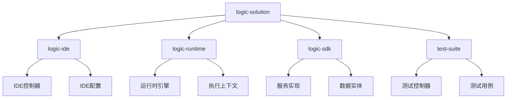
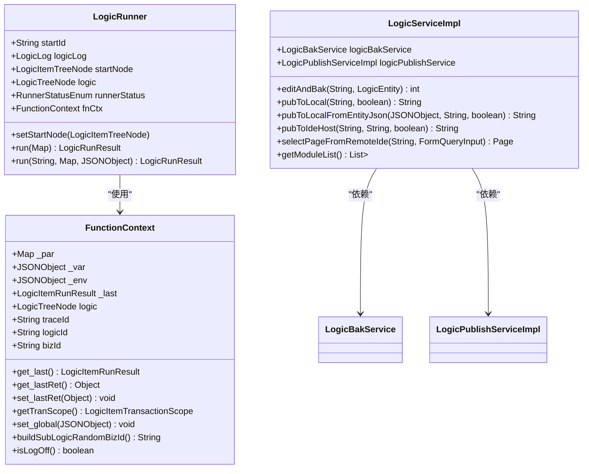
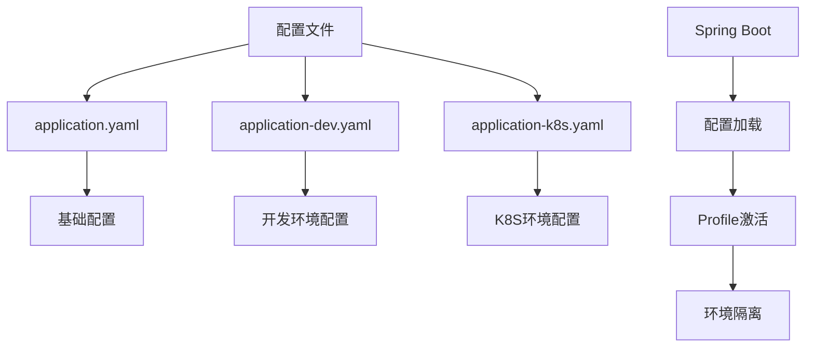
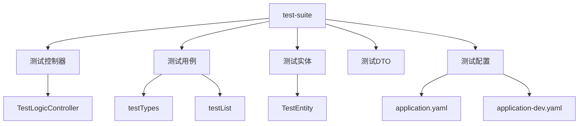

# 代码组织与团队协作最佳实践

<cite>
**本文档引用文件**  
- [CONTRIBUTING.md](file://CONTRIBUTING.md)
- [LogicRunner.java](file://logic-runtime/src/main/java/com/aims/logic/runtime/runner/LogicRunner.java)
- [LogicServiceImpl.java](file://logic-sdk/src/main/java/com/aims/logic/sdk/service/impl/LogicServiceImpl.java)
- [LogicIdeConfig.java](file://logic-ide/src/main/java/com/aims/logic/ide/configuration/LogicIdeConfig.java)
- [TestSuiteApplication.java](file://test-suite/src/main/java/com/aims/logic/testsuite/TestSuiteApplication.java)
- [application.yaml](file://test-suite/src/main/resources/application.yaml)
- [application-dev.yaml](file://test-suite/src/main/resources/application-dev.yaml)
- [application-k8s.yaml](file://test-suite/src/main/resources/application-k8s.yaml)
- [TestLogicController.java](file://test-suite/src/main/java/com/aims/logic/testsuite/controller/TestLogicController.java)
- [testTypes.java](file://test-suite/src/main/java/com/aims/logic/testsuite/demo/testTypes.java)
- [testList.java](file://test-suite/src/main/java/com/aims/logic/testsuite/demo/testList.java)
- [TestEntity.java](file://test-suite/src/main/java/com/aims/logic/testsuite/demo/entity/TestEntity.java)
</cite>

## 目录
1. [引言](#引言)
2. [项目结构划分](#项目结构划分)
3. [包命名与类设计规范](#包命名与类设计规范)
4. [代码注释标准](#代码注释标准)
5. [配置文件管理与环境隔离](#配置文件管理与环境隔离)
6. [测试用例组织结构](#测试用例组织结构)
7. [代码可读性与可维护性](#代码可读性与可维护性)
8. [代码审查清单](#代码审查清单)
9. [持续集成流程](#持续集成流程)
10. [结论](#结论)

## 引言

本实践文档旨在为团队开发提供一套完整的代码组织与协作规范，基于项目中的 CONTRIBUTING.md 文件制定。文档涵盖项目结构、命名规范、注释标准、配置管理、测试布局和代码质量保障等方面，确保团队成员能够高效协作，提升代码质量和开发效率。

**本文档引用文件**  
- [CONTRIBUTING.md](file://CONTRIBUTING.md)

## 项目结构划分

项目采用多模块 Maven 架构，包含 `logic-ide`、`logic-runtime`、`logic-sdk` 和 `test-suite` 四个核心模块，每个模块职责明确：

- **logic-ide**：集成开发环境模块，提供逻辑编排的可视化界面和管理功能
- **logic-runtime**：运行时引擎模块，负责逻辑执行核心功能
- **logic-sdk**：开发工具包，提供与数据库交互的服务层实现
- **test-suite**：测试套件模块，包含完整的测试用例和配置

各模块遵循标准的 Maven 目录结构，Java 源码位于 `src/main/java`，测试代码位于 `src/test/java`，资源配置文件位于 `src/main/resources`。这种清晰的模块化设计有助于团队成员快速定位功能代码，降低耦合度。



**图示来源**  
- [CONTRIBUTING.md](file://CONTRIBUTING.md)
- [项目结构](file://)

**本节来源**  
- [CONTRIBUTING.md](file://CONTRIBUTING.md)

## 包命名与类设计规范

项目严格遵循 Java 命名规范和阿里巴巴 Java 开发手册：

### 包命名规范
- 全小写，使用点分隔符：`com.aims.logic.runtime.runner`
- 按功能划分包结构，如 `controller`、`service`、`dto`、`entity`、`configuration` 等

### 类命名规范
- 类名采用大驼峰命名法（PascalCase）：`LogicRunner`、`FunctionContext`
- 接口名通常不加特殊前缀，抽象类可加 `Abstract` 前缀
- DTO 类以 `Dto` 结尾，实体类以 `Entity` 结尾，配置类以 `Config` 结尾

### 类设计原则
- 采用 Lombok 注解减少样板代码：`@Getter`、`@Setter`、`@Accessors(chain = true)`
- 遵循单一职责原则，每个类有明确的职责边界
- 使用依赖注入管理组件依赖，通过 `@Autowired` 注解实现



**图示来源**  
- [LogicRunner.java](file://logic-runtime/src/main/java/com/aims/logic/runtime/runner/LogicRunner.java)
- [FunctionContext.java](file://logic-runtime/src/main/java/com/aims/logic/runtime/runner/FunctionContext.java)
- [LogicServiceImpl.java](file://logic-sdk/src/main/java/com/aims/logic/sdk/service/impl/LogicServiceImpl.java)

**本节来源**  
- [CONTRIBUTING.md](file://CONTRIBUTING.md)
- [LogicRunner.java](file://logic-runtime/src/main/java/com/aims/logic/runtime/runner/LogicRunner.java)
- [LogicServiceImpl.java](file://logic-sdk/src/main/java/com/aims/logic/sdk/service/impl/LogicServiceImpl.java)

## 代码注释标准

项目遵循统一的代码注释规范，确保代码可读性和可维护性：

### JavaDoc 注释
- 所有公共方法必须包含 JavaDoc 注释
- 使用标准标签：`@param`、`@return`、`@throws`、`@author`、`@since`
- 注释内容应清晰描述方法功能、参数含义和返回值

### 类级别注释
- 类定义上方添加注释，说明类的职责和设计意图
- 包含作者信息和创建版本

### 方法注释示例
```java
/**
 * 执行逻辑实例
 *
 * @param logicId 逻辑编号
 * @param params  执行参数
 * @return 执行结果
 * @author liukun
 * @since 1.0.0
 */
public LogicRunResult runByMap(String logicId, Map<String, Object> params) {
    // 方法实现
}
```

### 内联注释
- 复杂逻辑添加内联注释解释实现思路
- 标记待办事项：`// TODO:`
- 标记需要修复的问题：`// FIXME:`

**本节来源**  
- [CONTRIBUTING.md](file://CONTRIBUTING.md)

## 配置文件管理与环境隔离

项目采用 Spring Boot 配置管理机制，实现多环境隔离：

### 配置文件结构
- `application.yaml`：基础配置
- `application-dev.yaml`：开发环境配置
- `application-k8s.yaml`：Kubernetes 环境配置

### 环境隔离策略
- 通过 `spring.profiles.active` 指定激活的配置文件
- 不同环境使用不同的数据库连接、日志存储等配置
- 敏感信息通过环境变量注入，避免硬编码

### 配置示例
```yaml
spring:
  datasource:
    url: jdbc:mysql://localhost:3306/logic_dev
    username: root
    password: 12#$qwER

logic:
  log:
    store: db
  config-dir: /path/to/configs
```

### 配置加载机制
- 使用 `@ConfigurationProperties` 注解绑定配置到 Java 对象
- 配置类使用 `@Component` 注解注册为 Spring Bean
- 支持配置热更新，无需重启应用



**图示来源**  
- [application.yaml](file://test-suite/src/main/resources/application.yaml)
- [application-dev.yaml](file://test-suite/src/main/resources/application-dev.yaml)
- [application-k8s.yaml](file://test-suite/src/main/resources/application-k8s.yaml)

**本节来源**  
- [application.yaml](file://test-suite/src/main/resources/application.yaml)
- [application-dev.yaml](file://test-suite/src/main/resources/application-dev.yaml)
- [application-k8s.yaml](file://test-suite/src/main/resources/application-k8s.yaml)
- [LogicIdeConfig.java](file://logic-ide/src/main/java/com/aims/logic/ide/configuration/LogicIdeConfig.java)

## 测试用例组织结构

测试套件模块（test-suite）提供了完整的测试组织结构：

### 测试目录结构
- `src/test/java`：测试代码
- `src/main/resources`：测试配置
- `test-case-configs`：测试用例配置文件

### 测试命名约定
- 测试类以 `Test` 开头或以 `Tests` 结尾
- 测试方法使用 `should` 描述预期行为
- 遵循 `UnitOfWork_StateUnderTest_ExpectedBehavior` 命名模式

### 测试类型
- **单元测试**：验证单个方法或类的行为
- **集成测试**：验证多个组件协同工作
- **端到端测试**：验证完整业务流程

### 测试配置
- 支持多环境测试配置
- 测试数据通过 JSON 配置文件管理
- 支持异步测试和并发测试



**图示来源**  
- [TestSuiteApplication.java](file://test-suite/src/main/java/com/aims/logic/testsuite/TestSuiteApplication.java)
- [TestLogicController.java](file://test-suite/src/main/java/com/aims/logic/testsuite/controller/TestLogicController.java)
- [testTypes.java](file://test-suite/src/main/java/com/aims/logic/testsuite/demo/testTypes.java)
- [testList.java](file://test-suite/src/main/java/com/aims/logic/testsuite/demo/testList.java)
- [TestEntity.java](file://test-suite/src/main/java/com/aims/logic/testsuite/demo/entity/TestEntity.java)

**本节来源**  
- [TestSuiteApplication.java](file://test-suite/src/main/java/com/aims/logic/testsuite/TestSuiteApplication.java)
- [TestLogicController.java](file://test-suite/src/main/java/com/aims/logic/testsuite/controller/TestLogicController.java)
- [testTypes.java](file://test-suite/src/main/java/com/aims/logic/testsuite/demo/testTypes.java)
- [testList.java](file://test-suite/src/main/java/com/aims/logic/testsuite/demo/testList.java)

## 代码可读性与可维护性

项目通过多种方式提升代码可读性和可维护性：

### 代码格式化
- 使用 4 空格缩进，不使用 Tab
- 行长度不超过 120 字符
- 遵循阿里巴巴 Java 开发手册

### 设计模式应用
- **构造器模式**：`LogicRunner` 提供多个构造函数处理不同场景
- **责任链模式**：逻辑执行流程通过 `runItem` 和 `findNextItem` 实现
- **依赖注入**：通过 Spring 管理组件依赖

### 异常处理
- 统一异常处理机制
- 自定义业务异常类
- 日志记录关键执行信息

### 性能考虑
- 使用缓存减少重复计算
- 异步执行耗时操作
- 连接池管理数据库连接

### 可测试性设计
- 依赖通过接口注入，便于 Mock
- 核心逻辑与框架解耦
- 提供测试专用配置

**本节来源**  
- [LogicRunner.java](file://logic-runtime/src/main/java/com/aims/logic/runtime/runner/LogicRunner.java)
- [LogicServiceImpl.java](file://logic-sdk/src/main/java/com/aims/logic/sdk/service/impl/LogicServiceImpl.java)

## 代码审查清单

为确保代码质量，团队应遵循以下代码审查清单：

### 代码规范
- [ ] 遵循项目代码规范
- [ ] 命名符合约定
- [ ] 代码格式正确
- [ ] 注释完整清晰

### 功能实现
- [ ] 逻辑正确性
- [ ] 边界条件处理
- [ ] 异常处理完善
- [ ] 性能影响评估

### 测试覆盖
- [ ] 已添加单元测试
- [ ] 已添加集成测试
- [ ] 测试覆盖率达标
- [ ] 所有测试通过

### 文档更新
- [ ] 已更新相关文档
- [ ] API 变更已记录
- [ ] 配置变更已说明

### 兼容性
- [ ] 无破坏性变更
- [ ] 向后兼容性保证
- [ ] 版本升级说明

**本节来源**  
- [CONTRIBUTING.md](file://CONTRIBUTING.md)

## 持续集成流程

项目采用标准的持续集成流程：

### 开发流程
1. 从主分支创建特性分支
2. 实现功能并添加测试
3. 本地运行测试和构建
4. 提交代码并推送分支
5. 创建 Pull Request

### CI/CD 流程
- 自动化构建：`mvn clean install`
- 自动化测试：`mvn test`
- 代码质量检查：静态分析
- 自动化部署：发布到 Maven 中央仓库

### 提交信息规范
使用 Conventional Commits 格式：
- `feat:` 新功能
- `fix:` 修复 Bug
- `docs:` 文档更新
- `style:` 代码格式调整
- `refactor:` 代码重构
- `test:` 测试相关

### 发布流程
1. 版本规划：遵循语义化版本
2. 发布候选：在 release 分支测试
3. 正式发布：创建 Git Tag
4. 仓库发布：自动发布到 Maven 中央仓库

**本节来源**  
- [CONTRIBUTING.md](file://CONTRIBUTING.md)

## 结论

本文档基于 CONTRIBUTING.md 文件和项目实际代码结构，系统性地阐述了代码组织与团队协作的最佳实践。通过遵循这些规范，团队可以确保代码质量、提升开发效率、降低维护成本。建议所有团队成员熟悉并遵守这些实践，共同维护项目的健康发展。