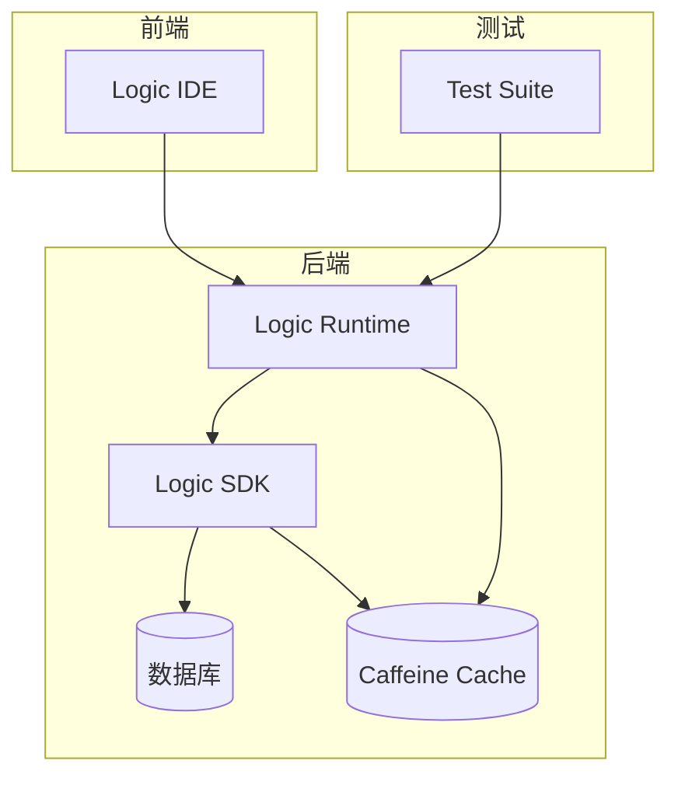
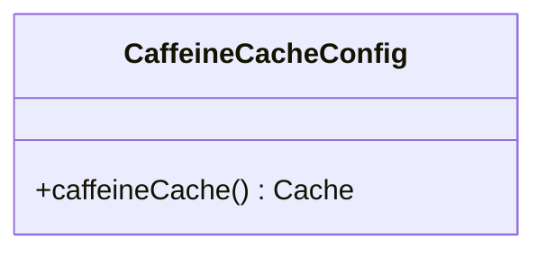
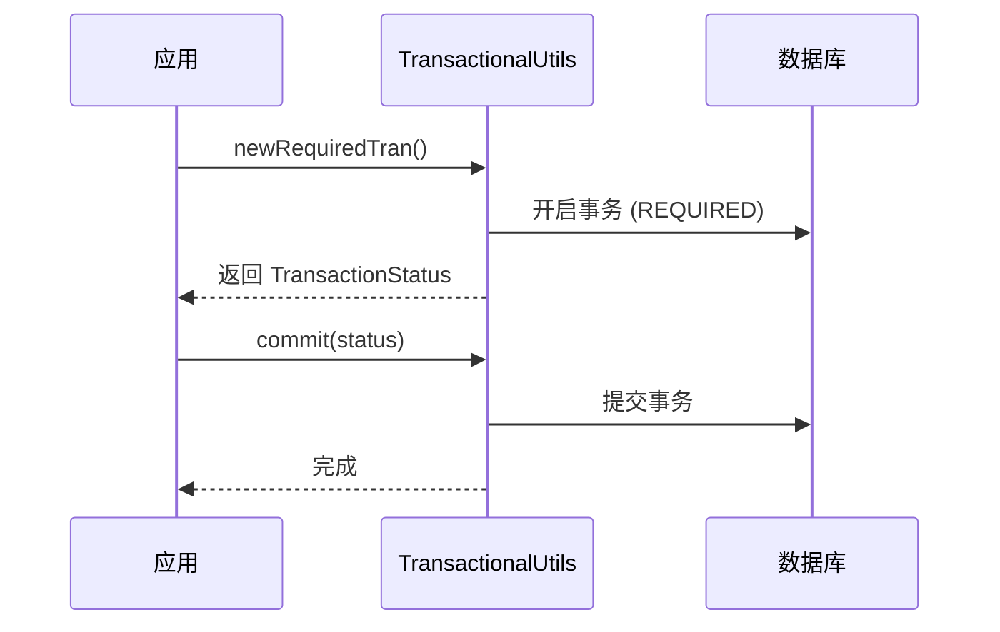
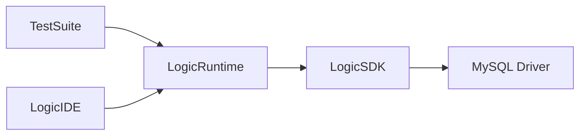

# 性能调优最佳实践

<cite>
**本文档引用文件**  
- [CaffeineCacheConfig.java](file://logic-runtime/src/main/java/com/aims/logic/runtime/configuration/CaffeineCacheConfig.java)
- [JsFunction.java](file://logic-runtime/src/main/java/com/aims/logic/runtime/runner/functions/impl/JsFunction.java)
- [TransactionalUtils.java](file://logic-sdk/src/main/java/com/aims/logic/sdk/util/TransactionalUtils.java)
- [TestConcurrency.java](file://test-suite/src/test/java/com/aims/logic/testsuite/TestConcurrency.java)
- [react.development.js](file://logic-ide/src/main/resources/public/js/umd/react.development.js)
</cite>

## 目录
1. [引言](#引言)  
2. [项目结构](#项目结构)  
3. [核心组件](#核心组件)  
4. [架构概述](#架构概述)  
5. [详细组件分析](#详细组件分析)  
6. [依赖分析](#依赖分析)  
7. [性能考量](#性能考量)  
8. [故障排除指南](#故障排除指南)  
9. [结论](#结论)

## 引言
本性能调优最佳实践文档旨在为 `logic-solution` 项目提供系统性的性能优化指导。文档基于 `test-suite` 中的并发测试用例，深入分析高并发场景下的性能瓶颈，并提出针对性的优化策略。重点涵盖缓存策略（Caffeine）、数据库连接优化、批量处理模式、JavaScript 执行性能及事务控制等关键领域，旨在通过合理的资源配置和执行模式选择，显著提升系统的整体吞吐量和响应能力。

## 项目结构
`logic-solution` 项目采用模块化设计，主要由 `logic-ide`、`logic-runtime`、`logic-sdk` 和 `test-suite` 四个核心模块构成。`logic-ide` 负责提供可视化逻辑编排的前端界面与后端控制；`logic-runtime` 是核心执行引擎，负责运行时逻辑的解析与执行；`logic-sdk` 提供了与外部系统集成的服务与数据访问能力；`test-suite` 则包含了用于验证系统功能与性能的测试用例。

**Section sources**
- [pom.xml](file://pom.xml#L0-L29)
- [readme.md](file://readme.md#L0-L29)

## 核心组件
本项目的核心性能优化围绕以下几个关键组件展开：
1.  **缓存配置**：位于 `logic-runtime` 模块的 `CaffeineCacheConfig` 类，负责配置高性能本地缓存。
2.  **JavaScript 执行引擎**：`logic-runtime` 模块中的 `JsFunction` 类，利用 GraalVM 实现高性能的 JS 脚本执行。
3.  **事务管理工具**：`logic-sdk` 模块中的 `TransactionalUtils` 类，提供灵活的事务开启、提交与回滚操作。
4.  **并发测试用例**：`test-suite` 模块中的 `TestConcurrency` 类，用于模拟高并发场景并评估系统性能。
5.  **前端框架**：`logic-ide` 中的 `react.development.js`，其性能对用户交互体验有直接影响。

**Section sources**
- [CaffeineCacheConfig.java](file://logic-runtime/src/main/java/com/aims/logic/runtime/configuration/CaffeineCacheConfig.java#L0-L22)
- [JsFunction.java](file://logic-runtime/src/main/java/com/aims/logic/runtime/runner/functions/impl/JsFunction.java#L0-L147)
- [TransactionalUtils.java](file://logic-sdk/src/main/java/com/aims/logic/sdk/util/TransactionalUtils.java#L0-L84)
- [TestConcurrency.java](file://test-suite/src/test/java/com/aims/logic/testsuite/TestConcurrency.java#L0-L56)
- [react.development.js](file://logic-ide/src/main/resources/public/js/umd/react.development.js#L0-L799)

## 架构概述
系统采用前后端分离的微服务架构。前端 `logic-ide` 通过 REST API 与后端 `logic-runtime` 交互，提交逻辑编排定义。`logic-runtime` 作为执行核心，接收执行请求，利用 `GraalVM` 引擎执行 JavaScript 代码，并通过 `logic-sdk` 访问数据库等外部资源。`test-suite` 独立运行，用于对 `logic-runtime` 的性能进行压力测试。缓存、事务和并发控制是贯穿整个架构的关键性能要素。

**Diagram sources**
- [pom.xml](file://pom.xml#L0-L29)
- [readme.md](file://readme.md#L0-L29)

## 详细组件分析

### 缓存策略配置（Caffeine）
`CaffeineCacheConfig` 类提供了配置本地缓存的能力。尽管当前代码中相关配置被注释，但其设计表明系统具备集成高性能缓存的潜力。建议在生产环境中启用并合理配置，例如设置合理的初始容量、最大容量和过期策略，以减少对数据库的频繁访问，从而显著提升高并发读取场景下的性能。

**Diagram sources**
- [CaffeineCacheConfig.java](file://logic-runtime/src/main/java/com/aims/logic/runtime/configuration/CaffeineCacheConfig.java#L0-L22)

### JavaScript 执行性能优化
`JsFunction` 类是 JavaScript 执行的核心。其性能优化点包括：
- **引擎复用**：通过依赖注入 `sharedEngine`，避免了每次执行都创建新的 GraalVM 引擎实例，极大降低了启动开销。
- **上下文隔离**：使用 `Context.newBuilder()` 为每次执行创建独立的上下文，保证了线程安全和变量隔离。
- **数据序列化**：在将 Java 对象（如 `_var`, `_env`）传递给 JS 环境前，使用 `JSON.toJSON()` 进行序列化，确保了数据的可访问性和线程安全。
- **代码预处理**：通过 `replaceAll("^//.*", "")` 移除脚本开头的注释，可能有助于 GraalVM 的解析优化。

**Section sources**
- [JsFunction.java](file://logic-runtime/src/main/java/com/aims/logic/runtime/runner/functions/impl/JsFunction.java#L19-L146)

### 事务控制对性能的影响
`TransactionalUtils` 类提供了细粒度的事务控制。不同的事务传播行为对性能有直接影响：
- **PROPAGATION_REQUIRED**：如果当前存在事务，则加入；否则新建。这是最常用的模式，但在高并发下，长事务会持有数据库连接和锁，影响吞吐量。
- **PROPAGATION_REQUIRES_NEW**：总是新建一个事务。这会增加事务创建和提交的开销，但可以隔离外部事务的影响，适用于需要独立提交的场景。
- **PROPAGATION_NOT_SUPPORTED**：以非事务方式执行，如果当前存在事务，则将其挂起。这能最大程度减少事务开销，适用于只读操作或对一致性要求不高的场景。

应根据业务需求选择合适的传播行为，避免不必要的事务开销。

**Diagram sources**
- [TransactionalUtils.java](file://logic-sdk/src/main/java/com/aims/logic/sdk/util/TransactionalUtils.java#L0-L84)

### 高并发场景下的性能优化
`TestConcurrency` 测试用例模拟了高并发执行场景。其关键点在于使用 `ExecutorService` 创建固定大小的线程池来并发执行逻辑。性能优化建议包括：
- **线程池大小**：线程池大小（10）应根据 CPU 核心数和任务类型（CPU 密集型或 I/O 密集型）进行调整。过大的线程池会导致上下文切换开销增加。
- **连接池优化**：确保数据库连接池（如 HikariCP）的配置与应用线程池相匹配，避免连接成为瓶颈。
- **批量处理**：对于可以合并的操作（如日志写入、数据更新），应采用批量处理模式，减少 I/O 次数。

**Section sources**
- [TestConcurrency.java](file://test-suite/src/test/java/com/aims/logic/testsuite/TestConcurrency.java#L0-L56)

## 依赖分析
项目各模块间存在明确的依赖关系。`logic-ide` 和 `test-suite` 依赖 `logic-runtime` 来执行逻辑；`logic-runtime` 依赖 `logic-sdk` 来访问数据。`logic-sdk` 依赖 MySQL 驱动和 `logic-runtime`。这种分层依赖确保了核心执行逻辑的独立性，便于进行性能测试和优化。

**Diagram sources**
- [logic-runtime/pom.xml](file://logic-runtime/pom.xml#L0-L34)
- [logic-sdk/pom.xml](file://logic-sdk/pom.xml#L0-L34)

## 性能考量
提升 `logic-solution` 系统吞吐量的关键在于：
1.  **启用并优化缓存**：激活 `Caffeine` 缓存，配置合理的过期和容量策略。
2.  **优化 JS 执行**：确保 `GraalVM` 引擎配置正确，避免在 JS 脚本中进行耗时的同步操作。
3.  **合理使用事务**：根据业务场景选择最合适的事务传播行为，避免长事务。
4.  **调整线程池**：根据压测结果，调整应用线程池和数据库连接池的大小。
5.  **前端性能**：虽然 `react.development.js` 仅用于开发，但生产环境应使用压缩后的版本以减少加载时间。

## 故障排除指南
当遇到性能问题时，可按以下步骤排查：
1.  检查日志，确认是否存在频繁的数据库查询或慢查询。
2.  监控系统资源（CPU、内存、I/O），确定瓶颈所在。
3.  分析线程堆栈，检查是否存在线程阻塞或死锁。
4.  验证缓存是否生效，命中率是否正常。
5.  审查事务边界，确认是否存在不必要的长事务。

**Section sources**
- [JsFunction.java](file://logic-runtime/src/main/java/com/aims/logic/runtime/runner/functions/impl/JsFunction.java#L19-L146)
- [TransactionalUtils.java](file://logic-sdk/src/main/java/com/aims/logic/sdk/util/TransactionalUtils.java#L0-L84)

## 结论
通过对 `logic-solution` 项目的深入分析，我们总结出一套全面的性能调优方案。通过合理配置 Caffeine 缓存、优化 GraalVM JavaScript 执行、精细化管理事务以及调整并发模型，可以有效提升系统在高并发场景下的稳定性和吞吐量。建议在生产环境中实施这些优化策略，并持续进行性能监控和调优。