# 最佳实践

<cite>
**本文档引用的文件**  
- [readme.md](file://readme.md)
- [CONTRIBUTING.md](file://CONTRIBUTING.md)
- [LogicRunner.java](file://logic-runtime/src/main/java/com/aims/logic/runtime/runner/LogicRunner.java)
- [LogicItemRunner.java](file://logic-runtime/src/main/java/com/aims/logic/runtime/runner/LogicItemRunner.java)
- [FunctionContext.java](file://logic-runtime/src/main/java/com/aims/logic/runtime/runner/FunctionContext.java)
- [LogicItemTreeNode.java](file://logic-runtime/src/main/java/com/aims/logic/runtime/contract/dsl/LogicItemTreeNode.java)
- [LogicTreeNode.java](file://logic-runtime/src/main/java/com/aims/logic/runtime/contract/dsl/LogicTreeNode.java)
- [LogicRunnerServiceImpl.java](file://logic-sdk/src/main/java/com/aims/logic/sdk/LogicRunnerServiceImpl.java)
- [CaffeineCacheConfig.java](file://logic-runtime/src/main/java/com/aims/logic/runtime/configuration/CaffeineCacheConfig.java)
- [CustomDiscardOldestPolicy.java](file://logic-runtime/src/main/java/com/aims/logic/runtime/custom/CustomDiscardOldestPolicy.java)
- [testConcurrency.java](file://test-suite/src/test/java/com/aims/logic/testsuite/TestConcurrency.java)
</cite>

## 目录
1. [引言](#引言)
2. [流程设计最佳模式](#流程设计最佳模式)
3. [性能调优建议](#性能调优建议)
4. [错误处理与异常恢复](#错误处理与异常恢复)
5. [代码组织与规范](#代码组织与规范)
6. [典型应用场景分析](#典型应用场景分析)
7. [团队协作与项目管理](#团队协作与项目管理)
8. [结论](#结论)

## 引言

`logic-solution` 是一个基于 Java 17 和 Spring Boot 的可视化逻辑编排引擎，支持通过拖拽式界面设计业务流程，并提供高性能的运行时执行能力。本最佳实践文档基于 `readme.md` 中的示例和 `test-suite` 中的实现，总结了使用该解决方案的推荐方法。

该系统核心特性包括可视化编排、高性能执行（基于 GraalVM JS 引擎）、状态管理、事务支持、完整日志记录、REST API 接口以及插件化扩展能力。通过本最佳实践指南，开发团队可以更好地利用这些特性，构建高效、可靠和可维护的业务逻辑系统。

**本文档引用的文件**  
- [readme.md](file://readme.md)

## 流程设计最佳模式

### 核心执行流程

`logic-solution` 的执行流程基于 `LogicRunner` 类实现，其核心设计模式是责任链与状态机的结合。当执行一个逻辑时，系统首先通过 `init` 方法初始化上下文环境，包括解析逻辑配置、合并环境变量、设置参数和局部变量等。

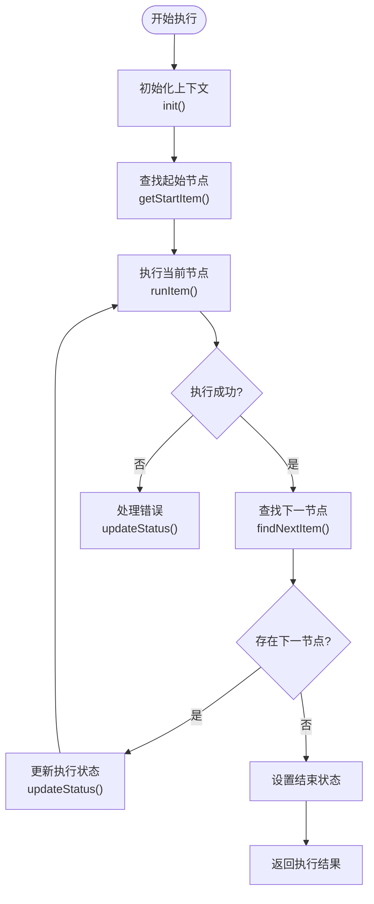

**Diagram sources **  
- [LogicRunner.java](file://logic-runtime/src/main/java/com/aims/logic/runtime/runner/LogicRunner.java#L70-L90)  
- [LogicRunner.java](file://logic-runtime/src/main/java/com/aims/logic/runtime/runner/LogicRunner.java#L145-L161)  
- [LogicRunner.java](file://logic-runtime/src/main/java/com/aims/logic/runtime/runner/LogicRunner.java#L200-L230)

**本文档引用的文件**  
- [LogicRunner.java](file://logic-runtime/src/main/java/com/aims/logic/runtime/runner/LogicRunner.java)

### 节点执行机制

每个逻辑节点的执行由 `LogicItemRunner` 类负责。该类采用策略模式，根据节点类型（type）选择不同的执行策略。系统通过 `switch` 语句分发不同类型的节点执行逻辑，如 `js`、`wait`、`assign-global` 等。

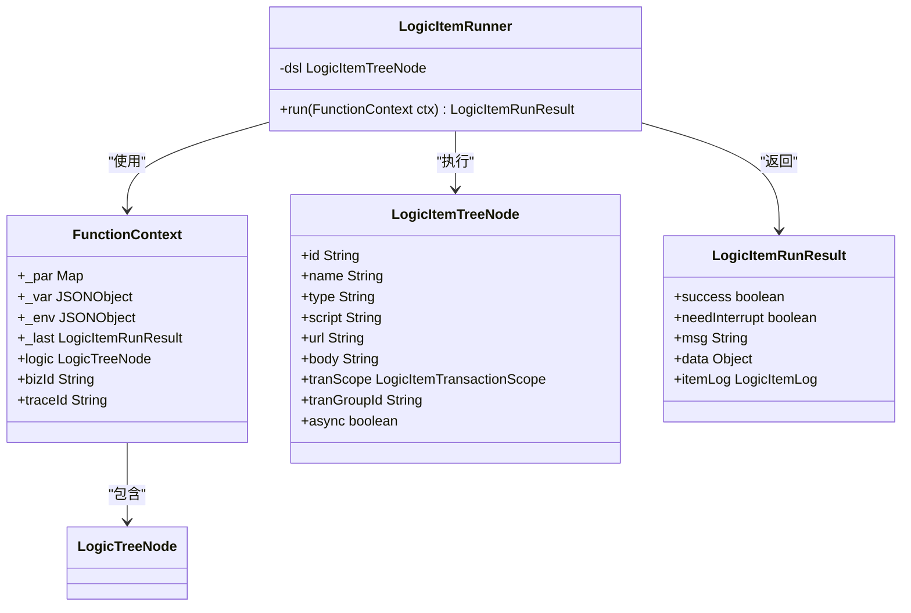

**Diagram sources **  
- [LogicItemRunner.java](file://logic-runtime/src/main/java/com/aims/logic/runtime/runner/LogicItemRunner.java#L10-L91)  
- [FunctionContext.java](file://logic-runtime/src/main/java/com/aims/logic/runtime/runner/FunctionContext.java#L14-L103)  
- [LogicItemTreeNode.java](file://logic-runtime/src/main/java/com/aims/logic/runtime/contract/dsl/LogicItemTreeNode.java#L15-L174)

**本文档引用的文件**  
- [LogicItemRunner.java](file://logic-runtime/src/main/java/com/aims/logic/runtime/runner/LogicItemRunner.java)  
- [FunctionContext.java](file://logic-runtime/src/main/java/com/aims/logic/runtime/runner/FunctionContext.java)  
- [LogicItemTreeNode.java](file://logic-runtime/src/main/java/com/aims/logic/runtime/contract/dsl/LogicItemTreeNode.java)

### 上下文管理

`FunctionContext` 类是整个执行过程中的上下文管理器，它维护了执行过程中的所有状态信息，包括参数（_par）、局部变量（_var）、环境变量（_env）、上一个节点的执行结果（_last）等。这种设计模式实现了状态的集中管理和传递。

上下文中的 `_global` 对象特别重要，它允许在不同逻辑之间共享全局状态。通过 `set_global` 方法，可以将外部传入的全局变量合并到上下文中，实现跨逻辑的状态传递。

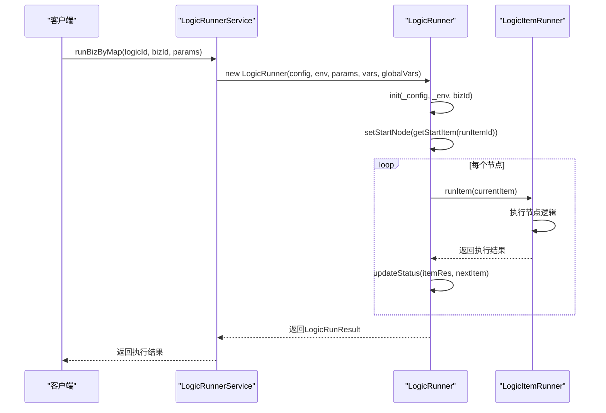

**Diagram sources **  
- [LogicRunnerServiceImpl.java](file://logic-sdk/src/main/java/com/aims/logic/sdk/LogicRunnerServiceImpl.java#L150-L200)  
- [LogicRunner.java](file://logic-runtime/src/main/java/com/aims/logic/runtime/runner/LogicRunner.java#L52-L61)  
- [LogicRunner.java](file://logic-runtime/src/main/java/com/aims/logic/runtime/runner/LogicRunner.java#L100-L120)

**本文档引用的文件**  
- [LogicRunnerServiceImpl.java](file://logic-sdk/src/main/java/com/aims/logic/sdk/LogicRunnerServiceImpl.java)  
- [LogicRunner.java](file://logic-runtime/src/main/java/com/aims/logic/runtime/runner/LogicRunner.java)

## 性能调优建议

### 脚本优化

在 `logic-solution` 中，JavaScript 脚本的执行性能至关重要，因为它是实现业务逻辑的主要方式之一。根据 `LogicItemRunner` 的实现，`js` 类型的节点通过 `Functions.get("js").invoke()` 方法执行，这表明系统使用了某种脚本引擎（可能是 GraalVM JS 引擎）。

为了优化脚本性能，建议：
1. 避免在脚本中进行复杂的循环和递归操作
2. 尽量减少全局变量的访问频率
3. 对于频繁执行的计算，考虑将其封装为 Java 函数并通过 `JavaCodeFunction` 执行
4. 使用缓存机制避免重复计算

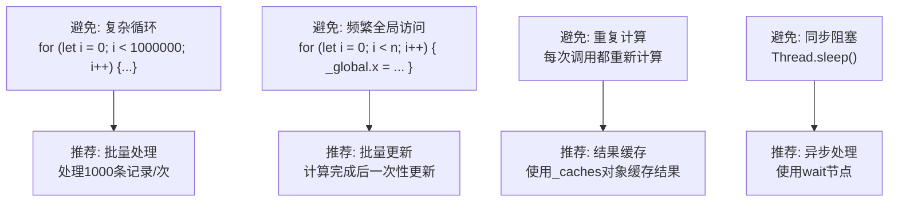

**本文档引用的文件**  
- [LogicItemRunner.java](file://logic-runtime/src/main/java/com/aims/logic/runtime/runner/LogicItemRunner.java)

### 缓存策略

`logic-solution` 提供了多种缓存机制来提升性能。首先，系统内置了 Caffeine 缓存配置，尽管在 `CaffeineCacheConfig.java` 中相关代码被注释掉了，但这表明系统设计时考虑了本地缓存的需求。

```java
// @Configuration
public class CaffeineCacheConfig {
//    @Bean
//    public Cache caffeineCache() {
//        return Caffeine.newBuilder()
//                .expireAfterAccess(1, TimeUnit.DAYS)
//                .initialCapacity(100)
//                .maximumSize(200)
//                .build();
//    }
}
```

此外，系统通过 `FunctionContext` 中的 `_var` 对象实现了执行上下文的缓存。对于有状态的业务实例，系统会将执行过程中的局部变量持久化，以便在后续执行中恢复状态。

推荐的缓存策略包括：
1. **本地缓存**：对于频繁访问且不经常变化的数据，使用 Caffeine 等本地缓存
2. **上下文缓存**：利用 `_var` 对象缓存执行过程中的中间结果
3. **全局缓存**：通过 `_global` 对象在不同逻辑实例间共享数据
4. **外部缓存**：集成 Redis 等分布式缓存系统

**本文档引用的文件**  
- [CaffeineCacheConfig.java](file://logic-runtime/src/main/java/com/aims/logic/runtime/configuration/CaffeineCacheConfig.java)  
- [FunctionContext.java](file://logic-runtime/src/main/java/com/aims/logic/runtime/runner/FunctionContext.java)

### 并发控制

并发控制是 `logic-solution` 性能优化的关键方面。系统通过 `BizLock` 机制确保同一业务实例的串行执行，避免了并发修改导致的数据不一致问题。

在 `LogicRunnerServiceImpl` 中，`runBizByMap` 方法使用了业务锁机制：
```java
String lockKey = bizLock.buildKey(logicId, bizId);
if (bizLock.spinLock(lockKey)) {
    try {
        // 执行业务逻辑
    } finally {
        bizLock.unlock(lockKey);
    }
}
```

对于高并发场景，建议：
1. **合理设置锁粒度**：避免锁的范围过大影响并发性能
2. **使用非阻塞锁**：考虑使用 Redis 的 SETNX 命令实现非阻塞锁
3. **异步执行**：对于不需要立即返回结果的操作，使用异步执行模式
4. **连接池优化**：合理配置数据库连接池大小

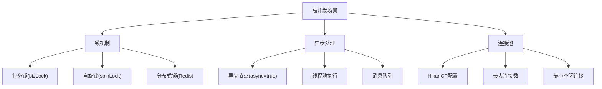

**本文档引用的文件**  
- [LogicRunnerServiceImpl.java](file://logic-sdk/src/main/java/com/aims/logic/sdk/LogicRunnerServiceImpl.java)  
- [CustomDiscardOldestPolicy.java](file://logic-runtime/src/main/java/com/aims/logic/runtime/custom/CustomDiscardOldestPolicy.java)

## 错误处理与异常恢复

### 错误处理机制

`logic-solution` 的错误处理机制设计得非常完善。每个节点的执行结果都封装在 `LogicItemRunResult` 对象中，包含 `success`、`msg`、`data` 等字段，便于统一处理。

在 `LogicItemRunner` 中，不同类型的节点有不同的错误处理方式：
- `js` 节点：捕获脚本执行异常
- `wait` 节点：处理 `InterruptedException`
- `http` 节点：处理网络异常和超时

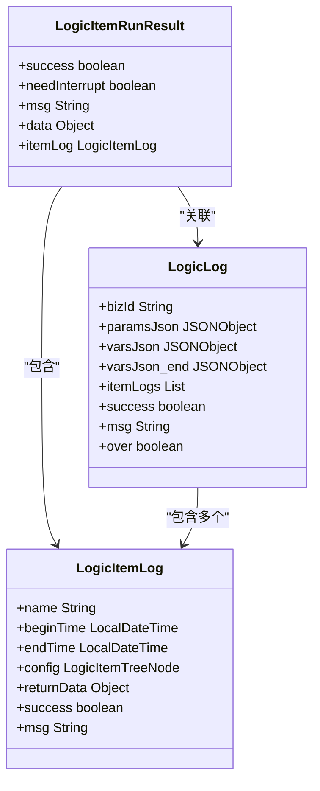

**Diagram sources **  
- [LogicItemRunResult.java](file://logic-runtime/src/main/java/com/aims/logic/runtime/contract/dto/LogicItemRunResult.java#L8-L47)  
- [LogicLog.java](file://logic-runtime/src/main/java/com/aims/logic/runtime/contract/logger/LogicLog.java)  
- [LogicItemLog.java](file://logic-runtime/src/main/java/com/aims/logic/runtime/contract/logger/LogicItemLog.java)

**本文档引用的文件**  
- [LogicItemRunResult.java](file://logic-runtime/src/main/java/com/aims/logic/runtime/contract/dto/LogicItemRunResult.java)  
- [LogicLog.java](file://logic-runtime/src/main/java/com/aims/logic/runtime/contract/logger/LogicLog.java)  
- [LogicItemLog.java](file://logic-runtime/src/main/java/com/aims/logic/runtime/contract/logger/LogicItemLog.java)

### 异常恢复策略

系统的异常恢复策略主要体现在有状态业务实例的设计上。当业务执行失败时，系统会保存当前的执行状态，包括已执行的节点、局部变量等，以便后续重试。

`LogicRunnerServiceImpl` 提供了 `retryErrorBiz` 方法用于重试失败的业务：
```java
@Override
public LogicRunResult retryErrorBiz(String logicId, String bizId) {
    // 从实例读取缓存的入参与临时变量
    // 从记录的待执行节点继续执行
    return runBiz(logicId, bizId, parsJson, traceId, logicLogId, null);
}
```

推荐的异常恢复实践包括：
1. **幂等性设计**：确保业务逻辑具有幂等性，可以安全地重试
2. **状态持久化**：定期保存执行状态，避免长时间运行的业务因故障而完全重来
3. **错误分类处理**：区分可恢复错误和不可恢复错误，采取不同的处理策略
4. **重试机制**：实现指数退避等智能重试策略

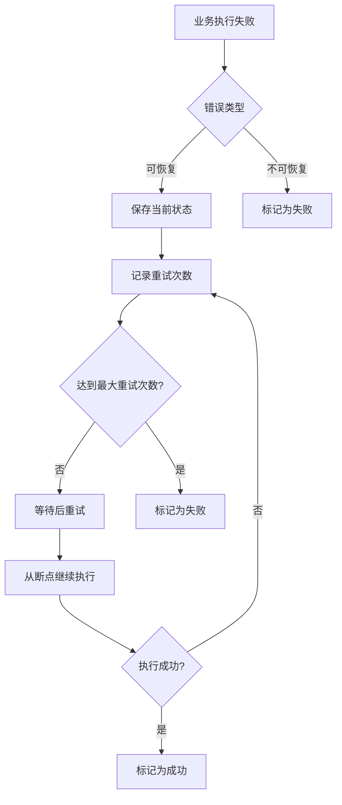

**本文档引用的文件**  
- [LogicRunnerServiceImpl.java](file://logic-sdk/src/main/java/com/aims/logic/sdk/LogicRunnerServiceImpl.java)

## 代码组织与规范

### 代码组织结构

`logic-solution` 的代码组织遵循清晰的模块化结构，主要分为三个核心模块：
- `logic-runtime`：核心执行引擎
- `logic-sdk`：SDK 和服务层
- `logic-ide`：Web IDE 界面

每个模块都有明确的职责划分，如 `logic-runtime` 中的包结构：
- `configuration`：配置类
- `contract`：契约定义（DTO、枚举等）
- `runner`：核心执行逻辑
- `service`：服务接口
- `store`：配置存储
- `util`：工具类

这种分层架构有利于代码的维护和扩展。

**本文档引用的文件**  
- [readme.md](file://readme.md)

### 命名约定

根据 `CONTRIBUTING.md` 中的代码规范，项目遵循以下命名约定：
- **类名**：大驼峰命名法（PascalCase），如 `LogicRunner`
- **方法名**：小驼峰命名法（camelCase），如 `runByMap`
- **常量名**：全大写下划线分隔，如 `DEFAULT_TIMEOUT`
- **包名**：全小写点分隔，如 `com.logic.runtime`

这些命名规范有助于提高代码的可读性和一致性。

**本文档引用的文件**  
- [CONTRIBUTING.md](file://CONTRIBUTING.md)

### 文档编写标准

项目强调代码文档的重要性，要求关键方法必须包含详细的 JavaDoc 注释。注释应包括：
- 方法功能描述
- 参数说明（@param）
- 返回值说明（@return）
- 异常说明（@throws）
- 作者和版本信息（@author, @since）

```java
/**
 * 执行逻辑实例
 *
 * @param logicId 逻辑编号
 * @param params  执行参数
 * @return 执行结果
 * @author yourname
 * @since 1.0.0
 */
public LogicRunResult runByMap(String logicId, Map<String, Object> params) {
    // 方法实现
}
```

**本文档引用的文件**  
- [CONTRIBUTING.md](file://CONTRIBUTING.md)

## 典型应用场景分析

### 模式分析

#### 有状态业务流程

有状态业务流程是 `logic-solution` 的典型应用场景。通过 `runBizByMap` 方法，可以创建有状态的业务实例，并在后续调用中从断点继续执行。

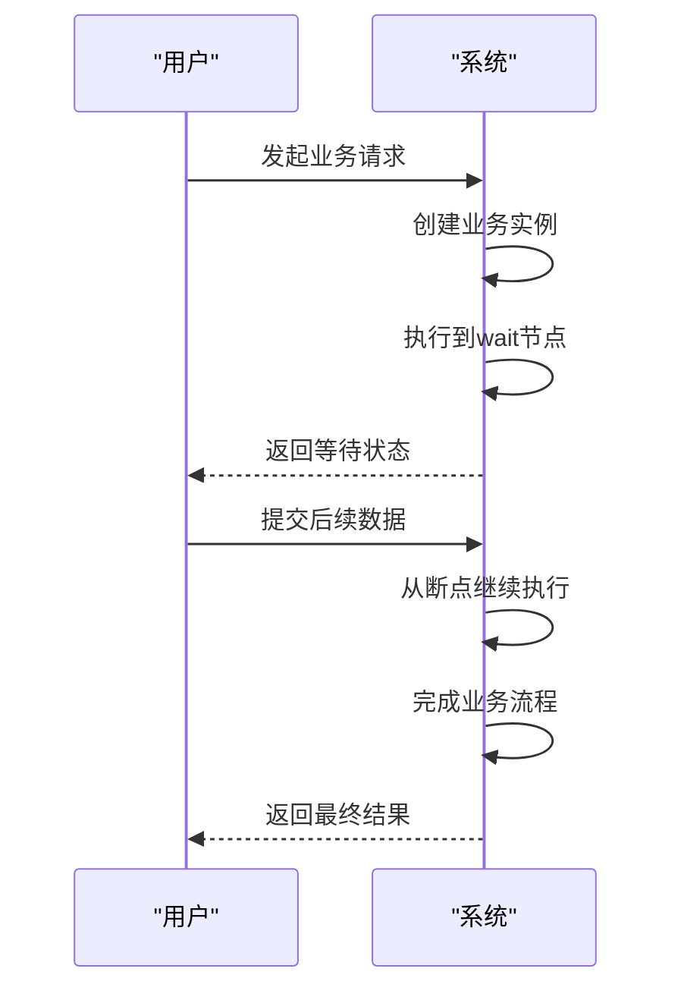

这种模式适用于需要多步交互的业务场景，如订单处理、审批流程等。

**本文档引用的文件**  
- [LogicRunnerServiceImpl.java](file://logic-sdk/src/main/java/com/aims/logic/sdk/LogicRunnerServiceImpl.java)

#### 异步处理模式

对于耗时较长的操作，可以使用异步处理模式。通过设置节点的 `async` 属性为 `true`，系统将不等待节点执行结果，立即返回成功。

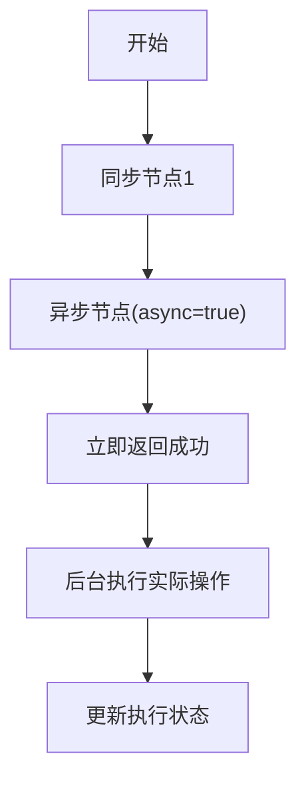

这种模式适用于发送通知、生成报表等不需要立即返回结果的操作。

**本文档引用的文件**  
- [LogicItemTreeNode.java](file://logic-runtime/src/main/java/com/aims/logic/runtime/contract/dsl/LogicItemTreeNode.java)

### 反模式分析

#### 过度依赖脚本

反模式：在 `js` 节点中编写复杂的业务逻辑，导致性能下降和维护困难。

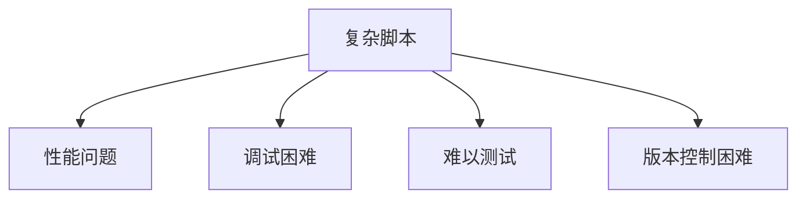

建议：将复杂的业务逻辑封装为 Java 函数，通过 `JavaCodeFunction` 执行。

#### 共享状态滥用

反模式：过度使用 `_global` 共享状态，导致不同业务实例间的耦合。

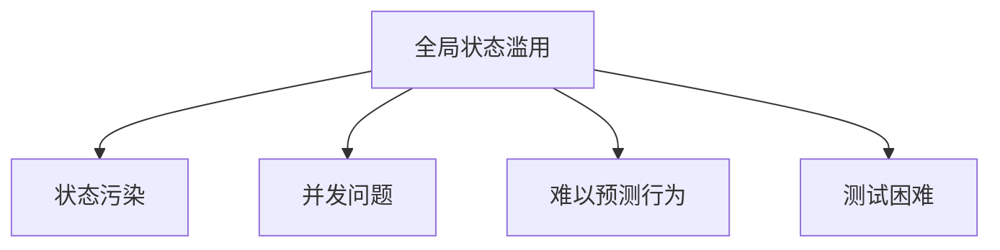

建议：限制全局状态的使用范围，优先使用局部变量和参数传递。

**本文档引用的文件**  
- [FunctionContext.java](file://logic-runtime/src/main/java/com/aims/logic/runtime/runner/FunctionContext.java)

## 团队协作与项目管理

### 贡献流程

`logic-solution` 项目遵循标准的开源贡献流程：
1. Fork 项目到个人账户
2. 创建特性分支（feature/your-feature-name）
3. 开发代码并添加测试
4. 提交代码（遵循 Conventional Commits 规范）
5. 推送分支并创建 Pull Request

提交信息应使用约定式提交格式：
- `feat: 新功能`
- `fix: 修复 Bug`
- `docs: 文档更新`
- `style: 代码格式调整`
- `refactor: 代码重构`
- `test: 测试相关`
- `chore: 构建过程或辅助工具变动`

**本文档引用的文件**  
- [CONTRIBUTING.md](file://CONTRIBUTING.md)

### 代码审查

代码审查是保证代码质量的关键环节。审查重点包括：
- 代码逻辑正确性
- 异常边界处理
- 性能影响
- 安全性考虑
- 向后兼容性

审查者应检查是否遵循了阿里巴巴 Java 开发手册和项目特定的代码规范。

**本文档引用的文件**  
- [CONTRIBUTING.md](file://CONTRIBUTING.md)

## 结论

`logic-solution` 是一个功能强大且设计良好的可视化逻辑编排引擎。通过遵循本文档中的最佳实践，开发团队可以充分发挥其潜力，构建高效、可靠和可维护的业务系统。

关键要点总结：
1. **流程设计**：理解核心执行流程，合理设计有状态和无状态业务
2. **性能优化**：优化脚本性能，合理使用缓存和并发控制
3. **错误处理**：设计健壮的错误处理和异常恢复机制
4. **代码质量**：遵循代码规范，编写清晰的文档
5. **团队协作**：遵循贡献流程，进行有效的代码审查

通过持续应用这些最佳实践，团队可以确保 `logic-solution` 项目的长期成功和可持续发展。