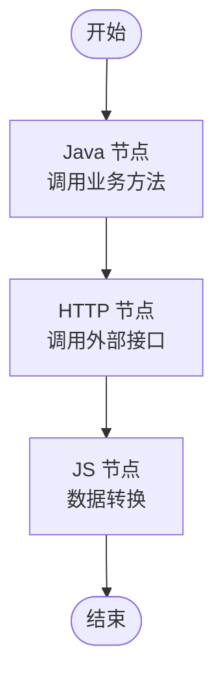
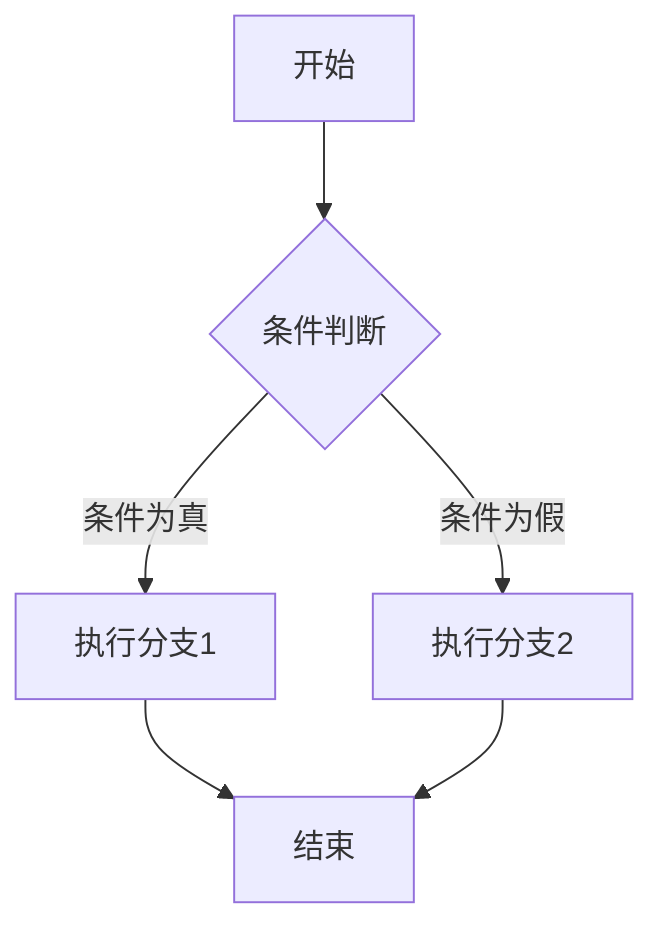
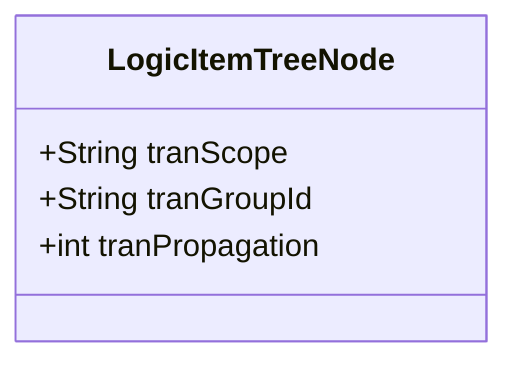

# 流程设计最佳实践

<cite>
**本文档引用的文件**  
- [readme.md](file://readme.md)
- [LogicItemTreeNode.java](file://logic-runtime/src/main/java/com/aims/logic/runtime/contract/dsl/LogicItemTreeNode.java)
- [LogicItemTransactionScope.java](file://logic-runtime/src/main/java/com/aims/logic/runtime/contract/enums/LogicItemTransactionScope.java)
- [LogicRunModelEnum.java](file://logic-runtime/src/main/java/com/aims/logic/runtime/contract/dto/LogicRunModelEnum.java)
- [testList.java](file://test-suite/src/main/java/com/aims/logic/testsuite/demo/testList.java)
- [testTypes.java](file://test-suite/src/main/java/com/aims/logic/testsuite/demo/testTypes.java)
- [if.json](file://logic-ide/src/main/resources/public/setting/forms/if.json)
- [switch-case.json](file://logic-ide/src/main/resources/public/setting/forms/switch-case.json)
- [java.json](file://logic-ide/src/main/resources/public/setting/forms/java.json)
- [http.json](file://logic-ide/src/main/resources/public/setting/forms/http.json)
</cite>

## 目录
1. [引言](#引言)
2. [核心节点类型与参数传递](#核心节点类型与参数传递)
3. [复杂逻辑设计模式](#复杂逻辑设计模式)
4. [上下文管理与事务控制](#上下文管理与事务控制)
5. [典型业务场景设计示例](#典型业务场景设计示例)
6. [设计反模式与解决方案](#设计反模式与解决方案)
7. [流程组织与命名规范](#流程组织与命名规范)

## 引言
Logic IDE 是一个基于 Java 17 和 Spring Boot 的可视化逻辑编排引擎，支持通过拖拽式界面设计业务流程。本实践文档旨在为开发者提供使用 logic-solution 进行可视化流程编排的最佳方法，重点介绍条件分支、循环处理、并行执行等复杂逻辑的设计模式，并总结节点类型选择、参数传递、上下文管理的最佳实践。

**本文档引用的文件**  
- [readme.md](file://readme.md)

## 核心节点类型与参数传递

在 logic-solution 中，节点是构成业务流程的基本单元。不同类型的节点适用于不同的场景，合理选择节点类型是设计高效流程的关键。

### 节点类型选择
- **Java 节点**：用于调用 Java 方法，支持强类型参数和返回值声明，适合执行核心业务逻辑。
- **HTTP 节点**：用于发起 HTTP 请求，支持配置 URL、方法、请求头、请求体和超时时间，适合与外部系统集成。
- **JS 节点**：用于执行 JavaScript 代码，适合进行数据转换、条件判断等轻量级操作。
- **条件分支节点（if）**：根据表达式的结果决定流程走向，适合实现简单的条件判断。
- **Switch 节点**：根据变量的值匹配不同的分支，适合实现多路分支逻辑。

### 参数传递最佳实践
- **Java 节点参数传递**：通过 `params` 字段声明方法参数，支持复杂类型和嵌套引用。在配置界面中，可以通过表单或代码块的方式配置参数。
- **HTTP 节点参数传递**：通过 `body` 和 `headers` 字段配置请求体和请求头，支持 JavaScript 表达式动态生成参数。
- **上下文参数传递**：使用 `_par` 前缀访问上下文中的参数，确保数据在流程中的正确传递。

**图示来源**
- [java.json](file://logic-ide/src/main/resources/public/setting/forms/java.json)
- [http.json](file://logic-ide/src/main/resources/public/setting/forms/http.json)
- [readme.md](file://readme.md)

**本节来源**
- [LogicItemTreeNode.java](file://logic-runtime/src/main/java/com/aims/logic/runtime/contract/dsl/LogicItemTreeNode.java)
- [java.json](file://logic-ide/src/main/resources/public/setting/forms/java.json)
- [http.json](file://logic-ide/src/main/resources/public/setting/forms/http.json)

## 复杂逻辑设计模式

### 条件分支处理
条件分支是流程中常见的控制结构。在 logic-solution 中，可以使用 `if` 节点和 `switch` 节点实现条件分支。

#### If 节点
`if` 节点通过 `condition` 字段配置条件表达式，表达式可以是变量名或 JavaScript 表达式。例如，`_par.outType == 'A'` 表示当 `outType` 参数等于 'A' 时执行该分支。

#### Switch 节点
`switch` 节点通过 `branches` 字段配置多个分支，每个分支包含一个 `case` 值和对应的 `nextId`。`switch` 节点根据变量的值匹配 `case` 值，执行相应的分支。

**图示来源**
- [if.json](file://logic-ide/src/main/resources/public/setting/forms/if.json)
- [switch-case.json](file://logic-ide/src/main/resources/public/setting/forms/switch-case.json)

### 循环处理
循环处理可以通过递归调用或定时任务实现。在 logic-solution 中，可以使用 `wait` 节点和 `process` 节点组合实现循环逻辑。

### 并行执行
并行执行可以通过 `async` 字段配置。当 `async` 为 `true` 时，节点将异步执行，不等待返回结果。适合执行耗时较长且不影响后续流程的操作。

**本节来源**
- [LogicItemTreeNode.java](file://logic-runtime/src/main/java/com/aims/logic/runtime/contract/dsl/LogicItemTreeNode.java)
- [if.json](file://logic-ide/src/main/resources/public/setting/forms/if.json)
- [switch-case.json](file://logic-ide/src/main/resources/public/setting/forms/switch-case.json)

## 上下文管理与事务控制

### 上下文管理
上下文是流程中存储和传递数据的容器。在 logic-solution 中，上下文中的参数可以通过 `_par` 前缀访问。合理管理上下文可以避免数据混乱和丢失。

### 事务控制
事务控制是确保数据一致性的关键。在 logic-solution 中，可以通过 `tranScope` 字段配置事务范围。

#### 事务范围
- `off`：关闭事务。
- `everyNode`：每个节点开启事务，发生异常则中断。
- `everyNode2`：每个节点开启事务，发生异常时，为配置的业务异常类则不中断，否则中断。
- `everyRequest`：每次请求交互开启事务。

#### 事务组
通过 `tranGroupId` 字段配置事务组编号，相邻且相同的编号会使用同一个事务，确保多个节点在同一个事务中执行。

**图示来源**
- [LogicItemTreeNode.java](file://logic-runtime/src/main/java/com/aims/logic/runtime/contract/dsl/LogicItemTreeNode.java)
- [LogicItemTransactionScope.java](file://logic-runtime/src/main/java/com/aims/logic/runtime/contract/enums/LogicItemTransactionScope.java)

**本节来源**
- [LogicItemTreeNode.java](file://logic-runtime/src/main/java/com/aims/logic/runtime/contract/dsl/LogicItemTreeNode.java)
- [LogicItemTransactionScope.java](file://logic-runtime/src/main/java/com/aims/logic/runtime/contract/enums/LogicItemTransactionScope.java)

## 典型业务场景设计示例

### 订单处理流程
订单处理流程通常包括创建订单、支付、发货、确认收货等步骤。在 logic-solution 中，可以使用 Java 节点调用业务方法，HTTP 节点调用支付接口，条件分支节点处理支付结果。

### 库存同步流程
库存同步流程需要与外部系统进行数据交换。在 logic-solution 中，可以使用 HTTP 节点调用外部系统的 API，JS 节点进行数据转换，`wait` 节点等待外部系统响应。

**本节来源**
- [readme.md](file://readme.md)
- [testList.java](file://test-suite/src/main/java/com/aims/logic/testsuite/demo/testList.java)
- [testTypes.java](file://test-suite/src/main/java/com/aims/logic/testsuite/demo/testTypes.java)

## 设计反模式与解决方案

### 过度嵌套
过度嵌套会导致流程难以理解和维护。解决方案是将复杂的逻辑拆分为多个子流程，使用 `sub-logic` 节点调用子流程。

### 循环依赖
循环依赖会导致流程无法正常执行。解决方案是重新设计流程，避免节点之间的循环调用。

**本节来源**
- [readme.md](file://readme.md)
- [LogicItemTreeNode.java](file://logic-runtime/src/main/java/com/aims/logic/runtime/contract/dsl/LogicItemTreeNode.java)

## 流程组织与命名规范

### 流程组织
- 将相关的节点组织在一起，形成逻辑清晰的模块。
- 使用 `process-group` 节点对流程进行分组，提高可读性。

### 命名规范
- 节点名称应简洁明了，准确描述节点的功能。
- 使用驼峰命名法，如 `createOrder`、`sendNotification`。

**本节来源**
- [readme.md](file://readme.md)
- [LogicItemTreeNode.java](file://logic-runtime/src/main/java/com/aims/logic/runtime/contract/dsl/LogicItemTreeNode.java)