# 错误处理与异常恢复最佳实践

<cite>
**Referenced Files in This Document**   
- [ThrowException.java](file://test-suite/src/main/java/com/aims/logic/testsuite/demo/cases/ThrowException.java)
- [ControllerExceptionHandler.java](file://logic-ide/src/main/java/com/aims/logic/ide/exception/ControllerExceptionHandler.java)
- [BizManuallyStoppedException.java](file://logic-runtime/src/main/java/com/aims/logic/runtime/exception/BizManuallyStoppedException.java)
- [CustomException.java](file://test-suite/src/main/java/com/aims/logic/testsuite/demo/exception/CustomException.java)
- [LogicBizException.java](file://logic-runtime/src/main/java/com/aims/logic/runtime/LogicBizException.java)
- [ExceptionHandler.java](file://test-suite/src/main/java/com/aims/logic/testsuite/demo/component/ExceptionHandler.java)
</cite>

## 目录
1. [引言](#引言)
2. [异常分类体系](#异常分类体系)
3. [自定义异常设计规范](#自定义异常设计规范)
4. [统一异常处理框架](#统一异常处理框架)
5. [异常传播控制策略](#异常传播控制策略)
6. [异常恢复与补偿机制](#异常恢复与补偿机制)
7. [日志记录与监控](#日志记录与监控)
8. [测试用例分析](#测试用例分析)
9. [最佳实践总结](#最佳实践总结)

## 引言
在逻辑工作流系统中，健壮的错误处理与异常恢复机制是确保系统稳定性和可靠性的关键。本文档基于test-suite中的异常测试用例，系统性地阐述了业务异常、系统异常和网络异常的分类处理方法。通过分析ExceptionHandler实现，展示了统一异常处理框架的配置和使用，为开发者提供了一套完整的异常管理策略。

## 异常分类体系

本系统采用分层异常分类体系，将异常分为三大类：业务异常、系统异常和网络异常。这种分类方法有助于针对性地设计处理策略和恢复机制。

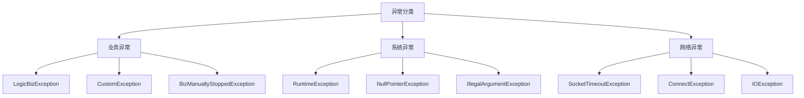

**Diagram sources**
- [LogicBizException.java](file://logic-runtime/src/main/java/com/aims/logic/runtime/LogicBizException.java)
- [CustomException.java](file://test-suite/src/main/java/com/aims/logic/testsuite/demo/exception/CustomException.java)
- [BizManuallyStoppedException.java](file://logic-runtime/src/main/java/com/aims/logic/runtime/exception/BizManuallyStoppedException.java)

**Section sources**
- [LogicBizException.java](file://logic-runtime/src/main/java/com/aims/logic/runtime/LogicBizException.java)
- [CustomException.java](file://test-suite/src/main/java/com/aims/logic/testsuite/demo/exception/CustomException.java)

## 自定义异常设计规范

### 基础设计原则
自定义异常应继承自RuntimeException，确保非检查异常的灵活性。所有自定义异常必须提供清晰的错误消息，便于问题定位和用户理解。

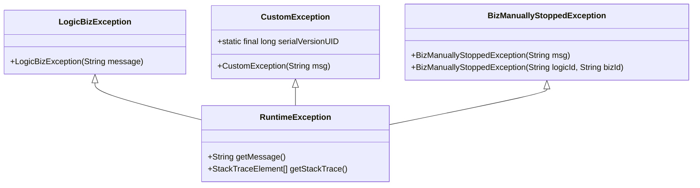

**Diagram sources**
- [LogicBizException.java](file://logic-runtime/src/main/java/com/aims/logic/runtime/LogicBizException.java#L2-L6)
- [CustomException.java](file://test-suite/src/main/java/com/aims/logic/testsuite/demo/exception/CustomException.java#L2-L8)
- [BizManuallyStoppedException.java](file://logic-runtime/src/main/java/com/aims/logic/runtime/exception/BizManuallyStoppedException.java#L2-L11)

**Section sources**
- [LogicBizException.java](file://logic-runtime/src/main/java/com/aims/logic/runtime/LogicBizException.java#L2-L6)
- [CustomException.java](file://test-suite/src/main/java/com/aims/logic/testsuite/demo/exception/CustomException.java#L2-L8)

### 异常继承结构
系统定义了清晰的异常继承结构，便于异常的统一管理和处理。LogicBizException作为业务异常的基类，为所有业务相关的异常提供了统一的处理入口。

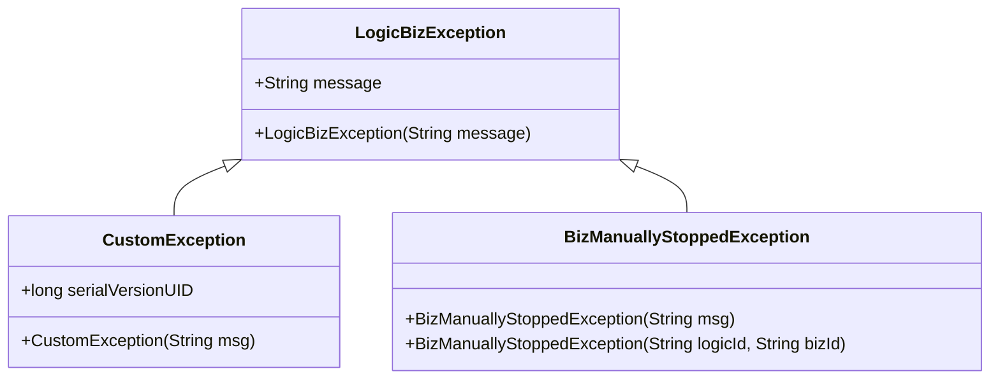

**Diagram sources**
- [LogicBizException.java](file://logic-runtime/src/main/java/com/aims/logic/runtime/LogicBizException.java)
- [CustomException.java](file://test-suite/src/main/java/com/aims/logic/testsuite/demo/exception/CustomException.java)
- [BizManuallyStoppedException.java](file://logic-runtime/src/main/java/com/aims/logic/runtime/exception/BizManuallyStoppedException.java)

**Section sources**
- [LogicBizException.java](file://logic-runtime/src/main/java/com/aims/logic/runtime/LogicBizException.java)
- [CustomException.java](file://test-suite/src/main/java/com/aims/logic/testsuite/demo/exception/CustomException.java)

## 统一异常处理框架

### ControllerExceptionHandler实现
ControllerExceptionHandler作为全局异常处理器，采用@ControllerAdvice注解实现跨控制器的异常捕获。该处理器能够捕获所有未处理的异常，并将其转换为标准化的API响应格式。

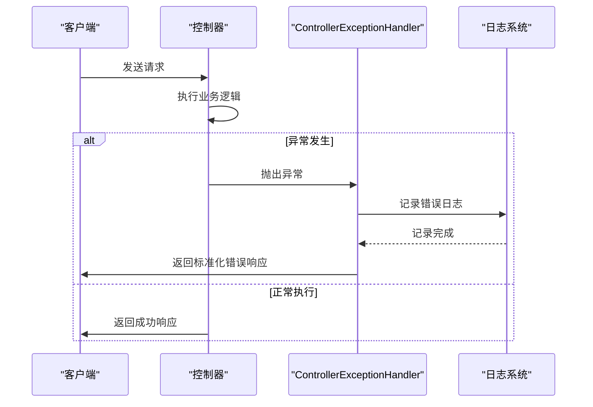

**Diagram sources**
- [ControllerExceptionHandler.java](file://logic-ide/src/main/java/com/aims/logic/ide/exception/ControllerExceptionHandler.java#L3-L19)

**Section sources**
- [ControllerExceptionHandler.java](file://logic-ide/src/main/java/com/aims/logic/ide/exception/ControllerExceptionHandler.java#L3-L19)

### 异常处理流程
统一异常处理框架遵循标准化的处理流程：异常捕获→日志记录→响应构建→返回客户端。这种流程确保了异常处理的一致性和可预测性。

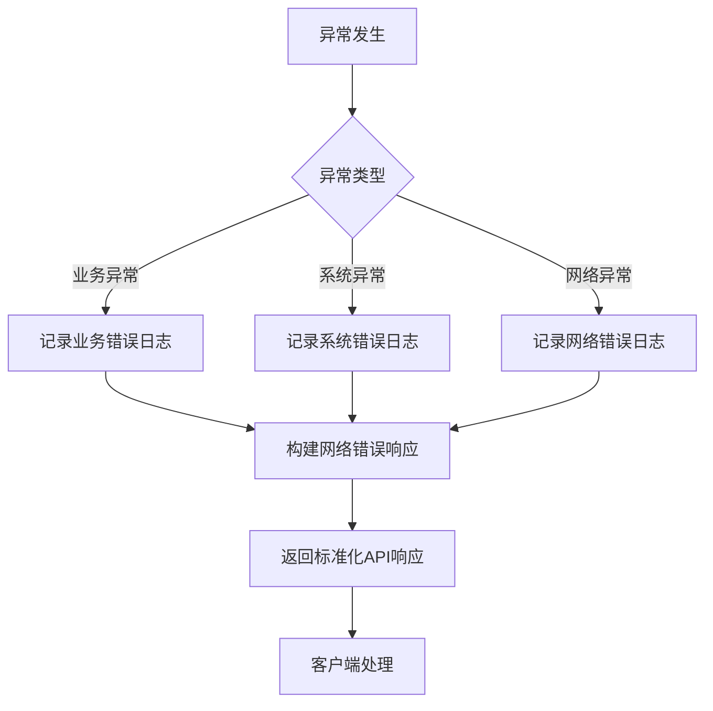

**Diagram sources**
- [ControllerExceptionHandler.java](file://logic-ide/src/main/java/com/aims/logic/ide/exception/ControllerExceptionHandler.java)
- [LogicBizException.java](file://logic-runtime/src/main/java/com/aims/logic/runtime/LogicBizException.java)

**Section sources**
- [ControllerExceptionHandler.java](file://logic-ide/src/main/java/com/aims/logic/ide/exception/ControllerExceptionHandler.java)

## 异常传播控制策略

### 异常包装与转换
在多层架构中，异常传播需要进行适当的包装和转换，以确保异常信息的完整性和安全性。避免将底层异常直接暴露给上层调用者。

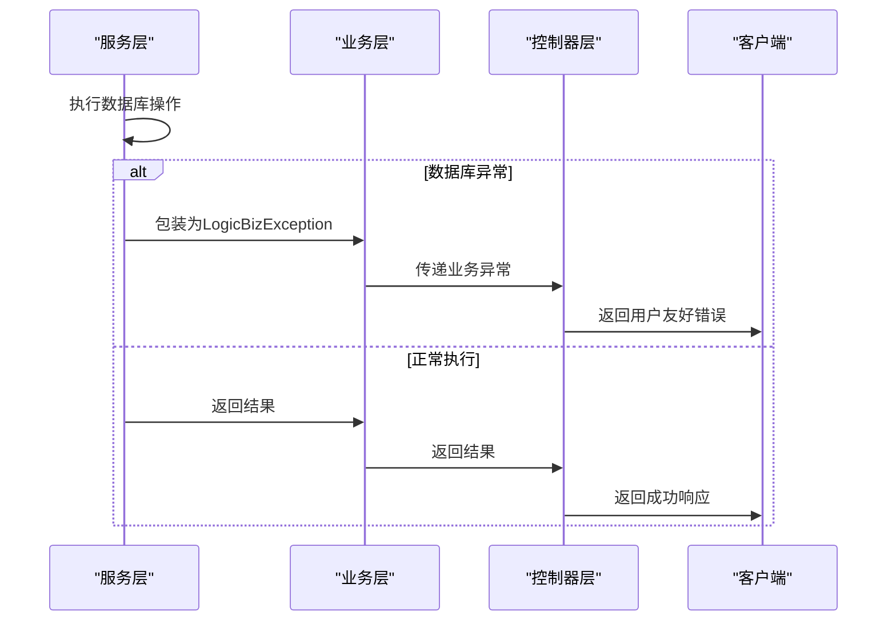

**Diagram sources**
- [LogicBizException.java](file://logic-runtime/src/main/java/com/aims/logic/runtime/LogicBizException.java)
- [ControllerExceptionHandler.java](file://logic-ide/src/main/java/com/aims/logic/ide/exception/ControllerExceptionHandler.java)

**Section sources**
- [LogicBizException.java](file://logic-runtime/src/main/java/com/aims/logic/runtime/LogicBizException.java)

### 异常边界管理
在系统边界处设置异常处理点，确保异常不会跨越边界传播。这有助于隔离故障，防止一个模块的异常影响整个系统。

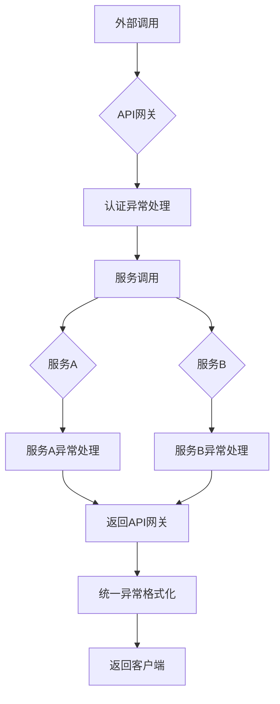

**Diagram sources**
- [ControllerExceptionHandler.java](file://logic-ide/src/main/java/com/aims/logic/ide/exception/ControllerExceptionHandler.java)

**Section sources**
- [ControllerExceptionHandler.java](file://logic-ide/src/main/java/com/aims/logic/ide/exception/ControllerExceptionHandler.java)

## 异常恢复与补偿机制

### 重试机制设计
对于可恢复的临时性异常，如网络超时或数据库连接问题，应实施智能重试机制。重试策略应包含退避算法，避免对系统造成过大压力。

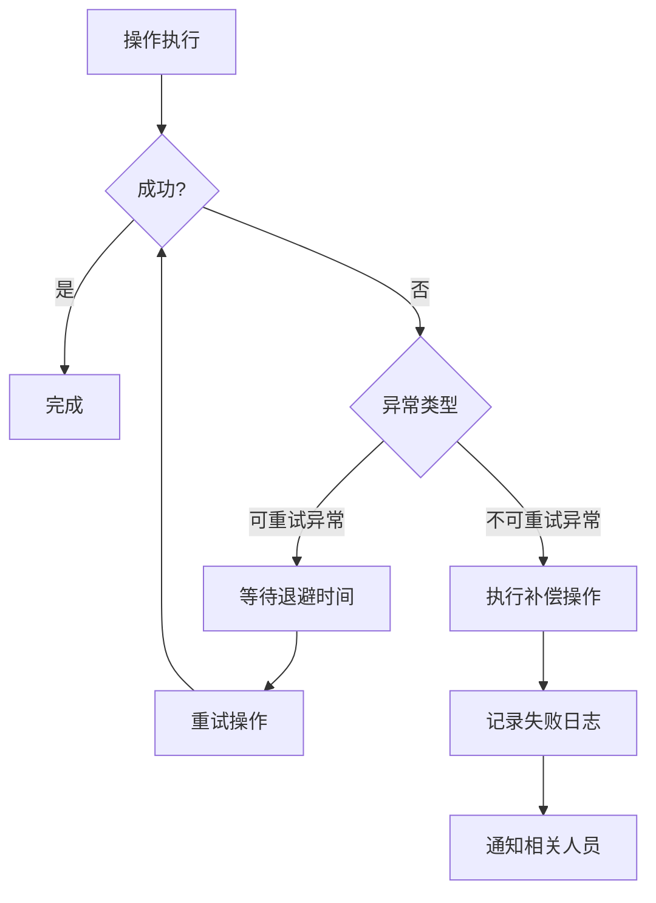

**Diagram sources**
- [LogicBizException.java](file://logic-runtime/src/main/java/com/aims/logic/runtime/LogicBizException.java)
- [CustomException.java](file://test-suite/src/main/java/com/aims/logic/testsuite/demo/exception/CustomException.java)

**Section sources**
- [LogicBizException.java](file://logic-runtime/src/main/java/com/aims/logic/runtime/LogicBizException.java)

### 补偿事务实现
对于已部分执行的操作，需要设计补偿事务来恢复系统到一致状态。补偿事务应具有幂等性，确保多次执行不会产生副作用。

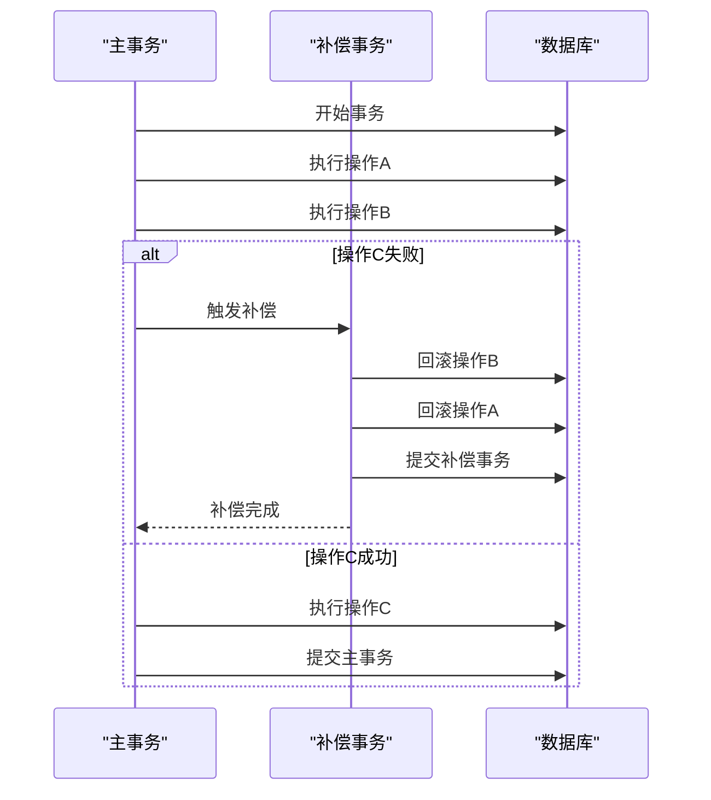

**Diagram sources**
- [LogicBizException.java](file://logic-runtime/src/main/java/com/aims/logic/runtime/LogicBizException.java)
- [CustomException.java](file://test-suite/src/main/java/com/aims/logic/testsuite/demo/exception/CustomException.java)

**Section sources**
- [LogicBizException.java](file://logic-runtime/src/main/java/com/aims/logic/runtime/LogicBizException.java)

## 日志记录与监控

### 异常日志规范
异常日志应包含完整的上下文信息，包括时间戳、异常类型、错误消息、堆栈跟踪和相关业务数据。日志级别应根据异常的严重程度进行适当设置。

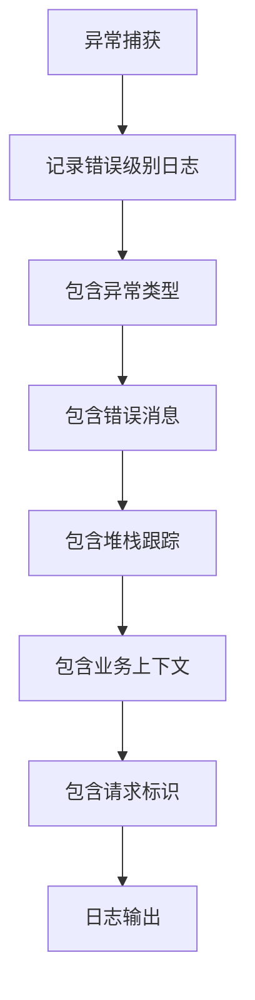

**Diagram sources**
- [ControllerExceptionHandler.java](file://logic-ide/src/main/java/com/aims/logic/ide/exception/ControllerExceptionHandler.java)

**Section sources**
- [ControllerExceptionHandler.java](file://logic-ide/src/main/java/com/aims/logic/ide/exception/ControllerExceptionHandler.java)

### 监控与告警
建立异常监控系统，对异常发生频率、类型分布和趋势进行实时监控。设置合理的告警阈值，及时通知相关人员处理严重异常。

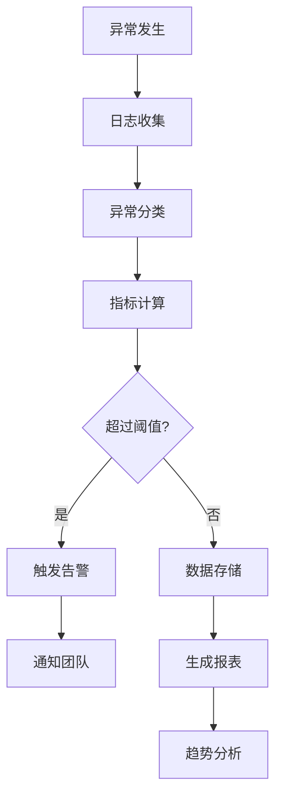

**Diagram sources**
- [ControllerExceptionHandler.java](file://logic-ide/src/main/java/com/aims/logic/ide/exception/ControllerExceptionHandler.java)

**Section sources**
- [ControllerExceptionHandler.java](file://logic-ide/src/main/java/com/aims/logic/ide/exception/ControllerExceptionHandler.java)

## 测试用例分析

### 异常测试用例
通过分析test-suite中的异常测试用例，可以验证异常处理机制的正确性和完整性。测试用例覆盖了各种异常场景，确保系统在异常情况下的行为符合预期。

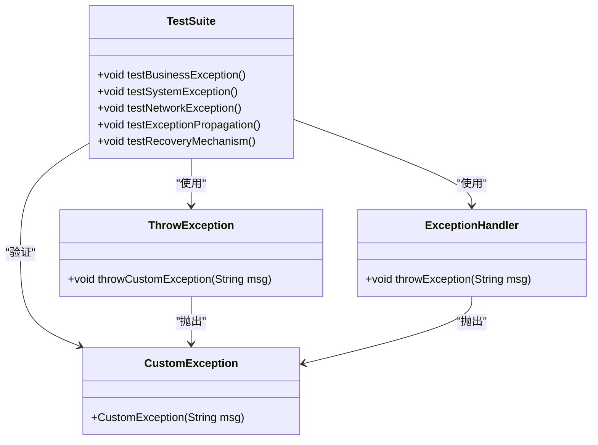

**Diagram sources**
- [ThrowException.java](file://test-suite/src/main/java/com/aims/logic/testsuite/demo/cases/ThrowException.java)
- [ExceptionHandler.java](file://test-suite/src/main/java/com/aims/logic/testsuite/demo/component/ExceptionHandler.java)
- [CustomException.java](file://test-suite/src/main/java/com/aims/logic/testsuite/demo/exception/CustomException.java)

**Section sources**
- [ThrowException.java](file://test-suite/src/main/java/com/aims/logic/testsuite/demo/cases/ThrowException.java)
- [ExceptionHandler.java](file://test-suite/src/main/java/com/aims/logic/testsuite/demo/component/ExceptionHandler.java)

## 最佳实践总结

### 设计原则
1. **单一职责**：每个异常类应有明确的职责和使用场景
2. **层次清晰**：建立清晰的异常继承体系，便于统一处理
3. **信息完整**：异常消息应提供足够的上下文信息
4. **安全暴露**：避免将敏感信息通过异常消息暴露给客户端

### 实施建议
1. **尽早抛出**：在检测到错误时立即抛出异常，避免问题积累
2. **晚捕获**：在合适的层次捕获异常，确保有足够的上下文信息进行处理
3. **合理包装**：在跨层调用时适当包装异常，保持异常语义的一致性
4. **记录日志**：在捕获异常时记录详细的日志信息，便于问题追踪

### 维护策略
1. **定期审查**：定期审查异常处理代码，确保其与业务需求保持一致
2. **监控优化**：根据监控数据优化异常处理策略，提高系统稳定性
3. **文档更新**：及时更新异常处理文档，确保团队成员了解最新实践
4. **培训分享**：定期组织异常处理最佳实践分享，提升团队整体水平

**Section sources**
- [LogicBizException.java](file://logic-runtime/src/main/java/com/aims/logic/runtime/LogicBizException.java)
- [ControllerExceptionHandler.java](file://logic-ide/src/main/java/com/aims/logic/ide/exception/ControllerExceptionHandler.java)
- [CustomException.java](file://test-suite/src/main/java/com/aims/logic/testsuite/demo/exception/CustomException.java)