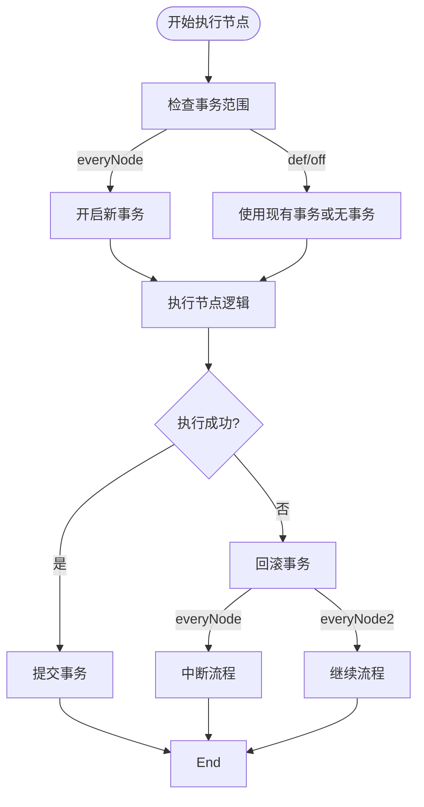
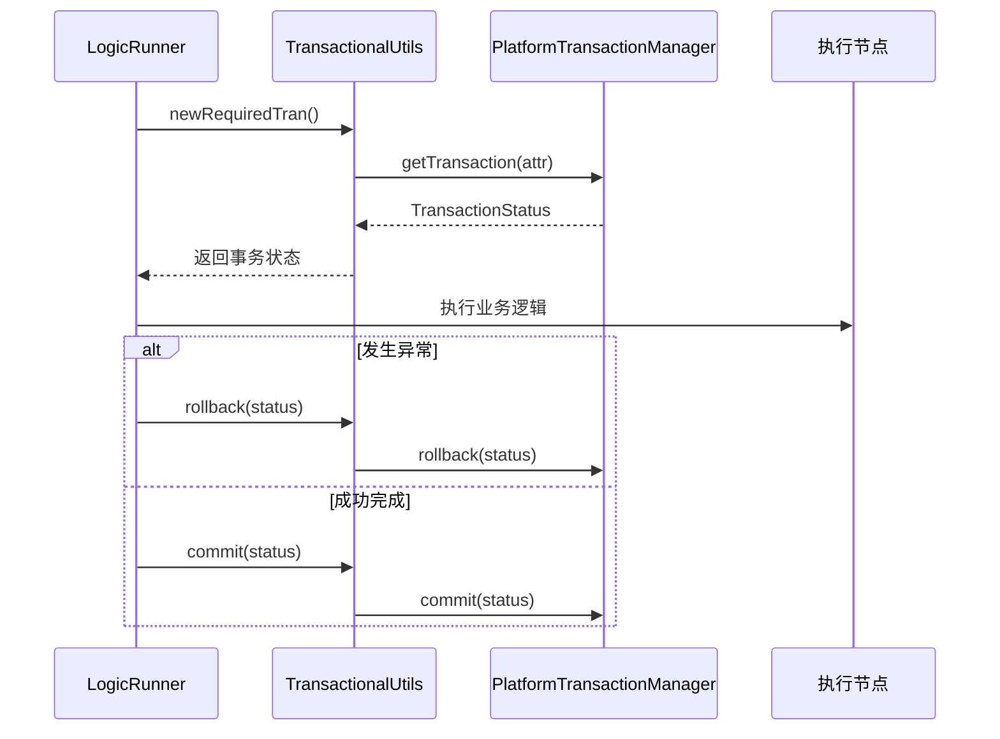

# 事务控制

<cite>
**本文档引用文件**  
- [LogicItemTransactionScope.java](file://logic-runtime/src/main/java/com/aims/logic/runtime/contract/enums/LogicItemTransactionScope.java)
- [LogicItemRunner.java](file://logic-runtime/src/main/java/com/aims/logic/runtime/runner/LogicItemRunner.java)
- [LogicRunner.java](file://logic-runtime/src/main/java/com/aims/logic/runtime/runner/LogicRunner.java)
- [TransactionalUtils.java](file://logic-sdk/src/main/java/com/aims/logic/sdk/util/TransactionalUtils.java)
- [TestTranService.java](file://test-suite/src/main/java/com/aims/logic/testsuite/demo/TestTranService.java)
</cite>

## 目录
1. [事务边界策略](#事务边界策略)  
2. [事务范围与流程节点执行](#事务范围与流程节点执行)  
3. [事务传播行为实现原理](#事务传播行为实现原理)  
4. [跨节点事务完整性示例](#跨节点事务完整性示例)  
5. [分布式与异步场景下的事务局限性](#分布式与异步场景下的事务局限性)  
6. [补偿机制建议](#补偿机制建议)  
7. [强一致性场景中的关键作用](#强一致性场景中的关键作用)

## 事务边界策略

`LogicItemTransactionScope` 枚举定义了流程引擎中事务的边界控制策略，用于决定在流程执行过程中事务的开启、提交与回滚时机。该枚举位于 `logic-runtime` 模块中，是事务控制的核心配置项。

当前支持的事务策略包括：

- **off**：关闭事务控制，所有操作不参与事务管理。
- **def**：使用默认事务行为，通常继承外部事务或根据上下文决定。
- **everyNode2**：每个节点执行后提交事务，若发生异常且为配置的业务异常类，则不中断流程；否则中断。
- **everyNode**：每个节点执行后提交事务，一旦发生异常即中断流程。
- **everyRequest**：整个请求周期内保持一个事务，直到流程结束才提交或回滚。

这些策略通过 `FunctionContext` 上下文传递，并在 `LogicRunner` 中被读取以决定事务行为。

**Section sources**  
- [LogicItemTransactionScope.java](file://logic-runtime/src/main/java/com/aims/logic/runtime/contract/enums/LogicItemTransactionScope.java#L4-L26)

## 事务范围与流程节点执行

`LogicItemRunner` 是流程中每个节点的实际执行器，负责根据当前节点类型调用对应的函数实现。虽然 `LogicItemRunner` 本身不直接管理事务，但它依赖于外部传入的 `FunctionContext` 中的事务状态信息。

事务的实际控制逻辑位于 `LogicRunner` 类中。`LogicRunner` 在执行每个节点前会检查当前的事务范围（`tranScope`），并根据 `LogicItemTransactionScope` 的值决定是否开启新事务、挂起当前事务或继续使用现有事务。

例如，在 `updateStatus` 方法中，当节点执行失败时，系统会判断是否需要中断流程，并结合事务范围策略决定是否回滚事务。对于 `everyNode` 策略，任何异常都会导致事务回滚并终止流程；而对于 `everyNode2`，仅非业务异常才会中断流程。

**Diagram sources**  
- [LogicItemRunner.java](file://logic-runtime/src/main/java/com/aims/logic/runtime/runner/LogicItemRunner.java#L10-L91)
- [LogicRunner.java](file://logic-runtime/src/main/java/com/aims/logic/runtime/runner/LogicRunner.java#L200-L250)

## 事务传播行为实现原理

事务传播行为由 `TransactionalUtils` 工具类实现，该类封装了 Spring 的事务管理器（`PlatformTransactionManager`），提供统一的事务操作接口。

`TransactionalUtils` 提供了三种核心方法：

- `newRequiredTran()`：开启一个 REQUIRED 传播行为的事务，若已有事务则加入，否则新建。
- `newRequiresNewTran()`：开启一个 REQUIRES_NEW 传播行为的事务，总是新建事务，挂起当前事务（如有）。
- `newNotSupportedTran()`：挂起当前事务（如有），以非事务方式执行。

这些方法通过构建 `DefaultTransactionAttribute` 设置传播行为，并调用 `getTransaction()` 获取事务状态对象。提交与回滚操作分别由 `commit()` 和 `rollback()` 方法完成，且会检查事务是否已完成，防止重复提交。

此机制确保了在复杂流程中，不同节点可根据需求灵活选择事务行为，例如在日志记录或通知发送等操作中使用 `NOT_SUPPORTED` 避免不必要的事务开销。

**Diagram sources**  
- [TransactionalUtils.java](file://logic-sdk/src/main/java/com/aims/logic/sdk/util/TransactionalUtils.java#L12-L83)

## 跨节点事务完整性示例

在 `test-suite` 模块中，`TestTranService` 类提供了多个用于验证事务完整性的测试用例。

例如，`insertWithTran` 方法标注了 `@Transactional(rollbackFor = Exception.class)`，并在插入数据后主动抛出 `CustomException`。测试表明，即使异常被捕获，由于事务注解的存在，数据库操作仍会被回滚，保证了数据一致性。

另一个关键示例是 `insertWithInnerTran` 方法，它调用了另一个带有事务的方法 `testTran2Service.insertWithTran(id + 1, true)`。该方法展示了嵌套事务的行为：内层事务抛出异常并回滚，但外层事务通过 catch 捕获异常后继续执行，体现了 `REQUIRES_NEW` 传播行为的隔离性。

此外，`insertOneByOne` 方法测试了批量插入中部分失败的情况。在未启用事务的情况下，部分插入可能成功；但在 `everyNode` 或 `everyRequest` 模式下，整个操作将作为一个整体回滚，确保原子性。

**Section sources**  
- [TestTranService.java](file://test-suite/src/main/java/com/aims/logic/testsuite/demo/TestTranService.java#L30-L140)

## 分布式与异步场景下的事务局限性

在分布式或异步执行场景下，本地事务机制存在明显局限：

1. **跨服务调用**：当流程节点调用外部微服务时，本地事务无法跨越网络边界，无法保证跨服务的数据一致性。
2. **异步节点（如 wait、waitForContinue）**：流程可能在中间节点暂停，待外部事件触发后继续执行。此时事务若长时间保持开启状态，将占用数据库连接并增加锁竞争风险。
3. **消息队列与事件驱动**：异步消息处理通常脱离原始事务上下文，难以实现强一致性。

因此，在这些场景下，传统的 ACID 事务不再适用，需采用最终一致性方案。

## 补偿机制建议

为应对分布式与异步场景下的事务挑战，建议采用以下补偿机制：

- **Saga 模式**：将长流程拆分为多个可逆的子事务，每个步骤都有对应的补偿操作（如订单创建 → 库存扣减 → 补偿：库存回滚）。
- **事件溯源（Event Sourcing）**：记录所有状态变更事件，通过重放事件恢复状态，便于错误恢复与审计。
- **TCC（Try-Confirm-Cancel）**：实现三阶段操作，明确划分资源预留、确认与取消逻辑。
- **本地事务表 + 定时对账**：将分布式操作记录在本地事务表中，通过后台任务定期校对状态并触发补偿。

在本系统中，可通过 `LogicItemTransactionScope.def` 配合自定义补偿节点实现简易 Saga 流程。

## 强一致性场景中的关键作用

在金融交易、订单处理、库存管理等强一致性要求的业务场景中，事务控制至关重要：

- **数据准确性**：确保多步操作要么全部成功，要么全部失败，避免脏数据。
- **防止重复扣款/发货**：通过事务锁机制防止并发操作导致的资金或商品损失。
- **审计与追溯**：事务日志可作为操作凭证，支持事后审计与问题排查。

通过合理配置 `LogicItemTransactionScope` 策略（如使用 `everyRequest` 保证全流程原子性），并结合 `TransactionalUtils` 的细粒度控制，系统能够在复杂业务流程中维持高可靠的数据一致性。