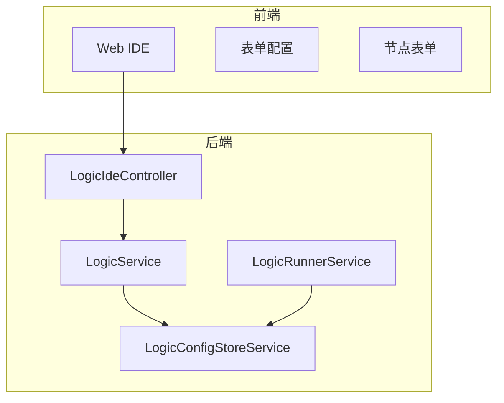
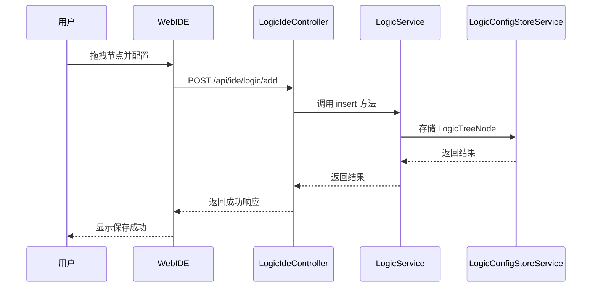
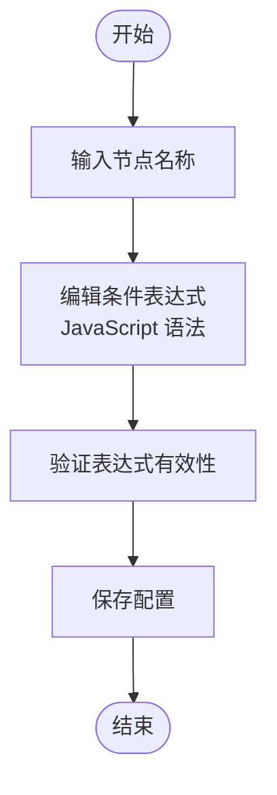
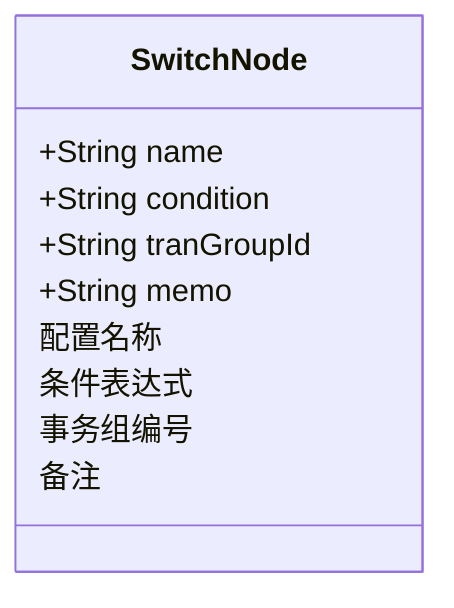
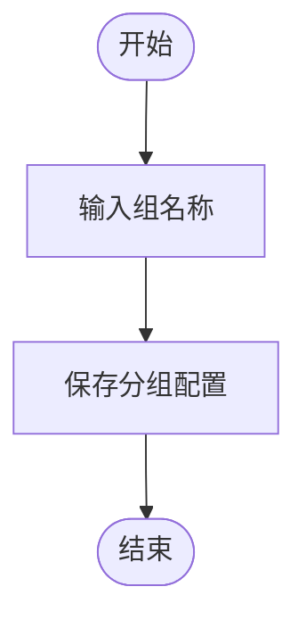
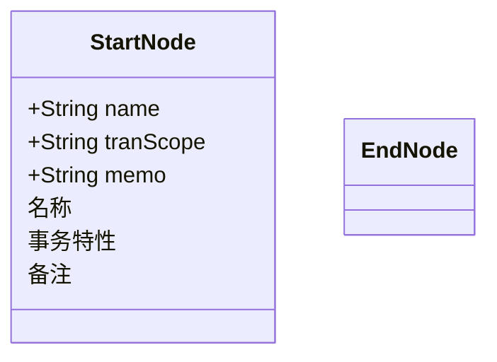
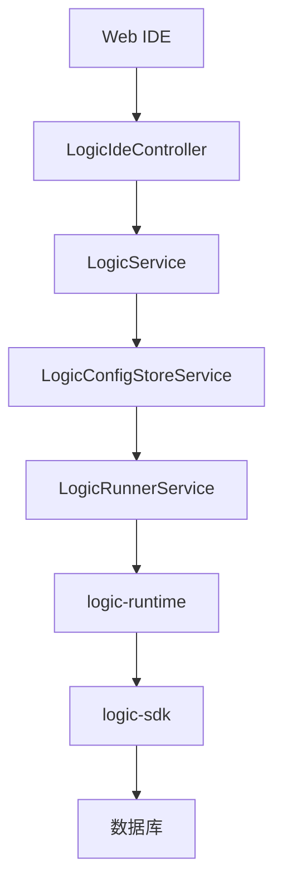

# 可视化编排

<cite>
**本文档引用文件**  
- [LogicIdeController.java](file://logic-ide/src/main/java/com/aims/logic/ide/controller/LogicIdeController.java)
- [LogicTreeNode.java](file://logic-runtime/src/main/java/com/aims/logic/runtime/contract/dsl/LogicTreeNode.java)
- [LogicItemTreeNode.java](file://logic-runtime/src/main/java/com/aims/logic/runtime/contract/dsl/LogicItemTreeNode.java)
- [if.json](file://logic-ide/src/main/resources/public/setting/forms/if.json)
- [switch.json](file://logic-ide/src/main/resources/public/setting/forms/switch.json)
- [process-group.json](file://logic-ide/src/main/resources/public/setting/forms/process-group.json)
- [start.json](file://logic-ide/src/main/resources/public/setting/forms/start.json)
- [end.json](file://logic-ide/src/main/resources/public/setting/forms/end.json)
</cite>

## 目录
1. [引言](#引言)
2. [项目结构](#项目结构)
3. [核心组件](#核心组件)
4. [架构概览](#架构概览)
5. [详细组件分析](#详细组件分析)
6. [依赖分析](#依赖分析)
7. [性能考虑](#性能考虑)
8. [故障排除指南](#故障排除指南)
9. [结论](#结论)

## 引言
本文档系统化介绍 logic-solution 模块的可视化编排功能，重点阐述通过 Web IDE 实现的拖拽式流程设计机制。涵盖流程起点、终点、条件分支（if、switch）、流程分组等节点的配置结构与 UI 表单定义，并解释前端表单数据如何映射到后端逻辑树结构（LogicTreeNode）。结合 LogicIdeController 中的接口说明流程创建、保存与加载的交互流程，提供完整流程设计示例，说明版本控制与流程快照机制的作用，并指出与 logic-runtime 模块的协同方式。

## 项目结构
logic-solution 是一个包含多个子模块的综合项目，主要由 logic-ide、logic-ide-service、logic-runtime 和 logic-sdk 组成。其中 logic-ide 提供前端可视化编排界面和后端控制逻辑，logic-runtime 负责执行逻辑流程，logic-sdk 提供开发支持和数据服务。

**Diagram sources**  
- [LogicIdeController.java](file://logic-ide/src/main/java/com/aims/logic/ide/controller/LogicIdeController.java)
- [LogicTreeNode.java](file://logic-runtime/src/main/java/com/aims/logic/runtime/contract/dsl/LogicTreeNode.java)

**Section sources**
- [LogicIdeController.java](file://logic-ide/src/main/java/com/aims/logic/ide/controller/LogicIdeController.java)
- [project_structure](file://project_structure#L1-L200)

## 核心组件
可视化编排功能的核心在于将用户在 Web IDE 中的拖拽操作转化为可执行的逻辑树结构。前端通过 JSON 配置文件定义各类节点的表单结构，后端通过 LogicTreeNode 和 LogicItemTreeNode 类构建和解析逻辑流程。

**Section sources**
- [LogicTreeNode.java](file://logic-runtime/src/main/java/com/aims/logic/runtime/contract/dsl/LogicTreeNode.java)
- [LogicItemTreeNode.java](file://logic-runtime/src/main/java/com/aims/logic/runtime/contract/dsl/LogicItemTreeNode.java)

## 架构概览
系统采用前后端分离架构，前端通过 React 实现可视化编辑器，后端通过 Spring Boot 提供 RESTful API。用户在前端进行流程设计，表单数据通过 HTTP 请求发送至后端，存储为 LogicTreeNode 结构并持久化。

**Diagram sources**  
- [LogicIdeController.java](file://logic-ide/src/main/java/com/aims/logic/ide/controller/LogicIdeController.java)
- [LogicTreeNode.java](file://logic-runtime/src/main/java/com/aims/logic/runtime/contract/dsl/LogicTreeNode.java)

## 详细组件分析

### 流程节点配置分析
各类流程节点通过 JSON 文件定义其 UI 表单结构，包括输入字段类型、验证规则和布局方式。

#### 条件分支节点（if）
if 节点允许用户配置名称和条件表达式，表达式使用 JavaScript 语法。

**Diagram sources**  
- [if.json](file://logic-ide/src/main/resources/public/setting/forms/if.json)

**Section sources**
- [if.json](file://logic-ide/src/main/resources/public/setting/forms/if.json)

#### 开关分支节点（switch）
switch 节点支持条件表达式、事务组编号和备注配置，实现多路分支逻辑。

**Diagram sources**  
- [switch.json](file://logic-ide/src/main/resources/public/setting/forms/switch.json)

**Section sources**
- [switch.json](file://logic-ide/src/main/resources/public/setting/forms/switch.json)

#### 流程分组节点
流程分组用于组织和管理多个相关节点，提高流程可读性。

**Diagram sources**  
- [process-group.json](file://logic-ide/src/main/resources/public/setting/forms/process-group.json)

**Section sources**
- [process-group.json](file://logic-ide/src/main/resources/public/setting/forms/process-group.json)

#### 流程起点与终点
起点节点可配置名称、事务特性和备注，终点节点无配置项。

**Diagram sources**  
- [start.json](file://logic-ide/src/main/resources/public/setting/forms/start.json)
- [end.json](file://logic-ide/src/main/resources/public/setting/forms/end.json)

**Section sources**
- [start.json](file://logic-ide/src/main/resources/public/setting/forms/start.json)
- [end.json](file://logic-ide/src/main/resources/public/setting/forms/end.json)

## 依赖分析
可视化编排功能依赖多个核心模块协同工作，形成完整的开发-运行闭环。

**Diagram sources**  
- [LogicIdeController.java](file://logic-ide/src/main/java/com/aims/logic/ide/controller/LogicIdeController.java)
- [LogicTreeNode.java](file://logic-runtime/src/main/java/com/aims/logic/runtime/contract/dsl/LogicTreeNode.java)

**Section sources**
- [LogicIdeController.java](file://logic-ide/src/main/java/com/aims/logic/ide/controller/LogicIdeController.java)
- [LogicTreeNode.java](file://logic-runtime/src/main/java/com/aims/logic/runtime/contract/dsl/LogicTreeNode.java)

## 性能考虑
系统通过缓存机制和异步处理优化性能。LogicRunnerService 使用缓存环境变量，减少重复解析开销。对于长时间运行的业务流程，支持异步执行模式，避免阻塞主线程。

## 故障排除指南
当流程无法正常保存或执行时，应检查以下方面：
1. 确认表单数据格式是否符合 JSON Schema 要求
2. 验证条件表达式语法是否正确
3. 检查事务组配置是否一致
4. 查看后端日志中的错误信息

**Section sources**
- [LogicIdeController.java](file://logic-ide/src/main/java/com/aims/logic/ide/controller/LogicIdeController.java)
- [LogicItemTreeNode.java](file://logic-runtime/src/main/java/com/aims/logic/runtime/contract/dsl/LogicItemTreeNode.java)

## 结论
logic-solution 的可视化编排功能通过 Web IDE 实现了直观的拖拽式流程设计，将前端表单配置无缝映射到后端 LogicTreeNode 结构。系统支持丰富的节点类型和复杂的业务逻辑编排，配合版本控制和快照机制，为开发者提供了完整的逻辑开发解决方案。通过与 logic-runtime 模块的紧密协同，实现了设计与执行的高效衔接。