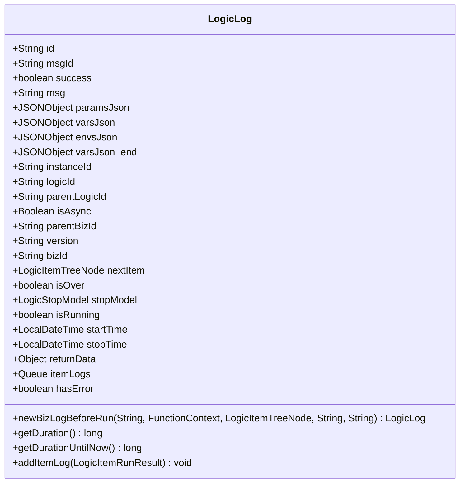
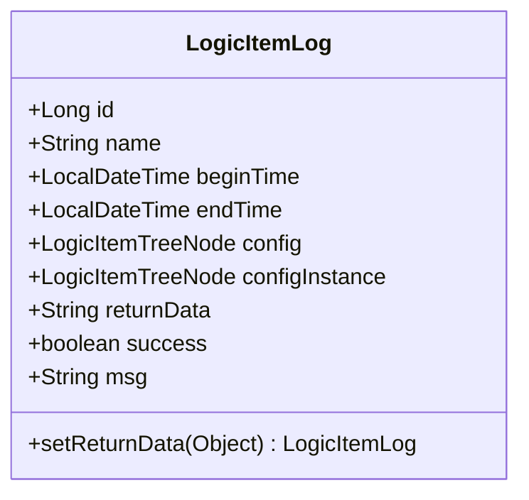
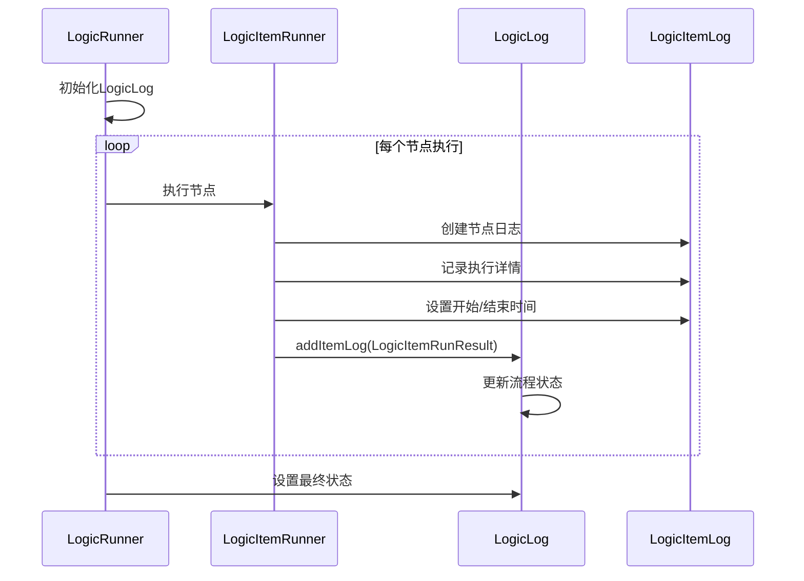
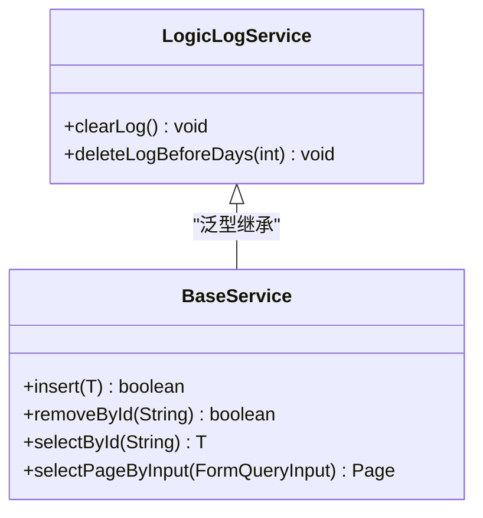
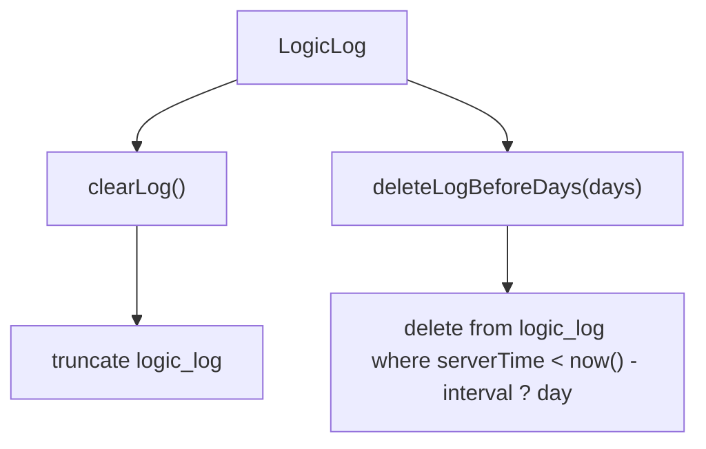
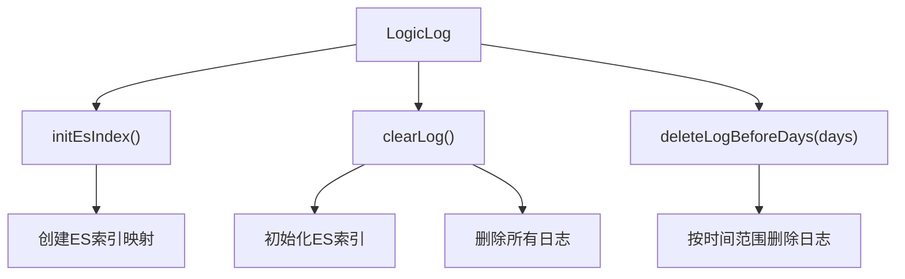
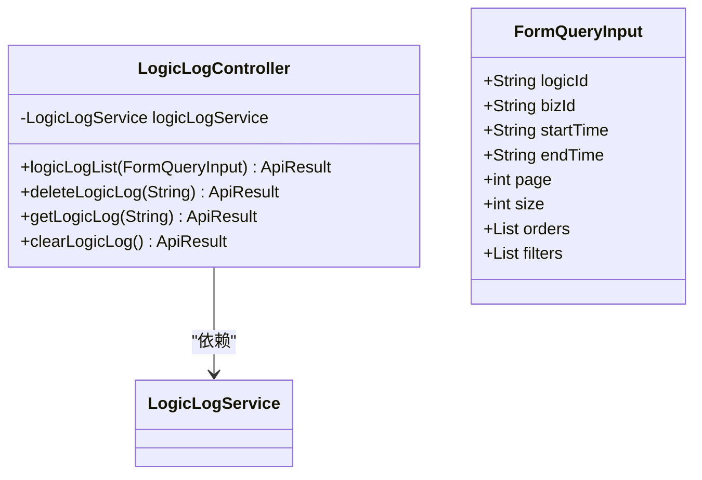
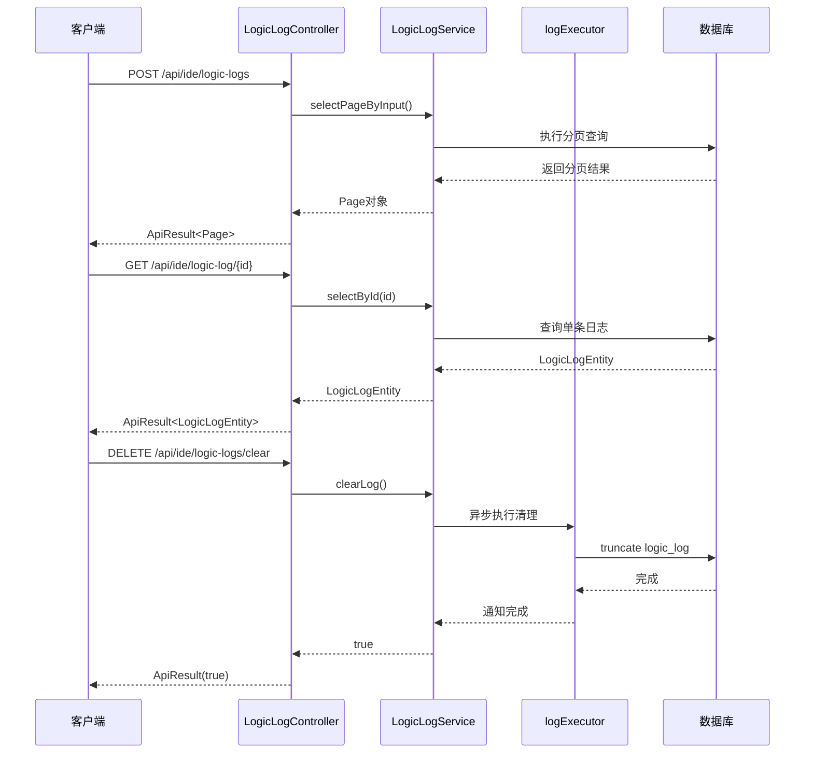

# 日志追踪

<cite>
**本文档引用文件**   
- [LogicLog.java](file://logic-runtime/src/main/java/com/aims/logic/runtime/contract/logger/LogicLog.java)
- [LogicItemLog.java](file://logic-runtime/src/main/java/com/aims/logic/runtime/contract/logger/LogicItemLog.java)
- [LogicLogController.java](file://logic-ide/src/main/java/com/aims/logic/ide/controller/LogicLogController.java)
- [LogicLogService.java](file://logic-sdk/src/main/java/com/aims/logic/sdk/service/LogicLogService.java)
- [LogicLogServiceImpl.java](file://logic-sdk/src/main/java/com/aims/logic/sdk/service/impl/LogicLogServiceImpl.java)
- [LogicLogServiceEsImpl.java](file://logic-sdk/src/main/java/com/aims/logic/sdk/service/impl/es/LogicLogServiceEsImpl.java)
- [LoggerHelperServiceImpl.java](file://logic-sdk/src/main/java/com/aims/logic/sdk/service/impl/LoggerHelperServiceImpl.java)
- [task_log.json](file://logic-ide/src/main/resources/public/setting/pages/task_log.json)
</cite>

## 目录
1. [引言](#引言)
2. [日志数据结构](#日志数据结构)
3. [日志记录机制](#日志记录机制)
4. [日志持久化与存储策略](#日志持久化与存储策略)
5. [日志查询与API接口](#日志查询与api接口)
6. [日志可视化看板](#日志可视化看板)
7. [日志最佳实践](#日志最佳实践)
8. [总结](#总结)

## 引言
logic-solution系统提供了完整的日志追踪体系，用于记录业务流程的整体执行情况和每个节点的详细执行信息。该体系通过LogicLog和LogicItemLog两个核心类实现，支持输入、输出、耗时和异常堆栈的全面记录。日志数据通过LogicLogService持久化到数据库或Elasticsearch，并支持多级存储策略。通过LogicLogController提供的API，用户可以进行日志查询、过滤和分页操作。前端通过task_log.json等页面配置构建日志可视化看板，为调试、审计和性能分析提供核心支持。

## 日志数据结构

### LogicLog结构
LogicLog类用于记录整个业务流程的执行日志，包含流程级别的关键信息：



**Diagram sources**
- [LogicLog.java](file://logic-runtime/src/main/java/com/aims/logic/runtime/contract/logger/LogicLog.java#L19-L170)

**Section sources**
- [LogicLog.java](file://logic-runtime/src/main/java/com/aims/logic/runtime/contract/logger/LogicLog.java#L19-L170)

### LogicItemLog结构
LogicItemLog类用于记录每个节点的详细执行信息，包含节点级别的执行细节：



**Diagram sources**
- [LogicItemLog.java](file://logic-runtime/src/main/java/com/aims/logic/runtime/contract/logger/LogicItemLog.java#L11-L52)

**Section sources**
- [LogicItemLog.java](file://logic-runtime/src/main/java/com/aims/logic/runtime/contract/logger/LogicItemLog.java#L11-L52)

## 日志记录机制

### 流程整体日志记录
LogicLog在流程执行开始时创建，记录整个业务流程的上下文信息。通过`newBizLogBeforeRun`静态方法初始化，包含实例ID、业务ID、逻辑ID、版本号、入参、变量和环境变量等关键信息。

### 节点详细日志记录
每个节点执行时，系统会创建LogicItemLog实例，记录节点的执行详情：
- **执行时间**：通过`beginTime`和`endTime`记录节点的开始和结束时间
- **节点配置**：通过`config`和`configInstance`保存节点的原始配置和运行时实例
- **执行结果**：通过`returnData`记录节点的返回值，`success`和`msg`记录执行状态和消息
- **异常信息**：如果节点执行失败，相关信息会被记录在`msg`字段中

### 日志关联机制
LogicLog通过`itemLogs`队列维护所有节点的日志记录，形成完整的执行链。通过`addItemLog`方法将每个节点的执行结果添加到队列中，同时更新流程的整体状态（如`hasError`、`returnData`等）。



**Diagram sources**
- [LogicLog.java](file://logic-runtime/src/main/java/com/aims/logic/runtime/contract/logger/LogicLog.java#L19-L170)
- [LogicItemLog.java](file://logic-runtime/src/main/java/com/aims/logic/runtime/contract/logger/LogicItemLog.java#L11-L52)
- [LogicRunner.java](file://logic-runtime/src/main/java/com/aims/logic/runtime/runner/LogicRunner.java#L0-L290)

**Section sources**
- [LogicLog.java](file://logic-runtime/src/main/java/com/aims/logic/runtime/contract/logger/LogicLog.java#L19-L170)
- [LogicItemLog.java](file://logic-runtime/src/main/java/com/aims/logic/runtime/contract/logger/LogicItemLog.java#L11-L52)
- [LogicRunner.java](file://logic-runtime/src/main/java/com/aims/logic/runtime/runner/LogicRunner.java#L0-L290)

## 日志持久化与存储策略

### 持久化接口设计
LogicLogService接口定义了日志持久化的核心操作：



**Diagram sources**
- [LogicLogService.java](file://logic-sdk/src/main/java/com/aims/logic/sdk/service/LogicLogService.java#L4-L13)

**Section sources**
- [LogicLogService.java](file://logic-sdk/src/main/java/com/aims/logic/sdk/service/LogicLogService.java#L4-L13)

### 多存储实现
系统提供了两种日志存储实现，支持灵活的存储策略配置。

#### 数据库存储实现
LogicLogServiceImpl类实现了基于JDBC的数据库存储：



**Diagram sources**
- [LogicLogServiceImpl.java](file://logic-sdk/src/main/java/com/aims/logic/sdk/service/impl/LogicLogServiceImpl.java#L0-L22)

**Section sources**
- [LogicLogServiceImpl.java](file://logic-sdk/src/main/java/com/aims/logic/sdk/service/impl/LogicLogServiceImpl.java#L0-L22)

#### Elasticsearch存储实现
LogicLogServiceEsImpl类实现了基于Elasticsearch的存储，支持更高效的查询和分析：



**Diagram sources**
- [LogicLogServiceEsImpl.java](file://logic-sdk/src/main/java/com/aims/logic/sdk/service/impl/es/LogicLogServiceEsImpl.java#L0-L242)

**Section sources**
- [LogicLogServiceEsImpl.java](file://logic-sdk/src/main/java/com/aims/logic/sdk/service/impl/es/LogicLogServiceEsImpl.java#L0-L242)

### 存储策略配置
系统支持通过配置实现多级存储策略：
- **热数据存储**：将近期日志存储在Elasticsearch中，支持快速查询和分析
- **冷数据归档**：将历史日志归档到数据库中，降低存储成本
- **自动清理**：通过`deleteLogBeforeDays`方法定期清理过期日志

## 日志查询与API接口

### API接口设计
LogicLogController提供了RESTful API接口，支持日志的查询和管理：



**Diagram sources**
- [LogicLogController.java](file://logic-ide/src/main/java/com/aims/logic/ide/controller/LogicLogController.java#L10-L43)

**Section sources**
- [LogicLogController.java](file://logic-ide/src/main/java/com/aims/logic/ide/controller/LogicLogController.java#L10-L43)

### 查询机制
系统通过LoggerHelperServiceImpl实现日志的异步记录和查询准备：



**Diagram sources**
- [LogicLogController.java](file://logic-ide/src/main/java/com/aims/logic/ide/controller/LogicLogController.java#L10-L43)
- [LogicLogServiceImpl.java](file://logic-sdk/src/main/java/com/aims/logic/sdk/service/impl/LogicLogServiceImpl.java#L0-L22)
- [LoggerHelperServiceImpl.java](file://logic-sdk/src/main/java/com/aims/logic/sdk/service/impl/LoggerHelperServiceImpl.java#L0-L272)

**Section sources**
- [LogicLogController.java](file://logic-ide/src/main/java/com/aims/logic/ide/controller/LogicLogController.java#L10-L43)
- [LogicLogServiceImpl.java](file://logic-sdk/src/main/java/com/aims/logic/sdk/service/impl/LogicLogServiceImpl.java#L0-L22)
- [LoggerHelperServiceImpl.java](file://logic-sdk/src/main/java/com/aims/logic/sdk/service/impl/LoggerHelperServiceImpl.java#L0-L272)

## 日志可视化看板

### 前端配置结构
task_log.json文件定义了日志可视化看板的前端配置：

```json
{
  "type": "button",
  "label": "按钮2",
  "onEvent": {
    "click": {
      "actions": [
        {
          "actionType": "drawer",
          "drawer": {
            "type": "drawer",
            "title": "日志分析",
            "body": [
              {
                "type": "tpl",
                "tpl": "日志分析",
                "wrapperComponent": "",
                "inline": false,
                "id": "u:1aea12e4ec6d"
              }
            ],
            "id": "u:a9890bd514d7",
            "position": "bottom",
            "overlay": false,
            "resizable": true
          }
        }
      ]
    }
  },
  "id": "u:1b1aa99fd171"
}
```

**Section sources**
- [task_log.json](file://logic-ide/src/main/resources/public/setting/pages/task_log.json#L0-L30)

### 看板功能特性
日志可视化看板提供以下核心功能：
- **日志分析抽屉**：点击按钮后从底部弹出日志分析面板
- **可调整大小**：支持用户调整看板大小，优化查看体验
- **非覆盖模式**：弹出的看板不会覆盖底层内容，保持上下文可见
- **动态内容加载**：通过模板组件动态加载日志分析内容

## 日志最佳实践

### 日志级别配置
建议根据环境和需求配置不同的日志级别：
- **开发环境**：启用DEBUG级别日志，便于问题排查
- **测试环境**：使用INFO级别日志，平衡信息量和性能
- **生产环境**：主要使用WARN和ERROR级别日志，减少日志量

### 敏感信息脱敏
为保护敏感信息，建议实施以下脱敏策略：
- **自动脱敏**：在日志记录前自动识别和脱敏敏感字段（如密码、token等）
- **配置化脱敏**：通过配置文件定义需要脱敏的字段列表
- **环境变量保护**：对环境变量中的敏感信息进行特殊处理

### 性能优化建议
- **异步日志记录**：使用线程池异步执行日志记录，避免阻塞主业务流程
- **日志队列大小控制**：合理设置日志队列大小，防止内存溢出
- **定期归档清理**：制定合理的日志保留策略，定期归档和清理历史日志

## 总结
logic-solution的日志追踪体系提供了从节点到流程的全方位日志记录能力。通过LogicLog和LogicItemLog的协同工作，系统能够完整记录业务执行的每一个细节。多存储策略支持热数据的快速查询和冷数据的成本优化，满足不同场景的需求。丰富的API接口和可视化看板使得日志查询和分析变得简单高效。该日志体系在调试、审计和性能分析中发挥着核心作用，是系统稳定运行的重要保障。