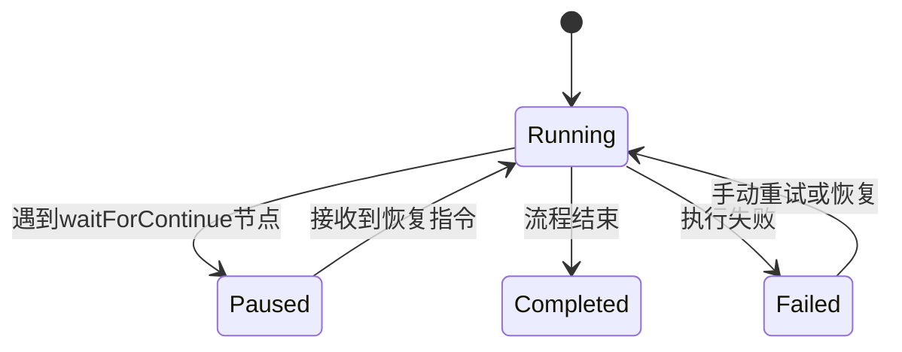
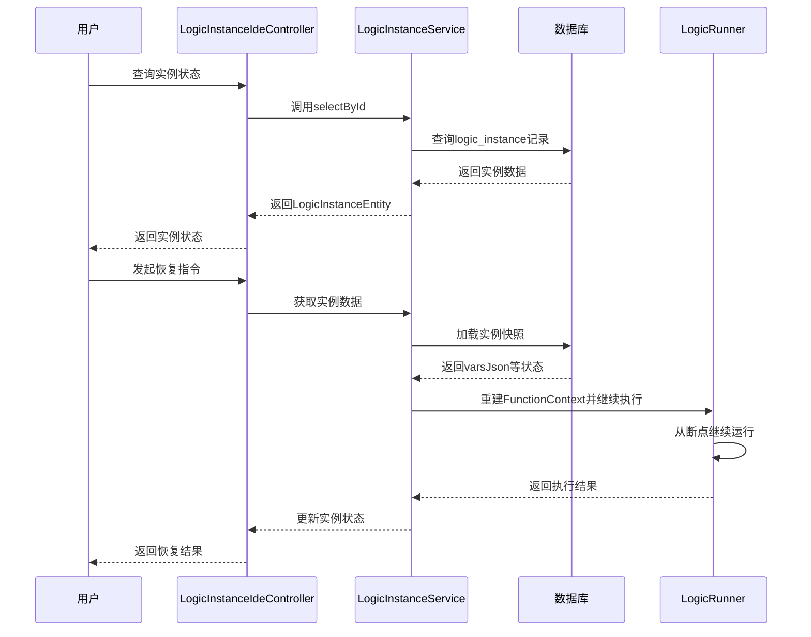

# 状态管理

<cite>
**本文档引用的文件**  
- [LogicRunModelEnum.java](file://logic-runtime/src/main/java/com/aims/logic/runtime/contract/dto/LogicRunModelEnum.java)
- [LogicInstanceDto.java](file://logic-runtime/src/main/java/com/aims/logic/runtime/contract/dto/LogicInstanceDto.java)
- [LogicInstanceEntity.java](file://logic-sdk/src/main/java/com/aims/logic/sdk/entity/LogicInstanceEntity.java)
- [LogicRunner.java](file://logic-runtime/src/main/java/com/aims/logic/runtime/runner/LogicRunner.java)
- [LogicInstanceIdeController.java](file://logic-ide/src/main/java/com/aims/logic/ide/controller/LogicInstanceIdeController.java)
</cite>

## 目录
1. [引言](#引言)
2. [业务实例生命周期控制](#业务实例生命周期控制)
3. [STATEFUL模式与流程控制](#stateful模式与流程控制)
4. [执行上下文快照与持久化](#执行上下文快照与持久化)
5. [状态保存点机制与一致性保障](#状态保存点机制与一致性保障)
6. [实例操作接口与调用示例](#实例操作接口与调用示例)
7. [复杂业务流程中的可靠性保障](#复杂业务流程中的可靠性保障)

## 引言
本文档全面介绍`logic-solution`框架中的状态管理能力，重点阐述业务逻辑实例（LogicInstance）的生命周期控制机制。通过分析STATEFUL执行模式、上下文快照、持久化策略及状态一致性保障机制，展示系统在长时间运行复杂业务流程中的可靠性设计。

## 业务实例生命周期控制
`LogicInstance`代表一次业务逻辑的执行实例，其生命周期由`LogicRunner`驱动，并通过`LogicInstanceEntity`在数据库中持久化状态。实例从创建、启动、暂停、恢复到终止的全过程均被精确控制与记录。

**Section sources**
- [LogicRunner.java](file://logic-runtime/src/main/java/com/aims/logic/runtime/runner/LogicRunner.java#L0-L290)
- [LogicInstanceEntity.java](file://logic-sdk/src/main/java/com/aims/logic/sdk/entity/LogicInstanceEntity.java#L0-L82)

## STATEFUL模式与流程控制
`LogicRunModelEnum`定义了逻辑执行模式，其中`STATEFUL`（状态化）模式支持流程的暂停、恢复与断点续跑。当流程执行到`waitForContinue`或`start`类型的节点时，`LogicRunner`会将状态置为`WaitForContinue`，暂停执行并保存当前上下文，等待外部指令恢复。



**Diagram sources**
- [LogicRunModelEnum.java](file://logic-runtime/src/main/java/com/aims/logic/runtime/contract/dto/LogicRunModelEnum.java#L0-L14)
- [LogicRunner.java](file://logic-runtime/src/main/java/com/aims/logic/runtime/runner/LogicRunner.java#L250-L270)

## 执行上下文快照与持久化
`LogicInstanceDto`用于保存执行过程中的上下文快照，包括`paramsJson`（输入参数）、`varsJson`（局部变量）、`envsJson`（环境变量）等。这些快照通过`LogicInstanceEntity`映射到数据库表`logic_instance`，实现持久化存储。

`LogicInstanceEntity`中的关键字段包括：
- `paramsJson`: 输入参数的JSON序列化
- `varsJson`: 当前局部变量状态
- `varsJsonEnd`: 执行结束时的变量状态
- `isRunning`: 实例是否正在运行
- `isOver`: 实例是否已结束
- `startTime`/`stopTime`: 开始与结束时间戳

**Section sources**
- [LogicInstanceDto.java](file://logic-runtime/src/main/java/com/aims/logic/runtime/contract/dto/LogicInstanceDto.java#L8-L20)
- [LogicInstanceEntity.java](file://logic-sdk/src/main/java/com/aims/logic/sdk/entity/LogicInstanceEntity.java#L0-L82)

## 状态保存点机制与一致性保障
`LogicRunner`在每次节点执行后，通过`updateStatus`方法检查是否需要暂停。若遇到`waitForContinue`节点，则将当前`FunctionContext`中的`varsJson`等状态记录到`LogicLog`，并通过`LogicInstanceService`持久化至数据库。恢复执行时，从数据库加载`LogicInstanceEntity`，重建`FunctionContext`，实现断点续跑。

该机制确保了在长时间运行的业务中，即使服务重启，状态也能从数据库恢复，保证了业务流程的一致性与可靠性。



**Diagram sources**
- [LogicRunner.java](file://logic-runtime/src/main/java/com/aims/logic/runtime/runner/LogicRunner.java#L150-L250)
- [LogicInstanceService.java](file://logic-sdk/src/main/java/com/aims/logic/sdk/service/LogicInstanceService.java)
- [LogicInstanceEntity.java](file://logic-sdk/src/main/java/com/aims/logic/sdk/entity/LogicInstanceEntity.java#L0-L82)

## 实例操作接口与调用示例
`LogicInstanceIdeController`提供了对业务实例的查询、恢复与终止操作接口：

- `GET /api/ide/logic-instance/{id}`: 根据ID查询实例
- `GET /api/ide/logic-instance/{logicId}/{bizId}`: 根据逻辑ID和业务ID查询实例
- `POST /api/ide/logic-instances`: 分页查询实例列表
- `DELETE /api/ide/logic-instance/delete/{id}`: 删除指定实例

**调用示例：查询实例**
```http
GET /api/ide/logic-instance/123e4567-e89b-12d3-a456-426614174000
```

**调用示例：分页查询**
```json
POST /api/ide/logic-instances
{
  "pageNum": 1,
  "pageSize": 10,
  "query": {
    "logicId": "demo-logic"
  }
}
```

**Section sources**
- [LogicInstanceIdeController.java](file://logic-ide/src/main/java/com/aims/logic/ide/controller/LogicInstanceIdeController.java#L0-L74)

## 复杂业务流程中的可靠性保障
状态管理机制通过持久化执行上下文、支持断点续跑、精确控制生命周期，为复杂业务流程提供了强有力的可靠性保障。即使在系统故障或网络中断的情况下，业务实例的状态也不会丢失，可通过恢复操作继续执行，确保了业务的最终一致性与高可用性。