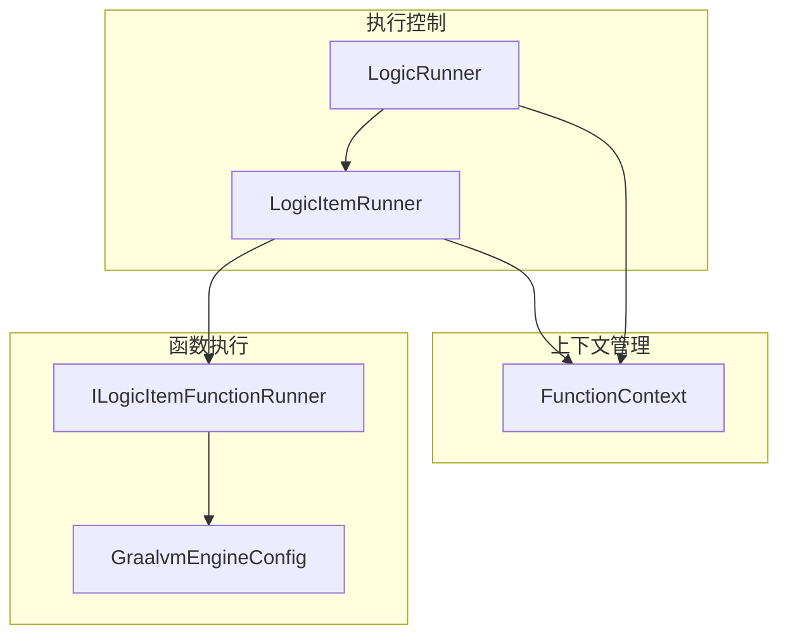
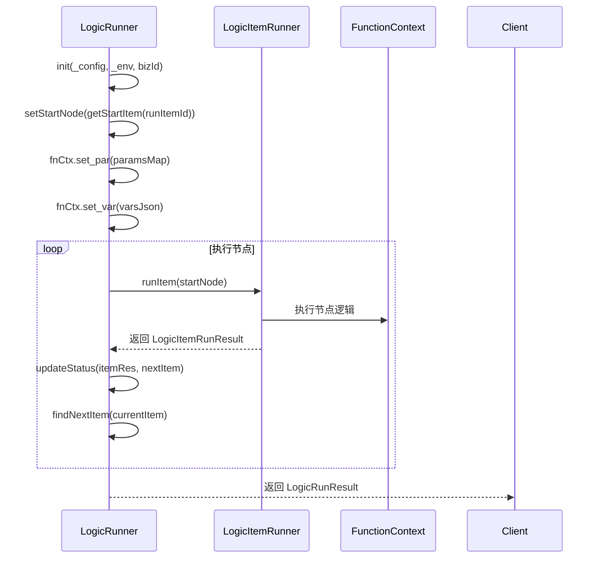
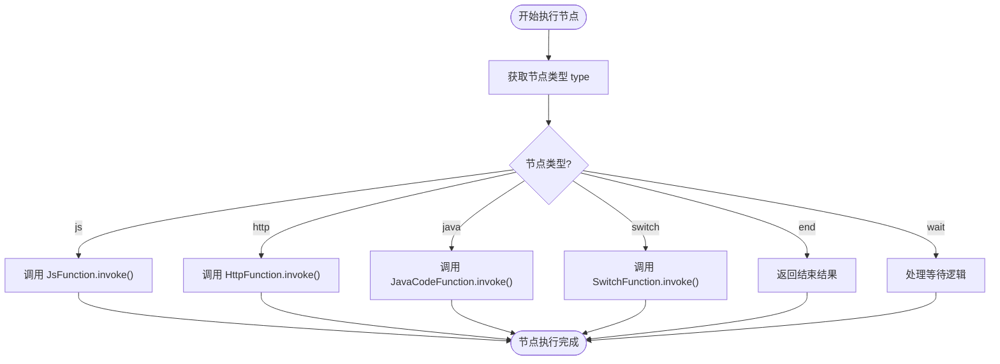
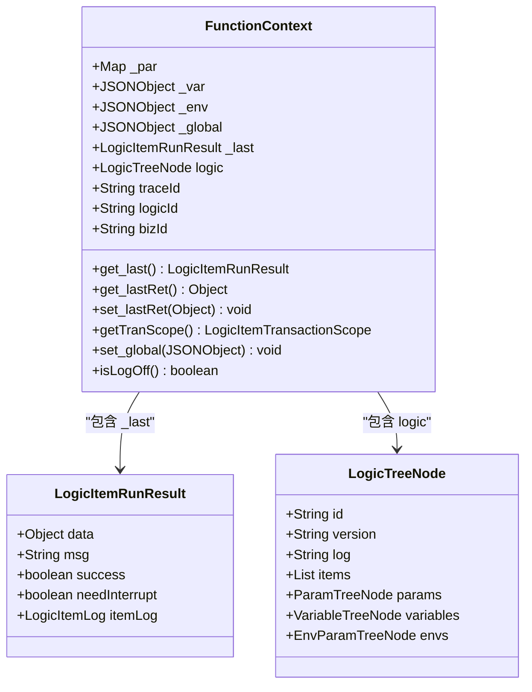
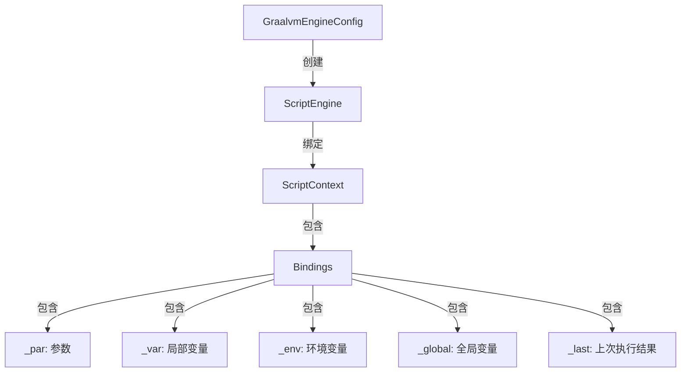
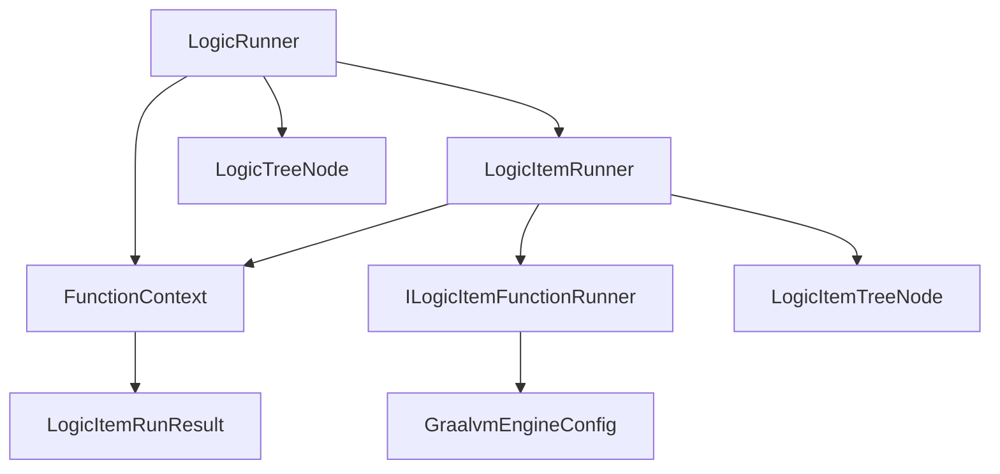

# 逻辑执行

<cite>
**本文档引用文件**  
- [LogicRunner.java](file://logic-runtime/src/main/java/com/aims/logic/runtime/runner/LogicRunner.java)
- [LogicItemRunner.java](file://logic-runtime/src/main/java/com/aims/logic/runtime/runner/LogicItemRunner.java)
- [FunctionContext.java](file://logic-runtime/src/main/java/com/aims/logic/runtime/runner/FunctionContext.java)
- [GraalvmEngineConfig.java](file://logic-runtime/src/main/java/com/aims/logic/runtime/configuration/GraalvmEngineConfig.java)
- [LogicTreeNode.java](file://logic-runtime/src/main/java/com/aims/logic/runtime/contract/dsl/LogicTreeNode.java)
- [ILogicItemFunctionRunner.java](file://logic-runtime/src/main/java/com/aims/logic/runtime/runner/functions/ILogicItemFunctionRunner.java)
- [LogicRunnerService.java](file://logic-runtime/src/main/java/com/aims/logic/runtime/service/LogicRunnerService.java)
</cite>

## 目录
1. [引言](#引言)
2. [项目结构](#项目结构)
3. [核心组件](#核心组件)
4. [架构概览](#架构概览)
5. [详细组件分析](#详细组件分析)
6. [依赖分析](#依赖分析)
7. [性能考量](#性能考量)
8. [故障排查指南](#故障排查指南)
9. [结论](#结论)

## 引言
本文档深入解析 `logic-solution` 模块中逻辑执行引擎的工作原理，重点阐述 `LogicRunner` 如何解析由 `LogicTreeNode` 构成的流程树并驱动执行。文档将区分无状态（STATELESS）与有状态（STATEFUL）两种执行模式的实现差异，说明 `LogicItemRunner` 如何调度不同类型的节点函数（`ILogicItemFunctionRunner`），并结合 `GraalvmEngineConfig` 分析 JS 代码执行环境的构建。同时描述执行上下文（`FunctionContext`）的传递机制与变量作用域管理，通过调用链路展示从 IDE 发起执行请求到 `LogicRunner` 返回结果的完整流程，并说明执行过程中的异常处理与中断机制。

## 项目结构
`logic-solution` 项目采用模块化设计，主要包含以下子模块：
- `logic-ide`：前端逻辑开发环境
- `logic-ide-service`：IDE 后端代理服务
- `logic-runtime`：核心运行时模块，包含逻辑执行引擎
- `logic-sdk`：提供逻辑服务接口与工具类
- `test-suite`：集成测试套件

其中，逻辑执行的核心实现在 `logic-runtime` 模块的 `runner` 包中。

**Section sources**
- [LogicRunner.java](file://logic-runtime/src/main/java/com/aims/logic/runtime/runner/LogicRunner.java#L1-L290)
- [LogicItemRunner.java](file://logic-runtime/src/main/java/com/aims/logic/runtime/runner/LogicItemRunner.java#L1-L92)

## 核心组件
本节分析逻辑执行引擎的核心组件，包括 `LogicRunner`、`LogicItemRunner`、`FunctionContext` 和 `GraalvmEngineConfig`。

**Section sources**
- [LogicRunner.java](file://logic-runtime/src/main/java/com/aims/logic/runtime/runner/LogicRunner.java#L1-L290)
- [LogicItemRunner.java](file://logic-runtime/src/main/java/com/aims/logic/runtime/runner/LogicItemRunner.java#L1-L92)
- [FunctionContext.java](file://logic-runtime/src/main/java/com/aims/logic/runtime/runner/FunctionContext.java#L1-L104)
- [GraalvmEngineConfig.java](file://logic-runtime/src/main/java/com/aims/logic/runtime/configuration/GraalvmEngineConfig.java#L1-L50)

## 架构概览
逻辑执行引擎采用树形结构驱动执行流程，由 `LogicRunner` 负责整体流程控制，`LogicItemRunner` 负责单个节点的执行，`FunctionContext` 管理执行上下文和变量作用域。

**Diagram sources**
- [LogicRunner.java](file://logic-runtime/src/main/java/com/aims/logic/runtime/runner/LogicRunner.java#L1-L290)
- [LogicItemRunner.java](file://logic-runtime/src/main/java/com/aims/logic/runtime/runner/LogicItemRunner.java#L1-L92)
- [FunctionContext.java](file://logic-runtime/src/main/java/com/aims/logic/runtime/runner/FunctionContext.java#L1-L104)

## 详细组件分析

### LogicRunner 分析
`LogicRunner` 是逻辑执行的主控制器，负责解析 `LogicTreeNode` 构成的流程树并驱动执行。

#### 流程树解析与执行驱动
`LogicRunner` 在初始化时将 JSON 配置解析为 `LogicTreeNode` 对象，并通过 `run` 方法启动执行流程。执行流程从 `start` 节点开始，通过 `findNextItem` 方法查找下一个执行节点，形成链式调用。

**Diagram sources**
- [LogicRunner.java](file://logic-runtime/src/main/java/com/aims/logic/runtime/runner/LogicRunner.java#L1-L290)

#### 无状态与有状态执行模式
`LogicRunner` 支持两种执行模式：
- **无状态模式（STATELESS）**：每次执行独立，不保留上下文状态
- **有状态模式（STATEFUL）**：通过 `FunctionContext` 保留变量状态，支持流程中断后继续执行

执行模式通过 `RunnerStatusEnum` 控制，`WaitForContinue` 状态表示流程暂停，等待外部触发继续执行。

**Section sources**
- [LogicRunner.java](file://logic-runtime/src/main/java/com/aims/logic/runtime/runner/LogicRunner.java#L1-L290)
- [FunctionContext.java](file://logic-runtime/src/main/java/com/aims/logic/runtime/runner/FunctionContext.java#L1-L104)

### LogicItemRunner 分析
`LogicItemRunner` 负责单个逻辑节点的执行，通过策略模式调度不同类型的节点函数。

#### 节点函数调度机制
`LogicItemRunner` 根据节点类型（`type`）从 `Functions` 工具类中获取对应的 `ILogicItemFunctionRunner` 实现，并调用其 `invoke` 方法执行。

**Diagram sources**
- [LogicItemRunner.java](file://logic-runtime/src/main/java/com/aims/logic/runtime/runner/LogicItemRunner.java#L1-L92)
- [ILogicItemFunctionRunner.java](file://logic-runtime/src/main/java/com/aims/logic/runtime/runner/functions/ILogicItemFunctionRunner.java#L1-L20)

### 执行上下文与变量作用域
`FunctionContext` 是执行上下文的核心，管理 `_par`（参数）、`_var`（局部变量）、`_env`（环境变量）和 `_global`（全局变量）四个作用域。

**Diagram sources**
- [FunctionContext.java](file://logic-runtime/src/main/java/com/aims/logic/runtime/runner/FunctionContext.java#L1-L104)
- [LogicTreeNode.java](file://logic-runtime/src/main/java/com/aims/logic/runtime/contract/dsl/LogicTreeNode.java#L1-L30)

### JS 执行环境构建
`GraalvmEngineConfig` 配置 GraalVM JavaScript 引擎，为 `JsFunction` 提供执行环境。

**Diagram sources**
- [GraalvmEngineConfig.java](file://logic-runtime/src/main/java/com/aims/logic/runtime/configuration/GraalvmEngineConfig.java#L1-L50)
- [FunctionContext.java](file://logic-runtime/src/main/java/com/aims/logic/runtime/runner/FunctionContext.java#L1-L104)

## 依赖分析
逻辑执行引擎各组件之间的依赖关系如下：

**Diagram sources**
- [LogicRunner.java](file://logic-runtime/src/main/java/com/aims/logic/runtime/runner/LogicRunner.java#L1-L290)
- [LogicItemRunner.java](file://logic-runtime/src/main/java/com/aims/logic/runtime/runner/LogicItemRunner.java#L1-L92)
- [FunctionContext.java](file://logic-runtime/src/main/java/com/aims/logic/runtime/runner/FunctionContext.java#L1-L104)

## 性能考量
- **上下文克隆**：`FunctionContext` 在执行过程中会进行 JSON 克隆，避免状态污染
- **日志开关**：通过 `isLogOff` 方法控制日志输出，防止大数据量时内存溢出
- **事务管理**：支持不同粒度的事务作用域（`LogicItemTransactionScope`）
- **并发执行**：通过 `bizId` 隔离不同业务实例的执行上下文

## 故障排查指南
### 异常处理机制
- **节点执行异常**：`LogicItemRunResult` 的 `success` 字段标识执行状态
- **中断机制**：`needInterrupt` 字段控制是否中断后续执行
- **事务回滚**：根据 `tranScope` 配置决定事务边界和回滚策略

### 常见问题
1. **节点找不到**：检查 `runItemId` 是否正确，或是否存在 `start` 节点
2. **JS 执行错误**：检查脚本语法和变量作用域
3. **变量未生效**：确认变量赋值语法（`_var.x = value`）和作用域
4. **流程中断**：检查是否遇到 `waitForContinue` 节点或执行异常

**Section sources**
- [LogicRunner.java](file://logic-runtime/src/main/java/com/aims/logic/runtime/runner/LogicRunner.java#L1-L290)
- [LogicItemRunner.java](file://logic-runtime/src/main/java/com/aims/logic/runtime/runner/LogicItemRunner.java#L1-L92)
- [FunctionContext.java](file://logic-runtime/src/main/java/com/aims/logic/runtime/runner/FunctionContext.java#L1-L104)

## 结论
`logic-solution` 的逻辑执行引擎通过 `LogicRunner` 驱动 `LogicTreeNode` 构成的流程树执行，采用 `LogicItemRunner` 调度不同类型的节点函数，通过 `FunctionContext` 管理执行上下文和变量作用域。引擎支持无状态和有状态两种执行模式，结合 `GraalvmEngineConfig` 提供安全的 JS 执行环境。整个执行流程清晰，异常处理机制完善，为复杂业务逻辑的可视化编排提供了可靠的基础支撑。