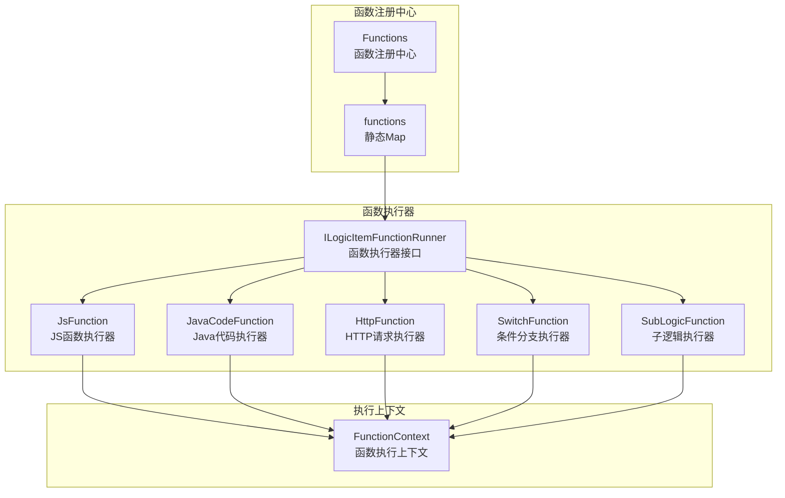
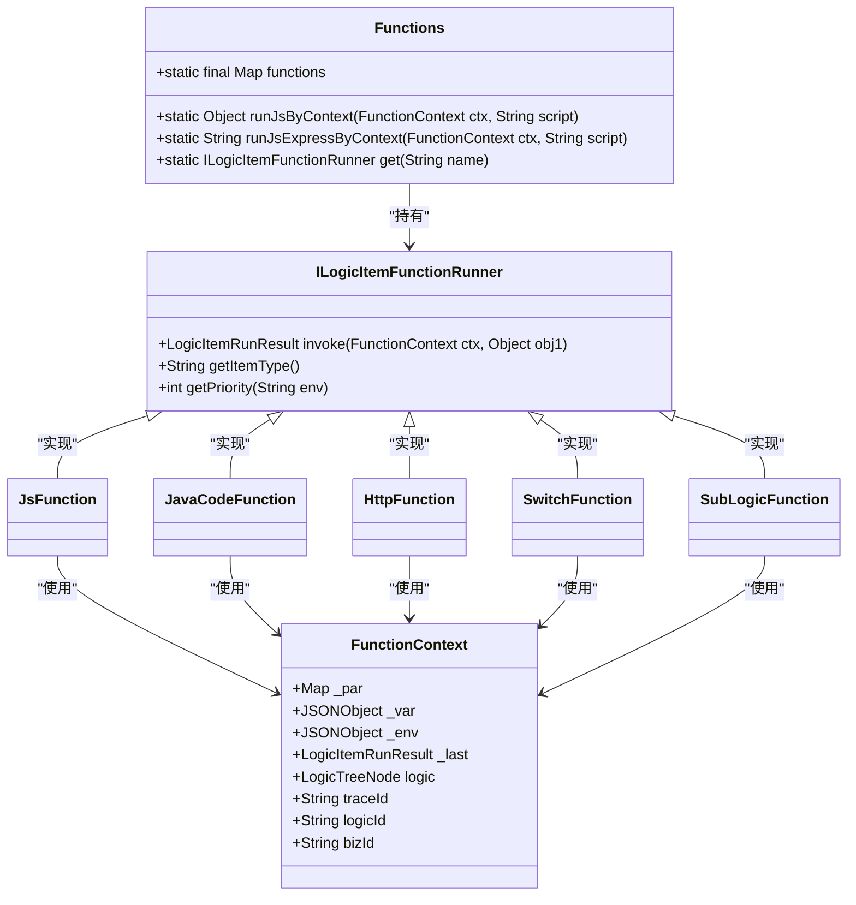
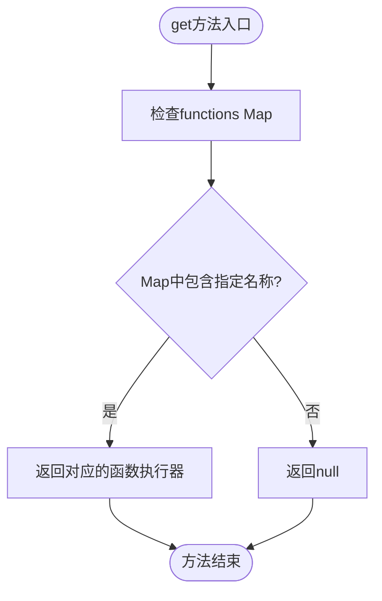
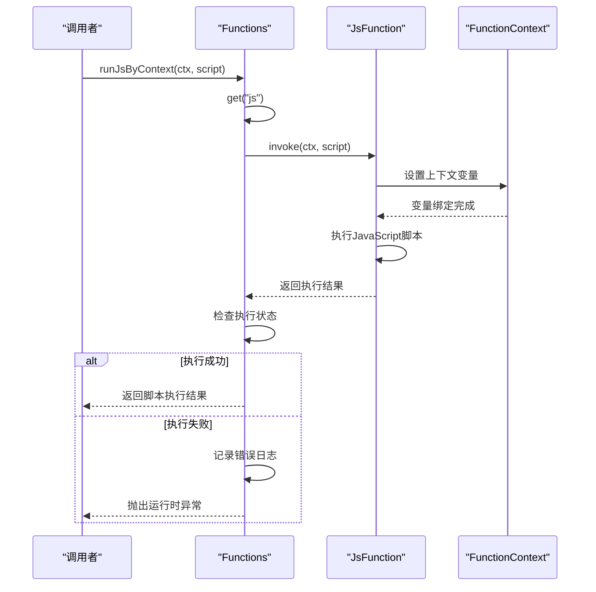
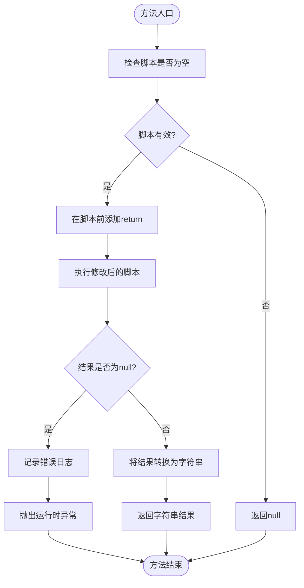
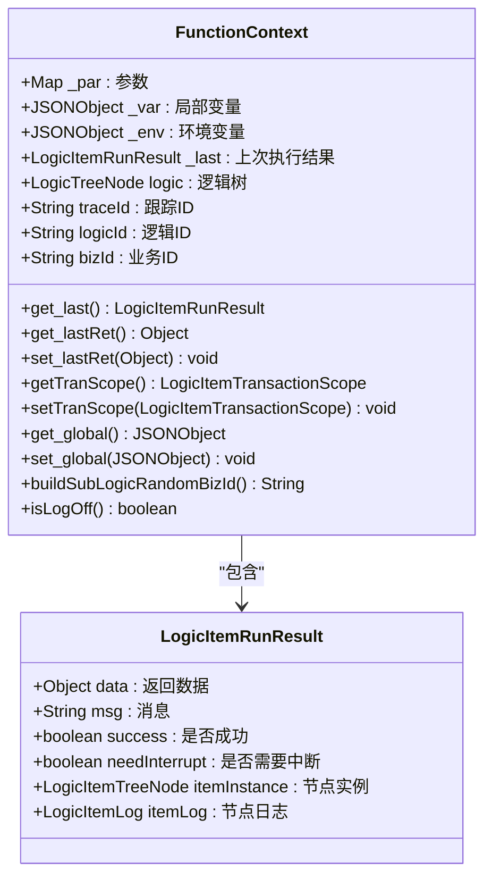
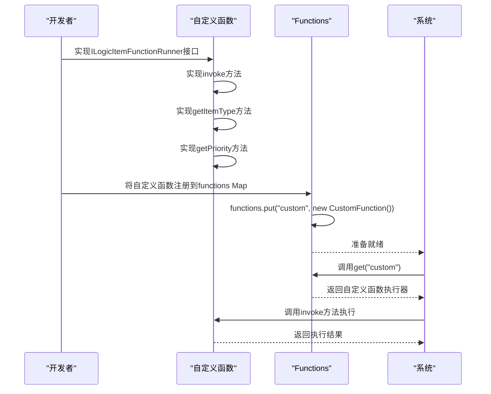
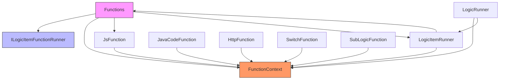

# 函数注册中心

<cite>
**本文档引用的文件**   
- [Functions.java](file://logic-runtime/src/main/java/com/aims/logic/runtime/runner/Functions.java)
- [ILogicItemFunctionRunner.java](file://logic-runtime/src/main/java/com/aims/logic/runtime/runner/functions/ILogicItemFunctionRunner.java)
- [FunctionContext.java](file://logic-runtime/src/main/java/com/aims/logic/runtime/runner/FunctionContext.java)
- [JsFunction.java](file://logic-runtime/src/main/java/com/aims/logic/runtime/runner/functions/impl/JsFunction.java)
- [LogicItemRunner.java](file://logic-runtime/src/main/java/com/aims/logic/runtime/runner/LogicItemRunner.java)
- [LogicRunner.java](file://logic-runtime/src/main/java/com/aims/logic/runtime/runner/LogicRunner.java)
</cite>

## 目录
1. [引言](#引言)
2. [核心组件](#核心组件)
3. [架构概述](#架构概述)
4. [详细组件分析](#详细组件分析)
5. [依赖分析](#依赖分析)
6. [性能考虑](#性能考虑)
7. [故障排除指南](#故障排除指南)
8. [结论](#结论)

## 引言
本文档详细介绍了`Functions`类作为函数注册中心的设计与实现。该注册中心通过静态Map存储不同类型的函数执行器，提供统一的函数调用接口。文档将深入分析其核心方法的实现原理和使用场景，以及如何通过实现`ILogicItemFunctionRunner`接口进行自定义函数扩展。

## 核心组件

`Functions`类是整个系统的核心组件，作为函数注册中心管理所有类型的函数执行器。它通过静态Map<String, ILogicItemFunctionRunner>存储不同类型的函数执行器，为系统提供统一的函数调用入口。

**本节来源**
- [Functions.java](file://logic-runtime/src/main/java/com/aims/logic/runtime/runner/Functions.java#L14-L14)

## 架构概述

**图表来源**
- [Functions.java](file://logic-runtime/src/main/java/com/aims/logic/runtime/runner/Functions.java#L14-L14)
- [ILogicItemFunctionRunner.java](file://logic-runtime/src/main/java/com/aims/logic/runtime/runner/functions/ILogicItemFunctionRunner.java#L8-L25)
- [FunctionContext.java](file://logic-runtime/src/main/java/com/aims/logic/runtime/runner/FunctionContext.java#L14-L103)

## 详细组件分析

### 函数注册中心设计

`Functions`类作为函数注册中心，通过静态Map<String, ILogicItemFunctionRunner> functions存储不同类型的函数执行器。这种设计模式实现了函数执行器的集中管理和统一调用。

**图表来源**
- [Functions.java](file://logic-runtime/src/main/java/com/aims/logic/runtime/runner/Functions.java#L12-L51)
- [ILogicItemFunctionRunner.java](file://logic-runtime/src/main/java/com/aims/logic/runtime/runner/functions/ILogicItemFunctionRunner.java#L8-L25)
- [FunctionContext.java](file://logic-runtime/src/main/java/com/aims/logic/runtime/runner/FunctionContext.java#L14-L103)

**本节来源**
- [Functions.java](file://logic-runtime/src/main/java/com/aims/logic/runtime/runner/Functions.java#L12-L51)

### get方法实现原理

`get`方法是函数注册中心的核心访问方法，负责根据函数名称从静态Map中获取相应的函数执行器。该方法实现了函数执行器的按需获取，为系统提供了灵活的函数调用机制。

**图表来源**
- [Functions.java](file://logic-runtime/src/main/java/com/aims/logic/runtime/runner/Functions.java#L48-L50)

**本节来源**
- [Functions.java](file://logic-runtime/src/main/java/com/aims/logic/runtime/runner/Functions.java#L48-L50)

### 核心辅助方法分析

#### runJsByContext方法

`runJsByContext`方法是执行JavaScript脚本的核心辅助方法，它通过获取JS函数执行器来执行传入的脚本，并处理执行结果。

**图表来源**
- [Functions.java](file://logic-runtime/src/main/java/com/aims/logic/runtime/runner/Functions.java#L25-L34)
- [JsFunction.java](file://logic-runtime/src/main/java/com/aims/logic/runtime/runner/functions/impl/JsFunction.java#L29-L85)

#### runJsExpressByContext方法

`runJsExpressByContext`方法专门用于执行JavaScript表达式，它在脚本前自动添加"return"关键字，确保表达式结果被正确返回。

**图表来源**
- [Functions.java](file://logic-runtime/src/main/java/com/aims/logic/runtime/runner/Functions.java#L36-L45)

**本节来源**
- [Functions.java](file://logic-runtime/src/main/java/com/aims/logic/runtime/runner/Functions.java#L25-L45)

### FunctionContext上下文机制

`FunctionContext`类在函数执行中扮演着桥梁角色，负责传递参数、变量、环境等上下文信息。它为函数执行提供了完整的运行环境。

**图表来源**
- [FunctionContext.java](file://logic-runtime/src/main/java/com/aims/logic/runtime/runner/FunctionContext.java#L14-L103)

**本节来源**
- [FunctionContext.java](file://logic-runtime/src/main/java/com/aims/logic/runtime/runner/FunctionContext.java#L14-L103)

### 自定义函数扩展实现

系统支持通过实现`ILogicItemFunctionRunner`接口来扩展自定义函数。新实现的函数执行器需要注册到`Functions`类的静态Map中，以便系统能够识别和调用。

**图表来源**
- [ILogicItemFunctionRunner.java](file://logic-runtime/src/main/java/com/aims/logic/runtime/runner/functions/ILogicItemFunctionRunner.java#L8-L25)
- [Functions.java](file://logic-runtime/src/main/java/com/aims/logic/runtime/runner/Functions.java#L14-L14)

**本节来源**
- [ILogicItemFunctionRunner.java](file://logic-runtime/src/main/java/com/aims/logic/runtime/runner/functions/ILogicItemFunctionRunner.java#L8-L25)

## 依赖分析

**图表来源**
- [Functions.java](file://logic-runtime/src/main/java/com/aims/logic/runtime/runner/Functions.java#L14-L14)
- [ILogicItemFunctionRunner.java](file://logic-runtime/src/main/java/com/aims/logic/runtime/runner/functions/ILogicItemFunctionRunner.java#L8-L25)
- [FunctionContext.java](file://logic-runtime/src/main/java/com/aims/logic/runtime/runner/FunctionContext.java#L14-L103)
- [LogicItemRunner.java](file://logic-runtime/src/main/java/com/aims/logic/runtime/runner/LogicItemRunner.java#L18-L90)
- [LogicRunner.java](file://logic-runtime/src/main/java/com/aims/logic/runtime/runner/LogicRunner.java#L36-L36)

**本节来源**
- [Functions.java](file://logic-runtime/src/main/java/com/aims/logic/runtime/runner/Functions.java#L14-L14)
- [LogicItemRunner.java](file://logic-runtime/src/main/java/com/aims/logic/runtime/runner/LogicItemRunner.java#L18-L90)
- [LogicRunner.java](file://logic-runtime/src/main/java/com/aims/logic/runtime/runner/LogicRunner.java#L36-L36)

## 性能考虑
函数注册中心采用静态Map存储函数执行器，确保了函数获取的O(1)时间复杂度。通过GraalVM引擎执行JavaScript代码，提供了高性能的脚本执行能力。FunctionContext的设计避免了频繁的对象创建，提高了内存使用效率。

## 故障排除指南
当函数执行出现问题时，首先检查FunctionContext中的参数、变量和环境配置是否正确。对于JavaScript执行错误，查看详细的错误日志以定位问题。确保自定义函数正确实现了ILogicItemFunctionRunner接口，并已正确注册到Functions类中。

**本节来源**
- [Functions.java](file://logic-runtime/src/main/java/com/aims/logic/runtime/runner/Functions.java#L25-L45)
- [FunctionContext.java](file://logic-runtime/src/main/java/com/aims/logic/runtime/runner/FunctionContext.java#L14-L103)

## 结论
`Functions`类作为函数注册中心，通过静态Map管理各种函数执行器，提供了统一的函数调用接口。其设计充分考虑了扩展性、性能和易用性，为系统提供了强大的函数执行能力。通过实现`ILogicItemFunctionRunner`接口，开发者可以轻松扩展自定义函数，满足各种业务需求。