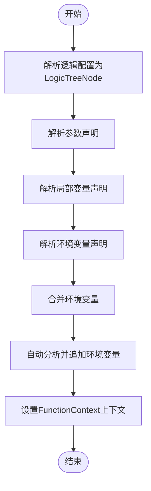
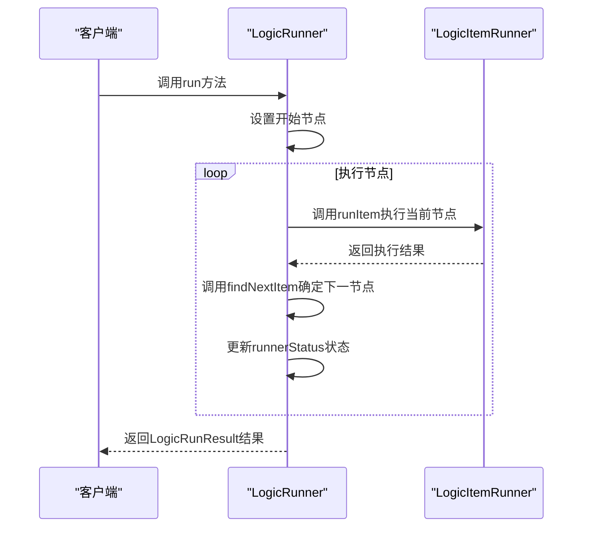
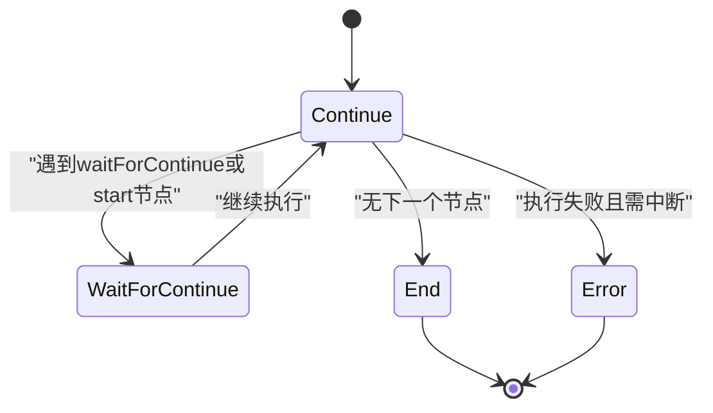
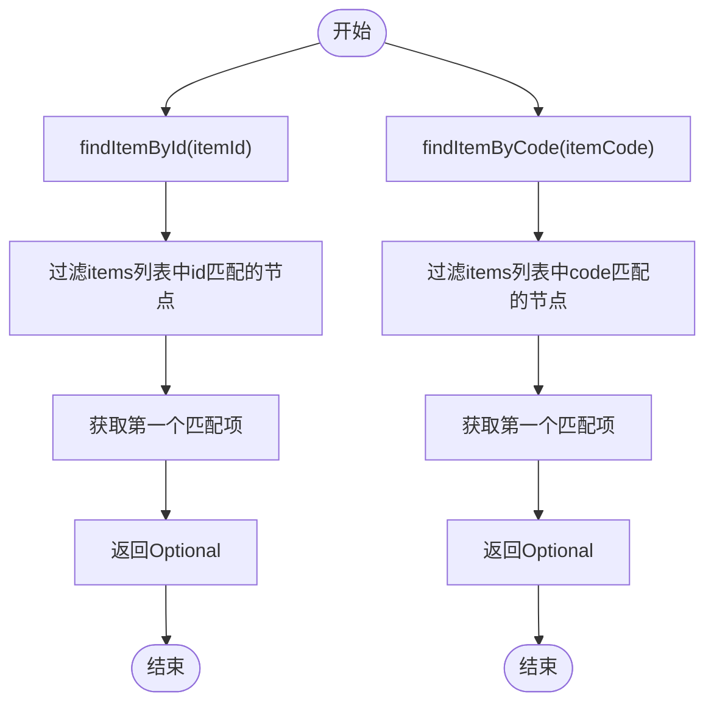
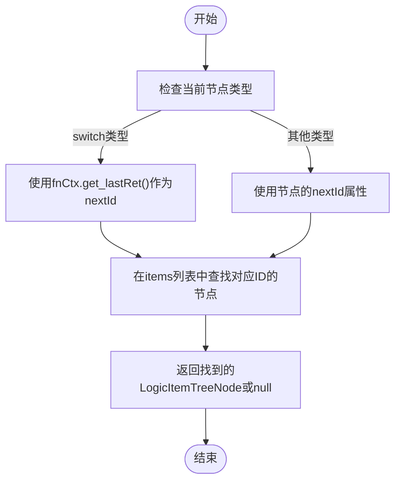
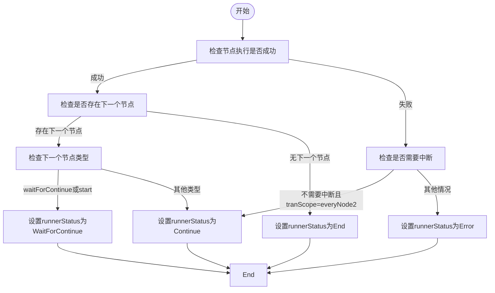

# 执行引擎架构

<cite>
**本文档引用的文件**
- [LogicRunner.java](file://logic-runtime/src/main/java/com/aims/logic/runtime/runner/LogicRunner.java)
- [LogicRunnerService.java](file://logic-runtime/src/main/java/com/aims/logic/runtime/service/LogicRunnerService.java)
- [LogicRunResult.java](file://logic-runtime/src/main/java/com/aims/logic/runtime/contract/dto/LogicRunResult.java)
- [RunnerStatusEnum.java](file://logic-runtime/src/main/java/com/aims/logic/runtime/contract/dto/RunnerStatusEnum.java)
- [FunctionContext.java](file://logic-runtime/src/main/java/com/aims/logic/runtime/runner/FunctionContext.java)
- [LogicItemRunner.java](file://logic-runtime/src/main/java/com/aims/logic/runtime/runner/LogicItemRunner.java)
- [Functions.java](file://logic-runtime/src/main/java/com/aims/logic/runtime/runner/Functions.java)
- [LogicTreeNode.java](file://logic-runtime/src/main/java/com/aims/logic/runtime/contract/dsl/LogicTreeNode.java)
- [LogicItemTreeNode.java](file://logic-runtime/src/main/java/com/aims/logic/runtime/contract/dsl/LogicItemTreeNode.java)
</cite>

## 目录
1. [引言](#引言)
2. [核心执行流程](#核心执行流程)
3. [初始化过程](#初始化过程)
4. [run方法执行机制](#run方法执行机制)
5. [runnerStatus状态机](#runnerstatus状态机)
6. [逻辑节点查找机制](#逻辑节点查找机制)
7. [下一个节点确定策略](#下一个节点确定策略)
8. [错误处理与事务传播](#错误处理与事务传播)
9. [时序图](#时序图)
10. [结论](#结论)

## 引言
LogicRunner是逻辑执行引擎的核心组件，负责管理逻辑流程的执行。它通过解析逻辑配置、处理环境变量和全局变量来初始化执行上下文，并按照预定义的节点顺序执行逻辑。本架构文档详细介绍了LogicRunner的核心执行流程，包括初始化过程、run方法的执行机制、runnerStatus状态机的转换逻辑、逻辑节点的查找机制以及错误处理和事务传播机制。

## 核心执行流程
LogicRunner的核心执行流程从调用run方法开始，经过初始化、节点查找、执行和状态更新等步骤，直到流程结束或遇到错误。整个流程由LogicRunner类中的多个方法协同完成，确保逻辑能够正确、高效地执行。

**本文档引用的文件**
- [LogicRunner.java](file://logic-runtime/src/main/java/com/aims/logic/runtime/runner/LogicRunner.java#L198-L200)

## 初始化过程
LogicRunner的初始化过程主要通过init方法完成，该方法接收逻辑配置、环境变量和业务标识作为参数。初始化过程中，首先将逻辑配置转换为LogicTreeNode对象，然后解析参数、局部变量和环境变量，并进行合并处理。此外，还会自动分析和追加环境变量中的JWT token等信息。



**图源**
- [LogicRunner.java](file://logic-runtime/src/main/java/com/aims/logic/runtime/runner/LogicRunner.java#L70-L90)
- [LogicRunner.java](file://logic-runtime/src/main/java/com/aims/logic/runtime/runner/LogicRunner.java#L95-L127)

**本文档引用的文件**
- [LogicRunner.java](file://logic-runtime/src/main/java/com/aims/logic/runtime/runner/LogicRunner.java#L70-L90)
- [LogicRunner.java](file://logic-runtime/src/main/java/com/aims/logic/runtime/runner/LogicRunner.java#L95-L127)

## run方法执行机制
run方法是LogicRunner的主要执行入口，它从开始节点到结束节点完整执行逻辑流程。该方法首先设置开始节点，然后循环执行每个节点，直到流程结束。在每次迭代中，会调用runItem方法执行当前节点，并通过findNextItem方法确定下一个节点。



**图源**
- [LogicRunner.java](file://logic-runtime/src/main/java/com/aims/logic/runtime/runner/LogicRunner.java#L210-L234)
- [LogicRunner.java](file://logic-runtime/src/main/java/com/aims/logic/runtime/runner/LogicRunner.java#L238-L249)
- [LogicRunner.java](file://logic-runtime/src/main/java/com/aims/logic/runtime/runner/LogicRunner.java#L273-L287)

**本文档引用的文件**
- [LogicRunner.java](file://logic-runtime/src/main/java/com/aims/logic/runtime/runner/LogicRunner.java#L210-L234)

## runnerStatus状态机
runnerStatus状态机定义了LogicRunner的三种状态：Continue、WaitForContinue和End。这些状态通过updateStatus方法进行转换。当节点执行成功且存在下一个节点时，状态为Continue；当遇到waitForContinue或start类型的节点时，状态为WaitForContinue；当没有下一个节点时，状态为End。如果节点执行失败，则根据事务范围决定是否进入Error状态。



**图源**
- [LogicRunner.java](file://logic-runtime/src/main/java/com/aims/logic/runtime/runner/LogicRunner.java#L251-L271)
- [RunnerStatusEnum.java](file://logic-runtime/src/main/java/com/aims/logic/runtime/contract/dto/RunnerStatusEnum.java#L3-L8)

**本文档引用的文件**
- [LogicRunner.java](file://logic-runtime/src/main/java/com/aims/logic/runtime/runner/LogicRunner.java#L251-L271)

## 逻辑节点查找机制
LogicRunner提供了两种逻辑节点查找方法：findItemById和findItemByCode。findItemById根据节点ID在逻辑配置的items列表中查找对应的LogicItemTreeNode对象；findItemByCode则根据节点代码进行查找。这两种方法都使用Java 8的Stream API和Optional机制来安全地处理可能不存在的节点。



**图源**
- [LogicRunner.java](file://logic-runtime/src/main/java/com/aims/logic/runtime/runner/LogicRunner.java#L129-L132)
- [LogicRunner.java](file://logic-runtime/src/main/java/com/aims/logic/runtime/runner/LogicRunner.java#L134-L137)

**本文档引用的文件**
- [LogicRunner.java](file://logic-runtime/src/main/java/com/aims/logic/runtime/runner/LogicRunner.java#L129-L132)

## 下一个节点确定策略
findNextItem方法负责确定当前节点执行后的下一个节点。对于普通节点，直接使用nextId属性确定下一个节点；对于switch类型节点，使用fnCtx中的_lastRet值作为下一个节点的ID。这种方法支持动态分支选择，使得逻辑流程可以根据运行时条件进行分支。



**图源**
- [LogicRunner.java](file://logic-runtime/src/main/java/com/aims/logic/runtime/runner/LogicRunner.java#L273-L287)

**本文档引用的文件**
- [LogicRunner.java](file://logic-runtime/src/main/java/com/aims/logic/runtime/runner/LogicRunner.java#L273-L287)

## 错误处理与事务传播
LogicRunner的错误处理机制在updateStatus方法中实现。当节点执行失败时，如果不需要中断且事务范围为everyNode2，则继续执行；否则进入Error状态。事务传播机制通过FunctionContext中的tranScope属性控制，支持多种事务范围配置，如everyNode、everyNode2、everyRequest和off。



**图源**
- [LogicRunner.java](file://logic-runtime/src/main/java/com/aims/logic/runtime/runner/LogicRunner.java#L251-L271)
- [FunctionContext.java](file://logic-runtime/src/main/java/com/aims/logic/runtime/runner/FunctionContext.java#L50-L65)

**本文档引用的文件**
- [LogicRunner.java](file://logic-runtime/src/main/java/com/aims/logic/runtime/runner/LogicRunner.java#L251-L271)

## 时序图
以下时序图展示了从调用run方法到返回LogicRunResult的完整过程，包括初始化、节点执行、状态更新和结果返回等关键步骤。

```mermaid
sequenceDiagram
participant Client as "客户端"
participant LogicRunner as "LogicRunner"
participant LogicItemRunner as "LogicItemRunner"
participant LogicRunResult as "LogicRunResult"
Client->>LogicRunner : run(paramsMap)
activate LogicRunner
LogicRunner->>LogicRunner : setStartNode(getStartItem(null))
LogicRunner->>LogicRunner : fnCtx.set_par(paramsMap)
LogicRunner->>LogicRunner : logicLog初始化
loop 执行节点
LogicRunner->>LogicItemRunner : runItem(startNode)
activate LogicItemRunner
LogicItemRunner-->>LogicRunner : 返回LogicItemRunResult
deactivate LogicItemRunner
LogicRunner->>LogicRunner : findNextItem(startNode)
LogicRunner->>LogicRunner : updateStatus(itemRes, nextItem)
alt runnerStatus == Continue
LogicRunner->>LogicRunner : 继续循环
else
break
end
end
LogicRunner->>LogicRunResult : fromItemResult(itemRes)
LogicRunner->>LogicRunResult : 设置logicLog等属性
LogicRunner-->>Client : 返回LogicRunResult
deactivate LogicRunner
```

**图源**
- [LogicRunner.java](file://logic-runtime/src/main/java/com/aims/logic/runtime/runner/LogicRunner.java#L210-L234)
- [LogicRunResult.java](file://logic-runtime/src/main/java/com/aims/logic/runtime/contract/dto/LogicRunResult.java#L50-L65)

**本文档引用的文件**
- [LogicRunner.java](file://logic-runtime/src/main/java/com/aims/logic/runtime/runner/LogicRunner.java#L210-L234)

## 结论
LogicRunner作为逻辑执行引擎的核心，通过精心设计的初始化过程、灵活的节点查找机制、可靠的错误处理和事务传播策略，实现了高效、稳定的逻辑流程执行。其状态机模型清晰地描述了执行过程中的各种状态转换，而时序图则直观地展示了从调用到返回的完整执行流程。这些设计使得LogicRunner能够适应各种复杂的业务场景，为上层应用提供强大的逻辑执行能力。

**本文档引用的文件**
- [LogicRunner.java](file://logic-runtime/src/main/java/com/aims/logic/runtime/runner/LogicRunner.java)
- [LogicRunnerService.java](file://logic-runtime/src/main/java/com/aims/logic/runtime/service/LogicRunnerService.java)
- [LogicRunResult.java](file://logic-runtime/src/main/java/com/aims/logic/runtime/contract/dto/LogicRunResult.java)
- [RunnerStatusEnum.java](file://logic-runtime/src/main/java/com/aims/logic/runtime/contract/dto/RunnerStatusEnum.java)
- [FunctionContext.java](file://logic-runtime/src/main/java/com/aims/logic/runtime/runner/FunctionContext.java)
- [LogicItemRunner.java](file://logic-runtime/src/main/java/com/aims/logic/runtime/runner/LogicItemRunner.java)
- [Functions.java](file://logic-runtime/src/main/java/com/aims/logic/runtime/runner/Functions.java)
- [LogicTreeNode.java](file://logic-runtime/src/main/java/com/aims/logic/runtime/contract/dsl/LogicTreeNode.java)
- [LogicItemTreeNode.java](file://logic-runtime/src/main/java/com/aims/logic/runtime/contract/dsl/LogicItemTreeNode.java)