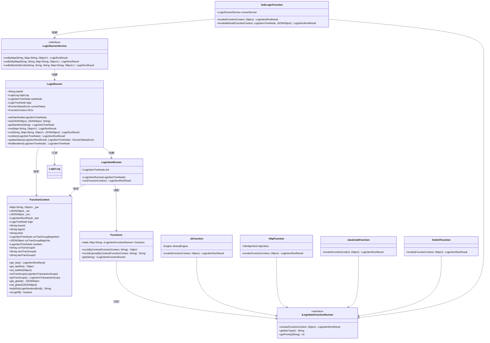
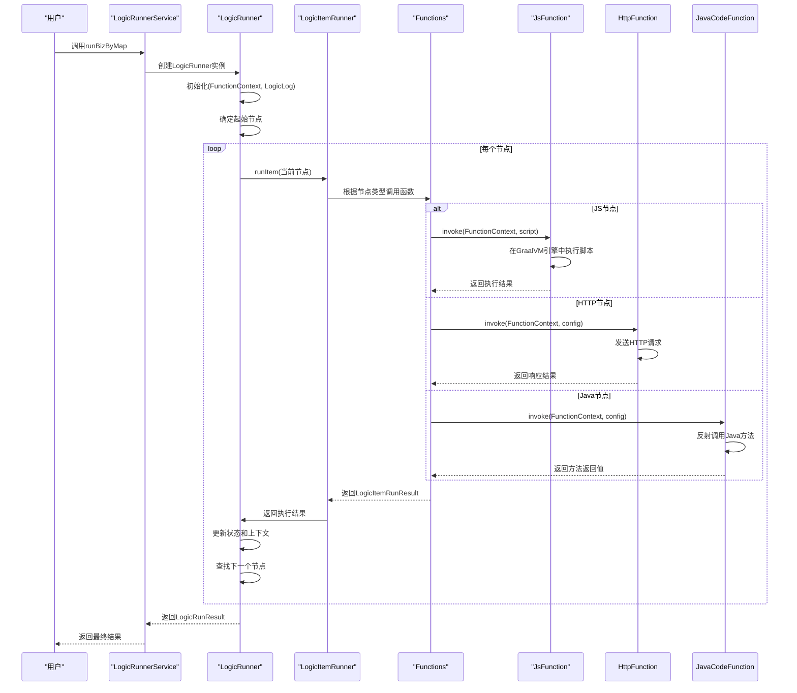
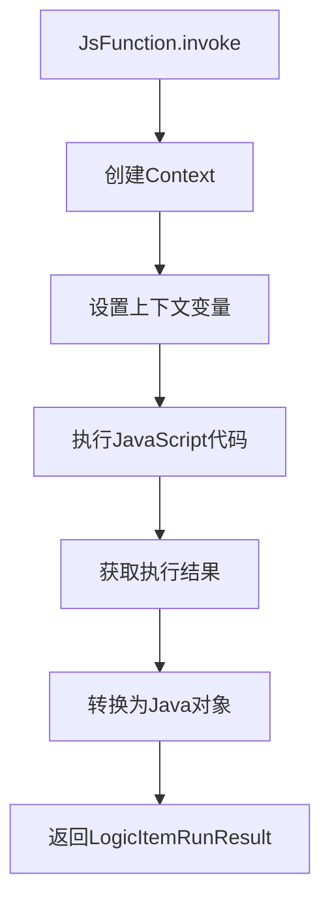

# 核心架构

<cite>
**本文档引用的文件**  
- [LogicRunner.java](file://logic-runtime/src/main/java/com/aims/logic/runtime/runner/LogicRunner.java)
- [LogicItemRunner.java](file://logic-runtime/src/main/java/com/aims/logic/runtime/runner/LogicItemRunner.java)
- [FunctionContext.java](file://logic-runtime/src/main/java/com/aims/logic/runtime/runner/FunctionContext.java)
- [Functions.java](file://logic-runtime/src/main/java/com/aims/logic/runtime/runner/Functions.java)
- [LogicRunnerService.java](file://logic-runtime/src/main/java/com/aims/logic/runtime/service/LogicRunnerService.java)
- [GraalvmEngineConfig.java](file://logic-runtime/src/main/java/com/aims/logic/runtime/configuration/GraalvmEngineConfig.java)
- [LogicItemTreeNode.java](file://logic-runtime/src/main/java/com/aims/logic/runtime/contract/dsl/LogicItemTreeNode.java)
- [LogicLog.java](file://logic-runtime/src/main/java/com/aims/logic/runtime/contract/logger/LogicLog.java)
- [LogicItemRunResult.java](file://logic-runtime/src/main/java/com/aims/logic/runtime/contract/dto/LogicItemRunResult.java)
- [LogicRunResult.java](file://logic-runtime/src/main/java/com/aims/logic/runtime/contract/dto/LogicRunResult.java)
- [JsonUtil.java](file://logic-runtime/src/main/java/com/aims/logic/runtime/util/JsonUtil.java)
- [ILogicItemFunctionRunner.java](file://logic-runtime/src/main/java/com/aims/logic/runtime/runner/functions/ILogicItemFunctionRunner.java)
- [HttpFunction.java](file://logic-runtime/src/main/java/com/aims/logic/runtime/runner/functions/impl/HttpFunction.java)
- [JavaCodeFunction.java](file://logic-runtime/src/main/java/com/aims/logic/runtime/runner/functions/impl/JavaCodeFunction.java)
- [JsFunction.java](file://logic-runtime/src/main/java/com/aims/logic/runtime/runner/functions/impl/JsFunction.java)
- [SwitchFunction.java](file://logic-runtime/src/main/java/com/aims/logic/runtime/runner/functions/impl/SwitchFunction.java)
- [SubLogicFunction.java](file://logic-sdk/src/main/java/com/aims/logic/sdk/functions/SubLogicFunction.java)
</cite>

## 目录
1. [系统上下文图](#系统上下文图)
2. [组件图](#组件图)
3. [核心组件设计](#核心组件设计)
4. [架构模式应用](#架构模式应用)
5. [数据流分析](#数据流分析)
6. [可扩展性、性能与容错性](#可扩展性性能与容错性)
7. [GraalVM引擎集成](#graalvm引擎集成)

## 系统上下文图

```mermaid
graph TD
User[用户] --> |输入请求| LogicRunnerService
LogicRunnerService --> |执行逻辑| LogicRunner
LogicRunner --> |运行节点| LogicItemRunner
LogicItemRunner --> |调用函数| Functions
Functions --> |执行JS| JsFunction
Functions --> |执行HTTP| HttpFunction
Functions --> |执行Java| JavaCodeFunction
Functions --> |执行Switch| SwitchFunction
Functions --> |执行子逻辑| SubLogicFunction
FunctionContext < --> |共享上下文| LogicRunner
FunctionContext < --> |共享上下文| LogicItemRunner
FunctionContext < --> |共享上下文| Functions
LogicLog < --> |记录日志| LogicRunner
LogicLog < --> |记录日志| LogicItemRunner
```

**图示来源**
- [LogicRunner.java](file://logic-runtime/src/main/java/com/aims/logic/runtime/runner/LogicRunner.java#L26-L289)
- [LogicItemRunner.java](file://logic-runtime/src/main/java/com/aims/logic/runtime/runner/LogicItemRunner.java#L10-L91)
- [Functions.java](file://logic-runtime/src/main/java/com/aims/logic/runtime/runner/Functions.java#L12-L51)
- [FunctionContext.java](file://logic-runtime/src/main/java/com/aims/logic/runtime/runner/FunctionContext.java#L14-L103)
- [LogicLog.java](file://logic-runtime/src/main/java/com/aims/logic/runtime/contract/logger/LogicLog.java#L19-L170)

## 组件图



**图示来源**
- [LogicRunner.java](file://logic-runtime/src/main/java/com/aims/logic/runtime/runner/LogicRunner.java#L26-L289)
- [LogicItemRunner.java](file://logic-runtime/src/main/java/com/aims/logic/runtime/runner/LogicItemRunner.java#L10-L91)
- [FunctionContext.java](file://logic-runtime/src/main/java/com/aims/logic/runtime/runner/FunctionContext.java#L14-L103)
- [Functions.java](file://logic-runtime/src/main/java/com/aims/logic/runtime/runner/Functions.java#L12-L51)
- [ILogicItemFunctionRunner.java](file://logic-runtime/src/main/java/com/aims/logic/runtime/runner/functions/ILogicItemFunctionRunner.java#L8-L25)
- [JsFunction.java](file://logic-runtime/src/main/java/com/aims/logic/runtime/runner/functions/impl/JsFunction.java#L19-L146)
- [HttpFunction.java](file://logic-runtime/src/main/java/com/aims/logic/runtime/runner/functions/impl/HttpFunction.java#L22-L117)
- [JavaCodeFunction.java](file://logic-runtime/src/main/java/com/aims/logic/runtime/runner/functions/impl/JavaCodeFunction.java#L21-L180)
- [SwitchFunction.java](file://logic-runtime/src/main/java/com/aims/logic/runtime/runner/functions/impl/SwitchFunction.java#L15-L64)
- [SubLogicFunction.java](file://logic-sdk/src/main/java/com/aims/logic/sdk/functions/SubLogicFunction.java#L17-L132)
- [LogicRunnerService.java](file://logic-runtime/src/main/java/com/aims/logic/runtime/service/LogicRunnerService.java#L0-L288)

## 核心组件设计

### LogicRunner
`LogicRunner` 是核心执行引擎的主控制器，负责管理整个逻辑流程的执行。它通过 `FunctionContext` 管理执行上下文，通过 `LogicItemRunner` 执行单个节点，并通过 `LogicLog` 记录执行日志。

**关键方法：**
- `init`: 初始化执行环境，解析逻辑配置，设置上下文变量
- `getStartItem`: 确定执行起点，支持指定节点或从 start 节点开始
- `run`: 执行逻辑流程，支持从指定节点开始执行
- `runItem`: 执行单个节点，创建 `LogicItemRunner` 并调用其 `run` 方法
- `updateStatus`: 更新执行状态，决定是否继续执行
- `findNextItem`: 查找下一个执行节点，特殊处理 switch 节点

**状态管理：**
`LogicRunner` 使用 `RunnerStatusEnum` 管理执行状态，包括 `Continue`（继续）、`Error`（错误）和 `End`（结束）等状态。

**上下文管理：**
通过 `FunctionContext` 管理 `_par`（参数）、`_var`（局部变量）、`_env`（环境变量）等上下文数据。

**日志记录：**
通过 `LogicLog` 记录整个执行过程的日志，包括参数、变量、执行结果等。

**组件来源**
- [LogicRunner.java](file://logic-runtime/src/main/java/com/aims/logic/runtime/runner/LogicRunner.java#L26-L289)

### LogicItemRunner
`LogicItemRunner` 负责执行单个逻辑节点。它接收 `FunctionContext` 作为执行上下文，根据节点类型调用相应的函数实现。

**执行流程：**
1. 创建节点日志记录
2. 根据节点类型分发到不同的处理逻辑
3. 调用 `Functions` 工具类执行具体函数
4. 记录执行结果和日志

**节点类型处理：**
- `end`: 执行结束节点脚本
- `wait`: 处理等待节点，支持动态超时时间
- `js`: 执行 JavaScript 脚本
- `assign-global`: 全局变量赋值
- `assign-local`: 局部变量赋值
- 其他类型：通过工厂模式从 `Functions` 获取对应的函数实现

**组件来源**
- [LogicItemRunner.java](file://logic-runtime/src/main/java/com/aims/logic/runtime/runner/LogicItemRunner.java#L10-L91)

### FunctionContext
`FunctionContext` 是执行上下文的核心类，贯穿整个执行过程，为所有组件提供共享的数据和状态。

**核心字段：**
- `_par`: 输入参数，Map 结构
- `_var`: 局部变量，JSONObject 结构
- `_env`: 环境变量，JSONObject 结构
- `_last`: 上一个节点的执行结果
- `logic`: 当前执行的逻辑定义
- `traceId`: 追踪ID，用于链路追踪
- `logicId`: 逻辑ID
- `bizId`: 业务ID
- 事务相关字段：`curTranGroupBeginItem`、`curTranGroupId` 等

**关键方法：**
- `get_last` 和 `get_lastRet`: 获取上一个节点的执行结果
- `setTranScope` 和 `getTranScope`: 管理事务作用域
- `get_global` 和 `set_global`: 管理全局变量
- `buildSubLogicRandomBizId`: 为子逻辑生成随机业务ID
- `isLogOff`: 判断是否关闭日志

**组件来源**
- [FunctionContext.java](file://logic-runtime/src/main/java/com/aims/logic/runtime/runner/FunctionContext.java#L14-L103)

### Functions
`Functions` 是一个静态工具类，实现了函数工厂模式，管理所有可用的函数实现。

**核心功能：**
- `functions` 静态Map：存储所有函数实现，键为函数类型，值为 `ILogicItemFunctionRunner` 实现
- `runJsByContext`: 在指定上下文中执行JavaScript脚本
- `runJsExpressByContext`: 在指定上下文中执行JavaScript表达式并返回结果
- `get`: 根据函数类型获取对应的函数实现

**函数注册：**
虽然代码中注释了通过 `ServiceLoader` 注册函数的机制，但实际使用的是静态Map手动注册的方式。

**组件来源**
- [Functions.java](file://logic-runtime/src/main/java/com/aims/logic/runtime/runner/Functions.java#L12-L51)

## 架构模式应用

### 工厂模式
工厂模式在系统中广泛应用，主要体现在 `Functions` 类中。

**实现方式：**
`Functions` 类维护一个 `Map<String, ILogicItemFunctionRunner>`，将函数类型映射到具体的实现类。当需要执行某个类型的函数时，通过 `Functions.get(type)` 获取对应的实现。

**优点：**
- 解耦了函数调用方和具体实现
- 易于扩展新的函数类型
- 支持运行时动态替换函数实现

**应用示例：**
```java
var func = Functions.get(itemType);
if (func != null)
    ret = func.invoke(ctx, this.dsl);
```

**组件来源**
- [Functions.java](file://logic-runtime/src/main/java/com/aims/logic/runtime/runner/Functions.java#L12-L51)
- [LogicItemRunner.java](file://logic-runtime/src/main/java/com/aims/logic/runtime/runner/LogicItemRunner.java#L10-L91)

### 策略模式
策略模式通过 `ILogicItemFunctionRunner` 接口实现，不同的函数类型对应不同的策略。

**实现方式：**
- 定义 `ILogicItemFunctionRunner` 接口，声明 `invoke` 方法
- 各种函数类型（如 `JsFunction`、`HttpFunction`）实现该接口
- 在运行时根据节点类型选择合适的策略执行

**优点：**
- 符合开闭原则，易于添加新的函数类型
- 代码结构清晰，每种函数类型的实现独立
- 支持优先级机制，可以通过 `getPriority` 方法控制实现的优先级

**组件来源**
- [ILogicItemFunctionRunner.java](file://logic-runtime/src/main/java/com/aims/logic/runtime/runner/functions/ILogicItemFunctionRunner.java#L8-L25)
- [JsFunction.java](file://logic-runtime/src/main/java/com/aims/logic/runtime/runner/functions/impl/JsFunction.java#L19-L146)
- [HttpFunction.java](file://logic-runtime/src/main/java/com/aims/logic/runtime/runner/functions/impl/HttpFunction.java#L22-L117)

### 责任链模式
责任链模式体现在逻辑节点的执行流程中。

**实现方式：**
- `LogicRunner` 作为责任链的起点
- 每个节点执行完成后，通过 `findNextItem` 方法确定下一个节点
- `updateStatus` 方法决定是否继续执行链条
- 节点之间通过 `FunctionContext` 共享状态

**执行流程：**
1. `LogicRunner` 开始执行
2. 调用 `runItem` 执行当前节点
3. 调用 `findNextItem` 查找下一个节点
4. 调用 `updateStatus` 更新状态
5. 根据状态决定是否继续执行下一个节点

**组件来源**
- [LogicRunner.java](file://logic-runtime/src/main/java/com/aims/logic/runtime/runner/LogicRunner.java#L26-L289)

### 单例模式
单例模式主要体现在 `GraalvmEngineConfig` 配置中。

**实现方式：**
- `GraalvmEngineConfig` 类通过 `@Configuration` 注解定义Spring配置
- `graalEngine` 方法通过 `@Bean` 注解创建单例的 `Engine` 实例
- 使用 `destroyMethod = "close"` 确保资源正确释放

**优点：**
- 共享GraalVM引擎实例，提高性能
- 避免重复创建昂贵的引擎资源
- 通过Spring容器管理生命周期

**组件来源**
- [GraalvmEngineConfig.java](file://logic-runtime/src/main/java/com/aims/logic/runtime/configuration/GraalvmEngineConfig.java#L0-L15)

## 数据流分析

### 整体数据流
用户输入 → LogicRunnerService → LogicRunner → LogicItemRunner → Functions → 具体函数实现 → 结果返回

### 详细数据流



**图示来源**
- [LogicRunnerService.java](file://logic-runtime/src/main/java/com/aims/logic/runtime/service/LogicRunnerService.java#L0-L288)
- [LogicRunner.java](file://logic-runtime/src/main/java/com/aims/logic/runtime/runner/LogicRunner.java#L26-L289)
- [LogicItemRunner.java](file://logic-runtime/src/main/java/com/aims/logic/runtime/runner/LogicItemRunner.java#L10-L91)
- [Functions.java](file://logic-runtime/src/main/java/com/aims/logic/runtime/runner/Functions.java#L12-L51)
- [JsFunction.java](file://logic-runtime/src/main/java/com/aims/logic/runtime/runner/functions/impl/JsFunction.java#L19-L146)

### 数据流关键点

1. **上下文传递**：`FunctionContext` 在整个执行过程中被所有组件共享，确保状态一致性
2. **结果处理**：每个节点的执行结果通过 `LogicItemRunResult` 返回，并更新到 `FunctionContext` 中
3. **变量管理**：通过 `_var`、`_par`、`_env` 等字段管理不同作用域的变量
4. **错误处理**：执行失败时通过 `LogicItemRunResult` 的 `success` 和 `msg` 字段传递错误信息
5. **日志记录**：每个节点的执行都会记录到 `LogicLog` 中，便于追踪和调试

## 可扩展性、性能与容错性

### 可扩展性
系统通过多种设计模式实现了良好的可扩展性：

**插件化函数实现：**
- 通过 `ILogicItemFunctionRunner` 接口定义标准
- 新的函数类型只需实现该接口并注册到 `Functions` 中
- 支持优先级机制，可以覆盖默认实现

**配置驱动：**
- 逻辑流程通过JSON配置定义
- 节点类型、参数、连接关系都在配置中声明
- 无需修改代码即可调整业务流程

**组件来源**
- [ILogicItemFunctionRunner.java](file://logic-runtime/src/main/java/com/aims/logic/runtime/runner/functions/ILogicItemFunctionRunner.java#L8-L25)
- [Functions.java](file://logic-runtime/src/main/java/com/aims/logic/runtime/runner/Functions.java#L12-L51)

### 性能
系统在性能方面做了多项优化：

**GraalVM引擎复用：**
- 通过Spring Bean管理单例的GraalVM引擎
- 避免重复创建引擎实例的开销
- 提高JavaScript执行性能

**上下文优化：**
- 使用轻量级的 `FunctionContext` 管理执行状态
- 避免不必要的对象创建和复制
- 支持关闭日志以提高性能

**异步执行：**
- 支持异步节点执行，不阻塞主流程
- 通过线程池管理异步任务

**组件来源**
- [GraalvmEngineConfig.java](file://logic-runtime/src/main/java/com/aims/logic/runtime/configuration/GraalvmEngineConfig.java#L0-L15)
- [FunctionContext.java](file://logic-runtime/src/main/java/com/aims/logic/runtime/runner/FunctionContext.java#L14-L103)
- [SubLogicFunction.java](file://logic-sdk/src/main/java/com/aims/logic/sdk/functions/SubLogicFunction.java#L17-L132)

### 容错性
系统具备良好的容错能力：

**异常处理：**
- 捕获并处理各种运行时异常
- 提供详细的错误信息和堆栈跟踪
- 支持业务异常和系统异常的区分处理

**状态恢复：**
- 支持从指定节点继续执行
- 可以传入缓存的局部变量实现状态恢复

**降级机制：**
- JWT解析失败时忽略错误，继续执行
- HTTP请求失败时记录错误但不中断流程

**组件来源**
- [LogicRunner.java](file://logic-runtime/src/main/java/com/aims/logic/runtime/runner/LogicRunner.java#L26-L289)
- [JavaCodeFunction.java](file://logic-runtime/src/main/java/com/aims/logic/runtime/runner/functions/impl/JavaCodeFunction.java#L21-L180)
- [HttpFunction.java](file://logic-runtime/src/main/java/com/aims/logic/runtime/runner/functions/impl/HttpFunction.java#L22-L117)

## GraalVM引擎集成

### 集成方式
系统通过Spring配置集成GraalVM引擎：

```java
@Configuration
public class GraalvmEngineConfig {
    @Bean(destroyMethod = "close")
    public Engine graalEngine() {
        return Engine.newBuilder()
                .option("engine.WarnInterpreterOnly", "false")
                .build();
    }
}
```

**关键配置：**
- `@Bean` 注解将引擎实例注册为Spring Bean
- `destroyMethod = "close"` 确保JVM关闭时正确释放资源
- `engine.WarnInterpreterOnly` 选项关闭解释器警告

### 执行流程


**组件来源**
- [GraalvmEngineConfig.java](file://logic-runtime/src/main/java/com/aims/logic/runtime/configuration/GraalvmEngineConfig.java#L0-L15)
- [JsFunction.java](file://logic-runtime/src/main/java/com/aims/logic/runtime/runner/functions/impl/JsFunction.java#L19-L146)

### 性能影响
GraalVM引擎的集成对执行性能有显著影响：

**优点：**
- 相比传统JavaScript引擎，执行速度更快
- 支持AOT编译，提高热点代码性能
- 与Java无缝集成，避免JNI调用开销

**优化措施：**
- 共享引擎实例，避免创建开销
- 使用 `allowHostAccess(HostAccess.ALL)` 提高互操作性
- 通过JSON转换确保线程安全

**组件来源**
- [GraalvmEngineConfig.java](file://logic-runtime/src/main/java/com/aims/logic/runtime/configuration/GraalvmEngineConfig.java#L0-L15)
- [JsFunction.java](file://logic-runtime/src/main/java/com/aims/logic/runtime/runner/functions/impl/JsFunction.java#L19-L146)