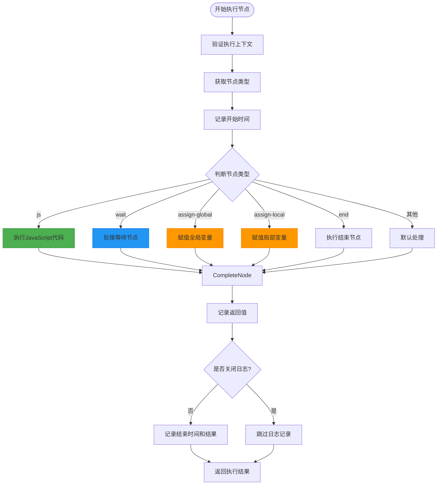
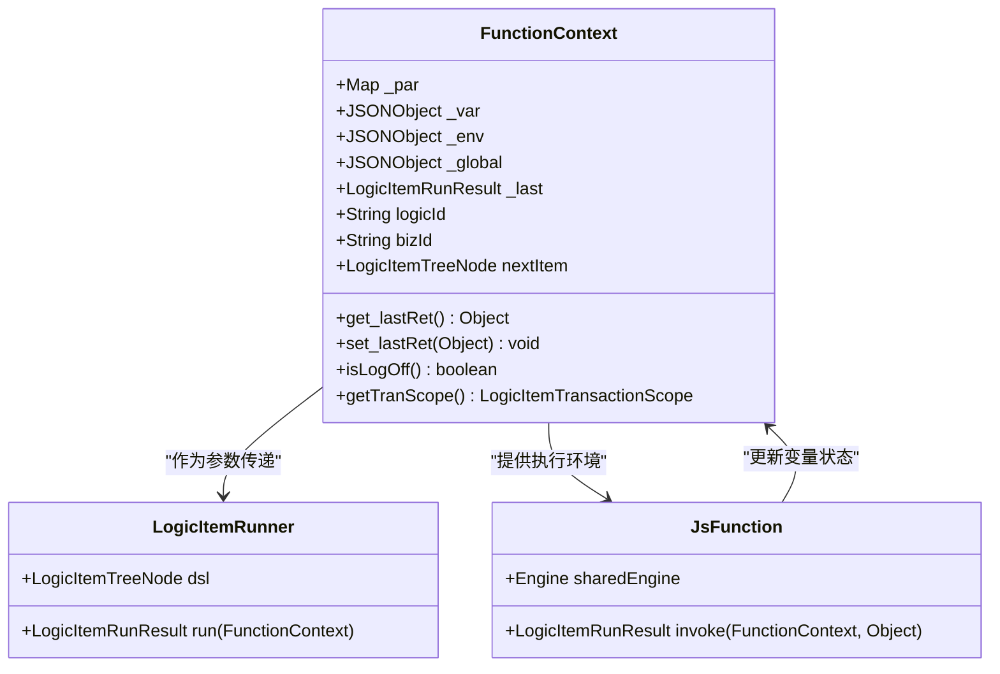
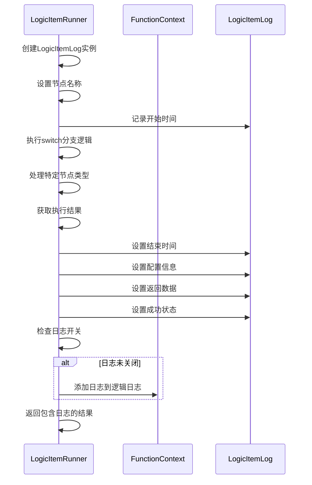

# 节点执行机制

<cite>
**本文档引用文件**  
- [LogicItemRunner.java](file://logic-runtime/src/main/java/com/aims/logic/runtime/runner/LogicItemRunner.java)
- [FunctionContext.java](file://logic-runtime/src/main/java/com/aims/logic/runtime/runner/FunctionContext.java)
- [LogicItemLog.java](file://logic-runtime/src/main/java/com/aims/logic/runtime/contract/logger/LogicItemLog.java)
- [Functions.java](file://logic-runtime/src/main/java/com/aims/logic/runtime/runner/Functions.java)
- [JsFunction.java](file://logic-runtime/src/main/java/com/aims/logic/runtime/runner/functions/impl/JsFunction.java)
</cite>

## 目录
1. [简介](#简介)
2. [核心执行流程](#核心执行流程)
3. [节点类型处理机制](#节点类型处理机制)
4. [执行上下文作用](#执行上下文作用)
5. [节点执行日志记录](#节点执行日志记录)
6. [代码示例说明](#代码示例说明)

## 简介
本文档详细阐述LogicItemRunner的节点执行机制，重点分析其如何处理不同类型的逻辑节点，包括JavaScript代码执行、等待节点超时处理、全局与局部变量赋值等核心功能。通过深入解析执行流程、上下文管理和日志记录机制，全面揭示系统运行原理。

## 核心执行流程



**图示来源**  
- [LogicItemRunner.java](file://logic-runtime/src/main/java/com/aims/logic/runtime/runner/LogicItemRunner.java#L18-L90)

## 节点类型处理机制

### JavaScript节点执行
当节点类型为"js"时，系统通过Functions.get("js")获取JavaScript执行器，并调用其invoke方法执行脚本内容。该过程利用GraalVM引擎在安全沙箱中运行JavaScript代码，确保执行的安全性和隔离性。

### 等待节点超时处理
对于"wait"类型节点，系统首先解析配置的超时表达式，通过Functions.runJsByContext在当前上下文中计算实际等待时间。若超时值大于0，则调用Thread.sleep进行阻塞等待，期间捕获可能的InterruptedException异常并记录错误信息。

### 全局变量赋值实现
"assign-global"类型节点通过构造特定格式的JavaScript语句（_global.varName = value）来实现全局变量赋值。执行后立即查询赋值结果，确保变量已正确设置，并将最新值作为返回数据。

### 局部变量赋值实现
"assign-local"类型节点采用类似机制，通过执行"_var.varName = value"语句完成局部变量赋值。与全局变量不同，局部变量存储在FunctionContext的_var对象中，具有更短的作用域生命周期。

**本节来源**  
- [LogicItemRunner.java](file://logic-runtime/src/main/java/com/aims/logic/runtime/runner/LogicItemRunner.java#L18-L90)
- [Functions.java](file://logic-runtime/src/main/java/com/aims/logic/runtime/runner/Functions.java#L22-L23)

## 执行上下文作用



**图示来源**  
- [FunctionContext.java](file://logic-runtime/src/main/java/com/aims/logic/runtime/runner/FunctionContext.java#L0-L104)
- [LogicItemRunner.java](file://logic-runtime/src/main/java/com/aims/logic/runtime/runner/LogicItemRunner.java#L14-L16)

执行上下文（FunctionContext）在节点执行过程中扮演核心角色，主要功能包括：
- 维护参数集合（_par）、局部变量（_var）、环境变量（_env）和全局变量（_global）
- 跟踪当前逻辑ID（logicId）和业务ID（bizId）
- 存储上一个节点的执行结果（_last）
- 管理事务作用域和传播属性
- 控制日志开关状态（isLogOff方法）

## 节点执行日志记录



**图示来源**  
- [LogicItemRunner.java](file://logic-runtime/src/main/java/com/aims/logic/runtime/runner/LogicItemRunner.java#L18-L90)
- [LogicItemLog.java](file://logic-runtime/src/main/java/com/aims/logic/runtime/contract/logger/LogicItemLog.java#L0-L53)

节点执行日志（LogicItemLog）记录过程包含以下关键步骤：
1. 在节点执行开始时创建LogicItemLog实例并设置名称
2. 记录执行开始时间（setBeginTime）
3. 执行完节点逻辑后记录结束时间（setEndTime）
4. 保存节点配置信息（config）和转换后的实例（configInstance）
5. 存储返回数据（setReturnData）和执行消息（msg）
6. 标记执行成功状态（success）
7. 根据上下文的日志开关状态决定是否最终记录日志

## 代码示例说明

### JavaScript节点配置示例
```json
{
  "type": "js",
  "script": "return _par.inputValue * 2;"
}
```
此配置将输入参数inputValue乘以2后返回，展示了JavaScript节点的基本用法。

### 等待节点配置示例
```json
{
  "type": "wait",
  "timeout": "1000 + Math.random() * 1000"
}
```
该配置实现1-2秒之间的随机等待，timeout字段支持JavaScript表达式计算。

### 全局变量赋值示例
```json
{
  "type": "assign-global",
  "url": "counter",
  "body": "(_global.counter || 0) + 1"
}
```
此配置实现全局计数器递增，每次执行都将counter值加1。

### 局部变量赋值示例
```json
{
  "type": "assign-local",
  "url": "tempResult",
  "body": "_par.valueA + _par.valueB"
}
```
该配置将两个输入参数相加并存储到局部变量tempResult中。

**本节来源**  
- [LogicItemRunner.java](file://logic-runtime/src/main/java/com/aims/logic/runtime/runner/LogicItemRunner.java#L38-L62)
- [JsFunction.java](file://logic-runtime/src/main/java/com/aims/logic/runtime/runner/functions/impl/JsFunction.java#L19-L146)