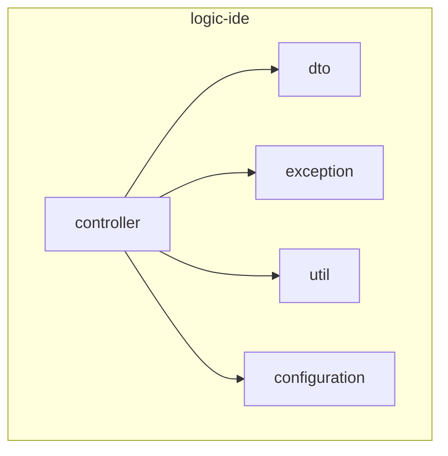
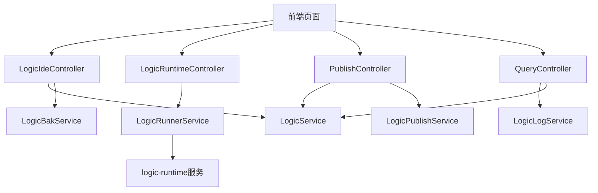
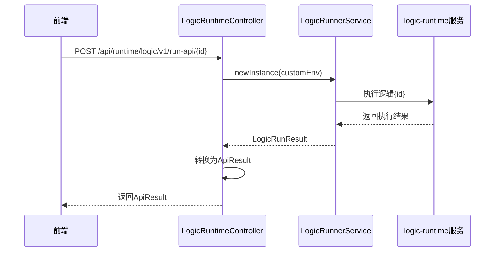
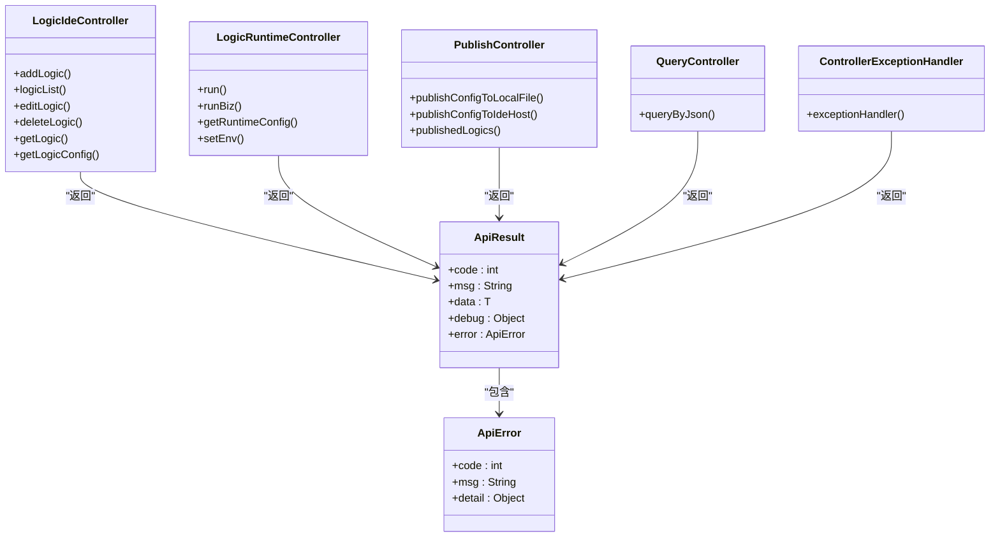

# IDE后端API

<cite>
**本文档引用文件**   
- [LogicIdeController.java](file://logic-ide/src/main/java/com/aims/logic/ide/controller/LogicIdeController.java)
- [LogicRuntimeController.java](file://logic-ide/src/main/java/com/aims/logic/ide/controller/LogicRuntimeController.java)
- [PublishController.java](file://logic-ide/src/main/java/com/aims/logic/ide/controller/PublishController.java)
- [QueryController.java](file://logic-ide/src/main/java/com/aims/logic/ide/controller/QueryController.java)
- [ApiResult.java](file://logic-ide/src/main/java/com/aims/logic/ide/controller/dto/ApiResult.java)
- [ApiError.java](file://logic-ide/src/main/java/com/aims/logic/ide/controller/dto/ApiError.java)
- [ControllerExceptionHandler.java](file://logic-ide/src/main/java/com/aims/logic/ide/exception/ControllerExceptionHandler.java)
</cite>

## 目录
1. [引言](#引言)
2. [项目结构](#项目结构)
3. [核心组件](#核心组件)
4. [架构概述](#架构概述)
5. [详细组件分析](#详细组件分析)
6. [依赖分析](#依赖分析)
7. [性能考虑](#性能考虑)
8. [故障排除指南](#故障排除指南)
9. [结论](#结论)

## 引言
本文档深入解析logic-ide模块中各控制器类的职责划分与接口设计，重点说明`LogicIdeController`提供的逻辑实例管理、增删改查、版本备份等核心功能接口；`LogicRuntimeController`如何作为代理转发执行请求至logic-runtime服务并处理响应；`PublishController`实现的发布流程控制机制；`QueryController`支持的查询能力。结合`ApiResult`、`ApiError`等DTO类说明统一响应结构设计。阐述各API的安全校验、异常处理（`ControllerExceptionHandler`）及与前端页面的调用映射关系。为开发者提供API调用示例、参数说明与常见错误排查指南。

## 项目结构



**图示来源**
- [LogicIdeController.java](file://logic-ide/src/main/java/com/aims/logic/ide/controller/LogicIdeController.java)
- [LogicRuntimeController.java](file://logic-ide/src/main/java/com/aims/logic/ide/controller/LogicRuntimeController.java)
- [PublishController.java](file://logic-ide/src/main/java/com/aims/logic/ide/controller/PublishController.java)
- [QueryController.java](file://logic-ide/src/main/java/com/aims/logic/ide/controller/QueryController.java)

**本节来源**
- [LogicIdeController.java](file://logic-ide/src/main/java/com/aims/logic/ide/controller/LogicIdeController.java#L1-L390)
- [LogicRuntimeController.java](file://logic-ide/src/main/java/com/aims/logic/ide/controller/LogicRuntimeController.java#L1-L209)

## 核心组件

`LogicIdeController`负责逻辑实例的增删改查、版本管理与配置获取；`LogicRuntimeController`作为运行时代理，转发执行请求并返回结果；`PublishController`管理逻辑发布流程；`QueryController`提供数据查询接口。统一响应结构由`ApiResult`和`ApiError`定义，异常处理通过`ControllerExceptionHandler`实现。

**本节来源**
- [LogicIdeController.java](file://logic-ide/src/main/java/com/aims/logic/ide/controller/LogicIdeController.java#L37-L390)
- [LogicRuntimeController.java](file://logic-ide/src/main/java/com/aims/logic/ide/controller/LogicRuntimeController.java#L17-L209)
- [PublishController.java](file://logic-ide/src/main/java/com/aims/logic/ide/controller/PublishController.java#L18-L93)
- [QueryController.java](file://logic-ide/src/main/java/com/aims/logic/ide/controller/QueryController.java#L14-L43)
- [ApiResult.java](file://logic-ide/src/main/java/com/aims/logic/ide/controller/dto/ApiResult.java#L6-L40)
- [ApiError.java](file://logic-ide/src/main/java/com/aims/logic/ide/controller/dto/ApiError.java#L5-L11)

## 架构概述



**图示来源**
- [LogicIdeController.java](file://logic-ide/src/main/java/com/aims/logic/ide/controller/LogicIdeController.java)
- [LogicRuntimeController.java](file://logic-ide/src/main/java/com/aims/logic/ide/controller/LogicRuntimeController.java)
- [PublishController.java](file://logic-ide/src/main/java/com/aims/logic/ide/controller/PublishController.java)
- [QueryController.java](file://logic-ide/src/main/java/com/aims/logic/ide/controller/QueryController.java)

## 详细组件分析

### LogicIdeController分析

`LogicIdeController`提供逻辑实例的全生命周期管理接口，包括新增、查询、修改、删除、版本备份与配置获取。

```mermaid
flowchart TD
Start([/api/ide/logic/add]) --> AddLogic[添加逻辑实例]
AddLogic --> DB[(数据库)]
Start2([/api/ide/logics]) --> QueryLogic[查询逻辑列表]
QueryLogic --> DB
Start3([/api/ide/logic/edit/{id}]) --> EditLogic[编辑逻辑实例]
EditLogic --> Backup[创建备份]
EditLogic --> DB
Start4([/api/ide/logic/delete/{id}]) --> DeleteLogic[删除逻辑实例]
DeleteLogic --> DB
Start5([/api/ide/logic/{id}/config]) --> GetConfig[获取当前配置]
GetConfig --> DB
Start6([/api/ide/logic/{id}/config/{version}]) --> GetVersionConfig[获取指定版本配置]
GetVersionConfig --> BackupStorage[备份存储]
```

**图示来源**
- [LogicIdeController.java](file://logic-ide/src/main/java/com/aims/logic/ide/controller/LogicIdeController.java#L37-L390)

**本节来源**
- [LogicIdeController.java](file://logic-ide/src/main/java/com/aims/logic/ide/controller/LogicIdeController.java#L37-L390)

### LogicRuntimeController分析

`LogicRuntimeController`作为代理控制器，接收执行请求并转发至`logic-runtime`服务，处理响应结果。



**图示来源**
- [LogicRuntimeController.java](file://logic-ide/src/main/java/com/aims/logic/ide/controller/LogicRuntimeController.java#L17-L209)

**本节来源**
- [LogicRuntimeController.java](file://logic-ide/src/main/java/com/aims/logic/ide/controller/LogicRuntimeController.java#L17-L209)

### PublishController分析

`PublishController`实现逻辑配置的发布控制，支持发布到本地文件或远程IDE主机。

```mermaid
flowchart TD
A[/api/ide/publish/logic/to-local/{id}] --> B[调用logicService.pubToLocal]
B --> C[生成本地文件路径]
C --> D[返回文件路径]
E[/api/ide/publish/logic/to-ide/{id}/{host_name}] --> F[查找目标主机]
F --> G{主机存在?}
G --> |是| H[调用logicService.pubToIdeHost]
G --> |否| I[返回错误信息]
H --> J[返回远程路径]
```

**图示来源**
- [PublishController.java](file://logic-ide/src/main/java/com/aims/logic/ide/controller/PublishController.java#L18-L93)

**本节来源**
- [PublishController.java](file://logic-ide/src/main/java/com/aims/logic/ide/controller/PublishController.java#L18-L93)

### QueryController分析

`QueryController`提供基于数据模型ID的通用查询接口，支持对逻辑日志等数据的查询。

```mermaid
flowchart TD
Start[/api/ide/data/{dataModelId}/query] --> CheckModel{dataModelId == "logic_log"?}
CheckModel --> |是| CallLogicLogService[调用logicLogService.selectPageByInput]
CheckModel --> |否| CallLogicService[调用logicService.selectPageByInput]
CallLogicLogService --> ReturnResult[返回分页结果]
CallLogicService --> ReturnResult
```

**图示来源**
- [QueryController.java](file://logic-ide/src/main/java/com/aims/logic/ide/controller/QueryController.java#L14-L43)

**本节来源**
- [QueryController.java](file://logic-ide/src/main/java/com/aims/logic/ide/controller/QueryController.java#L14-L43)

## 依赖分析



**图示来源**
- [LogicIdeController.java](file://logic-ide/src/main/java/com/aims/logic/ide/controller/LogicIdeController.java)
- [LogicRuntimeController.java](file://logic-ide/src/main/java/com/aims/logic/ide/controller/LogicRuntimeController.java)
- [PublishController.java](file://logic-ide/src/main/java/com/aims/logic/ide/controller/PublishController.java)
- [QueryController.java](file://logic-ide/src/main/java/com/aims/logic/ide/controller/QueryController.java)
- [ApiResult.java](file://logic-ide/src/main/java/com/aims/logic/ide/controller/dto/ApiResult.java)
- [ApiError.java](file://logic-ide/src/main/java/com/aims/logic/ide/controller/dto/ApiError.java)
- [ControllerExceptionHandler.java](file://logic-ide/src/main/java/com/aims/logic/ide/exception/ControllerExceptionHandler.java)

**本节来源**
- [LogicIdeController.java](file://logic-ide/src/main/java/com/aims/logic/ide/controller/LogicIdeController.java#L37-L390)
- [LogicRuntimeController.java](file://logic-ide/src/main/java/com/aims/logic/ide/controller/LogicRuntimeController.java#L17-L209)
- [PublishController.java](file://logic-ide/src/main/java/com/aims/logic/ide/controller/PublishController.java#L18-L93)
- [QueryController.java](file://logic-ide/src/main/java/com/aims/logic/ide/controller/QueryController.java#L14-L43)
- [ApiResult.java](file://logic-ide/src/main/java/com/aims/logic/ide/controller/dto/ApiResult.java#L6-L40)
- [ApiError.java](file://logic-ide/src/main/java/com/aims/logic/ide/controller/dto/ApiError.java#L5-L11)
- [ControllerExceptionHandler.java](file://logic-ide/src/main/java/com/aims/logic/ide/exception/ControllerExceptionHandler.java#L3-L19)

## 性能考虑
各控制器通过服务层与数据库或远程服务交互，建议对高频查询接口添加缓存机制。`LogicRuntimeController`的执行接口应考虑异步处理以避免阻塞。批量操作需注意事务管理和内存使用。

## 故障排除指南

常见错误包括：
- 404：检查API路径是否正确
- 500：查看服务日志获取详细错误信息
- 版本不存在：确认逻辑ID和版本号是否正确
- 发布失败：检查目标主机配置和网络连接

**本节来源**
- [ApiResult.java](file://logic-ide/src/main/java/com/aims/logic/ide/controller/dto/ApiResult.java#L6-L40)
- [ApiError.java](file://logic-ide/src/main/java/com/aims/logic/ide/controller/dto/ApiError.java#L5-L11)
- [ControllerExceptionHandler.java](file://logic-ide/src/main/java/com/aims/logic/ide/exception/ControllerExceptionHandler.java#L3-L19)

## 结论
本文档详细解析了logic-ide模块中各控制器的职责划分与接口设计，为开发者提供了清晰的API使用指南和故障排除参考。各控制器职责明确，通过统一的响应结构和异常处理机制保证了系统的稳定性和可维护性。