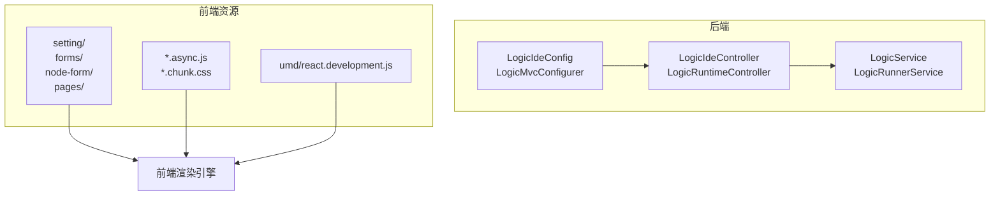
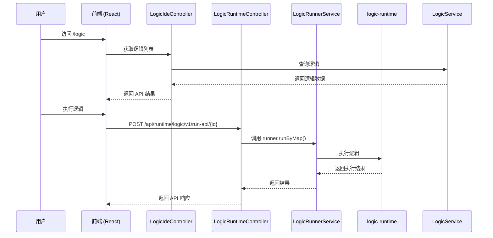
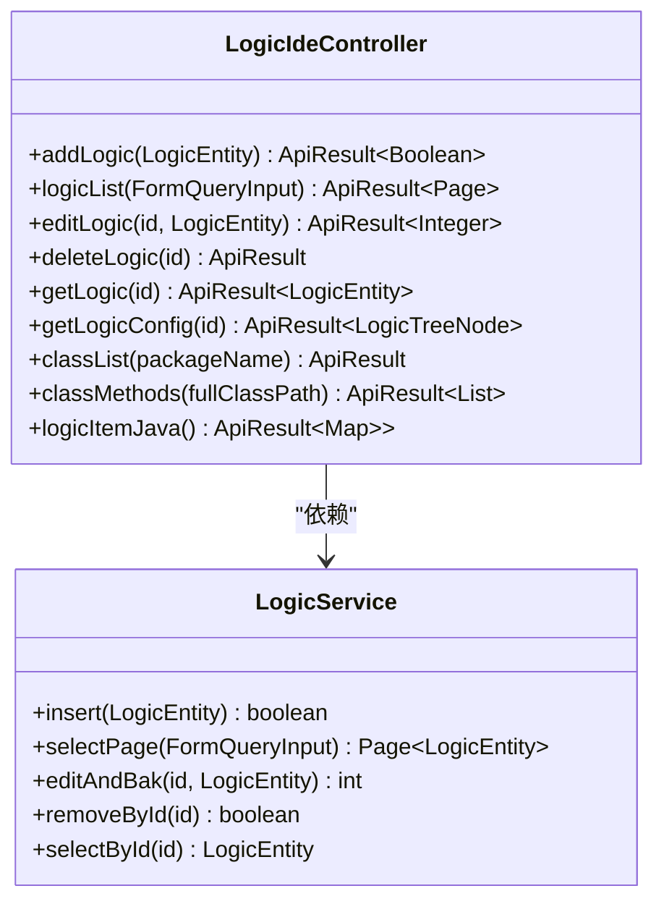
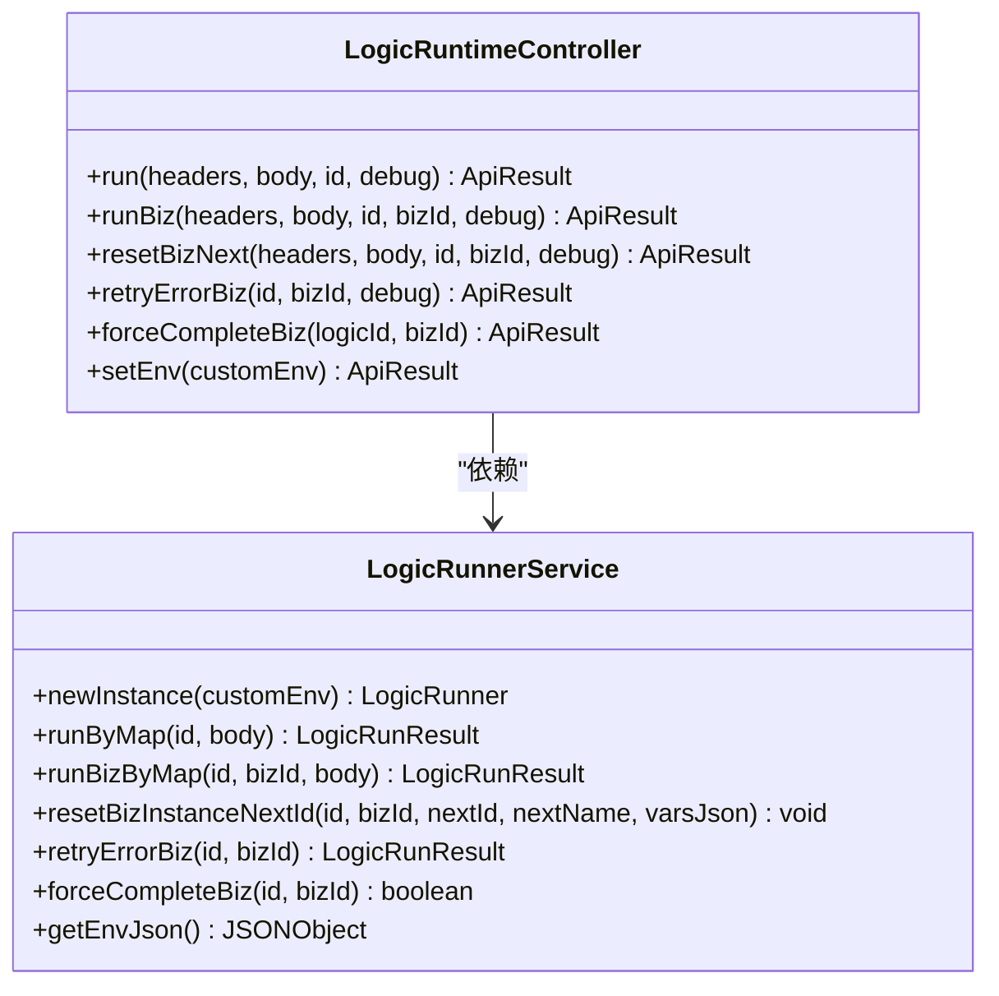
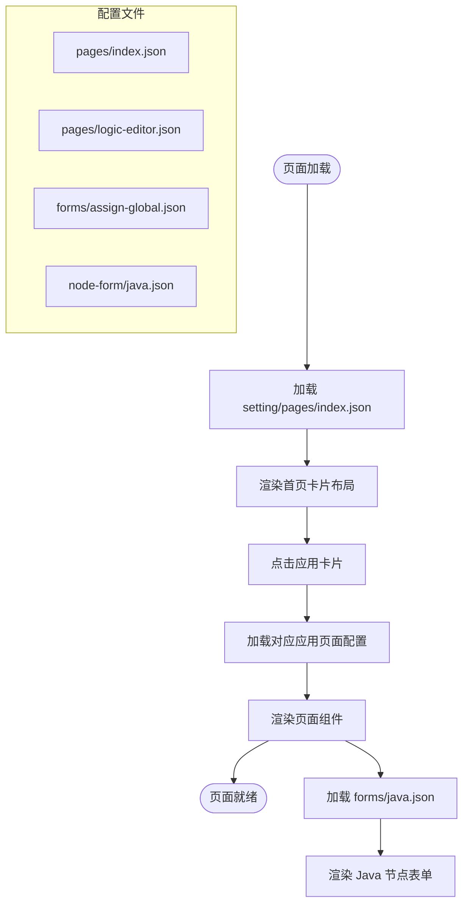
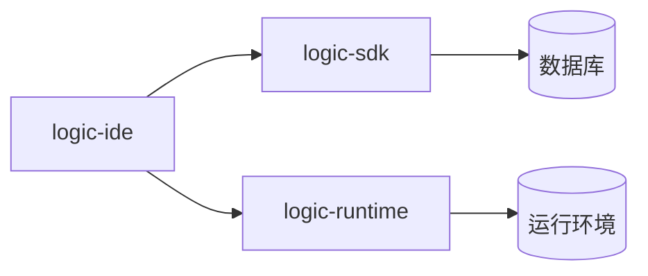

# logic-ide 模块

<cite>
**本文档中引用的文件**  
- [LogicIdeController.java](file://logic-ide/src/main/java/com/aims/logic/ide/controller/LogicIdeController.java)
- [LogicRuntimeController.java](file://logic-ide/src/main/java/com/aims/logic/ide/controller/LogicRuntimeController.java)
- [LogicIdeConfig.java](file://logic-ide/src/main/java/com/aims/logic/ide/configuration/LogicIdeConfig.java)
- [LogicMvcConfigurer.java](file://logic-ide/src/main/java/com/aims/logic/ide/configuration/LogicMvcConfigurer.java)
- [assign-global.json](file://logic-ide/src/main/resources/public/setting/forms/assign-global.json)
- [java.json](file://logic-ide/src/main/resources/public/setting/forms/java.json)
- [node-form/java.json](file://logic-ide/src/main/resources/public/setting/node-form/java.json)
- [logic-editor.json](file://logic-ide/src/main/resources/public/setting/pages/logic-editor.json)
- [index.json](file://logic-ide/src/main/resources/public/setting/pages/index.json)
- [env.dev.json](file://logic-sdk/logic-configs/envs/env.dev.json)
</cite>

## 目录
1. [简介](#简介)
2. [项目结构](#项目结构)
3. [核心组件](#核心组件)
4. [架构概览](#架构概览)
5. [详细组件分析](#详细组件分析)
6. [依赖分析](#依赖分析)
7. [性能考虑](#性能考虑)
8. [故障排除指南](#故障排除指南)
9. [结论](#结论)

## 简介
`logic-ide` 模块是一个基于 Web 的集成开发环境（IDE），专为逻辑编排服务设计。它通过前后端分离架构，提供项目管理、逻辑增删改查、节点配置、表单定义、页面布局等核心功能。前端通过低代码配置化方式实现界面渲染，后端通过 `LogicIdeController` 和 `LogicRuntimeController` 提供 REST API 与运行时代理服务。本文档系统性解析其前后端交互架构、配置机制与扩展路径，为二次开发者提供定制化指导。

## 项目结构
`logic-ide` 模块采用标准的 Spring Boot 项目结构，主要包含 Java 控制器、配置类与前端静态资源。前端资源集中于 `resources/public` 目录，通过 UMD 模块、CSS 和 JS Chunk 实现按需加载。配置文件通过 `setting` 目录下的 JSON 文件定义 UI 结构，实现低代码化界面配置。



**图示来源**  
- [LogicIdeController.java](file://logic-ide/src/main/java/com/aims/logic/ide/controller/LogicIdeController.java)
- [LogicRuntimeController.java](file://logic-ide/src/main/java/com/aims/logic/ide/controller/LogicRuntimeController.java)
- [LogicIdeConfig.java](file://logic-ide/src/main/java/com/aims/logic/ide/configuration/LogicIdeConfig.java)
- [LogicMvcConfigurer.java](file://logic-ide/src/main/java/com/aims/logic/ide/configuration/LogicMvcConfigurer.java)
- [setting/](file://logic-ide/src/main/resources/public/setting/)

**本节来源**  
- [logic-ide/src/main/java/com/aims/logic/ide](file://logic-ide/src/main/java/com/aims/logic/ide)
- [logic-ide/src/main/resources/public](file://logic-ide/src/main/resources/public)

## 核心组件
`logic-ide` 的核心功能由 `LogicIdeController` 和 `LogicRuntimeController` 两大控制器支撑。前者负责项目管理与逻辑配置的增删改查，后者作为运行时代理，转发执行请求并与 `logic-runtime` 模块通信。前端通过 `setting` 目录下的 JSON 配置文件定义表单、节点属性和页面布局，实现界面的低代码配置化。

**本节来源**  
- [LogicIdeController.java](file://logic-ide/src/main/java/com/aims/logic/ide/controller/LogicIdeController.java#L37-L390)
- [LogicRuntimeController.java](file://logic-ide/src/main/java/com/aims/logic/ide/controller/LogicRuntimeController.java#L17-L209)

## 架构概览
系统采用前后端分离架构，前端通过 `/logic` 路由访问静态资源，后端通过 `LogicMvcConfigurer` 配置资源映射。用户在 Web IDE 中操作逻辑项目时，请求由 `LogicIdeController` 处理；当需要执行逻辑时，请求被 `LogicRuntimeController` 代理至 `logic-runtime` 模块。配置项通过 `LogicIdeConfig` 注入，影响 IDE 行为与远程运行时列表。



**图示来源**  
- [LogicIdeController.java](file://logic-ide/src/main/java/com/aims/logic/ide/controller/LogicIdeController.java)
- [LogicRuntimeController.java](file://logic-ide/src/main/java/com/aims/logic/ide/controller/LogicRuntimeController.java)
- [LogicMvcConfigurer.java](file://logic-ide/src/main/java/com/aims/logic/ide/configuration/LogicMvcConfigurer.java)

## 详细组件分析

### LogicIdeController 分析
`LogicIdeController` 是 Web IDE 的核心控制器，提供逻辑项目的增删改查、配置获取、类方法扫描等 REST 接口。它通过 `LogicService` 操作数据库，支持分页查询、版本回溯、调试执行等功能。



**图示来源**  
- [LogicIdeController.java](file://logic-ide/src/main/java/com/aims/logic/ide/controller/LogicIdeController.java#L37-L390)
- [LogicService.java](file://logic-sdk/src/main/java/com/aims/logic/sdk/service/LogicService.java)

**本节来源**  
- [LogicIdeController.java](file://logic-ide/src/main/java/com/aims/logic/ide/controller/LogicIdeController.java#L37-L390)

### LogicRuntimeController 分析
`LogicRuntimeController` 作为运行时代理，负责将执行请求转发至 `logic-runtime` 模块。它通过 `LogicRunnerService` 实例化运行器并执行逻辑，支持调试模式、业务实例重试、环境变量设置等高级功能。



**图示来源**  
- [LogicRuntimeController.java](file://logic-ide/src/main/java/com/aims/logic/ide/controller/LogicRuntimeController.java#L17-L209)
- [LogicRunnerService.java](file://logic-runtime/src/main/java/com/aims/logic/runtime/service/LogicRunnerService.java)

**本节来源**  
- [LogicRuntimeController.java](file://logic-ide/src/main/java/com/aims/logic/ide/controller/LogicRuntimeController.java#L17-L209)

### 配置化界面分析
前端通过 `resources/public/setting` 目录下的 JSON 文件定义 UI 结构，实现低代码配置化。`forms` 定义节点配置表单，`node-form` 定义节点属性面板，`pages` 定义页面布局。

#### 表单配置示例（assign-global.json）
```json
{
  "type": "page",
  "body": [
    {
      "type": "form",
      "title": "节点配置",
      "body": [
        { "type": "input-text", "label": "名称", "name": "name" },
        { "type": "input-text", "label": "变量名", "name": "url" },
        { "type": "editor", "label": "值", "name": "body", "language": "javascript" }
      ]
    }
  ]
}
```

#### 节点属性配置示例（node-form/java.json）
```json
{
  "type": "object",
  "properties": {
    "name": { "title": "名称", "type": "string" },
    "url": { "title": "完整类路径", "type": "string" },
    "method": { "title": "方法名", "type": "string" },
    "body": { "title": "参数", "type": "string", "widget": "js" }
  }
}
```

#### 页面布局示例（logic-editor.json）
```json
{ "type": "page", "body": [ { "type": "logic-editor" } ] }
```



**图示来源**  
- [assign-global.json](file://logic-ide/src/main/resources/public/setting/forms/assign-global.json)
- [java.json](file://logic-ide/src/main/resources/public/setting/forms/java.json)
- [node-form/java.json](file://logic-ide/src/main/resources/public/setting/node-form/java.json)
- [logic-editor.json](file://logic-ide/src/main/resources/public/setting/pages/logic-editor.json)
- [index.json](file://logic-ide/src/main/resources/public/setting/pages/index.json)

**本节来源**  
- [logic-ide/src/main/resources/public/setting/forms](file://logic-ide/src/main/resources/public/setting/forms)
- [logic-ide/src/main/resources/public/setting/node-form](file://logic-ide/src/main/resources/public/setting/node-form)
- [logic-ide/src/main/resources/public/setting/pages](file://logic-ide/src/main/resources/public/setting/pages)

### 前端资源加载与路由
前端资源通过 `LogicMvcConfigurer` 映射至 `/logic/**` 路径，静态资源从 `classpath:/public/` 加载。JS Chunk 和 CSS 文件按需异步加载，UMD 模块提供 React 运行时支持。


**图示来源**  
- [LogicMvcConfigurer.java](file://logic-ide/src/main/java/com/aims/logic/ide/configuration/LogicMvcConfigurer.java)
- [public/](file://logic-ide/src/main/resources/public/)

**本节来源**  
- [LogicMvcConfigurer.java](file://logic-ide/src/main/java/com/aims/logic/ide/configuration/LogicMvcConfigurer.java)

### 服务端配置分析
`LogicIdeConfig` 通过 `@ConfigurationProperties(prefix = "logic")` 注入配置项，定义逻辑项分组与远程运行时列表，影响 IDE 的功能展示与运行时连接。

```java
@Getter
@Component
@ConfigurationProperties(prefix = "logic")
public class LogicIdeConfig {
    private List<LogicItemGroupDto> logicItemGroups = Collections.emptyList();
    private List<RemoteRuntimeDto> remoteRuntimes = Collections.emptyList();
}
```

**本节来源**  
- [LogicIdeConfig.java](file://logic-ide/src/main/java/com/aims/logic/ide/configuration/LogicIdeConfig.java)

## 依赖分析
`logic-ide` 模块依赖 `logic-sdk` 提供数据访问与逻辑服务，依赖 `logic-runtime` 提供运行时执行能力。前端通过 JSON 配置文件与后端解耦，实现低代码化开发。



**图示来源**  
- [pom.xml](file://logic-ide/pom.xml)
- [LogicIdeController.java](file://logic-ide/src/main/java/com/aims/logic/ide/controller/LogicIdeController.java)
- [LogicRuntimeController.java](file://logic-ide/src/main/java/com/aims/logic/ide/controller/LogicRuntimeController.java)

**本节来源**  
- [logic-ide/pom.xml](file://logic-ide/pom.xml)

## 性能考虑
- 前端资源采用异步 Chunk 加载，减少首屏加载时间。
- 逻辑配置缓存在 `logic-runtime` 中，避免重复读取文件。
- 运行时环境变量支持内存修改，无需重启生效。
- 支持业务实例的重试与强制完成，提升容错能力。

## 故障排除指南
- 若页面无法加载，检查 `/logic/**` 路由映射与静态资源路径。
- 若逻辑执行失败，查看 `logic-runtime` 日志与 `LogicLog` 表。
- 若配置不生效，确认 `LogicIdeConfig` 的 `prefix` 与 `application.yaml` 中的配置项匹配。
- 若节点属性不显示，检查 `node-form/*.json` 文件格式与字段映射。

**本节来源**  
- [LogicIdeController.java](file://logic-ide/src/main/java/com/aims/logic/ide/controller/LogicIdeController.java)
- [LogicRuntimeController.java](file://logic-ide/src/main/java/com/aims/logic/ide/controller/LogicRuntimeController.java)
- [LogicIdeConfig.java](file://logic-ide/src/main/java/com/aims/logic/ide/configuration/LogicIdeConfig.java)

## 结论
`logic-ide` 模块通过前后端分离与低代码配置化设计，实现了灵活可扩展的 Web IDE 服务。`LogicIdeController` 与 `LogicRuntimeController` 分别承担管理与执行职责，`setting` 目录下的 JSON 文件定义了完整的 UI 配置体系。二次开发者可通过修改配置文件或扩展控制器实现界面定制与功能增强。