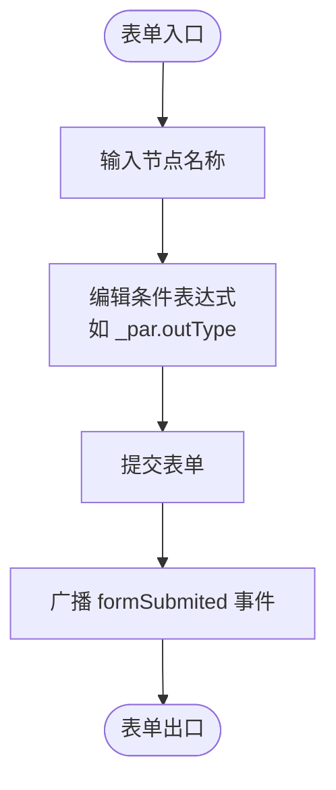
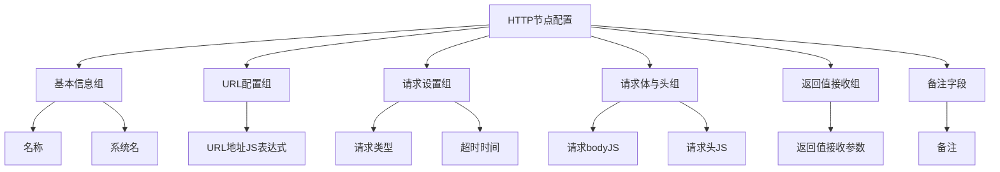
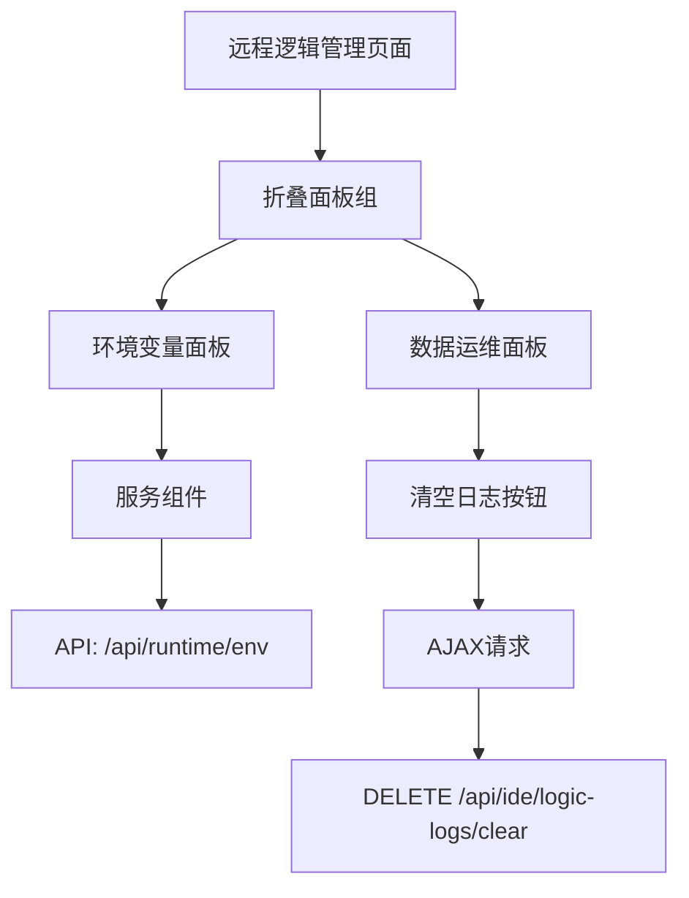
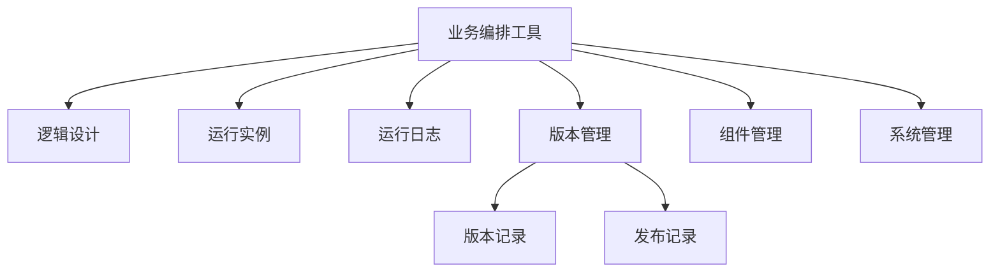

# 前端配置结构

<cite>
**本文档引用文件**  
- [if.json](file://logic-ide/src/main/resources/public/setting/forms/if.json)
- [switch.json](file://logic-ide/src/main/resources/public/setting/forms/switch.json)
- [http.json](file://logic-ide/src/main/resources/public/setting/forms/http.json)
- [java.json](file://logic-ide/src/main/resources/public/setting/node-form/java.json)
- [sub-logic.json](file://logic-ide/src/main/resources/public/setting/node-form/sub-logic.json)
- [logic-editor.json](file://logic-ide/src/main/resources/public/setting/pages/logic-editor.json)
- [remote-logic-manager.json](file://logic-ide/src/main/resources/public/setting/pages/remote-logic-manager.json)
- [index.json](file://logic-ide/src/main/resources/public/setting/apps/index.json)
- [xuanwu-factory.json](file://logic-ide/src/main/resources/public/setting/apps/xuanwu-factory.json)
</cite>

## 目录

1. [引言](#引言)
2. [表单配置机制](#表单配置机制)
3. [节点属性面板结构](#节点属性面板结构)
4. [页面布局与路由配置](#页面布局与路由配置)
5. [应用入口配置](#应用入口配置)
6. [低代码UI构建机制](#低代码ui构建机制)
7. [配置规范与字段说明](#配置规范与字段说明)
8. [自定义配置实践示例](#自定义配置实践示例)
9. [总结](#总结)

## 引言

本系统通过JSON配置文件驱动前端界面的动态渲染，实现低代码化UI构建。配置文件集中存放于`resources/public/setting`目录下，按功能划分为`forms`、`node-form`、`pages`和`apps`四个子目录，分别负责节点参数输入界面、节点属性面板、页面布局与路由、应用入口的定义。这些配置共同构成了可视化逻辑编排工具的核心前端结构。

## 表单配置机制

`forms`目录中的JSON文件定义了各类节点的参数输入界面，采用Amis框架的表单DSL语法，支持动态表达式输入、多字段分组、事件监听等功能。

### 条件分支节点配置（if.json）

该配置定义了条件判断节点的参数输入表单，包含名称输入框和条件表达式编辑器，支持JavaScript表达式输入。



**图示来源**  
- [if.json](file://logic-ide/src/main/resources/public/setting/forms/if.json)

### 多路分支节点配置（switch.json）

在基础条件表达式基础上，增加了事务组编号和备注字段，支持更复杂的业务场景配置。

**节来源**  
- [switch.json](file://logic-ide/src/main/resources/public/setting/forms/switch.json)

### HTTP请求节点配置（http.json）

采用分组布局，将参数划分为基本信息、URL配置、请求设置、请求体与头、返回值接收等逻辑区域，提升复杂表单的可操作性。



**图示来源**  
- [http.json](file://logic-ide/src/main/resources/public/setting/forms/http.json)

## 节点属性面板结构

`node-form`目录定义了各节点类型在编辑器中的属性面板结构，采用JSON Schema格式描述表单字段。

### Java调用节点（java.json）

定义了调用Java类方法所需的完整配置，包括类路径、方法名、参数等，所有输入均支持JavaScript表达式动态计算。

```json
{
  "type": "object",
  "properties": {
    "name": { "title": "名称", "type": "string" },
    "system": { "title": "系统名", "type": "string" },
    "url": { "title": "完整类路径", "type": "string", "extra": "js代码块，需return字符串" },
    "method": { "title": "方法名", "type": "string", "extra": "js代码块，需return字符串" },
    "body": { "title": "参数", "type": "string", "widget": "js", "extra": "js代码块，需return参数数组" }
  }
}
```

**节来源**  
- [java.json](file://logic-ide/src/main/resources/public/setting/node-form/java.json)

### 子逻辑调用节点（sub-logic.json）

专用于调用子流程，包含子逻辑编号、入参声明和返回值接收参数，支持复杂的数据传递逻辑。

```json
{
  "type": "object",
  "properties": {
    "name": { "title": "名称", "type": "string" },
    "url": { "title": "调用的逻辑编号", "type": "string" },
    "body": { "title": "入参声明", "type": "string", "widget": "js", "extra": "返回子流程的入参对象" },
    "returnAccept": { "title": "返回值赋值给哪个参数？", "type": "string", "widget": "js", "extra": "输入局部变量的完整引用" }
  }
}
```

**节来源**  
- [sub-logic.json](file://logic-ide/src/main/resources/public/setting/node-form/sub-logic.json)

## 页面布局与路由配置

`pages`目录中的配置文件定义了前端页面的布局结构和组件组合。

### 逻辑编辑器页面（logic-editor.json）

最简化的页面配置，仅包含一个`logic-editor`组件，负责渲染可视化逻辑编排画布。

```json
{
  "type": "page",
  "body": [
    {
      "type": "logic-editor"
    }
  ]
}
```

**节来源**  
- [logic-editor.json](file://logic-ide/src/main/resources/public/setting/pages/logic-editor.json)

### 远程逻辑管理页面（remote-logic-manager.json）

采用折叠面板布局，包含环境变量查看和数据运维功能，支持API数据绑定和按钮操作事件。



**图示来源**  
- [remote-logic-manager.json](file://logic-ide/src/main/resources/public/setting/pages/remote-logic-manager.json)

## 应用入口配置

`apps`目录定义了应用的入口和导航结构。

### 应用列表（index.json）

定义了系统中可用的应用列表，包括业务编排和远程业务编排。

```json
{
  "apps": [
    {
      "id": "xuanwu-factory",
      "title": "业务编排",
      "url": "/app/xuanwu-factory"
    },
    {
      "id": "remtote-list",
      "title": "远程业务编排",
      "url": "/remote-list"
    }
  ]
}
```

**节来源**  
- [index.json](file://logic-ide/src/main/resources/public/setting/apps/index.json)

### 业务编排导航（xuanwu-factory.json）

定义了"业务编排"应用的完整菜单结构，包含逻辑设计、运行实例、运行日志、版本管理等一级菜单，以及版本记录、发布记录等二级菜单。



**节来源**  
- [xuanwu-factory.json](file://logic-ide/src/main/resources/public/setting/apps/xuanwu-factory.json)

## 低代码UI构建机制

系统通过分层配置实现了低代码化UI构建：

1. **表单层**：`forms`目录提供通用表单配置，用于节点参数输入
2. **节点层**：`node-form`目录提供节点专属属性面板，支持复杂数据结构
3. **页面层**：`pages`目录组合组件形成完整页面
4. **应用层**：`apps`目录组织页面形成完整应用

这种分层架构支持动态扩展新节点类型与表单，只需在对应目录添加JSON配置文件即可。

## 配置规范与字段说明

### 通用配置规范

| 字段 | 类型 | 说明 |
|------|------|------|
| type | string | 组件类型标识 |
| title | string | 显示标题 |
| name | string | 字段名称，对应数据模型 |
| id | string | 唯一标识符 |
| description | string | 字段描述 |
| widget | string | 控件类型（textArea, js等） |

### 特殊字段说明

- **widget**: 指定特殊控件类型，如`js`表示JavaScript代码编辑器
- **extra**: 控件下方的提示信息
- **props**: 控件属性配置，如高度、行数等
- **onEvent**: 事件监听配置，支持submitSucc等事件
- **column**: 表单列数布局

## 自定义配置实践示例

### 新增自定义节点配置

1. 在`node-form`目录创建`custom-node.json`
2. 定义节点属性Schema
3. 在`forms`目录创建对应的表单配置
4. 在`pages`中引用新节点类型

### 扩展应用菜单

1. 修改`apps/xuanwu-factory.json`
2. 添加新的菜单项到`menus`数组
3. 指向已有的或新建的页面配置

## 总结

本系统的前端配置结构通过JSON文件实现了完全声明式的UI构建，具有高度的灵活性和可扩展性。`forms`、`node-form`、`pages`、`apps`四个层级的配置相互协作，共同支撑了可视化逻辑编排工具的完整功能体系。通过遵循统一的配置规范，开发人员可以快速实现新节点类型和页面的扩展，体现了低代码开发的核心价值。