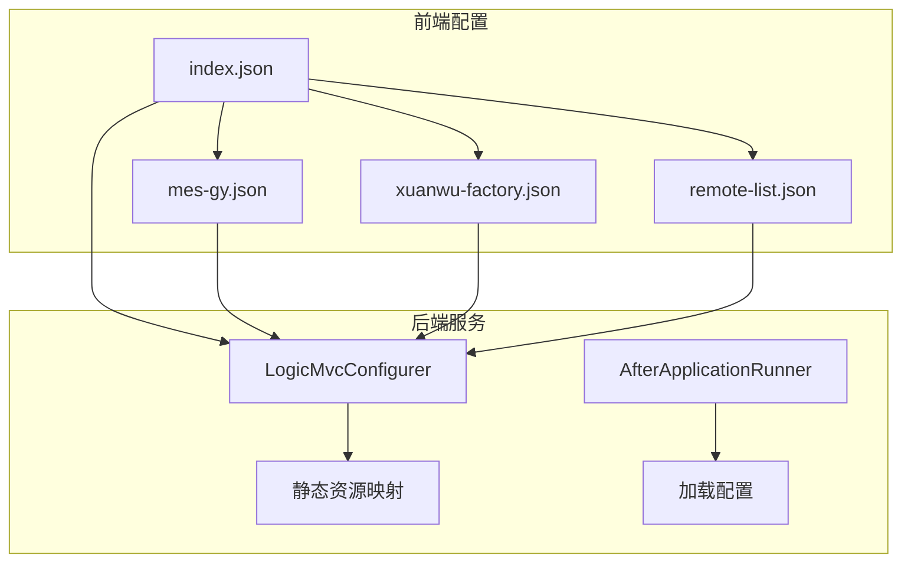
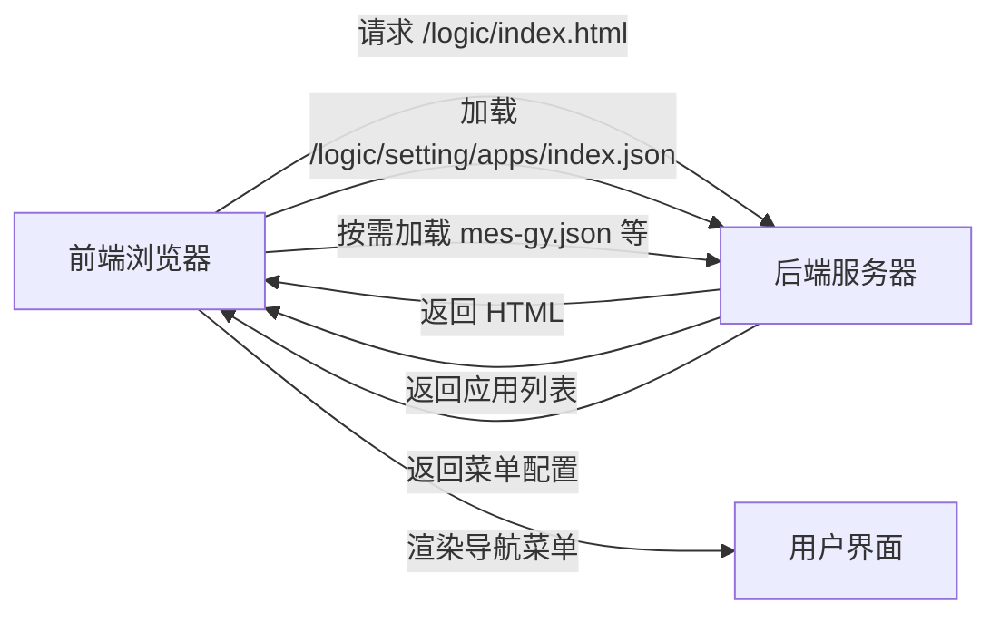
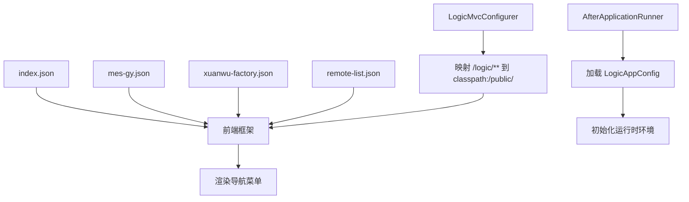

# 应用入口配置

<cite>
**本文档中引用的文件**  
- [index.json](file://logic-ide/src/main/resources/public/setting/apps/index.json)
- [mes-gy.json](file://logic-ide/src/main/resources/public/setting/apps/mes-gy.json)
- [xuanwu-factory.json](file://logic-ide/src/main/resources/public/setting/apps/xuanwu-factory.json)
- [remote-list.json](file://logic-ide/src/main/resources/public/setting/apps/remote-list.json)
- [LogicAppConfig.java](file://logic-runtime/src/main/java/com/aims/logic/runtime/env/LogicAppConfig.java)
- [AfterApplicationRunner.java](file://logic-ide/src/main/java/com/aims/logic/ide/configuration/AfterApplicationRunner.java)
- [LogicMvcConfigurer.java](file://logic-ide/src/main/java/com/aims/logic/ide/configuration/LogicMvcConfigurer.java)
</cite>

## 目录

1. [简介](#简介)
2. [项目结构](#项目结构)
3. [核心组件](#核心组件)
4. [架构概述](#架构概述)
5. [详细组件分析](#详细组件分析)
6. [依赖分析](#依赖分析)
7. [性能考虑](#性能考虑)
8. [故障排除指南](#故障排除指南)
9. [结论](#结论)

## 简介

本项目为一个基于微服务架构的业务逻辑编排系统，支持多租户、多环境的应用配置与运行。前端通过静态 JSON 配置文件定义应用入口与导航菜单，后端通过 Spring Boot 框架加载配置并提供服务。核心功能包括逻辑设计、运行实例管理、日志查看、版本控制等。本文档重点解析 `apps` 目录下的应用入口配置机制，阐述其设计原理与运行时行为。

## 项目结构

`apps` 目录位于前端资源路径下，用于存放应用入口配置文件。这些 JSON 文件定义了系统中各个独立应用的元信息，包括名称、图标、路由前缀、权限标识等。前端在初始化时加载这些配置，动态生成导航菜单，实现多应用、多环境的灵活切换。



**图示来源**  
- [index.json](file://logic-ide/src/main/resources/public/setting/apps/index.json)
- [LogicMvcConfigurer.java](file://logic-ide/src/main/java/com/aims/logic/ide/configuration/LogicMvcConfigurer.java)

**本节来源**  
- [index.json](file://logic-ide/src/main/resources/public/setting/apps/index.json)
- [LogicMvcConfigurer.java](file://logic-ide/src/main/java/com/aims/logic/ide/configuration/LogicMvcConfigurer.java)

## 核心组件

`apps` 目录下的 JSON 配置文件是系统应用导航的核心元数据。`index.json` 作为主入口文件，定义了系统默认加载的应用列表；其他如 `mes-gy.json`、`xuanwu-factory.json` 等则分别对应特定业务场景下的独立应用实例。这些配置通过前端框架解析，生成对应的路由与菜单结构，实现模块化、可插拔的应用架构。

**本节来源**  
- [index.json](file://logic-ide/src/main/resources/public/setting/apps/index.json)
- [mes-gy.json](file://logic-ide/src/main/resources/public/setting/apps/mes-gy.json)
- [xuanwu-factory.json](file://logic-ide/src/main/resources/public/setting/apps/xuanwu-factory.json)

## 架构概述

系统采用前后端分离架构，前端通过静态 JSON 文件定义应用入口，后端通过 Spring Boot 提供静态资源服务与配置加载。前端在启动时请求 `index.json` 获取应用列表，随后按需加载各应用的详细配置（如 `menus` 结构），动态渲染导航菜单。后端通过 `LogicMvcConfigurer` 将 `/logic/**` 路径映射到 `classpath:/public/`，确保前端资源可被正确访问。



**图示来源**  
- [index.json](file://logic-ide/src/main/resources/public/setting/apps/index.json)
- [LogicMvcConfigurer.java](file://logic-ide/src/main/java/com/aims/logic/ide/configuration/LogicMvcConfigurer.java)

## 详细组件分析

### index.json 分析

`index.json` 是系统主应用的入口配置文件，定义了默认加载的应用列表。其结构包含 `apps` 数组，每个应用对象包含 `id`、`title` 和 `url` 字段，用于标识应用、显示名称和路由前缀。

```json
{
    "apps": [
        {
            "id": "xuanwu-factory",
            "title": "业务编排",
            "url": "/app/xuanwu-factory"
        },
        {
            "id": "remtote-list",
            "title": "远程业务编排",
            "url": "/remote-list"
        }
    ]
}
```

前端通过解析此文件，确定初始可访问的应用集合，并根据 `url` 字段进行路由跳转。

**本节来源**  
- [index.json](file://logic-ide/src/main/resources/public/setting/apps/index.json)

### 业务应用配置分析

#### mes-gy.json（工艺编排）

`mes-gy.json` 定义了“工艺编排”应用的菜单结构，包含“工艺逻辑编排”、“版本管理”等一级菜单，其中“版本管理”下嵌套“版本记录”和“发布记录”子菜单。该配置通过 `menus` 字段定义完整的导航树。

```json
{
    "id": "mes-gy",
    "title": "工艺编排",
    "menus": [
        {
            "key": "process-logic-api",
            "label": "工艺逻辑编排"
        },
        {
            "key": "versions",
            "label": "版本管理",
            "children": [
                {
                    "key": "logic-bak",
                    "label": "版本记录"
                },
                {
                    "key": "logic-pub-record",
                    "label": "发布记录"
                }
            ]
        }
    ]
}
```

**图示来源**  
- [mes-gy.json](file://logic-ide/src/main/resources/public/setting/apps/mes-gy.json)

#### xuanwu-factory.json（业务编排工具）

`xuanwu-factory.json` 是“业务编排工具”的完整配置，包含“逻辑设计”、“运行实例”、“运行日志”、“版本管理”、“组件管理”和“系统管理”六大模块，结构更为复杂，体现了主应用的完整功能视图。

```json
{
    "id": "xuanwu-factory",
    "title": "业务编排工具",
    "menus": [
        {
            "key": "logic-api",
            "label": "逻辑设计"
        },
        {
            "key": "logic-instance",
            "label": "运行实例"
        },
        {
            "key": "logic-logs",
            "label": "运行日志"
        },
        {
            "key": "versions",
            "label": "版本管理",
            "children": [
                {
                    "key": "logic-bak",
                    "label": "版本记录"
                },
                {
                    "key": "logic-pub-record",
                    "label": "发布记录"
                }
            ]
        },
        {
            "key": "component-manager",
            "label": "组件管理"
        },
        {
            "key": "logic-manager",
            "label": "系统管理"
        }
    ]
}
```

**图示来源**  
- [xuanwu-factory.json](file://logic-ide/src/main/resources/public/setting/apps/xuanwu-factory.json)

### 配置字段解析

以下为配置文件中关键字段的含义及其运行时解析逻辑：

| 字段名 | 含义 | 运行时解析逻辑 |
|--------|------|----------------|
| `id` | 应用唯一标识符 | 用于匹配配置文件名，加载对应 JSON 文件 |
| `title` | 应用显示名称 | 在导航菜单或页面标题中展示 |
| `url` | 应用路由前缀 | 前端路由跳转的目标路径 |
| `menus` | 菜单结构数组 | 前端递归渲染为导航树，`key` 对应页面路由，`label` 为显示文本，`children` 为子菜单 |
| `env` | 环境标识（未显式定义） | 通过 `LogicAppConfig` 和 `RuntimeUtil` 从 `envs/index.json` 加载当前环境 |
| `modules` | 模块集合（隐式） | 由 `menus` 结构推导，每个 `key` 对应一个功能模块 |

**本节来源**  
- [mes-gy.json](file://logic-ide/src/main/resources/public/setting/apps/mes-gy.json)
- [xuanwu-factory.json](file://logic-ide/src/main/resources/public/setting/apps/xuanwu-factory.json)
- [LogicAppConfig.java](file://logic-runtime/src/main/java/com/aims/logic/runtime/env/LogicAppConfig.java)
- [RuntimeUtil.java](file://logic-runtime/src/main/java/com/aims/logic/runtime/util/RuntimeUtil.java)

## 依赖分析

应用入口配置依赖于前后端的协同工作。前端依赖 `index.json` 和各应用配置文件生成 UI；后端依赖 `LogicMvcConfigurer` 提供静态资源服务，并通过 `AfterApplicationRunner` 在启动时加载系统配置。



**图示来源**  
- [index.json](file://logic-ide/src/main/resources/public/setting/apps/index.json)
- [LogicMvcConfigurer.java](file://logic-ide/src/main/java/com/aims/logic/ide/configuration/LogicMvcConfigurer.java)
- [AfterApplicationRunner.java](file://logic-ide/src/main/java/com/aims/logic/ide/configuration/AfterApplicationRunner.java)

**本节来源**  
- [index.json](file://logic-ide/src/main/resources/public/setting/apps/index.json)
- [LogicMvcConfigurer.java](file://logic-ide/src/main/java/com/aims/logic/ide/configuration/LogicMvcConfigurer.java)
- [AfterApplicationRunner.java](file://logic-ide/src/main/java/com/aims/logic/ide/configuration/AfterApplicationRunner.java)

## 性能考虑

- **配置加载时机**：应用配置在前端初始化时一次性加载，减少后续请求开销。
- **静态资源缓存**：JSON 配置文件作为静态资源，可通过 CDN 缓存，提升访问速度。
- **按需加载**：大型应用可拆分配置，实现菜单的懒加载，优化首屏性能。

## 故障排除指南

- **菜单不显示**：检查 `index.json` 中 `id` 是否与配置文件名一致，确认文件路径正确。
- **路由跳转失败**：验证 `url` 字段路径是否与前端路由配置匹配。
- **环境变量未生效**：检查 `envs/index.json` 中 `env` 值，并确认 `env.{env}.json` 文件存在且格式正确。

**本节来源**  
- [index.json](file://logic-ide/src/main/resources/public/setting/apps/index.json)
- [envs/index.json](file://test-suite/test-case-configs/envs/index.json)
- [RuntimeUtil.java](file://logic-runtime/src/main/java/com/aims/logic/runtime/util/RuntimeUtil.java)

## 结论

`apps` 目录下的 JSON 配置文件是系统实现多应用、多环境导航的核心机制。通过 `index.json` 统一管理应用入口，各独立 JSON 文件定义具体菜单结构，结合后端的静态资源服务与配置加载，实现了灵活、可扩展的应用架构。新增应用只需添加对应 JSON 文件并更新 `index.json`，即可完成集成，体现了高内聚、低耦合的设计理念。