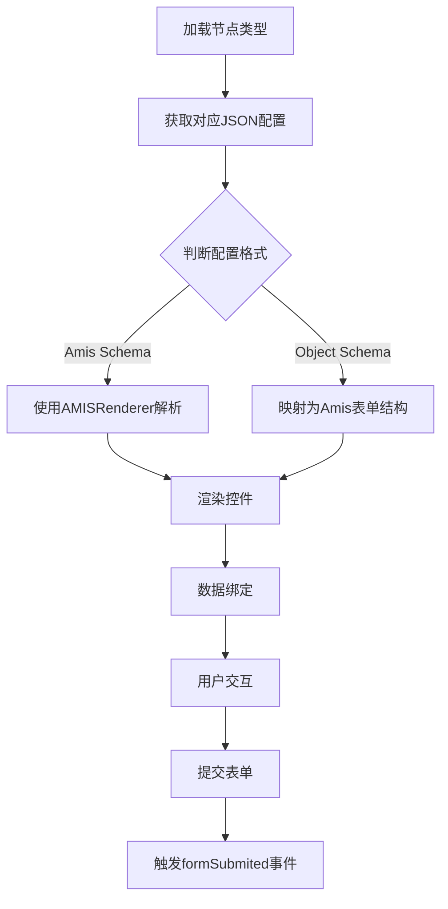

# 表单配置

<cite>
**本文档引用文件**  
- [if.json](file://logic-ide/src/main/resources/public/setting/forms/if.json)
- [switch.json](file://logic-ide/src/main/resources/public/setting/forms/switch.json)
- [http.json](file://logic-ide/src/main/resources/public/setting/node-form/http.json)
- [logic-setting.json](file://logic-ide/src/main/resources/public/setting/forms/logic-setting.json)
- [ControlRenderer](file://logic-ide/src/main/resources/public/359.async.js)
- [AMISRenderer](file://logic-ide/src/main/resources/public/1422.async.js)
- [FormQueryInput.java](file://logic-sdk/src/main/java/com/aims/logic/sdk/dto/FormQueryInput.java)
</cite>

## 目录

1. [简介](#简介)
2. [表单配置结构解析](#表单配置结构解析)
3. [核心字段说明](#核心字段说明)
4. [表单渲染机制](#表单渲染机制)
5. [典型配置文件分析](#典型配置文件分析)
6. [自定义表单配置示例](#自定义表单配置示例)
7. [结论](#结论)

## 简介

本项目中的表单配置系统用于定义逻辑节点的参数输入界面，支持多种节点类型（如条件判断、HTTP请求、流程控制等）的可视化配置。配置文件分为两类：位于 `forms` 目录下的通用节点配置，以及 `node-form` 目录下的具体节点类型配置。这些 JSON 配置文件通过前端框架解析并渲染为可视化表单，供用户在逻辑编排界面中使用。

## 表单配置结构解析

表单配置文件采用 JSON 格式，定义了表单的整体结构、字段布局、输入控件类型及交互行为。根据节点类型的不同，配置结构分为两种模式：

- **Amis 表单格式**：用于 `forms` 目录下的配置文件（如 `if.json`、`switch.json`），使用 Amis 框架的 JSON Schema 定义表单。
- **对象属性格式**：用于 `node-form` 目录下的配置文件（如 `http.json`），直接定义字段的属性、类型和控件。

所有配置均通过前端组件动态加载并渲染，实现无需编码的可视化配置能力。

**Section sources**
- [if.json](file://logic-ide/src/main/resources/public/setting/forms/if.json)
- [http.json](file://logic-ide/src/main/resources/public/setting/node-form/http.json)

## 核心字段说明

表单配置中包含多个关键字段，用于定义字段的显示、行为和验证规则。

### label
字段在界面上显示的中文标签名称，用于提示用户输入内容。

### key
对应数据模型中的字段名（通常为 `name`），用于绑定表单数据与后端逻辑。

### type
定义字段的数据类型，常见值包括：
- `string`：字符串
- `number`：数字
- `object`：对象
- `array`：数组

### props
控件的附加属性，如：
- `rows`：文本域行数
- `height`：编辑器高度
- `options`：下拉或单选框的选项列表

### widget
指定使用的 UI 控件类型，如：
- `textArea`：多行文本输入
- `js`：JavaScript 代码编辑器
- `radio`：单选框

### defaultValue
字段的默认值，在新建节点时自动填充。

### extra
字段的辅助说明文本，显示在输入控件下方，用于指导用户输入格式。

### visible
控制字段是否可见，支持动态条件显示逻辑（当前部分配置中未显式使用，但框架支持）。

**Section sources**
- [http.json](file://logic-ide/src/main/resources/public/setting/node-form/http.json)
- [switch.json](file://logic-ide/src/main/resources/public/setting/forms/switch.json)

## 表单渲染机制

前端通过 AMIS 框架解析 JSON 配置并渲染为可视化表单。核心流程如下：

1. **配置加载**：根据当前编辑的节点类型，加载对应的 JSON 配置文件。
2. **Schema 解析**：将 JSON Schema 转换为 React 组件树。
3. **控件渲染**：根据 `widget` 和 `type` 字段选择合适的输入控件。
4. **数据绑定**：将表单输入与节点数据模型（如 `name`、`condition`）双向绑定。
5. **事件处理**：提交表单时触发 `submitSucc` 事件，广播 `formSubmited` 通知其他组件更新。

前端通过 `ControlRenderer` 和 `AMISRenderer` 组件实现通用控件的封装与渲染，支持动态扩展新控件类型。



**Diagram sources**
- [AMISRenderer](file://logic-ide/src/main/resources/public/1422.async.js)
- [ControlRenderer](file://logic-ide/src/main/resources/public/359.async.js)

**Section sources**
- [AMISRenderer](file://logic-ide/src/main/resources/public/1422.async.js)
- [ControlRenderer](file://logic-ide/src/main/resources/public/359.async.js)

## 典型配置文件分析

### if.json 分析

该文件定义了条件判断节点的配置界面，包含：
- 名称输入框（`name`）
- 条件表达式编辑器（`condition`），使用 JavaScript 语法高亮，支持变量引用（如 `_par.outType`）

采用 Amis 的 `editor` 组件实现表达式输入，确保语法正确性。

### switch.json 分析

在 `if.json` 基础上扩展了事务组编号（`tranGroupId`）和备注（`memo`）字段：
- `tranGroupId` 支持变量引用，用于事务控制
- `memo` 为多行文本，便于添加注释

### http.json 分析

定义了 HTTP 节点的完整参数配置，包括：
- 请求方法（`method`）：使用单选框选择 POST/GET/PUT/DELETE
- URL、Headers、Body：均使用 JS 代码块输入，需返回相应字符串或对象
- 返回值绑定（`returnAccept`）：指定响应数据赋值的目标变量
- 超时设置（`timeout`）：数字输入，默认 5000ms

该配置展示了复杂参数的结构化定义方式，支持动态脚本输入。

**Section sources**
- [if.json](file://logic-ide/src/main/resources/public/setting/forms/if.json)
- [switch.json](file://logic-ide/src/main/resources/public/setting/forms/switch.json)
- [http.json](file://logic-ide/src/main/resources/public/setting/node-form/http.json)

## 自定义表单配置示例

以下为新增“数据库查询”节点的表单配置示例：

```json
{
  "type": "object",
  "properties": {
    "name": {
      "title": "名称",
      "type": "string",
      "widget": "textArea",
      "props": { "rows": 1 }
    },
    "dataSource": {
      "title": "数据源",
      "type": "string",
      "widget": "select",
      "props": {
        "options": [
          { "label": "主库", "value": "master" },
          { "label": "从库", "value": "slave" }
        ]
      }
    },
    "sql": {
      "title": "SQL语句",
      "type": "string",
      "widget": "js",
      "props": { "height": 150 },
      "extra": "支持JS模板字符串，如 `SELECT * FROM user WHERE id = ${_par.userId}`"
    },
    "resultVar": {
      "title": "结果赋值给",
      "type": "string",
      "defaultValue": "_var.queryResult"
    },
    "timeout": {
      "title": "超时时间(ms)",
      "type": "number",
      "defaultValue": 3000
    }
  },
  "column": 2
}
```

此配置展示了如何定义下拉框、JS 编辑器、默认值等特性，可直接用于新节点开发。

## 结论

表单配置系统通过 JSON Schema 实现了逻辑节点参数界面的灵活定义与动态渲染。核心字段如 `label`、`key`、`type`、`props`、`widget` 等共同构成了可扩展的配置体系。结合 AMIS 框架，实现了无需修改前端代码即可新增节点类型的能力。开发者可通过仿照现有配置文件，快速定义新节点的参数输入界面，提升开发效率。