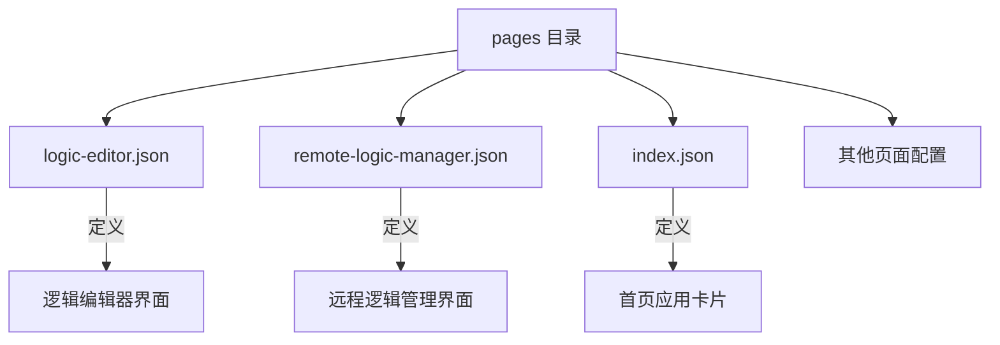
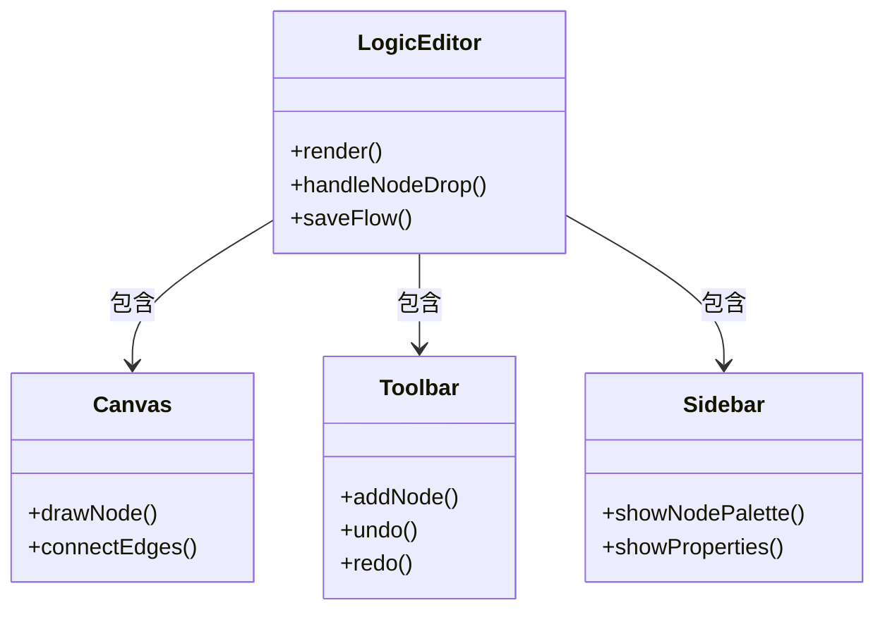
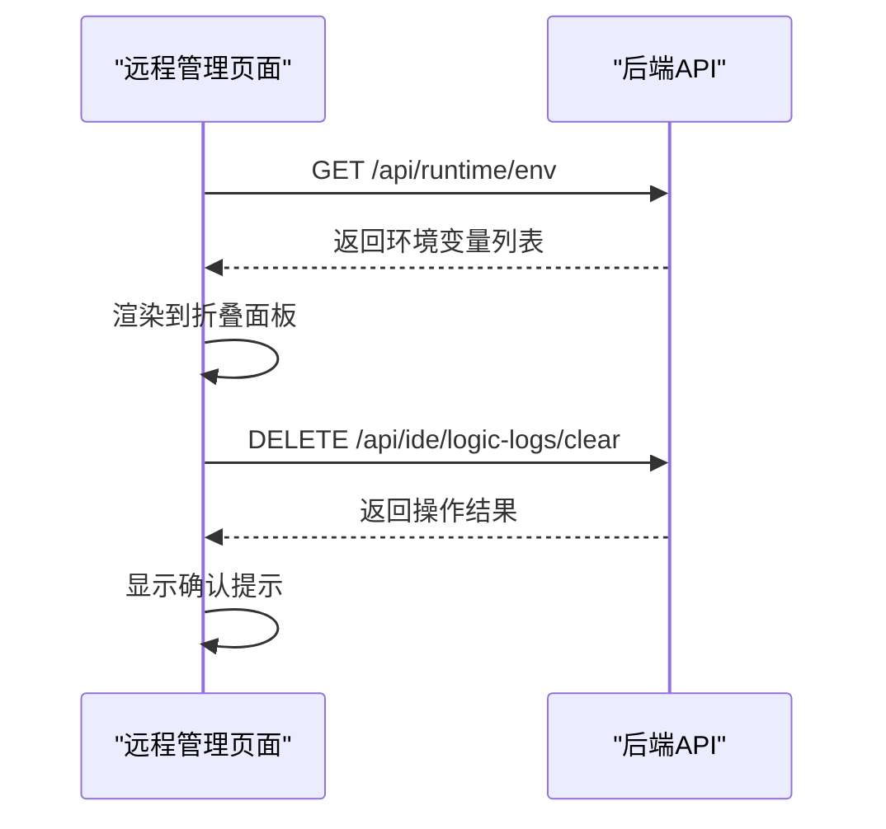
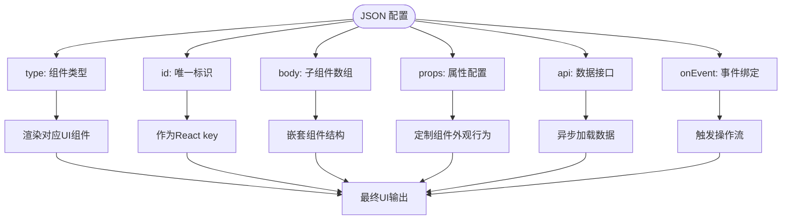
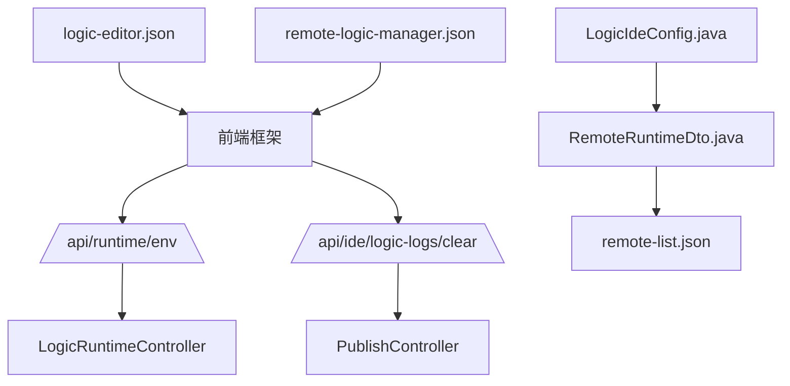

# 页面配置

<cite>
**本文档中引用的文件**  
- [logic-editor.json](file://logic-ide/src/main/resources/public/setting/pages/logic-editor.json)
- [remote-logic-manager.json](file://logic-ide/src/main/resources/public/setting/pages/remote-logic-manager.json)
- [remote-list.json](file://logic-ide/src/main/resources/public/setting/apps/remote-list.json)
- [index.json](file://logic-ide/src/main/resources/public/setting/pages/index.json)
- [LogicIdeConfig.java](file://logic-ide/src/main/java/com/aims/logic/ide/configuration/LogicIdeConfig.java)
- [RemoteRuntimeDto.java](file://logic-ide/src/main/java/com/aims/logic/ide/configuration/RemoteRuntimeDto.java)
- [LogicItemGroupDto.java](file://logic-ide/src/main/java/com/aims/logic/ide/controller/dto/LogicItemGroupDto.java)
</cite>

## 目录

1. [引言](#引言)  
2. [项目结构](#项目结构)  
3. [核心组件](#核心组件)  
4. [架构概览](#架构概览)  
5. [详细组件分析](#详细组件分析)  
6. [依赖分析](#依赖分析)  
7. [性能考虑](#性能考虑)  
8. [故障排除指南](#故障排除指南)  
9. [结论](#结论)

## 引言

本文档旨在全面解析 `pages` 目录下页面配置文件的作用机制，重点阐述 `logic-editor.json` 和 `remote-logic-manager.json` 如何驱动前端页面的布局、组件、交互与数据加载。结合 React 前端架构，说明这些 JSON 配置如何实现低代码化页面构建，并支持通过配置扩展新功能页面。同时提供标准化模板与最佳实践建议。

## 项目结构

`pages` 目录位于前端资源路径 `logic-ide/src/main/resources/public/setting/pages/` 下，存放所有页面级别的 JSON 配置文件。这些文件定义了不同功能模块的 UI 结构与行为逻辑。

**Diagram sources**  
- [logic-editor.json](file://logic-ide/src/main/resources/public/setting/pages/logic-editor.json)
- [remote-logic-manager.json](file://logic-ide/src/main/resources/public/setting/pages/remote-logic-manager.json)
- [index.json](file://logic-ide/src/main/resources/public/setting/pages/index.json)

**Section sources**  
- [logic-editor.json](file://logic-ide/src/main/resources/public/setting/pages/logic-editor.json#L1-L1)
- [remote-logic-manager.json](file://logic-ide/src/main/resources/public/setting/pages/remote-logic-manager.json#L1-L35)
- [index.json](file://logic-ide/src/main/resources/public/setting/pages/index.json#L1-L1)

## 核心组件

`logic-editor.json` 定义了逻辑编辑器主页面的结构，其核心为 `type: "logic-editor"` 的组件，负责渲染可视化流程图编辑区域。`remote-logic-manager.json` 则通过 `collapse-group` 和 `service` 组件构建系统管理界面，包含环境变量展示与日志清空操作等功能。

**Section sources**  
- [logic-editor.json](file://logic-ide/src/main/resources/public/setting/pages/logic-editor.json#L1-L1)
- [remote-logic-manager.json](file://logic-ide/src/main/resources/public/setting/pages/remote-logic-manager.json#L1-L35)

## 架构概览

系统采用前后端分离架构，前端基于 React 框架，通过 JSON 配置驱动 UI 渲染。后端提供 REST API 接口，供前端动态获取数据与执行操作。页面配置文件作为“元数据”，由前端框架解析并生成对应组件树。

**Diagram sources**  
- [logic-editor.json](file://logic-ide/src/main/resources/public/setting/pages/logic-editor.json#L1-L1)
- [remote-logic-manager.json](file://logic-ide/src/main/resources/public/setting/pages/remote-logic-manager.json#L1-L35)

## 详细组件分析

### 逻辑编辑器页面分析

`logic-editor.json` 是一个极简配置，仅包含一个 `logic-editor` 类型组件。该组件为自定义复合组件，封装了画布、节点库、连接线、工具栏等子模块，支持拖拽建模与流程设计。

**Diagram sources**  
- [logic-editor.json](file://logic-ide/src/main/resources/public/setting/pages/logic-editor.json#L1-L1)

**Section sources**  
- [logic-editor.json](file://logic-ide/src/main/resources/public/setting/pages/logic-editor.json#L1-L1)

### 远程逻辑管理页面分析

`remote-logic-manager.json` 定义了一个可折叠的管理界面，包含“环境变量”和“数据运维”两个面板。其中“环境变量”通过 `service` 组件从 `/api/runtime/env` 接口加载数据，而“数据运维”提供了清空日志的按钮，绑定 DELETE 请求至 `/api/ide/logic-logs/clear`。

**Diagram sources**  
- [remote-logic-manager.json](file://logic-ide/src/main/resources/public/setting/pages/remote-logic-manager.json#L1-L35)

**Section sources**  
- [remote-logic-manager.json](file://logic-ide/src/main/resources/public/setting/pages/remote-logic-manager.json#L1-L35)

### 配置字段机制分析

页面配置中的关键字段作用如下：

**Diagram sources**  
- [remote-logic-manager.json](file://logic-ide/src/main/resources/public/setting/pages/remote-logic-manager.json#L1-L35)

## 依赖分析

前端页面配置依赖于后端提供的 API 接口与配置类。`LogicIdeConfig.java` 提供了逻辑项分组与远程运行时列表的 Java 配置，而 `RemoteRuntimeDto.java` 定义了远程运行实例的元数据结构。

**Diagram sources**  
- [remote-logic-manager.json](file://logic-ide/src/main/resources/public/setting/pages/remote-logic-manager.json#L1-L35)
- [remote-list.json](file://logic-ide/src/main/resources/public/setting/apps/remote-list.json#L1-L35)
- [LogicIdeConfig.java](file://logic-ide/src/main/java/com/aims/logic/ide/configuration/LogicIdeConfig.java#L1-L24)
- [RemoteRuntimeDto.java](file://logic-ide/src/main/java/com/aims/logic/ide/configuration/RemoteRuntimeDto.java#L1-L9)

**Section sources**  
- [LogicIdeConfig.java](file://logic-ide/src/main/java/com/aims/logic/ide/configuration/LogicIdeConfig.java#L1-L24)
- [RemoteRuntimeDto.java](file://logic-ide/src/main/java/com/aims/logic/ide/configuration/RemoteRuntimeDto.java#L1-L9)
- [remote-list.json](file://logic-ide/src/main/resources/public/setting/apps/remote-list.json#L1-L35)

## 性能考虑

由于页面结构由 JSON 配置驱动，建议对复杂页面进行分块加载，避免单个配置文件过大影响解析性能。同时，API 请求应合理使用缓存策略，减少重复请求开销。

## 故障排除指南

- **页面未渲染**：检查 JSON 语法是否正确，`type` 字段是否匹配已注册组件。
- **数据未加载**：确认 `api` 接口路径是否正确，后端服务是否正常运行。
- **按钮无响应**：检查 `onEvent` 中的 `actionType` 与参数是否正确。
- **配置不生效**：确保文件已部署至正确路径，前端已刷新缓存。

**Section sources**  
- [logic-editor.json](file://logic-ide/src/main/resources/public/setting/pages/logic-editor.json#L1-L1)
- [remote-logic-manager.json](file://logic-ide/src/main/resources/public/setting/pages/remote-logic-manager.json#L1-L35)

## 结论

通过 `logic-editor.json` 和 `remote-logic-manager.json` 等配置文件，系统实现了高度灵活的低代码页面构建能力。开发者可通过修改 JSON 配置快速调整界面布局、数据源与交互行为，无需重新编译前端代码。该机制结合 React 动态渲染能力，为系统扩展新功能页面提供了标准化、可维护的解决方案。