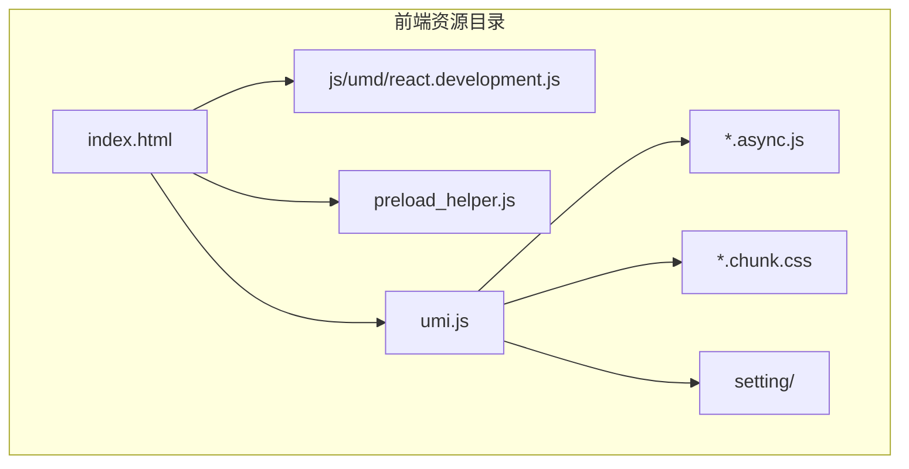
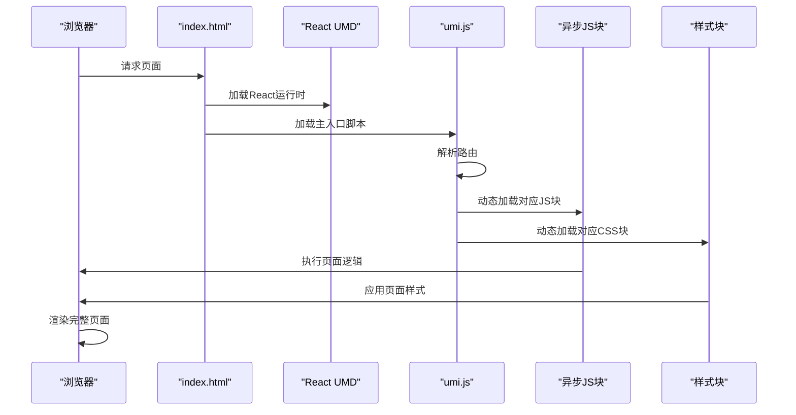
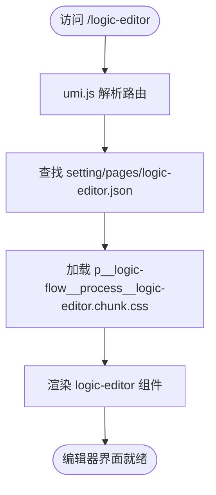
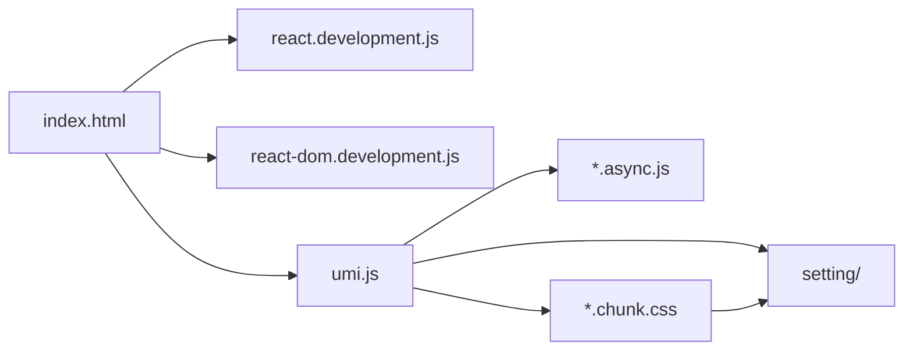

# 界面组件

<cite>
**本文档引用的文件**  
- [index.html](file://logic-ide/src/main/resources/public/index.html)
- [react.development.js](file://logic-ide/src/main/resources/public/js/umd/react.development.js)
- [p__logic-flow__process__logic-editor.chunk.css](file://logic-ide/src/main/resources/public/p__logic-flow__process__logic-editor.chunk.css)
- [layouts__index.chunk.css](file://logic-ide/src/main/resources/public/layouts__index.chunk.css)
- [p__logic-flow__process__logic-viewer.chunk.css](file://logic-ide/src/main/resources/public/p__logic-flow__process__logic-viewer.chunk.css)
- [logic-editor.json](file://logic-ide/src/main/resources/public/setting/pages/logic-editor.json)
- [index.json](file://logic-ide/src/main/resources/public/setting/pages/index.json)
</cite>

## 目录
1. [简介](#简介)
2. [项目结构](#项目结构)
3. [核心组件](#核心组件)
4. [架构概览](#架构概览)
5. [详细组件分析](#详细组件分析)
6. [依赖分析](#依赖分析)
7. [性能考虑](#性能考虑)
8. [故障排除指南](#故障排除指南)
9. [结论](#结论)

## 简介
本文档旨在深入解析 `logic-ide` 前端用户界面组件的技术实现与加载机制。重点阐述基于 React UMD 模块的前端框架集成方式，chunk.js 与 chunk.css 资源的按需加载策略及路由控制逻辑。分析 `index.html` 入口文件如何加载核心资源，构建单页应用（SPA）结构。详细说明 `logic-editor.chunk.css` 等样式文件对应的编辑器界面组件（如画布、工具栏、属性面板）的视觉呈现与交互行为。结合前端资源命名规则说明构建产物的组织方式，并为二次开发者提供界面主题定制、组件扩展与性能优化建议。

## 项目结构

`logic-ide` 项目的前端资源主要位于 `src/main/resources/public` 目录下，其结构清晰地反映了构建产物的组织方式。核心资源包括入口文件 `index.html`、UMD 格式的 React 库、按需加载的 JavaScript 异步块（`.async.js`）、CSS 样式块（`.chunk.css`）以及用于配置的 JSON 文件。



**Diagram sources**
- [index.html](file://logic-ide/src/main/resources/public/index.html#L1-L16)
- [p__logic-flow__process__logic-editor.chunk.css](file://logic-ide/src/main/resources/public/p__logic-flow__process__logic-editor.chunk.css#L0-L1)

**Section sources**
- [index.html](file://logic-ide/src/main/resources/public/index.html#L1-L16)
- [p__logic-flow__process__logic-editor.chunk.css](file://logic-ide/src/main/resources/public/p__logic-flow__process__logic-editor.chunk.css#L0-L1)

## 核心组件

`logic-ide` 的前端核心组件围绕 `React` 框架构建，通过 UMD 模块形式集成，确保了在无构建工具的环境中也能直接运行。入口文件 `index.html` 通过加载 `react.development.js` 和 `react-dom.development.js` 来提供 React 运行时环境，并通过 `umi.js` 启动应用。`umi.js` 作为应用的主入口脚本，负责动态加载后续所需的 `chunk.js` 和 `chunk.css` 资源，实现按需加载。

**Section sources**
- [index.html](file://logic-ide/src/main/resources/public/index.html#L1-L16)
- [react.development.js](file://logic-ide/src/main/resources/public/js/umd/react.development.js#L1-L50)

## 架构概览

`logic-ide` 采用单页应用（SPA）架构，其前端架构依赖于 `UmiJS` 框架。`index.html` 是唯一的 HTML 入口，它加载了 React UMD 模块和 `umi.js`。`umi.js` 负责解析路由并根据当前路由动态加载对应的代码块（chunk），这些代码块包含了特定页面或功能的 JavaScript 逻辑和 CSS 样式。这种设计极大地优化了初始加载时间，并实现了资源的高效利用。



**Diagram sources**
- [index.html](file://logic-ide/src/main/resources/public/index.html#L1-L16)
- [umi.js](file://logic-ide/src/main/resources/public/umi.js)

## 详细组件分析

### 逻辑编辑器组件分析

逻辑编辑器是 `logic-ide` 的核心功能界面，其配置定义在 `setting/pages/logic-editor.json` 中。该配置文件指定了页面类型为 `page`，其主体内容包含一个 `logic-editor` 类型的组件。当用户访问对应的路由时，`umi.js` 会加载 `p__logic-flow__process__logic-editor.chunk.css` 样式文件，该文件定义了编辑器界面的关键布局和样式。

#### 样式与布局分析
```mermaid
classDiagram
class LogicEditorCSS {
+.app-content{height : 100vh-64px}
+.drag-graph{width : "100%";height : calc(100vh - 64px)}
+.ant-layout-sider{border-right : 1px solid #e8e8e8}
+.x6-widget-stencil{background-color : #fff}
}
LogicEditorCSS : 定义编辑器主内容区高度
LogicEditorCSS : 定义拖拽画布区域
LogicEditorCSS : 定义侧边栏边框
LogicEditorCSS : 定义节点面板背景色
```

**Diagram sources**
- [p__logic-flow__process__logic-editor.chunk.css](file://logic-ide/src/main/resources/public/p__logic-flow__process__logic-editor.chunk.css#L0-L1)
- [logic-editor.json](file://logic-ide/src/main/resources/public/setting/pages/logic-editor.json#L0-L0)

#### 路由与页面配置


**Diagram sources**
- [logic-editor.json](file://logic-ide/src/main/resources/public/setting/pages/logic-editor.json#L0-L0)
- [p__logic-flow__process__logic-editor.chunk.css](file://logic-ide/src/main/resources/public/p__logic-flow__process__logic-editor.chunk.css#L0-L1)

**Section sources**
- [logic-editor.json](file://logic-ide/src/main/resources/public/setting/pages/logic-editor.json#L0-L0)
- [p__logic-flow__process__logic-editor.chunk.css](file://logic-ide/src/main/resources/public/p__logic-flow__process__logic-editor.chunk.css#L0-L1)

### 首页组件分析

首页的配置位于 `setting/pages/index.json`，它定义了一个包含卡片列表的页面，卡片数据来源于 `$apps`。该页面加载 `layouts__index.chunk.css` 样式文件，其中定义了导航项的样式（如 `margin-right:1em`），确保了首页布局的美观。

**Section sources**
- [index.json](file://logic-ide/src/main/resources/public/setting/pages/index.json#L0-L0)
- [layouts__index.chunk.css](file://logic-ide/src/main/resources/public/layouts__index.chunk.css#L0-L1)

## 依赖分析

`logic-ide` 前端的依赖关系清晰。`index.html` 直接依赖于 `react.development.js`、`react-dom.development.js` 和 `umi.js`。`umi.js` 作为核心加载器，间接依赖于所有按需加载的 `*.async.js` 和 `*.chunk.css` 文件。这些资源文件又依赖于 `setting/` 目录下的 JSON 配置文件来获取页面结构和组件信息。



**Diagram sources**
- [index.html](file://logic-ide/src/main/resources/public/index.html#L1-L16)
- [p__logic-flow__process__logic-editor.chunk.css](file://logic-ide/src/main/resources/public/p__logic-flow__process__logic-editor.chunk.css#L0-L1)
- [setting/pages/logic-editor.json](file://logic-ide/src/main/resources/public/setting/pages/logic-editor.json#L0-L0)

**Section sources**
- [index.html](file://logic-ide/src/main/resources/public/index.html#L1-L16)
- [p__logic-flow__process__logic-editor.chunk.css](file://logic-ide/src/main/resources/public/p__logic-flow__process__logic-editor.chunk.css#L0-L1)
- [setting/pages/logic-editor.json](file://logic-ide/src/main/resources/public/setting/pages/logic-editor.json#L0-L0)

## 性能考虑

`logic-ide` 通过以下策略优化性能：
1.  **按需加载 (Lazy Loading)**：利用 `umi.js` 的代码分割功能，仅在访问特定路由时才加载对应的 JS 和 CSS 资源，显著减少初始加载时间。
2.  **UMD 模块集成**：直接在浏览器中使用 React，避免了复杂的构建和打包过程，简化了部署。
3.  **资源命名规范化**：采用 `p__<path>__<filename>.chunk.css` 的命名规则，清晰地映射了构建产物与源代码路径的关系，便于维护和调试。

## 故障排除指南

1.  **页面空白**：检查 `index.html` 中的 `umi.js` 路径是否正确，确保服务器能正确提供该文件。
2.  **样式丢失**：确认 `umi.js` 是否成功加载了对应的 `*.chunk.css` 文件，检查浏览器网络面板是否有 404 错误。
3.  **组件不渲染**：检查 `setting/pages/` 下的 JSON 配置文件是否正确，特别是 `type` 字段是否与注册的组件名匹配。
4.  **React 报错**：由于使用了 `development.js` 版本，React 会提供详细的错误信息，可根据控制台日志进行排查。

**Section sources**
- [index.html](file://logic-ide/src/main/resources/public/index.html#L1-L16)
- [react.development.js](file://logic-ide/src/main/resources/public/js/umd/react.development.js#L1-L50)

## 结论

`logic-ide` 的前端架构通过巧妙地结合 UMD 模块、UmiJS 框架和按需加载机制，构建了一个高效且可维护的单页应用。其资源组织方式清晰，通过 `index.html` 作为唯一入口，`umi.js` 作为动态加载器，`*.chunk.css` 和 `*.async.js` 作为功能模块，实现了核心功能的解耦。对于二次开发者而言，理解这一加载机制和资源命名规则是进行界面定制和功能扩展的基础。建议在开发时遵循相同的命名规范，并充分利用按需加载的优势来优化应用性能。