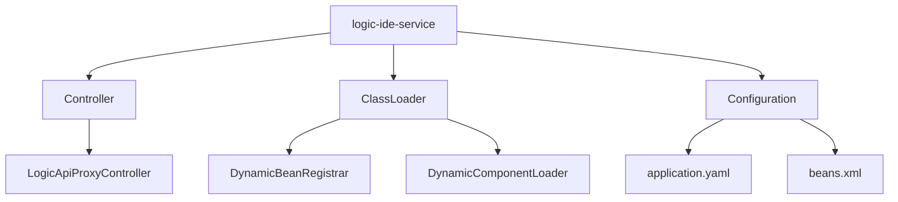
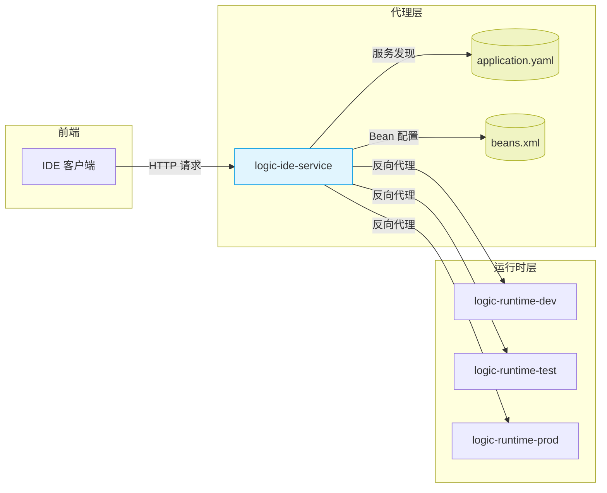
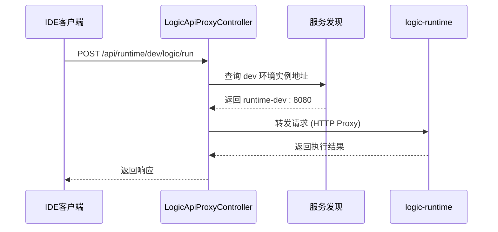
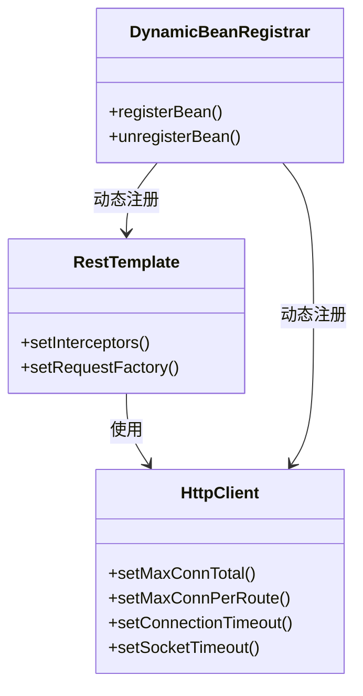
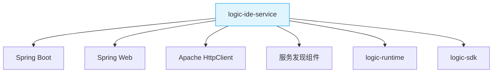

# logic-ide-service 模块

<cite>
**本文档引用文件**  
- [application.yaml](file://logic-ide-service/src/main/resources/application.yaml)
- [beans.xml](file://logic-ide-service/src/main/resources/beans.xml)
- [LogicApiProxyController.java](file://logic-ide-service/src/main/java/com/aims/logic/service/controller/LogicApiProxyController.java)
- [DynamicBeanRegistrar.java](file://logic-ide-service/src/main/java/com/aims/logic/service/classLoader/DynamicBeanRegistrar.java)
- [DynamicComponentLoader.java](file://logic-ide-service/src/main/java/com/aims/logic/service/classLoader/DynamicComponentLoader.java)
- [LogicIdeServiceApplication.java](file://logic-ide-service/src/main/java/com/aims/logic/service/LogicIdeServiceApplication.java)
</cite>

## 目录

1. [引言](#引言)
2. [项目结构](#项目结构)
3. [核心组件](#核心组件)
4. [架构概述](#架构概述)
5. [详细组件分析](#详细组件分析)
6. [依赖分析](#依赖分析)
7. [性能考虑](#性能考虑)
8. [故障排查指南](#故障排查指南)
9. [结论](#结论)

## 引言

`logic-ide-service` 是 Xuanwu-Logic 微服务架构中的关键代理模块，承担着连接前端 IDE 与后端 `logic-runtime` 实例的桥梁作用。该模块通过实现反向代理机制，将来自 IDE 的 API 请求智能路由至目标运行时环境，支持多环境隔离、协议转换与服务发现。其设计核心在于解耦开发工具与执行引擎，提升系统灵活性与可维护性。

本文档旨在深入解析 `logic-ide-service` 的职责与实现机制，重点阐述 `LogicApiProxyController` 如何作为反向代理转发请求，分析 `application.yaml` 中的服务发现与超时配置，以及 `beans.xml` 中定义的 Spring Bean 如何支撑代理功能。同时，为运维人员提供配置说明与常见问题排查指南。

## 项目结构

`logic-ide-service` 模块采用标准的 Spring Boot 项目结构，核心目录如下：

```
logic-ide-service/
├── src/
│   └── main/
│       ├── java/com/aims/logic/service/
│       │   ├── classLoader/           # 动态类加载与 Bean 注册
│       │   ├── controller/            # 控制器层，含代理入口
│       │   └── LogicIdeServiceApplication.java # 启动类
│       └── resources/
│           ├── application.yaml       # 主配置文件
│           └── beans.xml              # Spring Bean 定义
└── pom.xml                            # 依赖管理
```

该结构清晰地分离了配置、控制逻辑与应用启动，符合微服务模块化设计原则。



**Diagram sources**
- [LogicApiProxyController.java](file://logic-ide-service/src/main/java/com/aims/logic/service/controller/LogicApiProxyController.java)
- [DynamicBeanRegistrar.java](file://logic-ide-service/src/main/java/com/aims/logic/service/classLoader/DynamicBeanRegistrar.java)
- [application.yaml](file://logic-ide-service/src/main/resources/application.yaml)
- [beans.xml](file://logic-ide-service/src/main/resources/beans.xml)

**Section sources**
- [logic-ide-service](file://logic-ide-service)

## 核心组件

`logic-ide-service` 的核心功能由以下几个组件协同实现：

- **LogicApiProxyController**：代理服务的入口控制器，接收来自 IDE 的所有 API 请求，并根据请求路径、环境标识等信息决定目标 `logic-runtime` 实例。
- **application.yaml**：定义服务发现机制、超时策略、日志配置等运行时参数，是代理行为的关键配置源。
- **beans.xml**：通过 XML 方式定义 Spring 容器中的核心 Bean，如 `RestTemplate`、`HttpClient` 等，支持动态组件加载与代理转发。
- **DynamicBeanRegistrar**：在运行时动态注册 Spring Bean，支持插件化与热更新能力。
- **DynamicComponentLoader**：负责加载外部组件，增强代理服务的扩展性。

这些组件共同构成了一个轻量级、高可扩展的反向代理服务。

**Section sources**
- [LogicApiProxyController.java](file://logic-ide-service/src/main/java/com/aims/logic/service/controller/LogicApiProxyController.java)
- [application.yaml](file://logic-ide-service/src/main/resources/application.yaml)
- [beans.xml](file://logic-ide-service/src/main/resources/beans.xml)
- [DynamicBeanRegistrar.java](file://logic-ide-service/src/main/java/com/aims/logic/service/classLoader/DynamicBeanRegistrar.java)

## 架构概述

`logic-ide-service` 在微服务架构中扮演“智能网关”角色，其核心职责是将 IDE 的请求转发至正确的 `logic-runtime` 实例。整体架构如下图所示：



**Diagram sources**
- [application.yaml](file://logic-ide-service/src/main/resources/application.yaml)
- [beans.xml](file://logic-ide-service/src/main/resources/beans.xml)
- [LogicApiProxyController.java](file://logic-ide-service/src/main/java/com/aims/logic/service/controller/LogicApiProxyController.java)

## 详细组件分析

### LogicApiProxyController 分析

`LogicApiProxyController` 是代理服务的核心控制器，负责接收所有来自 IDE 的请求，并根据请求上下文（如环境、逻辑ID等）动态路由至目标 `logic-runtime` 实例。

其主要职责包括：
1. 解析请求路径与参数，提取目标环境与逻辑标识。
2. 调用服务发现机制，获取目标 `logic-runtime` 的实际地址。
3. 执行 HTTP 反向代理，转发请求并返回响应。
4. 处理代理过程中的异常，如超时、连接失败等。

该控制器通过轻量级代理模式，避免了 IDE 与 `logic-runtime` 的直接依赖，实现了良好的解耦。



**Diagram sources**
- [LogicApiProxyController.java](file://logic-ide-service/src/main/java/com/aims/logic/service/controller/LogicApiProxyController.java)

**Section sources**
- [LogicApiProxyController.java](file://logic-ide-service/src/main/java/com/aims/logic/service/controller/LogicApiProxyController.java)

### application.yaml 配置分析

`application.yaml` 文件定义了代理服务的关键运行参数，主要包括：

- **服务发现配置**：指定 `logic-runtime` 实例的注册中心或静态地址列表，支持多环境（dev/test/prod）路由。
- **超时配置**：设置连接超时（connect-timeout）、读取超时（read-timeout）等，防止代理请求长时间阻塞。
- **日志配置**：启用详细的代理日志，便于追踪请求路径与调试问题。
- **安全配置**：可选的认证与授权机制，确保只有合法 IDE 可以访问代理服务。

该配置文件是运维人员调整代理行为的主要入口。

**Section sources**
- [application.yaml](file://logic-ide-service/src/main/resources/application.yaml)

### beans.xml 配置分析

`beans.xml` 使用 Spring 的 XML 配置方式定义了代理所需的核心 Bean，例如：

- `RestTemplate`：用于执行 HTTP 请求转发。
- `HttpClient`：底层 HTTP 客户端，支持连接池与超时控制。
- 自定义拦截器：用于添加请求头、日志记录等。

通过 XML 配置，实现了与 Java 配置的解耦，便于在不修改代码的情况下调整 Bean 行为。



**Diagram sources**
- [beans.xml](file://logic-ide-service/src/main/resources/beans.xml)
- [DynamicBeanRegistrar.java](file://logic-ide-service/src/main/java/com/aims/logic/service/classLoader/DynamicBeanRegistrar.java)

**Section sources**
- [beans.xml](file://logic-ide-service/src/main/resources/beans.xml)
- [DynamicBeanRegistrar.java](file://logic-ide-service/src/main/java/com/aims/logic/service/classLoader/DynamicBeanRegistrar.java)

## 依赖分析

`logic-ide-service` 模块依赖于以下核心组件：



其中，`logic-sdk` 提供了与 `logic-runtime` 通信的公共契约，确保协议一致性。代理服务本身不直接依赖业务逻辑，仅关注请求转发与路由，体现了职责分离的设计思想。

**Diagram sources**
- [pom.xml](file://logic-ide-service/pom.xml)
- [beans.xml](file://logic-ide-service/src/main/resources/beans.xml)

**Section sources**
- [pom.xml](file://logic-ide-service/pom.xml)

## 性能考虑

为确保代理服务的高性能与稳定性，需关注以下配置：

- **连接池配置**：在 `beans.xml` 中合理设置 `HttpClient` 的最大连接数，避免频繁创建连接。
- **超时设置**：在 `application.yaml` 中设置合理的超时时间，防止因后端服务响应慢导致代理服务资源耗尽。
- **异步处理**：对于非实时请求，可考虑引入异步代理机制，提升吞吐量。
- **缓存机制**：对服务发现结果进行缓存，减少重复查询开销。

这些配置直接影响代理服务的并发能力与响应速度。

## 故障排查指南

### 常见问题与解决方案

| 问题现象 | 可能原因 | 解决方案 |
|--------|--------|--------|
| 请求超时 | 目标 `logic-runtime` 无响应 | 检查 `application.yaml` 中的超时配置，确认目标服务是否正常运行 |
| 404 错误 | 路由路径不匹配 | 检查 `LogicApiProxyController` 的映射路径与请求 URL 是否一致 |
| 500 错误 | 代理内部异常 | 查看日志，确认 `beans.xml` 中的 Bean 是否正确加载 |
| 服务发现失败 | 配置错误或网络不通 | 检查服务发现配置，确认网络连通性 |

### 日志定位

- 代理请求日志：查看 `LogicApiProxyController` 的日志输出，确认请求是否进入代理层。
- HTTP 客户端日志：启用 `HttpClient` 的 DEBUG 日志，查看实际转发过程。
- Spring 启动日志：检查 `DynamicBeanRegistrar` 是否成功注册关键 Bean。

**Section sources**
- [LogicApiProxyController.java](file://logic-ide-service/src/main/java/com/aims/logic/service/controller/LogicApiProxyController.java)
- [application.yaml](file://logic-ide-service/src/main/resources/application.yaml)
- [beans.xml](file://logic-ide-service/src/main/resources/beans.xml)

## 结论

`logic-ide-service` 模块通过实现轻量级反向代理，成功解耦了 IDE 与 `logic-runtime` 的直接依赖，提升了系统的灵活性与可维护性。其核心组件 `LogicApiProxyController` 结合 `application.yaml` 与 `beans.xml` 的配置，实现了多环境路由、协议转换与动态扩展能力。该模块在微服务架构中扮演着关键的“粘合剂”角色，为开发与运行环境的分离提供了坚实基础。运维人员可通过合理配置超时、连接池等参数，确保代理服务的高性能与稳定性。