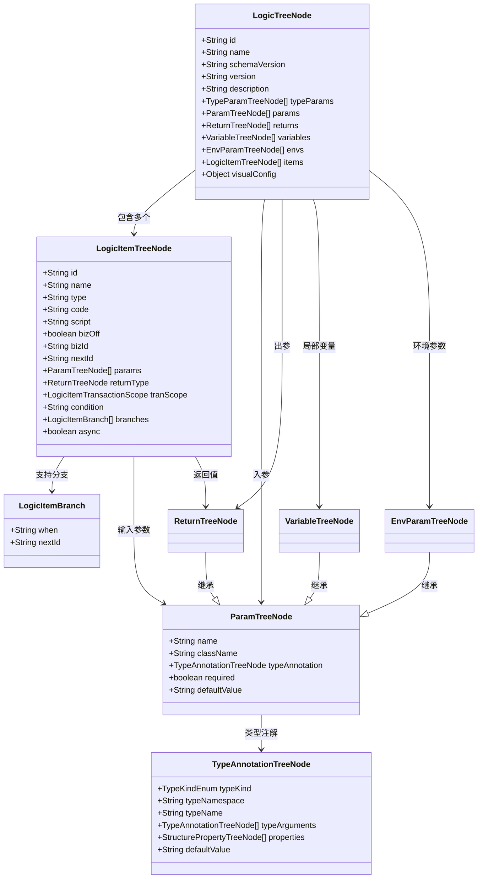

# DSL定义

<cite>
**本文档引用文件**  
- [LogicTreeNode.java](file://logic-runtime/src/main/java/com/aims/logic/runtime/contract/dsl/LogicTreeNode.java)
- [LogicItemTreeNode.java](file://logic-runtime/src/main/java/com/aims/logic/runtime/contract/dsl/LogicItemTreeNode.java)
- [LogicItemBranch.java](file://logic-runtime/src/main/java/com/aims/logic/runtime/contract/dsl/LogicItemBranch.java)
- [ParamTreeNode.java](file://logic-runtime/src/main/java/com/aims/logic/runtime/contract/dsl/ParamTreeNode.java)
- [VariableTreeNode.java](file://logic-runtime/src/main/java/com/aims/logic/runtime/contract/dsl/VariableTreeNode.java)
- [ReturnTreeNode.java](file://logic-runtime/src/main/java/com/aims/logic/runtime/contract/dsl/ReturnTreeNode.java)
- [EnvParamTreeNode.java](file://logic-runtime/src/main/java/com/aims/logic/runtime/contract/dsl/EnvParamTreeNode.java)
- [TypeAnnotationTreeNode.java](file://logic-runtime/src/main/java/com/aims/logic/runtime/contract/dsl/basic/TypeAnnotationTreeNode.java)
- [TypeAnnotationParser.java](file://logic-runtime/src/main/java/com/aims/logic/runtime/contract/parser/TypeAnnotationParser.java)
- [LogicItemType.java](file://logic-runtime/src/main/java/com/aims/logic/runtime/contract/enums/LogicItemType.java)
- [LogicItemTransactionScope.java](file://logic-runtime/src/main/java/com/aims/logic/runtime/contract/enums/LogicItemTransactionScope.java)
</cite>

## 目录
1. [引言](#引言)
2. [核心DSL结构概述](#核心dsl结构概述)
3. [LogicTreeNode：逻辑流程根节点](#logicTreeNode：逻辑流程根节点)
4. [LogicItemTreeNode：可执行节点模型](#logicItemTreeNode：可执行节点模型)
5. [参数与变量模型设计](#参数与变量模型设计)
6. [条件分支结构：LogicItemBranch](#条件分支结构：logicItemBranch)
7. [事务边界表达：LogicItemTransactionScope](#事务边界表达：logicItemTransactionScope)
8. [类型系统与TypeAnnotationTreeNode](#类型系统与typeAnnotationTreeNode)
9. [前端JSON配置与反序列化示例](#前端json配置与反序列化示例)
10. [总结](#总结)

## 引言
本文档全面阐述`logic-runtime`模块中DSL（领域特定语言）的契约设计，重点解析逻辑流程的结构化建模机制。通过分析`LogicTreeNode`作为根节点如何抽象整个逻辑流程，并与前端IDE的JSON配置形成映射，揭示系统在可视化编程与运行时执行之间的桥梁设计。同时，深入探讨各类节点模型、分支结构、事务控制及类型系统的实现原理。

## 核心DSL结构概述



**图示来源**  
- [LogicTreeNode.java](file://logic-runtime/src/main/java/com/aims/logic/runtime/contract/dsl/LogicTreeNode.java)
- [LogicItemTreeNode.java](file://logic-runtime/src/main/java/com/aims/logic/runtime/contract/dsl/LogicItemTreeNode.java)
- [LogicItemBranch.java](file://logic-runtime/src/main/java/com/aims/logic/runtime/contract/dsl/LogicItemBranch.java)
- [ParamTreeNode.java](file://logic-runtime/src/main/java/com/aims/logic/runtime/contract/dsl/ParamTreeNode.java)
- [TypeAnnotationTreeNode.java](file://logic-runtime/src/main/java/com/aims/logic/runtime/contract/dsl/basic/TypeAnnotationTreeNode.java)

**本节来源**  
- [LogicTreeNode.java](file://logic-runtime/src/main/java/com/aims/logic/runtime/contract/dsl/LogicTreeNode.java#L1-L55)
- [LogicItemTreeNode.java](file://logic-runtime/src/main/java/com/aims/logic/runtime/contract/dsl/LogicItemTreeNode.java#L1-L115)

## LogicTreeNode：逻辑流程根节点

`LogicTreeNode`是整个逻辑流程的根节点，代表一个完整的可执行逻辑单元。它继承自`BaseLASL`，并通过`concept = ConceptEnum.Logic`标识其类型。该节点封装了逻辑的元信息、输入输出、变量定义以及核心的执行节点列表。

其核心字段包括：
- **id/name/version**：唯一标识、名称与版本控制
- **schemaVersion**：DSL结构的版本号，用于兼容性管理
- **params/returns**：逻辑的输入参数与返回值定义
- **variables**：作用域内的局部变量集合
- **envs**：所需的环境参数（如数据库连接、API密钥等）
- **items**：按执行顺序排列的`LogicItemTreeNode`节点列表，构成主流程
- **visualConfig**：前端IDE的可视化布局配置，不参与运行时逻辑

此结构实现了前端JSON配置与后端Java对象的直接映射，使得逻辑定义既可被可视化编辑，又能被运行时精确解析。

**本节来源**  
- [LogicTreeNode.java](file://logic-runtime/src/main/java/com/aims/logic/runtime/contract/dsl/LogicTreeNode.java#L1-L55)

## LogicItemTreeNode：可执行节点模型

`LogicItemTreeNode`代表逻辑流程中的一个可执行节点，其类型由`LogicItemType`枚举定义（如Java代码、JS脚本、HTTP调用、MQTT通信等）。每个节点是流程中的原子执行单元。

关键属性解析：
- **type**：节点类型，决定执行器（`ILogicItemFunctionRunner`）的选择
- **code**：节点唯一编码，用于流程内跳转与引用
- **script/body/method**：根据类型存储脚本内容、HTTP请求体或Java方法签名
- **params/returnType**：强类型的输入参数与返回值声明
- **nextId**：默认执行路径的下一个节点ID
- **tranScope**：事务作用域控制（见下文详述）
- **condition**：条件节点的判断表达式（如if的布尔表达式）
- **branches**：分支节点（如switch）的路径定义
- **async**：是否异步执行，异步节点不阻塞主流程

节点通过`bizOff`和`bizId`支持业务实例的启停控制，增强了运行时的灵活性。

**本节来源**  
- [LogicItemTreeNode.java](file://logic-runtime/src/main/java/com/aims/logic/runtime/contract/dsl/LogicItemTreeNode.java#L1-L115)
- [LogicItemType.java](file://logic-runtime/src/main/java/com/aims/logic/runtime/contract/enums/LogicItemType.java)

## 参数与变量模型设计

### ParamTreeNode：参数基类
`ParamTreeNode`是所有参数化节点的基类，定义了参数的通用属性：
- **name**：参数名称
- **typeAnnotation**：指向`TypeAnnotationTreeNode`，实现复杂类型描述
- **required/defaultValue**：是否必填及默认值
- **className**：用于反射的全类名

### 变体节点
系统通过继承实现语义化区分：
- **VariableTreeNode**：继承`ParamTreeNode`，表示流程中的局部变量，`concept = ConceptEnum.Variable`
- **ReturnTreeNode**：表示返回值，`concept = ConceptEnum.Return`
- **EnvParamTreeNode**：表示环境参数，`concept = ConceptEnum.EnvParam`

这种设计保证了类型系统的一致性，同时通过`concept`字段在运行时进行语义区分。

**本节来源**  
- [ParamTreeNode.java](file://logic-runtime/src/main/java/com/aims/logic/runtime/contract/dsl/ParamTreeNode.java#L1-L34)
- [VariableTreeNode.java](file://logic-runtime/src/main/java/com/aims/logic/runtime/contract/dsl/VariableTreeNode.java#L1-L10)
- [ReturnTreeNode.java](file://logic-runtime/src/main/java/com/aims/logic/runtime/contract/dsl/ReturnTreeNode.java#L1-L16)
- [EnvParamTreeNode.java](file://logic-runtime/src/main/java/com/aims/logic/runtime/contract/dsl/EnvParamTreeNode.java#L1-L10)

## 条件分支结构：LogicItemBranch

`LogicItemBranch`用于支持条件分支逻辑，如`if-else`或`switch-case`。它本身结构简单，仅包含两个字段：
- **when**：条件表达式，通常为布尔表达式或case值
- **nextId**：当条件满足时，流程跳转的目标节点ID

在`LogicItemTreeNode`中，`branches`字段以列表形式存储多个`LogicItemBranch`，形成多路径选择结构。例如，一个`switch`节点会根据`when`表达式的值匹配不同的`nextId`，实现流程的动态路由。

**本节来源**  
- [LogicItemBranch.java](file://logic-runtime/src/main/java/com/aims/logic/runtime/contract/dsl/LogicItemBranch.java#L1-L11)

## 事务边界表达：LogicItemTransactionScope

`LogicItemTransactionScope`枚举定义了事务的边界策略，允许在流程级别精细控制事务行为：
- **EveryJavaNode**：每个Java节点执行前开启事务，出错回滚
- **EveryJavaNode2**：同上，但节点出错不中断流程（仅回滚当前事务）
- **EveryRequest**：每次外部交互（如HTTP、MQTT）开启事务
- **off**：关闭事务

该枚举通过`LogicItemTreeNode`的`tranScope`字段应用，结合`tranPropagation`（传播行为）和`tranGroupId`（事务组），实现了灵活的分布式事务控制模型。运行时根据此配置动态决定是否开启事务代理。

**本节来源**  
- [LogicItemTreeNode.java](file://logic-runtime/src/main/java/com/aims/logic/runtime/contract/dsl/LogicItemTreeNode.java#L1-L115)
- [LogicItemTransactionScope.java](file://logic-runtime/src/main/java/com/aims/logic/runtime/contract/enums/LogicItemTransactionScope.java)

## 类型系统与TypeAnnotationTreeNode

### TypeAnnotationTreeNode：类型描述核心
`TypeAnnotationTreeNode`是DSL类型系统的核心，能够描述原始类型、引用类型、泛型、匿名结构等复杂类型。

关键字段：
- **typeKind**：类型种类（如`PRIMITIVE`、`REFERENCE`、`GENERIC`、`ANONYMOUS_STRUCTURE`）
- **typeName/typeNamespace**：类型名称与命名空间（包名）
- **typeArguments**：泛型参数列表，支持嵌套（如`List<Map<String, Integer>>`）
- **properties**：匿名结构的属性列表，用于描述无POJO的JSON对象
- **defaultValue**：默认值

### TypeAnnotationParser：类型解析器
`TypeAnnotationParser`负责将字符串或反射类型（`java.lang.reflect.Type`）解析为`TypeAnnotationTreeNode`对象。它通过递归解析泛型、数组、通配符等，构建完整的类型树，确保DSL能够准确表达复杂的输入输出契约。

此机制使得前端无需定义Java类即可声明复杂数据结构，极大提升了开发效率。

**本节来源**  
- [TypeAnnotationTreeNode.java](file://logic-runtime/src/main/java/com/aims/logic/runtime/contract/dsl/basic/TypeAnnotationTreeNode.java#L1-L25)
- [TypeAnnotationParser.java](file://logic-runtime/src/main/java/com/aims/logic/runtime/contract/parser/TypeAnnotationParser.java)

## 前端JSON配置与反序列化示例

以下是一个简化的JSON配置示例，展示前端如何定义一个包含条件分支的逻辑流程：

```json
{
  "id": "demo-logic",
  "name": "演示逻辑",
  "schemaVersion": "1.0",
  "version": "1.0.0",
  "params": [
    {
      "name": "input",
      "typeAnnotation": {
        "typeKind": "REFERENCE",
        "typeName": "User",
        "typeNamespace": "com.aims.dto"
      }
    }
  ],
  "returns": [
    {
      "name": "result",
      "typeAnnotation": {
        "typeKind": "PRIMITIVE",
        "typeName": "Boolean"
      }
    }
  ],
  "items": [
    {
      "id": "checkAge",
      "name": "检查年龄",
      "type": "if",
      "condition": "input.age >= 18",
      "branches": [
        {
          "when": "true",
          "nextId": "adultProcess"
        },
        {
          "when": "false",
          "nextId": "minorProcess"
        }
      ]
    },
    {
      "id": "adultProcess",
      "name": "成人处理",
      "type": "java",
      "code": "processAdult",
      "tranScope": "EveryJavaNode"
    },
    {
      "id": "minorProcess",
      "name": "未成年人处理",
      "type": "java",
      "code": "processMinor",
      "async": true
    }
  ]
}
```

当此JSON被后端接收时，Spring框架利用Jackson库自动反序列化为对应的`LogicTreeNode` Java对象。由于所有字段名称与Java类属性完全匹配，且嵌套结构一致，反序列化过程无需额外配置即可完成。运行时通过`LogicRunner`遍历`items`列表，根据节点类型和条件表达式执行相应的逻辑。

**本节来源**  
- [LogicTreeNode.java](file://logic-runtime/src/main/java/com/aims/logic/runtime/contract/dsl/LogicTreeNode.java)
- [LogicItemTreeNode.java](file://logic-runtime/src/main/java/com/aims/logic/runtime/contract/dsl/LogicItemTreeNode.java)
- [LogicItemBranch.java](file://logic-runtime/src/main/java/com/aims/logic/runtime/contract/dsl/LogicItemBranch.java)

## 总结
`logic-runtime`模块的DSL设计通过`LogicTreeNode`作为根节点，构建了一个层次清晰、扩展性强的逻辑流程模型。`LogicItemTreeNode`及其子结构实现了对可执行节点、参数、分支、事务等核心概念的精确建模。结合`TypeAnnotationTreeNode`强大的类型系统，该DSL不仅支持复杂的业务逻辑表达，还实现了与前端IDE的无缝集成。整个设计体现了声明式编程与运行时执行的完美结合，为低代码平台提供了坚实的底层支撑。