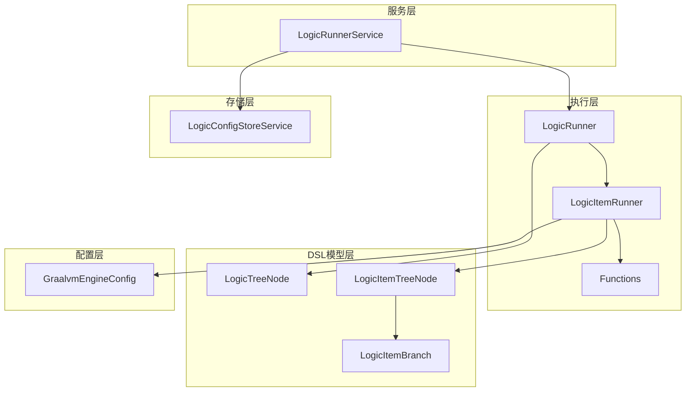
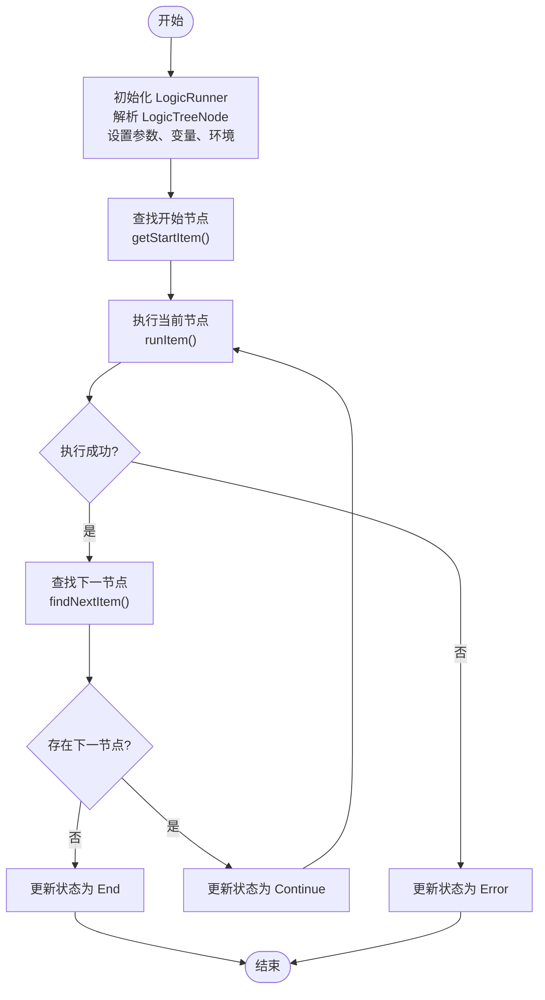
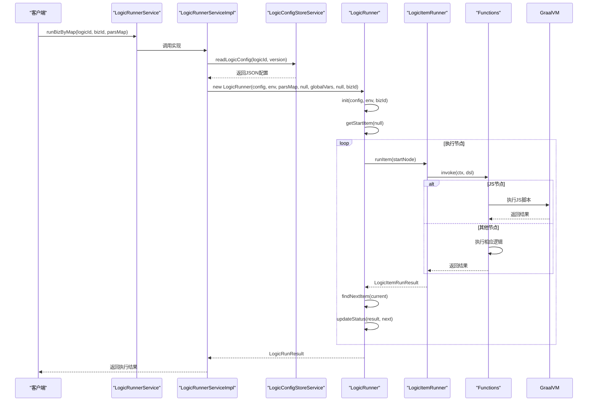
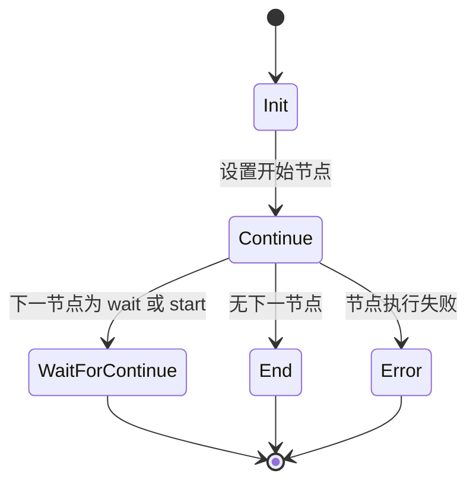

# logic-runtime 模块

<cite>
**本文档引用文件**  
- [LogicRunnerService.java](file://logic-runtime/src/main/java/com/aims/logic/runtime/service/LogicRunnerService.java)
- [LogicRunner.java](file://logic-runtime/src/main/java/com/aims/logic/runtime/runner/LogicRunner.java)
- [LogicItemRunner.java](file://logic-runtime/src/main/java/com/aims/logic/runtime/runner/LogicItemRunner.java)
- [LogicTreeNode.java](file://logic-runtime/src/main/java/com/aims/logic/runtime/contract/dsl/LogicTreeNode.java)
- [LogicItemBranch.java](file://logic-runtime/src/main/java/com/aims/logic/runtime/contract/dsl/LogicItemBranch.java)
- [GraalvmEngineConfig.java](file://logic-runtime/src/main/java/com/aims/logic/runtime/configuration/GraalvmEngineConfig.java)
- [LogicConfigStoreService.java](file://logic-runtime/src/main/java/com/aims/logic/runtime/store/LogicConfigStoreService.java)
- [LogicItemTreeNode.java](file://logic-runtime/src/main/java/com/aims/logic/runtime/contract/dsl/LogicItemTreeNode.java)
</cite>

## 目录
1. [引言](#引言)
2. [核心执行引擎架构](#核心执行引擎架构)
3. [主服务入口：LogicRunnerService](#主服务入口：logicrunnerservice)
4. [流程执行核心：LogicRunner与LogicItemRunner](#流程执行核心：logicrunner与logicitemrunner)
5. [DSL模型设计：LogicTreeNode与可视化映射](#dsl模型设计：logictreenode与可视化映射)
6. [逻辑配置存储：LogicConfigStoreService](#逻辑配置存储：logicconfigstoreservice)
7. [JS脚本执行环境：GraalvmEngineConfig](#js脚本执行环境：graalvmengineconfig)
8. [流程执行时序与状态机](#流程执行时序与状态机)
9. [无状态与有状态执行模式](#无状态与有状态执行模式)
10. [总结](#总结)

## 引言
`logic-runtime`模块是整个逻辑执行系统的核心引擎，负责解析、调度和执行由前端IDE定义的可视化业务流程。该模块通过DSL（领域特定语言）抽象流程结构，利用GraalVM实现JS脚本的安全隔离执行，并支持有状态和无状态两种执行模式，满足不同业务场景的需求。本文档深入剖析其架构设计与实现机制，帮助开发者理解其内部工作原理。

## 核心执行引擎架构
`logic-runtime`模块采用分层架构设计，主要包括服务层、执行层、DSL模型层、存储层和配置层。服务层提供统一的API入口，执行层负责流程的递归遍历与节点调度，DSL模型层定义流程的抽象结构，存储层负责逻辑配置的加载与缓存，配置层则管理执行环境的构建。



**图示来源**
- [LogicRunnerService.java](file://logic-runtime/src/main/java/com/aims/logic/runtime/service/LogicRunnerService.java)
- [LogicRunner.java](file://logic-runtime/src/main/java/com/aims/logic/runtime/runner/LogicRunner.java)
- [LogicItemRunner.java](file://logic-runtime/src/main/java/com/aims/logic/runtime/runner/LogicItemRunner.java)
- [LogicTreeNode.java](file://logic-runtime/src/main/java/com/aims/logic/runtime/contract/dsl/LogicTreeNode.java)
- [LogicItemBranch.java](file://logic-runtime/src/main/java/com/aims/logic/runtime/contract/dsl/LogicItemBranch.java)
- [GraalvmEngineConfig.java](file://logic-runtime/src/main/java/com/aims/logic/runtime/configuration/GraalvmEngineConfig.java)
- [LogicConfigStoreService.java](file://logic-runtime/src/main/java/com/aims/logic/runtime/store/LogicConfigStoreService.java)

## 主服务入口：LogicRunnerService
`LogicRunnerService`是逻辑执行的主服务入口，提供了丰富的API来创建和管理逻辑运行器实例，并协调逻辑的创建、执行与状态管理。

### 核心功能
- **环境变量管理**：通过`setEnv`和`getEnvJson`方法管理自定义环境变量。
- **实例创建**：通过`newInstance`方法创建新的逻辑运行器实例，支持继承父逻辑的上下文。
- **无状态执行**：提供`runByJson`、`runByObjectArgs`和`runByMap`等方法，用于执行无状态逻辑。
- **有状态执行**：提供`runBizByJson`、`runBizByObjectArgs`和`runBizByMap`等方法，用于执行有状态逻辑，支持业务ID（bizId）跟踪。
- **实例管理**：支持重试异常业务、强制完成或停止业务实例、重置实例状态等操作。

**本节来源**
- [LogicRunnerService.java](file://logic-runtime/src/main/java/com/aims/logic/runtime/service/LogicRunnerService.java)

## 流程执行核心：LogicRunner与LogicItemRunner
`LogicRunner`和`LogicItemRunner`是流程执行的核心组件，分别负责流程级别的调度和节点级别的执行。

### LogicRunner：流程调度器
`LogicRunner`负责整个逻辑流程的调度，其核心职责包括：
- **初始化**：通过`init`方法解析逻辑配置（`LogicTreeNode`），初始化参数、局部变量和环境变量。
- **节点查找**：通过`findItemById`和`findItemByCode`方法根据ID或代码查找节点。
- **开始节点确定**：通过`getStartItem`方法确定流程的开始节点，支持从指定节点开始执行。
- **流程执行**：通过`run`方法启动流程执行，该方法会调用`runItem`执行当前节点，然后通过`findNextItem`查找下一个节点，循环执行直到流程结束。
- **状态更新**：通过`updateStatus`方法根据当前节点的执行结果和下一个节点的类型更新运行器状态（`RunnerStatusEnum`）。



**图示来源**
- [LogicRunner.java](file://logic-runtime/src/main/java/com/aims/logic/runtime/runner/LogicRunner.java)

### LogicItemRunner：节点执行器
`LogicItemRunner`负责单个逻辑节点的执行，其核心职责是根据节点类型（`type`）调用相应的执行函数。

#### 执行流程
1. **日志记录**：记录节点开始执行的时间和名称。
2. **类型分发**：根据`LogicItemTreeNode`的`type`字段，使用`switch`语句分发到不同的处理逻辑。
3. **函数调用**：通过`Functions.get(itemType).invoke()`调用预注册的函数实现。
4. **结果处理**：将执行结果封装为`LogicItemRunResult`，并记录节点日志（`LogicItemLog`）。
5. **返回值赋值**：如果节点配置了`returnAccept`，则将返回值赋给指定的变量。

#### 支持的节点类型
- **end**：结束节点，可执行JS脚本并返回结果。
- **wait**：等待节点，根据`timeout`表达式计算等待时间，然后调用`Thread.sleep`。
- **js**：JS脚本节点，通过`Functions.runJsByContext`执行JS代码。
- **assign-global**：全局变量赋值节点，将值赋给`_global`对象中的指定变量。
- **assign-local**：局部变量赋值节点，将值赋给`_var`对象中的指定变量。
- **start**：开始节点，通常作为流程入口。
- **其他类型**：通过`Functions.get(itemType)`获取并调用自定义函数。

**本节来源**
- [LogicRunner.java](file://logic-runtime/src/main/java/com/aims/logic/runtime/runner/LogicRunner.java)
- [LogicItemRunner.java](file://logic-runtime/src/main/java/com/aims/logic/runtime/runner/LogicItemRunner.java)

## DSL模型设计：LogicTreeNode与可视化映射
DSL（领域特定语言）模型是连接前端IDE与后端执行引擎的桥梁，它以JSON结构抽象了可视化流程。

### LogicTreeNode：逻辑根节点
`LogicTreeNode`是整个逻辑流程的根节点，定义了逻辑的元数据和结构。

#### 核心属性
- `id`：逻辑的唯一标识符。
- `name`：逻辑名称。
- `version`：逻辑版本号。
- `params`：输入参数列表，类型为`List<ParamTreeNode>`。
- `returns`：返回值列表，类型为`List<ReturnTreeNode>`。
- `variables`：局部变量列表，类型为`List<VariableTreeNode>`。
- `envs`：环境变量列表，类型为`List<EnvParamTreeNode>`。
- `items`：逻辑节点列表，类型为`List<LogicItemTreeNode>`，是流程的核心。
- `visualConfig`：存储前端IDE的可视化布局信息（如坐标、连线等）。

**本节来源**
- [LogicTreeNode.java](file://logic-runtime/src/main/java/com/aims/logic/runtime/contract/dsl/LogicTreeNode.java)

### LogicItemTreeNode：逻辑节点
`LogicItemTreeNode`代表流程中的一个具体节点。

#### 核心属性
- `id`：节点唯一ID。
- `name`：节点名称。
- `type`：节点类型（如"js", "wait", "if"等）。
- `nextId`：下一个节点的ID，用于线性流程。
- `branches`：分支列表，类型为`List<LogicItemBranch>`，用于条件分支（如if、switch）。
- `script`：JS脚本内容，用于js节点。
- `timeout`：超时时间表达式，用于wait节点。
- `returnAccept`：接收返回值的变量名。

**本节来源**
- [LogicItemTreeNode.java](file://logic-runtime/src/main/java/com/aims/logic/runtime/contract/dsl/LogicItemTreeNode.java)

### LogicItemBranch：分支条件
`LogicItemBranch`用于定义条件分支的规则。

#### 核心属性
- `when`：条件表达式（JS代码），当表达式结果为`true`时，选择此分支。
- `nextId`：此分支指向的下一个节点ID。

**本节来源**
- [LogicItemBranch.java](file://logic-runtime/src/main/java/com/aims/logic/runtime/contract/dsl/LogicItemBranch.java)

### 与前端IDE的映射关系
前端IDE通过`visualConfig`保存节点的UI信息（位置、大小、样式），而`LogicTreeNode`的`items`列表则保存了节点的逻辑信息。当用户在IDE中拖拽节点、设置参数时，IDE会同步更新`LogicTreeNode`的JSON结构。执行引擎在加载配置时，忽略`visualConfig`，只解析`items`等逻辑属性来构建执行流程。

## 逻辑配置存储：LogicConfigStoreService
`LogicConfigStoreService`负责逻辑配置的加载、缓存和管理。

### 核心功能
- **配置加载**：`readLogicConfig`方法支持从文件、远程主机或缓存中读取逻辑配置。
- **缓存管理**：提供`getLogicConfigCache`获取缓存实例，`saveToCache`和`removeFromCache`用于写入和删除缓存。
- **本地持久化**：`saveLogicConfigToFile`将配置保存到本地文件系统。
- **离线管理**：`getOfflineLogicIds`获取离线逻辑的ID列表。

该服务确保了逻辑配置的高效加载和一致性，是连接配置源与执行引擎的关键组件。

**本节来源**
- [LogicConfigStoreService.java](file://logic-runtime/src/main/java/com/aims/logic/runtime/store/LogicConfigStoreService.java)

## JS脚本执行环境：GraalvmEngineConfig
为了安全、高效地执行JS脚本，`logic-runtime`模块使用GraalVM作为脚本引擎。

### 隔离机制
`GraalvmEngineConfig`通过Spring的`@Bean`注解创建一个全局的`Engine`实例。

```java
@Configuration
public class GraalvmEngineConfig {
    @Bean(destroyMethod = "close")
    public Engine graalEngine() {
        return Engine.newBuilder()
                .option("engine.WarnInterpreterOnly", "false")
                .build();
    }
}
```

- **全局单例**：`@Bean`确保`Engine`在整个应用中只有一个实例，提高资源利用率。
- **资源释放**：`destroyMethod = "close"`确保在应用关闭时正确释放GraalVM引擎资源。
- **选项配置**：`.option("engine.WarnInterpreterOnly", "false")`禁用解释器模式警告，允许在无JIT编译器的环境下运行。

执行时，JS脚本在GraalVM提供的隔离环境中运行，无法直接访问宿主JVM的敏感资源，保证了执行的安全性。

**本节来源**
- [GraalvmEngineConfig.java](file://logic-runtime/src/main/java/com/aims/logic/runtime/configuration/GraalvmEngineConfig.java)

## 流程执行时序与状态机
### 流程执行时序图


**图示来源**
- [LogicRunnerService.java](file://logic-runtime/src/main/java/com/aims/logic/runtime/service/LogicRunnerService.java)
- [LogicRunner.java](file://logic-runtime/src/main/java/com/aims/logic/runtime/runner/LogicRunner.java)
- [LogicItemRunner.java](file://logic-runtime/src/main/java/com/aims/logic/runtime/runner/LogicItemRunner.java)
- [LogicConfigStoreService.java](file://logic-runtime/src/main/java/com/aims/logic/runtime/store/LogicConfigStoreService.java)

### 状态机模型
`LogicRunner`通过`RunnerStatusEnum`维护流程的执行状态。



- **Continue**：继续执行状态，表示流程正常进行。
- **WaitForContinue**：等待继续状态，通常由`wait`或`start`节点触发，表示流程暂停。
- **End**：结束状态，表示流程已正常执行完毕。
- **Error**：错误状态，表示流程因节点执行失败而终止。

**本节来源**
- [LogicRunner.java](file://logic-runtime/src/main/java/com/aims/logic/runtime/runner/LogicRunner.java)

## 无状态与有状态执行模式
### 无状态执行 (Stateless)
- **特点**：每次执行都是独立的，不保存任何中间状态。执行结果仅依赖于输入参数。
- **API**：`runByJson`, `runByObjectArgs`, `runByMap`。
- **应用场景**：适用于幂等性操作、简单计算、数据转换等无需状态跟踪的场景。
- **优势**：轻量、高效、易于并行和缓存。

### 有状态执行 (Stateful)
- **特点**：通过`bizId`标识一个业务实例，可以保存和恢复执行状态（如局部变量`_var`）。支持重试、暂停和继续执行。
- **API**：`runBizByJson`, `runBizByObjectArgs`, `runBizByMap`。
- **应用场景**：适用于复杂的业务流程、需要长时间运行的任务、需要人工干预的审批流程等。
- **优势**：支持复杂的业务逻辑，提供更好的错误恢复和流程控制能力。

开发者应根据业务需求选择合适的执行模式。对于简单、快速的计算，优先使用无状态模式；对于复杂、长周期的业务流程，则使用有状态模式。

## 总结
`logic-runtime`模块通过精心设计的分层架构和清晰的职责划分，实现了可视化流程的高效、安全执行。`LogicRunnerService`作为统一入口，`LogicRunner`和`LogicItemRunner`协同完成流程调度与节点执行，`LogicTreeNode`等DSL模型抽象了流程结构，`LogicConfigStoreService`保障了配置的高效管理，而`GraalvmEngineConfig`则提供了安全的JS执行环境。理解这些组件的协作机制，对于开发和维护基于该引擎的业务逻辑至关重要。