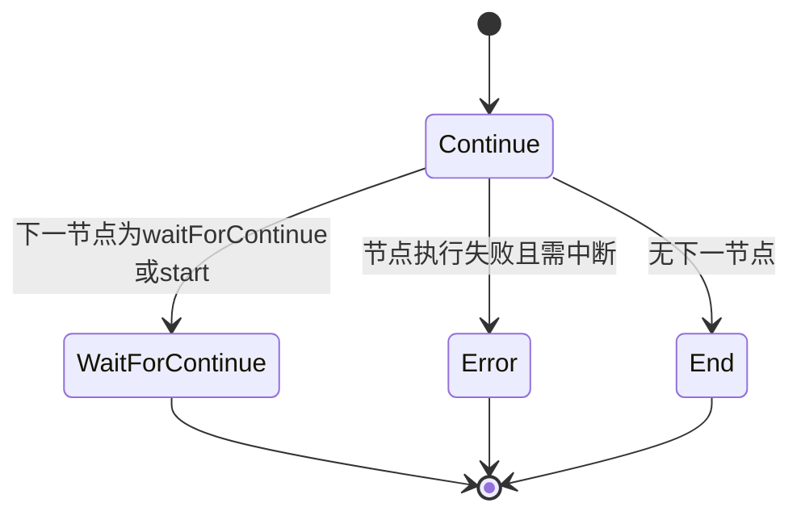

# 执行核心

<cite>
**本文档引用文件**  
- [LogicRunnerService.java](file://logic-runtime/src/main/java/com/aims/logic/runtime/service/LogicRunnerService.java)
- [LogicRunner.java](file://logic-runtime/src/main/java/com/aims/logic/runtime/runner/LogicRunner.java)
- [LogicItemRunner.java](file://logic-runtime/src/main/java/com/aims/logic/runtime/runner/LogicItemRunner.java)
- [LogicRunModelEnum.java](file://logic-runtime/src/main/java/com/aims/logic/runtime/contract/dto/LogicRunModelEnum.java)
- [RunnerStatusEnum.java](file://logic-runtime/src/main/java/com/aims/logic/runtime/contract/dto/RunnerStatusEnum.java)
- [FunctionContext.java](file://logic-runtime/src/main/java/com/aims/logic/runtime/runner/FunctionContext.java)
- [UnCompletedBizDto.java](file://logic-runtime/src/main/java/com/aims/logic/runtime/contract/dto/UnCompletedBizDto.java)
- [LongtimeRunningBizDto.java](file://logic-runtime/src/main/java/com/aims/logic/runtime/contract/dto/LongtimeRunningBizDto.java)
</cite>

## 目录
1. [引言](#引言)
2. [逻辑执行生命周期管理](#逻辑执行生命周期管理)
3. [执行模式区分：有状态与无状态](#执行模式区分有状态与无状态)
4. [流程调度机制：递归遍历LogicTreeNode](#流程调度机制递归遍历logictreenode)
5. [节点执行上下文与异常处理](#节点执行上下文与异常处理)
6. [执行状态机：RunnerStatusEnum流转](#执行状态机runnerstatusenum流转)
7. [流程执行时序图](#流程执行时序图)
8. [共享数据传递：FunctionContext机制](#共享数据传递functioncontext机制)
9. [长时间运行业务处理机制](#长时间运行业务处理机制)
10. [结论](#结论)

## 引言
本文档深入解析`logic-runtime`模块的执行核心机制，重点阐述`LogicRunnerService`作为主服务入口如何管理逻辑实例的完整生命周期，包括创建、启动、暂停、恢复和终止。详细说明`LogicRunner`如何根据`LogicRunModelEnum`区分无状态与有状态执行模式，并通过递归遍历`LogicTreeNode`实现流程调度。剖析`LogicItemRunner`对单个节点的执行上下文管理、异常处理与日志记录机制。结合`RunnerStatusEnum`说明执行状态机的流转过程。解释`FunctionContext`如何在执行过程中传递共享数据，并确保线程安全。针对长时间运行业务场景，说明`UnCompletedBizDto`与`LongtimeRunningBizDto`的设计意图与使用方式。

## 逻辑执行生命周期管理
`LogicRunnerService`是逻辑执行的核心服务入口，负责管理所有逻辑实例的生命周期。该服务通过多种`run`方法变体支持不同参数形式的调用，统一最终调用`runByMap`方法进行执行。

服务支持创建新的实例上下文，通过`newInstance`方法传入自定义环境变量、父逻辑ID、父业务ID等参数，实现嵌套调用和上下文隔离。对于有状态执行，服务通过`bizId`标识唯一业务实例，支持对特定实例进行重试、强制完成、强制停止、重置执行节点等操作。

实例的终止可通过`forceStopBiz`方法实现，该方法会中断指定业务实例的执行。`clearCompletedInstance`方法用于清理已完成的业务实例，释放系统资源。

**Section sources**
- [LogicRunnerService.java](file://logic-runtime/src/main/java/com/aims/logic/runtime/service/LogicRunnerService.java#L1-L288)

## 执行模式区分：有状态与无状态
`LogicRunner`根据调用方式区分无状态与有状态执行模式。无状态执行通过`runByMap`等方法调用，每次执行独立，不保留执行上下文。有状态执行通过`runBizByMap`等方法调用，需指定`bizId`，系统会为该业务ID维护执行状态，包括入参、局部变量、执行进度等。

在`LogicRunner`构造函数中，有状态执行会传入`bizId`，并初始化`FunctionContext`的业务ID字段。执行过程中，系统会记录当前执行节点`nextItem`和结束时的局部变量`varsJson_end`，以便后续恢复执行。

两种模式共享相同的执行引擎，区别在于上下文的持久化策略。无状态模式适用于短时、独立任务；有状态模式适用于需要断点续执行、长时间运行的复杂业务流程。

**Section sources**
- [LogicRunner.java](file://logic-runtime/src/main/java/com/aims/logic/runtime/runner/LogicRunner.java#L45-L290)
- [LogicRunnerService.java](file://logic-runtime/src/main/java/com/aims/logic/runtime/service/LogicRunnerService.java#L1-L288)

## 流程调度机制：递归遍历LogicTreeNode
`LogicRunner`通过递归遍历`LogicTreeNode`实现流程调度。`LogicTreeNode`表示整个逻辑流程的树形结构，包含所有节点`items`、参数、变量和环境变量。

执行流程如下：
1. 调用`getStartItem`方法获取起始节点，若指定了`runItemId`则从指定节点开始，否则从类型为`start`的节点开始。
2. 调用`runItem`方法执行当前节点，返回`LogicItemRunResult`。
3. 调用`findNextItem`方法查找下一个节点。对于`switch`节点，下一个节点ID由`fnCtx.get_lastRet()`决定；对于其他节点，从`nextId`字段获取。
4. 调用`updateStatus`方法更新执行状态，根据结果决定是否继续执行。
5. 循环执行步骤2-4，直到状态为`End`或`Error`。

该机制实现了基于节点连接的流程驱动，支持条件分支、顺序执行等复杂流程。

**Section sources**
- [LogicRunner.java](file://logic-runtime/src/main/java/com/aims/logic/runtime/runner/LogicRunner.java#L45-L290)

## 节点执行上下文与异常处理
`LogicItemRunner`负责单个节点的执行，其核心是`run`方法。执行过程中，`FunctionContext`（`fnCtx`）作为执行上下文，贯穿整个执行过程，存储参数、变量、环境变量、事务范围、最后返回值等信息。

异常处理机制如下：
- 每个节点执行捕获异常，封装为`LogicItemRunResult`，设置`success=false`。
- `updateStatus`方法检查`itemRes.isSuccess()`，若失败则根据`needInterrupt`标志和事务范围`tranScope`决定是否中断执行。
- 当`tranScope`为`everyNode2`且`needInterrupt=false`时，执行继续；否则状态置为`Error`，中断执行。
- 系统记录详细的日志信息，包括每个节点的执行日志`LogicItemLog`，便于问题排查。

日志记录通过`logicLog.addItemLog(itemRes)`实现，收集所有节点的执行结果，最终形成完整的执行日志。

**Section sources**
- [LogicRunner.java](file://logic-runtime/src/main/java/com/aims/logic/runtime/runner/LogicRunner.java#L45-L290)
- [LogicItemRunner.java](file://logic-runtime/src/main/java/com/aims/logic/runtime/runner/LogicItemRunner.java#L1-L100)

## 执行状态机：RunnerStatusEnum流转
执行状态由`RunnerStatusEnum`枚举定义，包含以下状态：
- `Continue`：继续执行
- `WaitForContinue`：等待继续（遇到`waitForContinue`或`start`节点）
- `End`：正常结束
- `Error`：执行出错

状态流转由`updateStatus`方法控制：
- 若节点执行失败且需中断，则状态置为`Error`。
- 若节点执行成功，检查下一个节点类型：
  - 若为`waitForContinue`或`start`，状态置为`WaitForContinue`。
  - 否则，状态置为`Continue`。
- 若无下一个节点，状态置为`End`。

该状态机清晰地表达了执行过程中的各种状态，便于外部系统查询和控制执行流程。



**Diagram sources**
- [RunnerStatusEnum.java](file://logic-runtime/src/main/java/com/aims/logic/runtime/contract/dto/RunnerStatusEnum.java#L1-L20)
- [LogicRunner.java](file://logic-runtime/src/main/java/com/aims/logic/runtime/runner/LogicRunner.java#L200-L230)

## 流程执行时序图
以下时序图展示了从服务调用到节点执行完成的完整链路：

```mermaid
sequenceDiagram
participant Client as "客户端"
participant Service as "LogicRunnerService"
participant Runner as "LogicRunner"
participant ItemRunner as "LogicItemRunner"
participant Context as "FunctionContext"
Client->>Service : runBizByMap(logicId, bizId, parsMap)
Service->>Runner : new LogicRunner(_config, _env, paramsMap, varsJson, globalVars, runItemId, bizId)
Runner->>Runner : init(_config, _env, bizId)
Runner->>Runner : setStartNode(getStartItem(runItemId))
loop 执行节点
Runner->>ItemRunner : runItem(startNode)
ItemRunner->>Context : 执行节点逻辑
ItemRunner-->>Runner : LogicItemRunResult
Runner->>Runner : updateStatus(itemRes, nextItem)
alt 状态为Continue
Runner->>Runner : findNextItem(nextItem)
else 状态为End或Error
break
end
end
Runner-->>Service : LogicRunResult
Service-->>Client : 返回执行结果
```

**Diagram sources**
- [LogicRunnerService.java](file://logic-runtime/src/main/java/com/aims/logic/runtime/service/LogicRunnerService.java#L1-L288)
- [LogicRunner.java](file://logic-runtime/src/main/java/com/aims/logic/runtime/runner/LogicRunner.java#L45-L290)

## 共享数据传递：FunctionContext机制
`FunctionContext`是执行过程中的核心上下文对象，负责在节点间传递共享数据。它包含以下关键字段：
- `_par`：入参，来自`parsMap`
- `_var`：局部变量，跨节点共享，可被修改
- `_env`：环境变量，包含系统和自定义环境
- `_global`：全局变量，跨实例共享
- `last`：上一个节点的执行结果
- `nextItem`：下一个待执行节点
- `traceId`：链路追踪ID
- `bizId`：业务ID
- `logicId`：逻辑ID

`FunctionContext`通过引用传递，确保所有节点操作同一上下文实例。系统在执行前后对`_var`进行深拷贝，保证状态快照的准确性。对于线程安全，每个`LogicRunner`实例拥有独立的`FunctionContext`，避免并发冲突。

**Section sources**
- [FunctionContext.java](file://logic-runtime/src/main/java/com/aims/logic/runtime/runner/FunctionContext.java#L1-L50)
- [LogicRunner.java](file://logic-runtime/src/main/java/com/aims/logic/runtime/runner/LogicRunner.java#L45-L290)

## 长时间运行业务处理机制
针对长时间运行业务场景，系统提供了`UnCompletedBizDto`和`LongtimeRunningBizDto`两种数据传输对象。

`UnCompletedBizDto`用于表示未完成的业务实例，包含`logicId`、`bizId`、`createTime`、`isRunning`、`hasError`等字段。系统提供`queryUncompletedBiz`方法查询符合条件的未完成实例，便于监控和管理。

`LongtimeRunningBizDto`专门用于表示超时运行的业务实例，包含运行时长信息。`retryLongtimeRunningBiz`方法可重试超时业务，`queryLongtimeRunningBiz`方法可查询超时实例。

设计意图：
- `UnCompletedBizDto`：通用未完成实例查询，支持按时间范围、运行状态、成功状态等条件筛选。
- `LongtimeRunningBizDto`：专项监控长时间运行实例，防止系统资源耗尽。

使用方式：通过`LogicRunnerService`的查询方法获取DTO列表，分析后可调用`retryErrorBiz`、`forceCompleteBiz`或`forceStopBiz`进行处理。

**Section sources**
- [UnCompletedBizDto.java](file://logic-runtime/src/main/java/com/aims/logic/runtime/contract/dto/UnCompletedBizDto.java#L1-L30)
- [LongtimeRunningBizDto.java](file://logic-runtime/src/main/java/com/aims/logic/runtime/contract/dto/LongtimeRunningBizDto.java#L1-L25)
- [LogicRunnerService.java](file://logic-runtime/src/main/java/com/aims/logic/runtime/service/LogicRunnerService.java#L1-L288)

## 结论
`logic-runtime`的执行核心机制设计精巧，通过`LogicRunnerService`统一管理生命周期，`LogicRunner`实现流程调度，`LogicItemRunner`执行具体节点，`FunctionContext`贯穿上下文，`RunnerStatusEnum`控制状态流转。系统支持无状态与有状态两种执行模式，满足不同业务场景需求。对于长时间运行的业务，提供了完善的监控和处理机制。整体架构清晰，扩展性强，为复杂业务流程的执行提供了可靠保障。