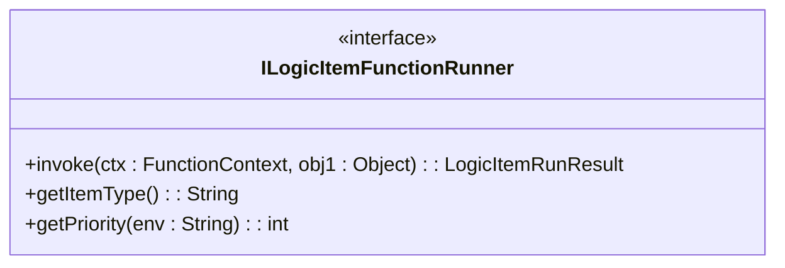
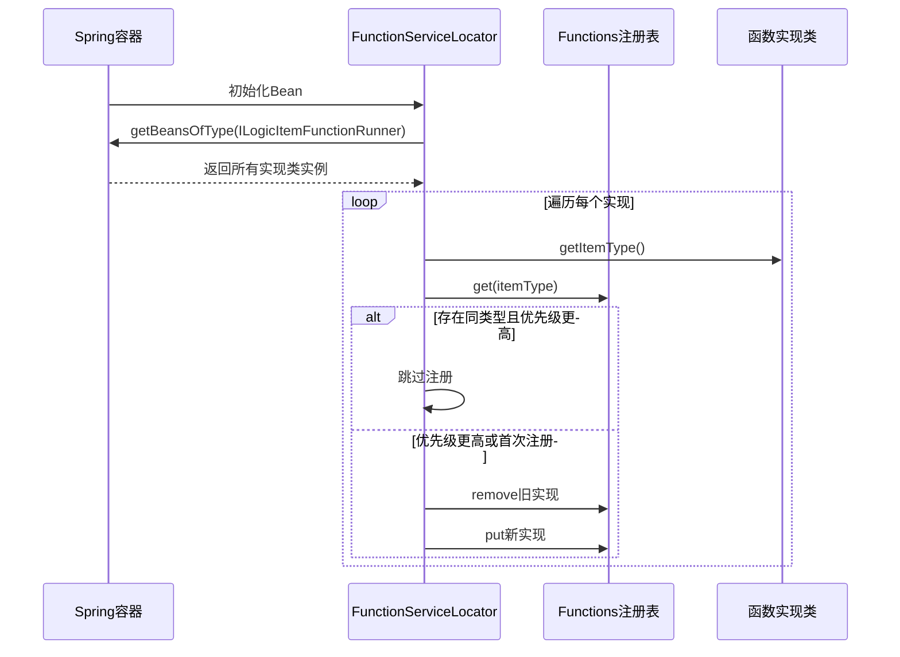
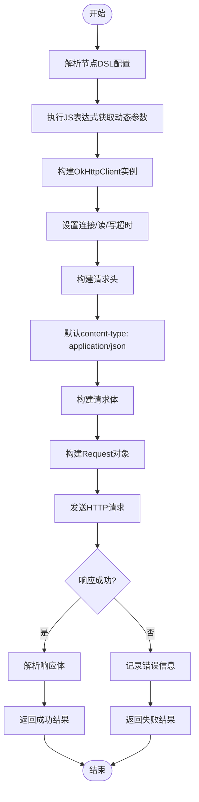
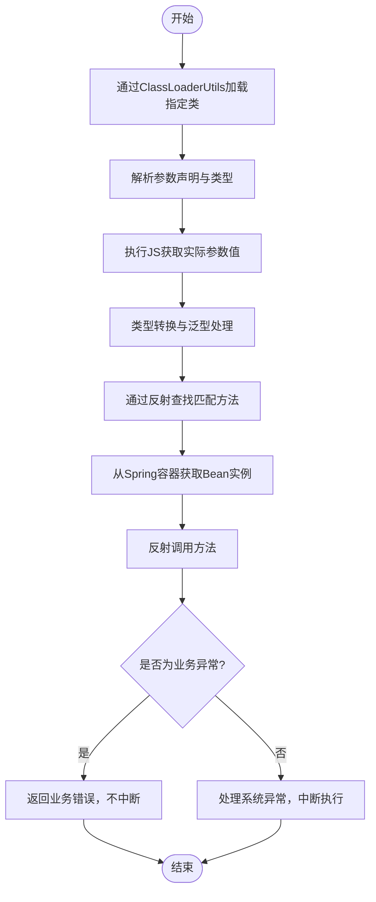
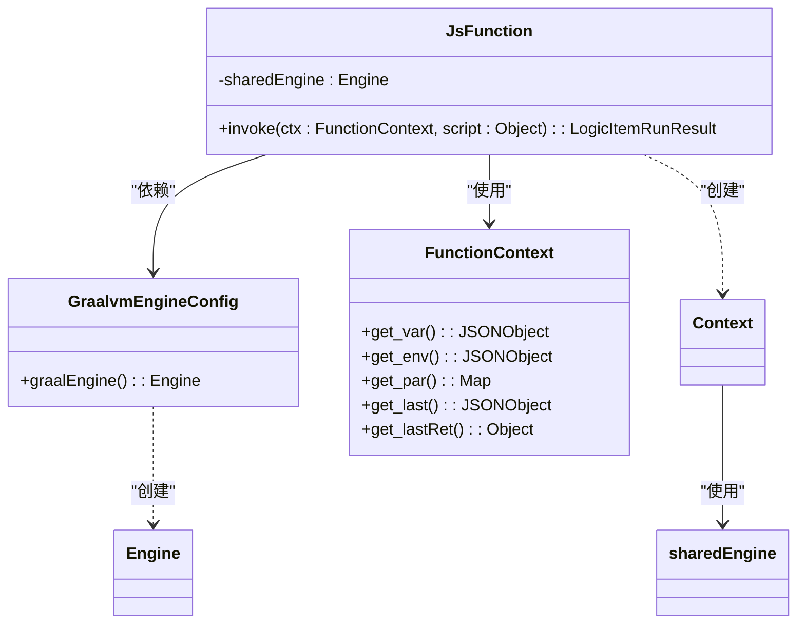
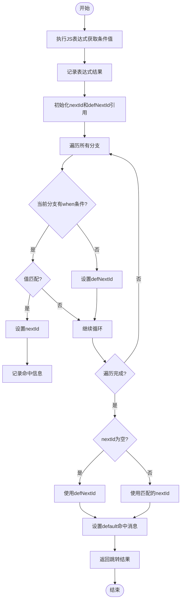

# 节点函数

<cite>
**本文档中引用的文件**  
- [ILogicItemFunctionRunner.java](file://logic-runtime/src/main/java/com/aims/logic/runtime/runner/functions/ILogicItemFunctionRunner.java)
- [FunctionServiceLocator.java](file://logic-runtime/src/main/java/com/aims/logic/runtime/runner/FunctionServiceLocator.java)
- [HttpFunction.java](file://logic-runtime/src/main/java/com/aims/logic/runtime/runner/functions/impl/HttpFunction.java)
- [JavaCodeFunction.java](file://logic-runtime/src/main/java/com/aims/logic/runtime/runner/functions/impl/JavaCodeFunction.java)
- [JsFunction.java](file://logic-runtime/src/main/java/com/aims/logic/runtime/runner/functions/impl/JsFunction.java)
- [SwitchFunction.java](file://logic-runtime/src/main/java/com/aims/logic/runtime/runner/functions/impl/SwitchFunction.java)
- [GraalvmEngineConfig.java](file://logic-runtime/src/main/java/com/aims/logic/runtime/configuration/GraalvmEngineConfig.java)
- [ClassLoaderUtils.java](file://logic-runtime/src/main/java/com/aims/logic/runtime/util/ClassLoaderUtils.java)
</cite>

## 目录
1. [引言](#引言)
2. [函数执行器统一契约](#函数执行器统一契约)
3. [函数服务定位器与SPI机制](#函数服务定位器与spi机制)
4. [HTTP函数实现分析](#http函数实现分析)
5. [Java代码函数实现分析](#java代码函数实现分析)
6. [JS函数实现分析](#js函数实现分析)
7. [Switch函数实现分析](#switch函数实现分析)
8. [自定义函数扩展指南](#自定义函数扩展指南)
9. [性能优化与错误处理](#性能优化与错误处理)

## 引言
本文档详细说明`logic-runtime`系统中内置节点函数的实现机制。重点分析各类函数的执行逻辑、上下文管理、安全机制及扩展方式，为开发者提供深入的技术参考。

## 函数执行器统一契约

所有节点函数执行器均需实现 `ILogicItemFunctionRunner` 接口，该接口定义了函数执行的统一契约，确保系统具备一致的调用方式和扩展能力。



**接口方法说明**：
- `invoke`: 执行函数逻辑，接收上下文和输入对象，返回执行结果
- `getItemType`: 返回该函数实现对应的节点类型标识（如 "http", "js"）
- `getPriority`: 返回加载优先级，用于实现覆盖机制

**Diagram sources**
- [ILogicItemFunctionRunner.java](file://logic-runtime/src/main/java/com/aims/logic/runtime/runner/functions/ILogicItemFunctionRunner.java#L1-L25)

**Section sources**
- [ILogicItemFunctionRunner.java](file://logic-runtime/src/main/java/com/aims/logic/runtime/runner/functions/ILogicItemFunctionRunner.java#L1-L25)

## 函数服务定位器与SPI机制

`FunctionServiceLocator` 通过Spring的 `ApplicationContextAware` 机制，自动发现并管理所有实现 `ILogicItemFunctionRunner` 的Bean，实现基于SPI（Service Provider Interface）的函数注册与优先级管理。



该机制支持通过优先级覆盖默认实现，为系统扩展提供灵活性。

**Diagram sources**
- [FunctionServiceLocator.java](file://logic-runtime/src/main/java/com/aims/logic/runtime/runner/FunctionServiceLocator.java#L1-L30)

**Section sources**
- [FunctionServiceLocator.java](file://logic-runtime/src/main/java/com/aims/logic/runtime/runner/FunctionServiceLocator.java#L1-L30)

## HTTP函数实现分析

`HttpFunction` 负责执行HTTP请求，支持动态URL、请求体、头信息和超时配置。

### 执行流程


**关键特性**：
- 支持JS表达式动态计算URL、请求体和头信息
- 可配置毫秒级超时
- 自动处理JSON序列化
- 详细的日志记录

**Diagram sources**
- [HttpFunction.java](file://logic-runtime/src/main/java/com/aims/logic/runtime/runner/functions/impl/HttpFunction.java#L1-L118)

**Section sources**
- [HttpFunction.java](file://logic-runtime/src/main/java/com/aims/logic/runtime/runner/functions/impl/HttpFunction.java#L1-L118)

## Java代码函数实现分析

`JavaCodeFunction` 通过 `ClassLoaderUtils` 动态加载并执行Java类，实现沙箱安全的代码执行。

### 类加载与执行流程


**安全机制**：
- 使用自定义类加载器隔离执行环境
- 严格的类型转换和泛型支持
- 业务异常与系统异常分离处理

**Diagram sources**
- [JavaCodeFunction.java](file://logic-runtime/src/main/java/com/aims/logic/runtime/runner/functions/impl/JavaCodeFunction.java#L1-L181)
- [ClassLoaderUtils.java](file://logic-runtime/src/main/java/com/aims/logic/runtime/util/ClassLoaderUtils.java#L1-L239)

**Section sources**
- [JavaCodeFunction.java](file://logic-runtime/src/main/java/com/aims/logic/runtime/runner/functions/impl/JavaCodeFunction.java#L1-L181)
- [ClassLoaderUtils.java](file://logic-runtime/src/main/java/com/aims/logic/runtime/util/ClassLoaderUtils.java#L1-L239)

## JS函数实现分析

`JsFunction` 集成GraalVM引擎，实现高性能、隔离的JavaScript脚本执行。

### 执行环境构建


**核心特性**：
- 共享GraalVM引擎实例，提升性能
- 上下文隔离，每个执行创建独立Context
- 自动绑定 `_var`, `_env`, `_par`, `_last`, `_lastRet` 等上下文变量
- 支持HostAccess，可访问Java对象
- JSON序列化确保线程安全

**Diagram sources**
- [JsFunction.java](file://logic-runtime/src/main/java/com/aims/logic/runtime/runner/functions/impl/JsFunction.java#L1-L147)
- [GraalvmEngineConfig.java](file://logic-runtime/src/main/java/com/aims/logic/runtime/configuration/GraalvmEngineConfig.java#L1-L15)

**Section sources**
- [JsFunction.java](file://logic-runtime/src/main/java/com/aims/logic/runtime/runner/functions/impl/JsFunction.java#L1-L147)
- [GraalvmEngineConfig.java](file://logic-runtime/src/main/java/com/aims/logic/runtime/configuration/GraalvmEngineConfig.java#L1-L15)

## Switch函数实现分析

`SwitchFunction` 根据表达式结果进行分支跳转，实现流程控制。

### 分支匹配逻辑


**特点**：
- 条件表达式通过JS引擎计算
- 精确值匹配，区分大小写
- 支持default分支
- 详细的日志追踪

**Diagram sources**
- [SwitchFunction.java](file://logic-runtime/src/main/java/com/aims/logic/runtime/runner/functions/impl/SwitchFunction.java#L1-L65)

**Section sources**
- [SwitchFunction.java](file://logic-runtime/src/main/java/com/aims/logic/runtime/runner/functions/impl/SwitchFunction.java#L1-L65)

## 自定义函数扩展指南

要实现自定义函数，需遵循以下步骤：

1. **实现接口**：创建类实现 `ILogicItemFunctionRunner` 接口
2. **注册Bean**：使用 `@Service` 注解注册为Spring Bean
3. **指定类型**：在 `getItemType()` 中返回唯一节点类型标识
4. **设置优先级**：根据需要设置 `getPriority()` 返回值

```java
@Service
public class CustomFunction implements ILogicItemFunctionRunner {
    
    @Override
    public LogicItemRunResult invoke(FunctionContext ctx, Object item) {
        // 实现自定义逻辑
        return new LogicItemRunResult().setData(result);
    }

    @Override
    public String getItemType() {
        return "custom"; // 唯一标识
    }

    @Override
    public int getPriority(String env) {
        return 0; // 默认优先级
    }
}
```

系统启动时，`FunctionServiceLocator` 会自动发现并注册该实现。

**Section sources**
- [ILogicItemFunctionRunner.java](file://logic-runtime/src/main/java/com/aims/logic/runtime/runner/functions/ILogicItemFunctionRunner.java#L1-L25)
- [FunctionServiceLocator.java](file://logic-runtime/src/main/java/com/aims/logic/runtime/runner/FunctionServiceLocator.java#L1-L30)

## 性能优化与错误处理

### 性能优化策略
- **GraalVM共享引擎**：`JsFunction` 使用共享的 `Engine` 实例，避免重复初始化开销
- **OkHttpClient复用**：`HttpFunction` 可优化为复用 `OkHttpClient` 实例
- **缓存机制**：可结合 `CaffeineCacheConfig` 实现结果缓存
- **异步执行**：对耗时操作考虑异步处理

### 错误处理模式
- **分层异常处理**：区分业务异常（不中断）和系统异常（中断）
- **详细日志**：记录关键参数和错误堆栈
- **上下文保留**：即使失败也返回完整的执行上下文
- **错误码映射**：HTTP函数对非2xx响应进行语义化错误描述

**Section sources**
- [HttpFunction.java](file://logic-runtime/src/main/java/com/aims/logic/runtime/runner/functions/impl/HttpFunction.java#L1-L118)
- [JavaCodeFunction.java](file://logic-runtime/src/main/java/com/aims/logic/runtime/runner/functions/impl/JavaCodeFunction.java#L1-L181)
- [JsFunction.java](file://logic-runtime/src/main/java/com/aims/logic/runtime/runner/functions/impl/JsFunction.java#L1-L147)