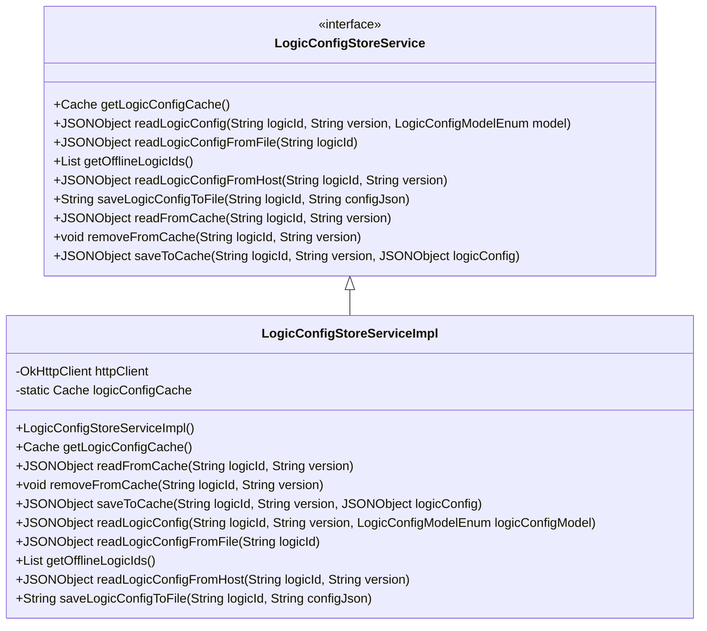
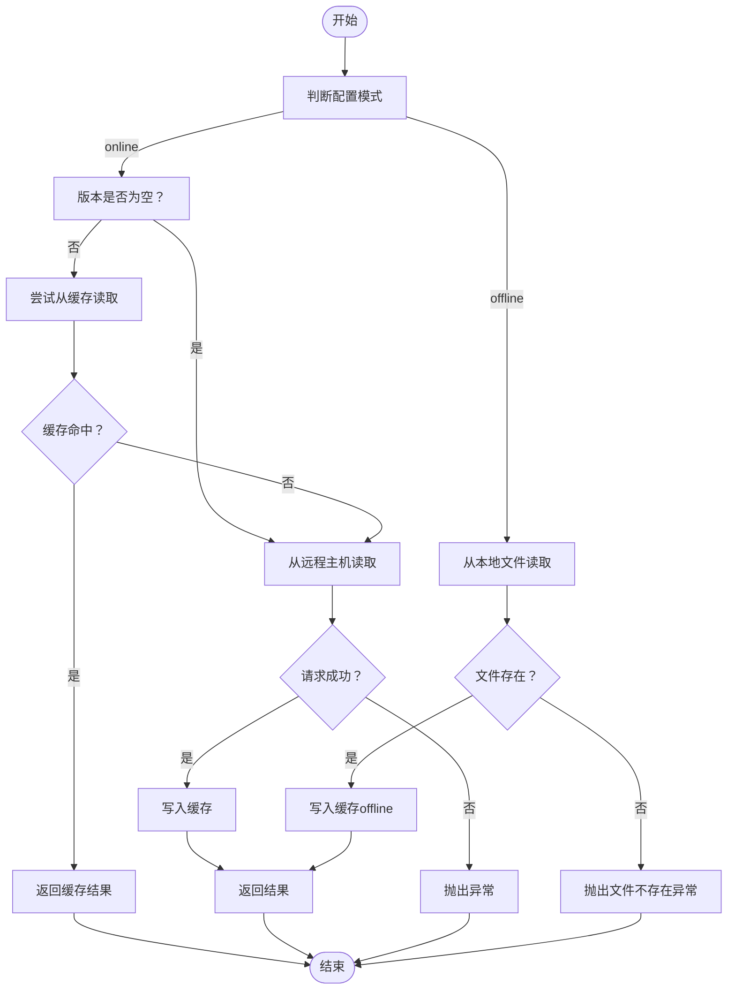
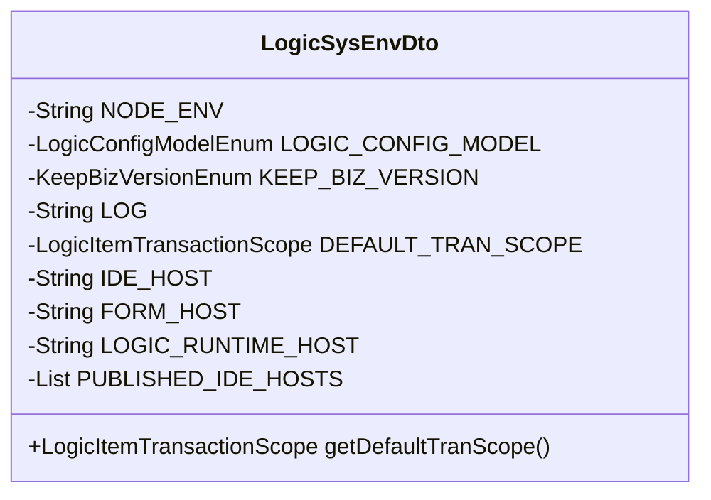
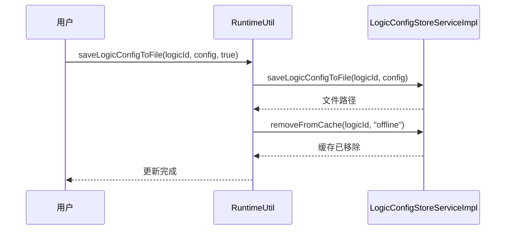
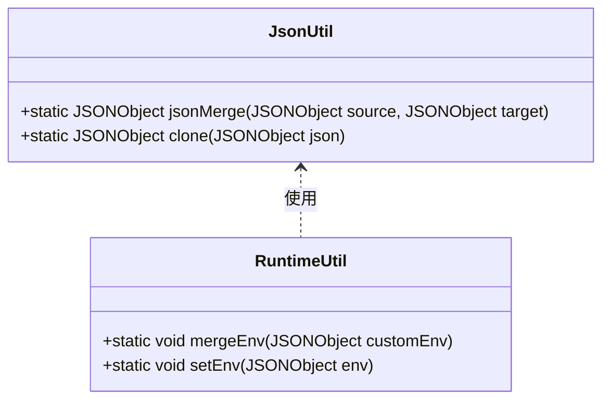

# 配置管理

<cite>
**本文档中引用的文件**  
- [LogicConfigStoreService.java](file://logic-runtime/src/main/java/com/aims/logic/runtime/store/LogicConfigStoreService.java)
- [LogicConfigStoreServiceImpl.java](file://logic-runtime/src/main/java/com/aims/logic/runtime/store/impl/LogicConfigStoreServiceImpl.java)
- [CaffeineCacheConfig.java](file://logic-runtime/src/main/java/com/aims/logic/runtime/configuration/CaffeineCacheConfig.java)
- [LogicAppConfig.java](file://logic-runtime/src/main/java/com/aims/logic/runtime/env/LogicAppConfig.java)
- [LogicSysEnvDto.java](file://logic-runtime/src/main/java/com/aims/logic/runtime/env/LogicSysEnvDto.java)
- [JsonUtil.java](file://logic-runtime/src/main/java/com/aims/logic/runtime/util/JsonUtil.java)
- [FileUtil.java](file://logic-runtime/src/main/java/com/aims/logic/runtime/util/FileUtil.java)
- [RuntimeUtil.java](file://logic-runtime/src/main/java/com/aims/logic/runtime/util/RuntimeUtil.java)
- [LogicConfigModelEnum.java](file://logic-runtime/src/main/java/com/aims/logic/runtime/contract/enums/LogicConfigModelEnum.java)
</cite>

## 目录
1. [引言](#引言)
2. [核心组件](#核心组件)
3. [配置加载流程](#配置加载流程)
4. [缓存机制](#缓存机制)
5. [应用与环境配置管理](#应用与环境配置管理)
6. [热更新实现](#热更新实现)
7. [序列化与反序列化](#序列化与反序列化)
8. [分布式环境下的挑战](#分布式环境下的挑战)
9. [结论](#结论)

## 引言
本系统采用分层配置存储机制，支持从本地文件系统或远程服务加载逻辑配置。通过缓存优化、热更新支持和灵活的配置模型，确保配置读取的高性能与高可用性。核心组件包括 `LogicConfigStoreService` 接口及其具体实现 `LogicConfigStoreServiceImpl`，结合 Caffeine 缓存、JSON 序列化工具和环境配置管理类，构建了完整的配置管理体系。

## 核心组件

### LogicConfigStoreService 接口
该接口定义了配置存储的核心操作契约，包括：
- 从缓存读取配置
- 从文件或远程主机加载配置
- 管理离线逻辑列表
- 将配置写入本地文件
- 缓存的增删查操作

**Section sources**
- [LogicConfigStoreService.java](file://logic-runtime/src/main/java/com/aims/logic/runtime/store/LogicConfigStoreService.java#L12-L65)

### LogicConfigStoreServiceImpl 实现类
作为 `LogicConfigStoreService` 的默认实现，`LogicConfigStoreServiceImpl` 提供了完整的配置加载与缓存管理功能。其主要职责包括：
- 初始化 HTTP 客户端用于远程调用
- 管理本地 Caffeine 缓存实例
- 实现多源配置读取策略（本地文件 vs 远程服务）
- 处理缓存命中与失效逻辑



**Diagram sources**
- [LogicConfigStoreService.java](file://logic-runtime/src/main/java/com/aims/logic/runtime/store/LogicConfigStoreService.java#L12-L65)
- [LogicConfigStoreServiceImpl.java](file://logic-runtime/src/main/java/com/aims/logic/runtime/store/impl/LogicConfigStoreServiceImpl.java#L1-L169)

## 配置加载流程

### 配置读取主流程
配置加载遵循“缓存优先 → 多源回退”的原则。根据配置模式（online/offline）决定数据源优先级。



**Diagram sources**
- [LogicConfigStoreServiceImpl.java](file://logic-runtime/src/main/java/com/aims/logic/runtime/store/impl/LogicConfigStoreServiceImpl.java#L100-L169)

**Section sources**
- [LogicConfigStoreServiceImpl.java](file://logic-runtime/src/main/java/com/aims/logic/runtime/store/impl/LogicConfigStoreServiceImpl.java#L100-L169)

## 缓存机制

### Caffeine 缓存配置
系统使用 Caffeine 作为本地缓存组件，`LogicConfigStoreServiceImpl` 中直接定义了缓存实例：

- **初始容量**：100
- **过期策略**：访问后1小时过期（`expireAfterAccess(Duration.ofHours(1))`）
- **最大容量**：注释中提及200，但当前未启用（`.maximumSize(200)` 被注释）

> 注意：`CaffeineCacheConfig.java` 文件虽存在，但被注释，实际缓存配置在 `LogicConfigStoreServiceImpl` 中硬编码实现。

```mermaid
classDiagram
class CaffeineCacheConfig {
<<configuration>>
//-Cache caffeineCache()
}
class LogicConfigStoreServiceImpl {
-static Cache<String, JSONObject> logicConfigCache
}
CaffeineCacheConfig -.-> LogicConfigStoreServiceImpl : 配置被绕过
```

**Diagram sources**
- [CaffeineCacheConfig.java](file://logic-runtime/src/main/java/com/aims/logic/runtime/configuration/CaffeineCacheConfig.java#L1-L22)
- [LogicConfigStoreServiceImpl.java](file://logic-runtime/src/main/java/com/aims/logic/runtime/store/impl/LogicConfigStoreServiceImpl.java#L25-L30)

**Section sources**
- [CaffeineCacheConfig.java](file://logic-runtime/src/main/java/com/aims/logic/runtime/configuration/CaffeineCacheConfig.java#L1-L22)
- [LogicConfigStoreServiceImpl.java](file://logic-runtime/src/main/java/com/aims/logic/runtime/store/impl/LogicConfigStoreServiceImpl.java#L25-L30)

## 应用与环境配置管理

### LogicAppConfig
该类通过 Spring `@Value` 注解注入应用级配置参数，支持外部化配置：

- `CONFIG_DIR`：配置根目录，默认为 `./logic-configs`
- `BIZ_ERROR_CLASSES`：业务异常类列表
- `SERVER_PORT`：服务端口，默认8080
- `itemQueueSize`：日志项队列大小

**Section sources**
- [LogicAppConfig.java](file://logic-runtime/src/main/java/com/aims/logic/runtime/env/LogicAppConfig.java#L1-L21)

### LogicSysEnvDto
该数据传输对象封装运行时环境变量，提供强类型访问：

- `NODE_ENV`：当前环境标识
- `LOGIC_CONFIG_MODEL`：配置模式（online/offline）
- `IDE_HOST`：远程 IDE 主机地址
- `DEFAULT_TRAN_SCOPE`：默认事务作用域
- `PUBLISHED_IDE_HOSTS`：已发布的集成开发环境列表



**Diagram sources**
- [LogicSysEnvDto.java](file://logic-runtime/src/main/java/com/aims/logic/runtime/env/LogicSysEnvDto.java#L1-L47)

**Section sources**
- [LogicSysEnvDto.java](file://logic-runtime/src/main/java/com/aims/logic/runtime/env/LogicSysEnvDto.java#L1-L47)

## 热更新实现

### 配置热更新流程
系统支持配置热更新，通过 `RuntimeUtil.saveLogicConfigToFile(..., true)` 触发：

1. 将新配置写入本地文件
2. 显式调用 `removeFromCache(logicId, "offline")` 失效缓存
3. 下次读取时自动从文件重新加载并重建缓存

此机制确保在不重启服务的情况下更新离线配置。



**Diagram sources**
- [RuntimeUtil.java](file://logic-runtime/src/main/java/com/aims/logic/runtime/util/RuntimeUtil.java#L150-L165)
- [LogicConfigStoreServiceImpl.java](file://logic-runtime/src/main/java/com/aims/logic/runtime/store/impl/LogicConfigStoreServiceImpl.java#L150-L160)

**Section sources**
- [RuntimeUtil.java](file://logic-runtime/src/main/java/com/aims/logic/runtime/util/RuntimeUtil.java#L150-L165)

## 序列化与反序列化

### JsonUtil 工具类
`JsonUtil` 提供关键的 JSON 操作功能：

- `jsonMerge(source, target)`：合并两个 JSON 对象，数组属性不合并，直接覆盖
- `clone(json)`：深克隆 JSON 对象
- 支持嵌套对象递归合并

该工具在环境变量合并（`RuntimeUtil.mergeEnv`）等场景中被广泛使用。



**Diagram sources**
- [JsonUtil.java](file://logic-runtime/src/main/java/com/aims/logic/runtime/util/JsonUtil.java#L1-L78)
- [RuntimeUtil.java](file://logic-runtime/src/main/java/com/aims/logic/runtime/util/RuntimeUtil.java#L70-L85)

**Section sources**
- [JsonUtil.java](file://logic-runtime/src/main/java/com/aims/logic/runtime/util/JsonUtil.java#L1-L78)

## 分布式环境下的挑战

### 配置一致性问题
当前实现为**本地缓存模式**，在分布式部署场景下面临以下挑战：

1. **缓存不一致**：各节点缓存独立，热更新仅失效本节点缓存
2. **配置同步延迟**：依赖远程 IDE 服务，网络波动影响配置获取
3. **无中心化配置管理**：缺乏如 Nacos、Apollo 等配置中心支持

### 潜在解决方案
| 问题 | 解决方案 |
|------|----------|
| 缓存一致性 | 引入 Redis 作为分布式缓存，或使用消息队列广播缓存失效事件 |
| 配置中心化 | 集成 Nacos/Apollo，实现配置的统一管理与动态推送 |
| 高可用 | 部署多副本 IDE 服务，配置负载均衡地址 |
| 安全性 | 增加配置访问鉴权（如 JWT）和传输加密（HTTPS） |

当前系统通过 `IDE_HOST` 配置支持指定远程服务地址，为后续集成提供了扩展基础。

## 结论
本系统通过 `LogicConfigStoreService` 及其实现类构建了灵活的配置加载机制，结合 Caffeine 本地缓存显著提升了读取性能。`LogicAppConfig` 和 `LogicSysEnvDto` 实现了应用级与环境级配置的分离管理。`JsonUtil` 提供了可靠的序列化支持。热更新通过“写文件+删缓存”实现。然而，在分布式环境下存在缓存一致性风险，建议未来引入分布式缓存或配置中心以增强系统健壮性。