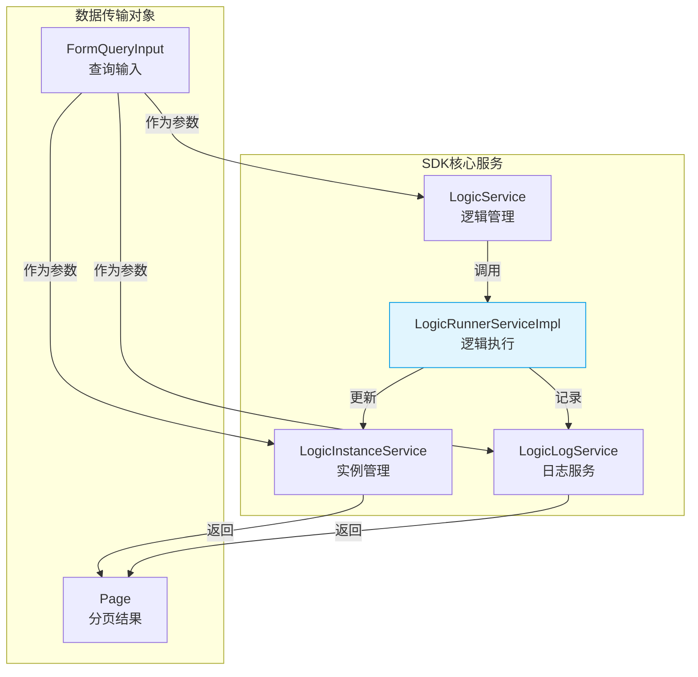
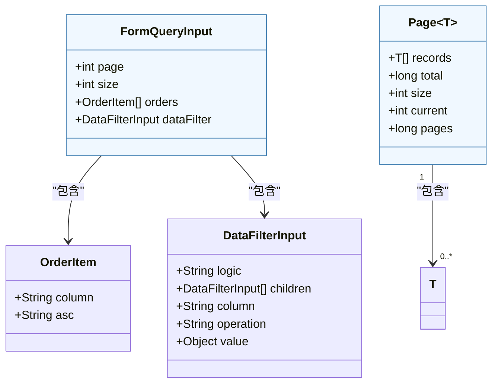

# SDK服务接口

<cite>
**本文档中引用的文件**  
- [LogicRunnerServiceImpl.java](file://logic-sdk/src/main/java/com/aims/logic/sdk/LogicRunnerServiceImpl.java)
- [LogicService.java](file://logic-sdk/src/main/java/com/aims/logic/sdk/service/LogicService.java)
- [LogicInstanceService.java](file://logic-sdk/src/main/java/com/aims/logic/sdk/service/LogicInstanceService.java)
- [LogicLogService.java](file://logic-sdk/src/main/java/com/aims/logic/sdk/service/LogicLogService.java)
- [FormQueryInput.java](file://logic-sdk/src/main/java/com/aims/logic/sdk/dto/FormQueryInput.java)
- [Page.java](file://logic-sdk/src/main/java/com/aims/logic/sdk/dto/Page.java)
</cite>

## 目录
1. [简介](#简介)
2. [核心服务接口概览](#核心服务接口概览)
3. [LogicRunnerServiceImpl：逻辑执行引擎](#logicrunnerserviceimpl逻辑执行引擎)
4. [LogicService：逻辑管理接口](#logicservice逻辑管理接口)
5. [LogicInstanceService：实例生命周期管理](#logicinstanceservice实例生命周期管理)
6. [LogicLogService：日志记录与检索](#logiclogservice日志记录与检索)
7. [分页与数据过滤：FormQueryInput 与 Page](#分页与数据过滤formqueryinput-与-page)
8. [典型调用示例](#典型调用示例)
9. [异常处理策略](#异常处理策略)
10. [性能优化建议](#性能优化建议)
11. [附录](#附录)

## 简介
本SDK为业务逻辑的编排、执行与管理提供了一套完整的解决方案。其核心在于通过`LogicRunnerServiceImpl`实现灵活的逻辑执行流程，支持同步与异步调用，并深度集成事务控制机制。同时，SDK提供了`LogicService`、`LogicInstanceService`和`LogicLogService`等服务接口，分别用于逻辑定义的管理、业务实例的生命周期监控以及执行过程的日志追踪。通过`FormQueryInput`和`Page`等DTO类，SDK还实现了强大的分页查询与数据过滤功能，便于在实际应用中进行数据集成与分析。

## 核心服务接口概览
SDK的核心服务接口围绕业务逻辑的“定义-执行-管理-监控”全生命周期构建。`LogicService`负责逻辑的增删改查与发布；`LogicRunnerServiceImpl`作为执行引擎，封装了复杂的运行时流程；`LogicInstanceService`跟踪每一次业务执行的实例状态；`LogicLogService`则记录了执行过程中的详细日志。这些服务协同工作，为上层应用提供了稳定、可靠且可追溯的逻辑执行能力。



**图示来源**
- [LogicRunnerServiceImpl.java](file://logic-sdk/src/main/java/com/aims/logic/sdk/LogicRunnerServiceImpl.java)
- [LogicService.java](file://logic-sdk/src/main/java/com/aims/logic/sdk/service/LogicService.java)
- [LogicInstanceService.java](file://logic-sdk/src/main/java/com/aims/logic/sdk/service/LogicInstanceService.java)
- [LogicLogService.java](file://logic-sdk/src/main/java/com/aims/logic/sdk/service/LogicLogService.java)
- [FormQueryInput.java](file://logic-sdk/src/main/java/com/aims/logic/sdk/dto/FormQueryInput.java)
- [Page.java](file://logic-sdk/src/main/java/com/aims/logic/sdk/dto/Page.java)

## LogicRunnerServiceImpl：逻辑执行引擎

`LogicRunnerServiceImpl`是SDK的核心执行组件，它实现了`LogicRunnerService`接口，负责封装逻辑执行的全部流程。该服务支持同步与异步两种调用模式，并通过`tranPropagation`参数和`bizLock`机制，实现了对事务传播行为的精细控制。

### 同步与异步调用模式
服务通过`isAsync`标志位区分调用模式。在同步模式下，`runBizByMap`等方法会阻塞直到逻辑执行完成或失败。在异步模式下，方法会立即返回，实际的执行在后台进行。实例的`isAsync`属性在创建时确定，并在执行过程中被继承。

### 事务控制机制
`LogicRunnerServiceImpl`的事务控制是其最核心的特性之一。它支持多种事务范围（`LogicItemTransactionScope`），包括：
- `everyRequest`：每个交互点作为一个事务。
- `everyNode`：每个节点作为一个事务。
- `off`：不使用事务。

服务通过`TransactionalUtils`工具类管理Spring事务，并在`runBizInstanceWithEveryNodeTran`等私有方法中实现了不同事务模式下的执行逻辑。例如，在`everyNode`模式下，每个节点执行前会开启一个新事务，执行成功后提交，失败则回滚，并将执行指针重置到事务组的起始节点，确保了错误的可恢复性。

```mermaid
sequenceDiagram
participant Client as "客户端"
participant Runner as "LogicRunnerServiceImpl"
participant Lock as "BizLock"
participant Tran as "TransactionalUtils"
participant DB as "数据库"
Client->>Runner : runBizByMap(logicId, bizId, parsMap)
Runner->>Lock : spinLock(lockKey)
Lock-->>Runner : 获取锁成功
alt 事务传播为REQUIRES_NEW
Runner->>Tran : newRequiresNewTran()
Tran-->>Runner : 事务状态
end
Runner->>Runner : runBiz(logicId, bizId, ...)
Runner->>Runner : 根据tranScope选择执行模式
loop 每个节点
Runner->>Runner : beginNewTranIfNewGroup()
Runner->>Runner : runItem(nextItem)
alt 执行成功
Runner->>Runner : commitCurTranIfNextIsNewGroup()
else 执行失败
Runner->>Tran : rollback(事务状态)
Runner->>Runner : 重置nextItem
break
end
end
Runner->>Tran : commit(主事务)
Runner->>Lock : unlock(lockKey)
Runner-->>Client : LogicRunResult
```

**图示来源**
- [LogicRunnerServiceImpl.java](file://logic-sdk/src/main/java/com/aims/logic/sdk/LogicRunnerServiceImpl.java#L300-L799)

**本节来源**
- [LogicRunnerServiceImpl.java](file://logic-sdk/src/main/java/com/aims/logic/sdk/LogicRunnerServiceImpl.java)

## LogicService：逻辑管理接口

`LogicService`接口定义了对业务逻辑本身进行管理的核心功能。它继承自`BaseService`，提供了对`LogicEntity`实体的标准CRUD操作，并扩展了与业务逻辑生命周期相关的特有方法。

### 核心功能
- **编辑与备份**：`editAndBak`方法在编辑逻辑的同时，会自动创建一个备份版本，确保变更的可追溯性。
- **发布到本地**：`pubToLocal`方法将指定ID的逻辑发布到本地运行时环境，`isHotUpdate`参数控制是否进行热更新。
- **远程发布**：`pubToLocalFromEntityJson`和`pubToIdeHost`方法支持从JSON字符串或远程IDE主机发布逻辑，便于实现跨环境部署。
- **远程查询**：`selectPageFromRemoteIde`方法允许从指定的IDE主机查询逻辑列表，支持分页和过滤。
- **模块查询**：`getModuleList`方法返回所有可用的逻辑模块列表，便于前端进行分类展示。

**本节来源**
- [LogicService.java](file://logic-sdk/src/main/java/com/aims/logic/sdk/service/LogicService.java)

## LogicInstanceService：实例生命周期管理

`LogicInstanceService`接口专注于管理业务逻辑的每一次具体执行实例（`LogicInstanceEntity`）。它提供了对实例状态的查询、清理和触发器功能。

### 核心功能
- **实例查询**：`getInstance`方法根据`logicId`和`bizId`获取特定业务实例的当前状态。
- **未完成实例查询**：`queryUncompletedBiz`系列方法允许根据创建时间、运行状态、成功状态等条件查询未完成的业务实例，是监控系统健康状况的关键。
- **长时间运行实例查询**：`queryLongtimeRunningBiz`方法用于找出执行时间超过指定超时阈值的实例，便于进行告警或人工干预。
- **实例清理**：`deleteCompletedBizInstance`和`deleteCompletedBizInstanceByLogicId`方法用于清理已完成的实例，防止数据库膨胀。
- **状态更新**：`updateInstanceNextId`方法用于更新实例的下一个执行节点和相关变量，是执行引擎内部状态同步的基础。
- **事件触发器**：`triggerBeforeLogicRun`、`triggerAfterLogicStop`和`triggerBizCompleted`方法在逻辑执行的关键节点被调用，可用于实现自定义的监控、通知或数据同步逻辑。

**本节来源**
- [LogicInstanceService.java](file://logic-sdk/src/main/java/com/aims/logic/sdk/service/LogicInstanceService.java)

## LogicLogService：日志记录与检索

`LogicLogService`接口负责记录和检索业务逻辑执行过程中的详细日志。日志是诊断问题、审计流程和分析性能的最重要依据。

### 核心功能
- **日志存储**：`addLogicLog`方法将`LogicLog`实体持久化到存储（如Elasticsearch或数据库）。
- **日志查询**：提供分页查询接口，支持根据`logicId`、`bizId`、时间范围等条件检索日志。
- **日志清理**：`clearLog`方法用于清空日志表，通常在测试或维护时使用。

日志服务的具体实现（如`LogicLogServiceEsImpl`）会根据配置选择不同的存储后端，确保了日志系统的灵活性和可扩展性。

**本节来源**
- [LogicLogService.java](file://logic-sdk/src/main/java/com/aims/logic/sdk/service/LogicLogService.java)

## 分页与数据过滤：FormQueryInput 与 Page

为了支持对逻辑、实例和日志等数据的高效查询，SDK提供了`FormQueryInput`和`Page`两个核心DTO类。

### FormQueryInput：查询输入
`FormQueryInput`类封装了分页查询的所有输入参数：
- `page`：当前页码。
- `size`：每页大小。
- `orders`：排序规则列表，包含字段名和升降序。
- `dataFilter`：数据过滤条件，支持复杂的嵌套查询。

### Page：分页结果
`Page`类封装了分页查询的返回结果：
- `records`：当前页的数据记录列表。
- `total`：满足查询条件的总记录数。
- `size`：每页大小。
- `current`：当前页码。
- `pages`：总页数。

这两个类共同构成了SDK统一的分页查询协议，使得前端可以以一致的方式处理来自不同服务的分页数据。



**图示来源**
- [FormQueryInput.java](file://logic-sdk/src/main/java/com/aims/logic/sdk/dto/FormQueryInput.java)
- [Page.java](file://logic-sdk/src/main/java/com/aims/logic/sdk/dto/Page.java)

**本节来源**
- [FormQueryInput.java](file://logic-sdk/src/main/java/com/aims/logic/sdk/dto/FormQueryInput.java)
- [Page.java](file://logic-sdk/src/main/java/com/aims/logic/sdk/dto/Page.java)

## 典型调用示例

以下是一个典型的集成调用示例，展示了如何使用SDK的核心服务：

```java
// 1. 获取LogicRunnerService实例
@Autowired
private LogicRunnerService logicRunnerService;

// 2. 设置环境变量（可选）
JSONObject customEnv = new JSONObject();
customEnv.put("apiUrl", "https://api.example.com");
logicRunnerService.setEnv(customEnv, false);

// 3. 准备入参
Map<String, Object> params = new HashMap<>();
params.put("orderId", "12345");
params.put("amount", 100.0);

// 4. 同步执行业务逻辑
LogicRunResult result = logicRunnerService.runBizByMap("PAYMENT_PROCESS", "BIZ_001", params);

// 5. 处理结果
if (result.isSuccess()) {
    System.out.println("执行成功: " + result.getData());
} else {
    System.err.println("执行失败: " + result.getMsg());
    // 尝试重试
    LogicRunResult retryResult = logicRunnerService.retryErrorBiz("PAYMENT_PROCESS", "BIZ_001");
}
```

## 异常处理策略

SDK在设计上充分考虑了异常处理：
1. **业务异常**：由`LogicBizException`表示，通常由业务逻辑内部抛出，会被执行引擎捕获并记录在`LogicRunResult`中。
2. **手动中断**：当检测到`bizLock.isStopping()`为真时，会抛出`BizManuallyStoppedException`，表示业务被手动停止。
3. **系统异常**：对于未预期的`Exception`，执行引擎会捕获并打印堆栈，同时回滚当前事务，确保系统状态的一致性。
4. **重试机制**：`retryErrorBiz`方法提供了内置的重试功能，允许从失败的节点继续执行，提高了系统的容错能力。

## 性能优化建议

1. **合理使用事务**：避免在`everyNode`模式下执行大量节点，因为频繁的事务开启和提交会带来显著的性能开销。对于非关键操作，可考虑使用`off`模式。
2. **优化锁机制**：`bizLock`使用自旋锁，应确保业务逻辑执行时间不宜过长，避免长时间占用锁导致其他请求阻塞。
3. **日志级别控制**：在生产环境中，应合理设置日志级别，避免过度的日志输出影响性能。
4. **缓存配置**：利用`CaffeineCacheConfig`等配置，对频繁读取的逻辑配置进行缓存，减少对存储的访问。

## 附录

### 核心枚举类型
- `LogicRunModelEnum`：逻辑运行模式。
- `RunnerStatusEnum`：执行器状态。
- `LogicStopModel`：停止模式（手动、超时等）。
- `KeepBizVersionEnum`：业务版本保持策略。

### 核心实体类
- `LogicEntity`：逻辑定义实体。
- `LogicInstanceEntity`：业务实例实体。
- `LogicLogEntity`：日志实体。