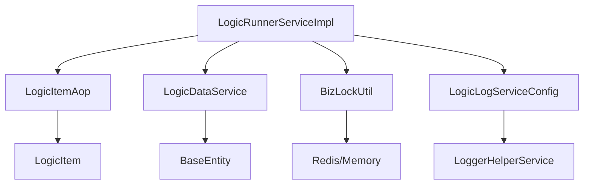
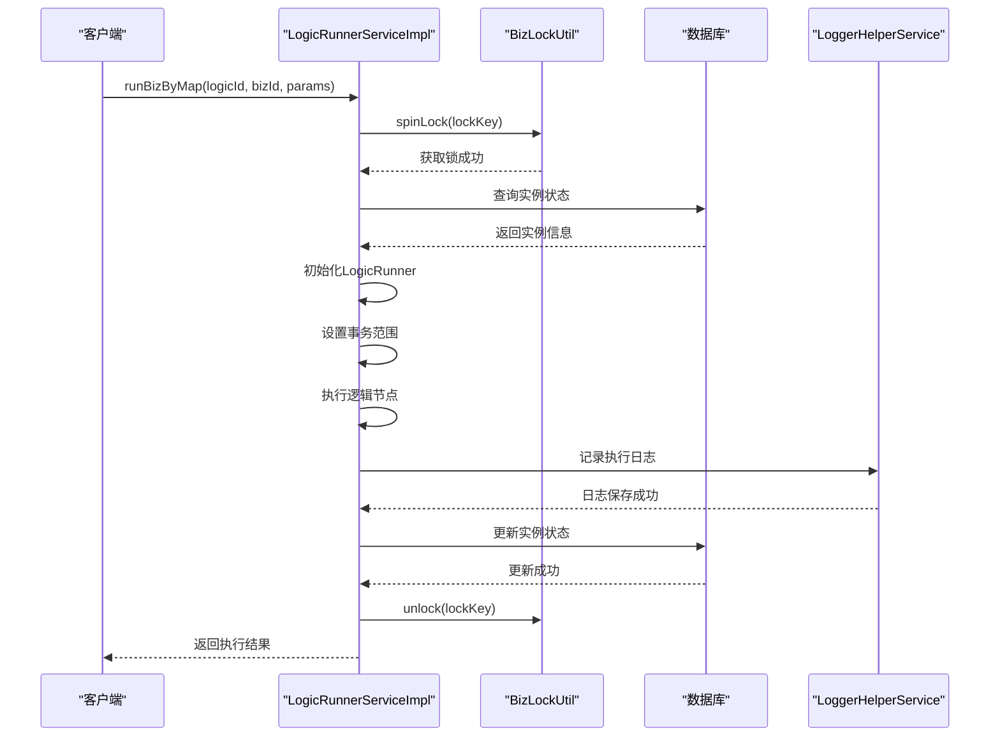
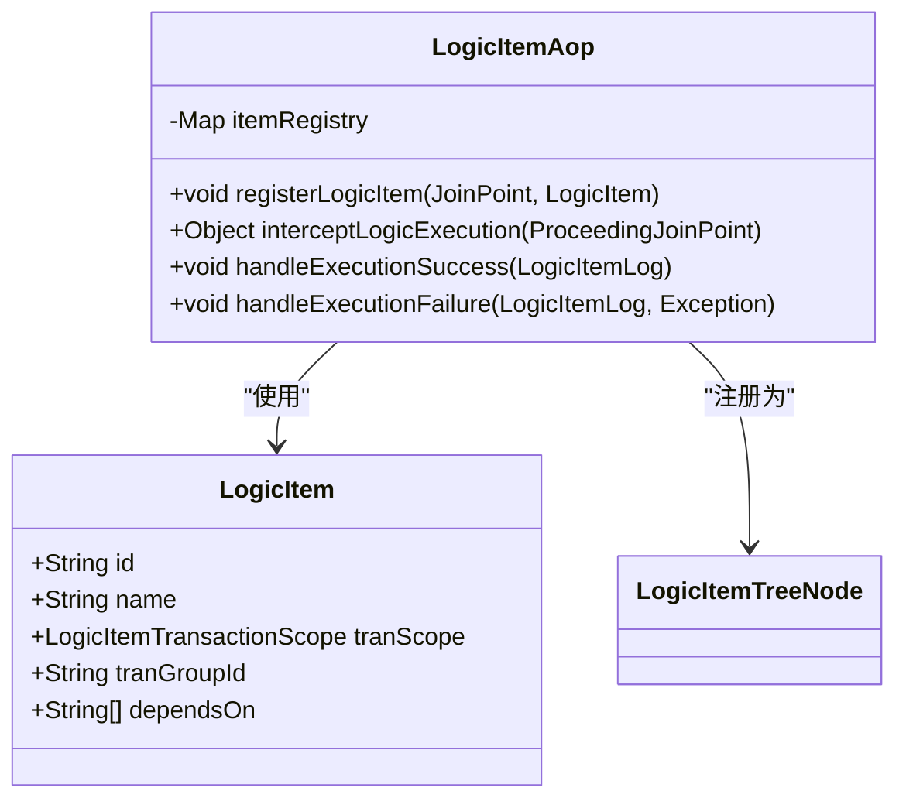
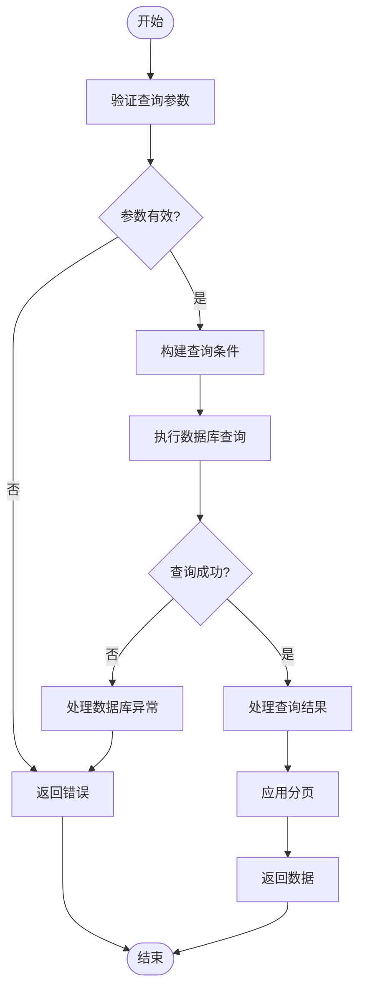
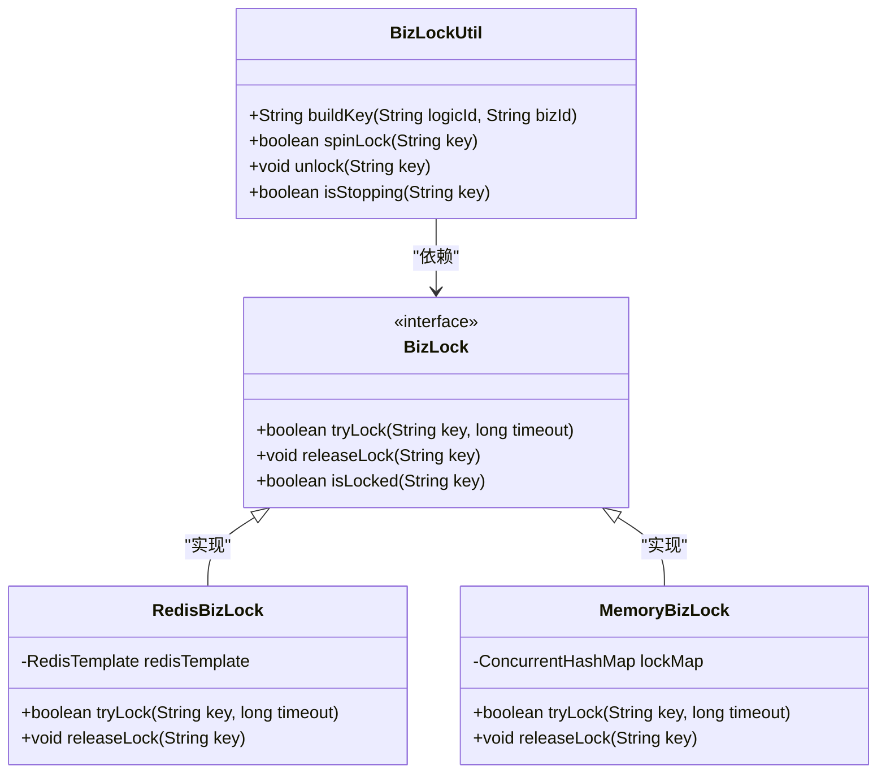
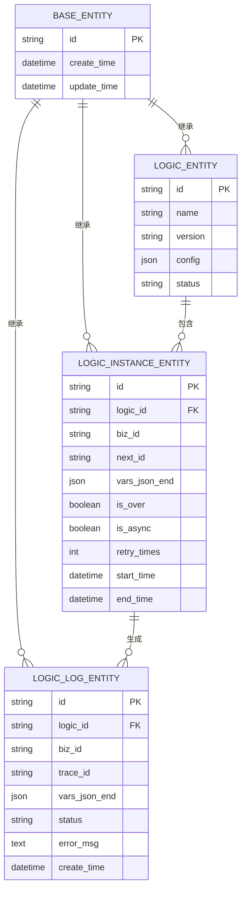
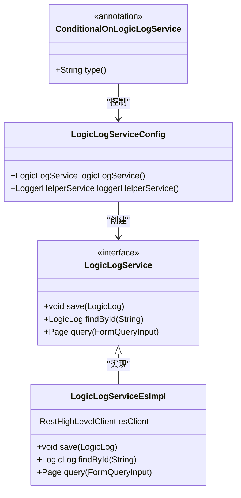

# logic-sdk 模块

<cite>
**本文档引用文件**  
- [LogicRunnerServiceImpl.java](file://logic-sdk/src/main/java/com/aims/logic/sdk/LogicRunnerServiceImpl.java)
- [LogicItemAop.java](file://logic-sdk/src/main/java/com/aims/logic/sdk/aop/LogicItemAop.java)
- [LogicItem.java](file://logic-sdk/src/main/java/com/aims/logic/sdk/annotation/LogicItem.java)
- [LogicDataService.java](file://logic-sdk/src/main/java/com/aims/logic/sdk/LogicDataService.java)
- [BizLockUtil.java](file://logic-sdk/src/main/java/com/aims/logic/sdk/util/BizLockUtil.java)
- [BaseEntity.java](file://logic-sdk/src/main/java/com/aims/logic/sdk/entity/BaseEntity.java)
- [LogicEntity.java](file://logic-sdk/src/main/java/com/aims/logic/sdk/entity/LogicEntity.java)
- [LogicInstanceEntity.java](file://logic-sdk/src/main/java/com/aims/logic/sdk/entity/LogicInstanceEntity.java)
- [LogicLogEntity.java](file://logic-sdk/src/main/java/com/aims/logic/sdk/entity/LogicLogEntity.java)
- [LogicLogServiceConfig.java](file://logic-sdk/src/main/java/com/aims/logic/sdk/config/LogicLogServiceConfig.java)
</cite>

## 目录
1. [简介](#简介)
2. [核心组件](#核心组件)
3. [运行时执行机制](#运行时执行机制)
4. [逻辑节点注解与AOP拦截](#逻辑节点注解与aop拦截)
5. [数据服务与CRUD操作](#数据服务与crud操作)
6. [分布式业务锁实现](#分布式业务锁实现)
7. [实体类与数据库映射](#实体类与数据库映射)
8. [日志服务配置扩展](#日志服务配置扩展)
9. [集成使用范式与最佳实践](#集成使用范式与最佳实践)

## 简介
`logic-sdk` 是一个面向业务逻辑编排的开发工具包，提供运行时调用封装、逻辑节点自动注册、数据持久化、分布式锁控制及日志记录等核心能力。本模块为外部系统集成提供统一的API接口和可扩展的配置机制，支持同步/异步执行、事务传播控制和业务实例状态管理。

## 核心组件

`logic-sdk` 的核心功能围绕 `LogicRunnerServiceImpl` 展开，结合 `LogicItem` 注解、`LogicItemAop` 切面、`LogicDataService` 数据服务、`BizLockUtil` 分布式锁工具及 `LogicLogServiceConfig` 日志配置类，构建了一套完整的逻辑执行与管理框架。

**核心组件关系图**


**图示来源**  
- [LogicRunnerServiceImpl.java](file://logic-sdk/src/main/java/com/aims/logic/sdk/LogicRunnerServiceImpl.java)
- [LogicItemAop.java](file://logic-sdk/src/main/java/com/aims/logic/sdk/aop/LogicItemAop.java)
- [LogicDataService.java](file://logic-sdk/src/main/java/com/aims/logic/sdk/LogicDataService.java)
- [BizLockUtil.java](file://logic-sdk/src/main/java/com/aims/logic/sdk/util/BizLockUtil.java)
- [LogicLogServiceConfig.java](file://logic-sdk/src/main/java/com/aims/logic/sdk/config/LogicLogServiceConfig.java)

**本节来源**  
- [LogicRunnerServiceImpl.java](file://logic-sdk/src/main/java/com/aims/logic/sdk/LogicRunnerServiceImpl.java)
- [LogicItemAop.java](file://logic-sdk/src/main/java/com/aims/logic/sdk/aop/LogicItemAop.java)
- [LogicDataService.java](file://logic-sdk/src/main/java/com/aims/logic/sdk/LogicDataService.java)

## 运行时执行机制

`LogicRunnerServiceImpl` 实现了 `LogicRunnerService` 接口，封装了逻辑运行时的调用流程，支持同步与异步执行模式，并提供事务传播控制能力。

### 执行接口
- `runByMap`: 通过逻辑ID和参数Map执行，适用于一次性执行场景。
- `runBizByMap`: 通过业务标识（bizId）执行，支持状态持久化与断点续跑。
- `retryErrorBiz`: 重试失败的业务实例，从上次中断点继续执行。

### 事务支持
通过 `tranPropagation` 参数控制事务传播行为：
- `REQUIRED`: 默认，加入当前事务。
- `REQUIRES_NEW`: 开启新事务。
- `NOT_SUPPORTED`: 不支持事务。

事务范围由 `LogicItemTransactionScope` 枚举控制，支持 `everyNode`（每节点）、`everyRequest`（每请求）、`off`（无事务）等模式。



**图示来源**  
- [LogicRunnerServiceImpl.java](file://logic-sdk/src/main/java/com/aims/logic/sdk/LogicRunnerServiceImpl.java#L200-L500)

**本节来源**  
- [LogicRunnerServiceImpl.java](file://logic-sdk/src/main/java/com/aims/logic/sdk/LogicRunnerServiceImpl.java)

## 逻辑节点注解与AOP拦截

### LogicItem 注解
`@LogicItem` 用于标记逻辑节点方法，实现自动注册与元数据提取。关键属性包括：
- `id`: 节点唯一标识
- `name`: 节点名称
- `tranScope`: 事务范围
- `tranGroupId`: 事务组ID表达式

### LogicItemAop 切面
通过Spring AOP拦截 `@LogicItem` 注解的方法，实现以下功能：
- 自动注册逻辑节点到运行时上下文
- 执行前/后日志记录
- 异常处理与状态更新
- 事务边界控制



**图示来源**  
- [LogicItem.java](file://logic-sdk/src/main/java/com/aims/logic/sdk/annotation/LogicItem.java)
- [LogicItemAop.java](file://logic-sdk/src/main/java/com/aims/logic/sdk/aop/LogicItemAop.java)

**本节来源**  
- [LogicItem.java](file://logic-sdk/src/main/java/com/aims/logic/sdk/annotation/LogicItem.java)
- [LogicItemAop.java](file://logic-sdk/src/main/java/com/aims/logic/sdk/aop/LogicItemAop.java)

## 数据服务与CRUD操作

`LogicDataService` 提供统一的数据访问接口，支持对逻辑实例、日志、配置等实体的CRUD操作。

### 核心功能
- `saveInstance`: 保存逻辑实例状态
- `updateInstance`: 更新实例变量与进度
- `queryByCondition`: 条件查询逻辑日志
- `deleteCompletedInstance`: 清理已完成实例

### 查询能力
支持分页、排序、条件过滤：
- `FormQueryInput`: 查询输入参数
- `Page`: 分页信息
- `OrderByInput`: 排序规则
- `DataFilterInput`: 数据过滤条件



**图示来源**  
- [LogicDataService.java](file://logic-sdk/src/main/java/com/aims/logic/sdk/LogicDataService.java)

**本节来源**  
- [LogicDataService.java](file://logic-sdk/src/main/java/com/aims/logic/sdk/LogicDataService.java)

## 分布式业务锁实现

`BizLockUtil` 基于Redis或内存实现分布式业务锁，防止同一业务标识的并发执行。

### 锁机制
- `buildKey`: 构建锁键 `logicId:bizId`
- `spinLock`: 自旋获取锁，支持超时
- `unlock`: 释放锁
- `isStopping`: 检查是否收到停止信号

### 存储支持
- `RedisBizLock`: 基于Redis的分布式锁，适用于集群环境
- `MemoryBizLock`: 基于ConcurrentHashMap的内存锁，适用于单机环境



**图示来源**  
- [BizLockUtil.java](file://logic-sdk/src/main/java/com/aims/logic/sdk/util/BizLockUtil.java)
- [RedisBizLock.java](file://logic-sdk/src/main/java/com/aims/logic/sdk/util/lock/RedisBizLock.java)
- [MemoryBizLock.java](file://logic-sdk/src/main/java/com/aims/logic/sdk/util/lock/MemoryBizLock.java)

**本节来源**  
- [BizLockUtil.java](file://logic-sdk/src/main/java/com/aims/logic/sdk/util/BizLockUtil.java)

## 实体类与数据库映射

`entity` 包下的实体类通过MyBatis-Plus与数据库表映射，遵循统一基类设计。

### 核心实体
- `BaseEntity`: 所有实体的基类，包含ID、创建/更新时间等公共字段
- `LogicEntity`: 逻辑定义实体
- `LogicInstanceEntity`: 逻辑实例实体，记录执行状态
- `LogicLogEntity`: 逻辑执行日志实体

### 注解映射
- `@TableName`: 指定数据库表名
- `@TableId`: 标识主键字段
- `@TableField`: 配置字段映射规则



**图示来源**  
- [BaseEntity.java](file://logic-sdk/src/main/java/com/aims/logic/sdk/entity/BaseEntity.java)
- [LogicEntity.java](file://logic-sdk/src/main/java/com/aims/logic/sdk/entity/LogicEntity.java)
- [LogicInstanceEntity.java](file://logic-sdk/src/main/java/com/aims/logic/sdk/entity/LogicInstanceEntity.java)
- [LogicLogEntity.java](file://logic-sdk/src/main/java/com/aims/logic/sdk/entity/LogicLogEntity.java)

**本节来源**  
- [BaseEntity.java](file://logic-sdk/src/main/java/com/aims/logic/sdk/entity/BaseEntity.java)
- [LogicEntity.java](file://logic-sdk/src/main/java/com/aims/logic/sdk/entity/LogicEntity.java)
- [LogicInstanceEntity.java](file://logic-sdk/src/main/java/com/aims/logic/sdk/entity/LogicInstanceEntity.java)
- [LogicLogEntity.java](file://logic-sdk/src/main/java/com/aims/logic/sdk/entity/LogicLogEntity.java)

## 日志服务配置扩展

`LogicLogServiceConfig` 支持日志存储的可插拔扩展，通过条件化配置加载不同的日志实现。

### 扩展机制
- `@ConditionalOnLogicLogService`: 自定义条件注解，根据配置启用特定日志服务
- `LogicLogService`: 日志服务接口
- `LogicLogServiceEsImpl`: 基于Elasticsearch的实现
- `BaseEsServiceImpl`: ES基础服务封装

### 配置方式
通过 `logic.log.service.type` 配置项选择日志存储类型：
- `es`: 使用Elasticsearch
- 其他: 使用默认存储



**图示来源**  
- [LogicLogServiceConfig.java](file://logic-sdk/src/main/java/com/aims/logic/sdk/config/LogicLogServiceConfig.java)
- [LogicLogService.java](file://logic-sdk/src/main/java/com/aims/logic/sdk/service/LogicLogService.java)
- [LogicLogServiceEsImpl.java](file://logic-sdk/src/main/java/com/aims/logic/sdk/service/impl/es/LogicLogServiceEsImpl.java)

**本节来源**  
- [LogicLogServiceConfig.java](file://logic-sdk/src/main/java/com/aims/logic/sdk/config/LogicLogServiceConfig.java)

## 集成使用范式与最佳实践

### API使用范式
```java
// 1. 获取Runner实例
@Autowired
private LogicRunnerService logicRunnerService;

// 2. 设置环境变量
JSONObject env = new JSONObject();
env.put("envType", "prod");
logicRunnerService.setEnv(env, false);

// 3. 执行业务逻辑
Map<String, Object> params = new HashMap<>();
params.put("orderId", "12345");
LogicRunResult result = logicRunnerService.runBizByMap("PAYMENT_PROCESS", "ORDER_12345", params);

// 4. 处理结果
if (result.isSuccess()) {
    // 业务成功
} else {
    // 重试或告警
    logicRunnerService.retryErrorBiz("PAYMENT_PROCESS", "ORDER_12345");
}
```

### 最佳实践
1. **业务标识唯一性**: 确保 `bizId` 在业务维度唯一，用于幂等控制。
2. **事务合理配置**: 根据业务需求选择合适的事务范围，避免长事务。
3. **异常处理**: 捕获 `LogicBizException` 并进行重试或补偿。
4. **日志监控**: 集成日志服务，实时监控逻辑执行状态。
5. **锁超时设置**: 合理配置 `BizLock` 超时时间，避免死锁。

**本节来源**  
- [LogicRunnerServiceImpl.java](file://logic-sdk/src/main/java/com/aims/logic/sdk/LogicRunnerServiceImpl.java)
- [LogicDataService.java](file://logic-sdk/src/main/java/com/aims/logic/sdk/LogicDataService.java)
- [BizLockUtil.java](file://logic-sdk/src/main/java/com/aims/logic/sdk/util/BizLockUtil.java)