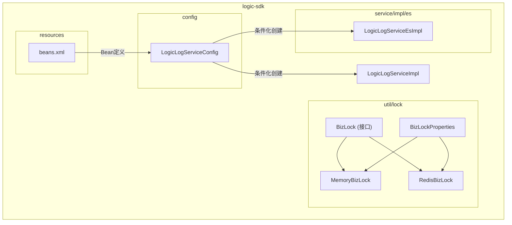
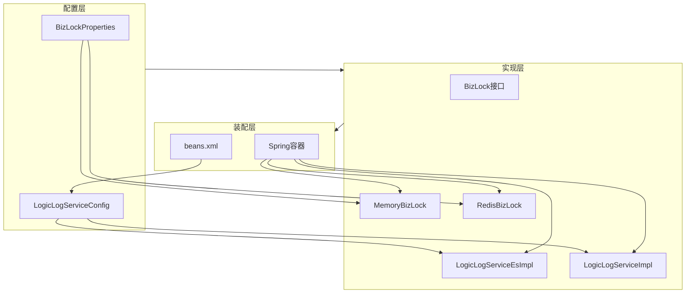
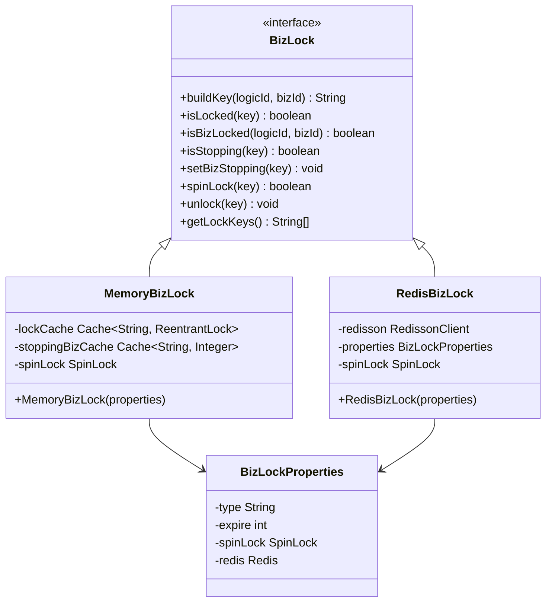
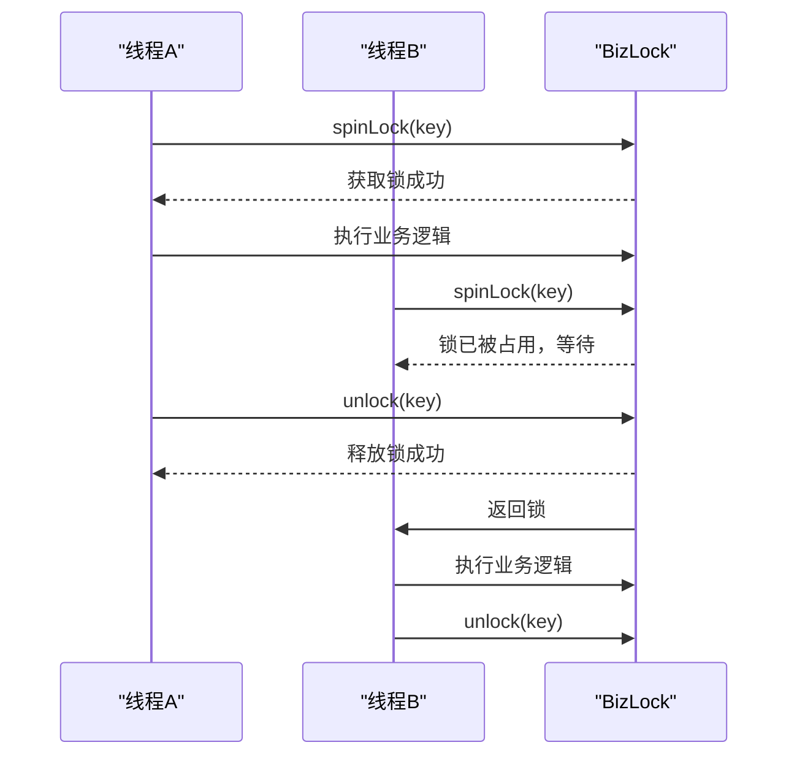
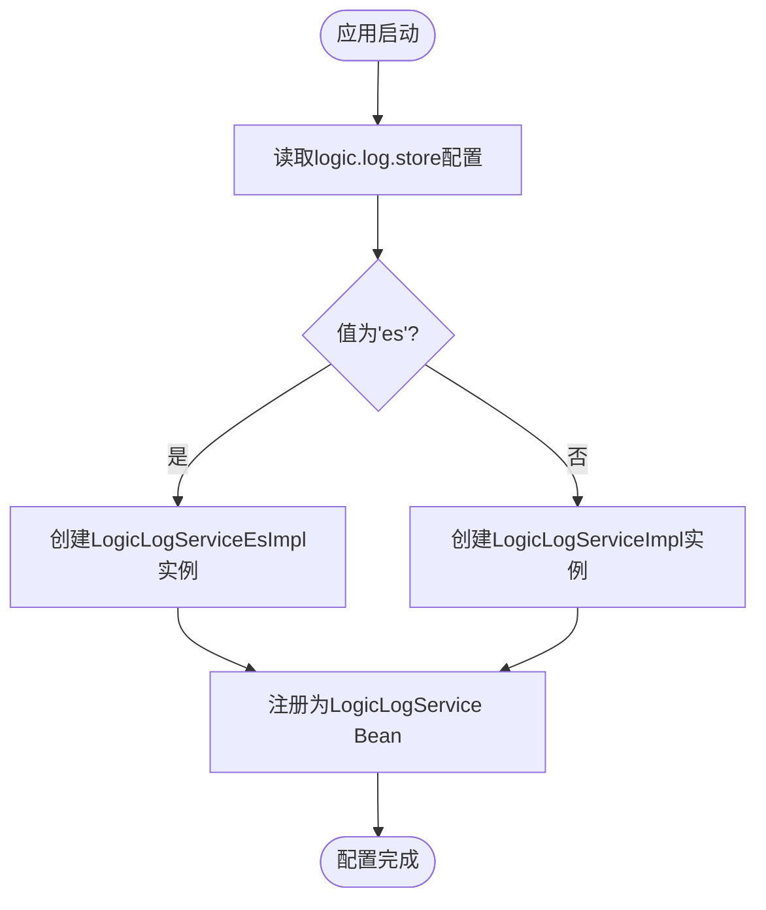
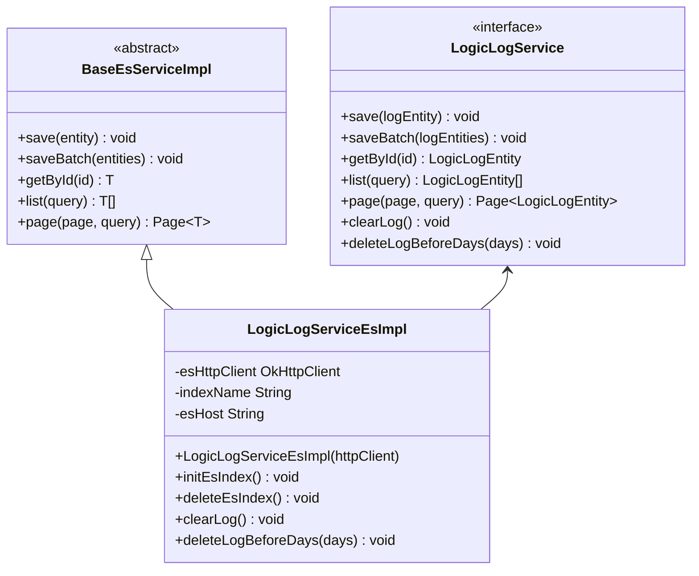
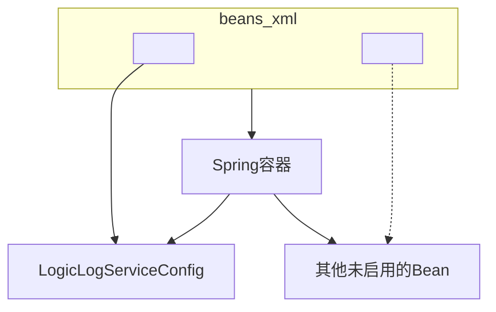
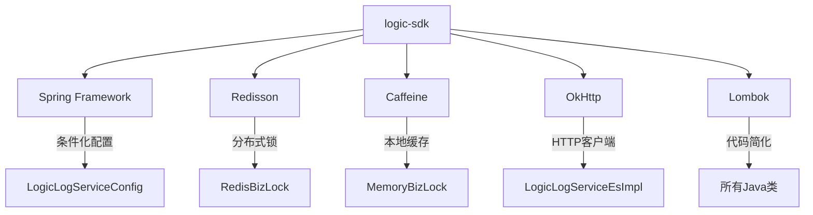

# 扩展机制与配置

<cite>
**本文档中引用的文件**  
- [BizLockUtil.java](file://logic-sdk/src/main/java/com/aims/logic/sdk/util/BizLockUtil.java)
- [BizLock.java](file://logic-sdk/src/main/java/com/aims/logic/sdk/util/lock/BizLock.java)
- [MemoryBizLock.java](file://logic-sdk/src/main/java/com/aims/logic/sdk/util/lock/MemoryBizLock.java)
- [RedisBizLock.java](file://logic-sdk/src/main/java/com/aims/logic/sdk/util/lock/RedisBizLock.java)
- [BizLockProperties.java](file://logic-sdk/src/main/java/com/aims/logic/sdk/util/lock/BizLockProperties.java)
- [LogicLogServiceConfig.java](file://logic-sdk/src/main/java/com/aims/logic/sdk/config/LogicLogServiceConfig.java)
- [LogicLogServiceEsImpl.java](file://logic-sdk/src/main/java/com/aims/logic/sdk/service/impl/es/LogicLogServiceEsImpl.java)
- [beans.xml](file://logic-sdk/src/main/resources/beans.xml)
</cite>

## 目录
1. [简介](#简介)
2. [项目结构](#项目结构)
3. [核心组件](#核心组件)
4. [架构概述](#架构概述)
5. [详细组件分析](#详细组件分析)
6. [依赖分析](#依赖分析)
7. [性能考虑](#性能考虑)
8. [故障排除指南](#故障排除指南)
9. [结论](#结论)

## 简介
本文档深入解析SDK提供的可扩展架构设计与定制化配置能力。重点阐述BizLockUtil如何通过策略模式封装分布式业务锁，支持RedisBizLock与MemoryBizLock两种实现，并说明其在高并发场景下的应用方式。详细说明LogicLogServiceConfig配置类如何通过Spring条件化配置支持多种日志存储后端（如Elasticsearch、数据库）。分析LogicLogServiceEsImpl对ES存储的实现细节，包括索引管理、文档映射与查询优化。解释beans.xml中定义的Bean装配逻辑及其对模块化集成的支持。提供自定义扩展点的开发指南，展示如何新增锁实现或日志存储适配器，并讨论配置热更新与多环境适配的最佳实践。

## 项目结构
本项目采用模块化设计，主要包含以下几个核心模块：
- `logic-ide`：逻辑开发环境模块
- `logic-ide-service`：IDE服务模块
- `logic-runtime`：运行时模块
- `logic-sdk`：核心SDK模块，包含可扩展架构与配置能力
- `test-suite`：测试套件模块

其中，`logic-sdk`模块是本文档分析的重点，其内部结构清晰地体现了可扩展性与配置化的设计理念。

**Diagram sources**  
- [LogicLogServiceConfig.java](file://logic-sdk/src/main/java/com/aims/logic/sdk/config/LogicLogServiceConfig.java)
- [BizLock.java](file://logic-sdk/src/main/java/com/aims/logic/sdk/util/lock/BizLock.java)
- [MemoryBizLock.java](file://logic-sdk/src/main/java/com/aims/logic/sdk/util/lock/MemoryBizLock.java)
- [RedisBizLock.java](file://logic-sdk/src/main/java/com/aims/logic/sdk/util/lock/RedisBizLock.java)
- [beans.xml](file://logic-sdk/src/main/resources/beans.xml)

**Section sources**
- [LogicLogServiceConfig.java](file://logic-sdk/src/main/java/com/aims/logic/sdk/config/LogicLogServiceConfig.java)
- [BizLock.java](file://logic-sdk/src/main/java/com/aims/logic/sdk/util/lock/BizLock.java)
- [MemoryBizLock.java](file://logic-sdk/src/main/java/com/aims/logic/sdk/util/lock/MemoryBizLock.java)
- [RedisBizLock.java](file://logic-sdk/src/main/java/com/aims/logic/sdk/util/lock/RedisBizLock.java)
- [beans.xml](file://logic-sdk/src/main/resources/beans.xml)

## 核心组件

本文档的核心组件包括：
- **BizLock体系**：基于策略模式的分布式业务锁实现
- **LogicLogServiceConfig**：条件化日志服务配置
- **LogicLogServiceEsImpl**：Elasticsearch日志存储实现
- **beans.xml**：模块化Bean装配配置

这些组件共同构成了SDK的可扩展架构基础，支持灵活的定制化配置和模块化集成。

**Section sources**
- [BizLock.java](file://logic-sdk/src/main/java/com/aims/logic/sdk/util/lock/BizLock.java)
- [LogicLogServiceConfig.java](file://logic-sdk/src/main/java/com/aims/logic/sdk/config/LogicLogServiceConfig.java)
- [LogicLogServiceEsImpl.java](file://logic-sdk/src/main/java/com/aims/logic/sdk/service/impl/es/LogicLogServiceEsImpl.java)
- [beans.xml](file://logic-sdk/src/main/resources/beans.xml)

## 架构概述

SDK的可扩展架构采用分层设计，通过接口抽象、策略模式和Spring条件化配置实现高度可定制性。整体架构分为配置层、实现层和装配层三个层次。

**Diagram sources**  
- [BizLockProperties.java](file://logic-sdk/src/main/java/com/aims/logic/sdk/util/lock/BizLockProperties.java)
- [LogicLogServiceConfig.java](file://logic-sdk/src/main/java/com/aims/logic/sdk/config/LogicLogServiceConfig.java)
- [BizLock.java](file://logic-sdk/src/main/java/com/aims/logic/sdk/util/lock/BizLock.java)
- [MemoryBizLock.java](file://logic-sdk/src/main/java/com/aims/logic/sdk/util/lock/MemoryBizLock.java)
- [RedisBizLock.java](file://logic-sdk/src/main/java/com/aims/logic/sdk/util/lock/RedisBizLock.java)
- [LogicLogServiceEsImpl.java](file://logic-sdk/src/main/java/com/aims/logic/sdk/service/impl/es/LogicLogServiceEsImpl.java)
- [beans.xml](file://logic-sdk/src/main/resources/beans.xml)

## 详细组件分析

### 分布式业务锁实现分析

#### 策略模式架构
BizLock体系采用策略模式设计，通过统一接口定义业务锁的核心行为，支持多种实现方式。

**Diagram sources**  
- [BizLock.java](file://logic-sdk/src/main/java/com/aims/logic/sdk/util/lock/BizLock.java)
- [MemoryBizLock.java](file://logic-sdk/src/main/java/com/aims/logic/sdk/util/lock/MemoryBizLock.java)
- [RedisBizLock.java](file://logic-sdk/src/main/java/com/aims/logic/sdk/util/lock/RedisBizLock.java)
- [BizLockProperties.java](file://logic-sdk/src/main/java/com/aims/logic/sdk/util/lock/BizLockProperties.java)

#### 高并发场景下的应用
在高并发场景下，BizLock通过自旋锁机制确保业务操作的原子性。

**Diagram sources**  
- [MemoryBizLock.java](file://logic-sdk/src/main/java/com/aims/logic/sdk/util/lock/MemoryBizLock.java)
- [RedisBizLock.java](file://logic-sdk/src/main/java/com/aims/logic/sdk/util/lock/RedisBizLock.java)

**Section sources**
- [MemoryBizLock.java](file://logic-sdk/src/main/java/com/aims/logic/sdk/util/lock/MemoryBizLock.java)
- [RedisBizLock.java](file://logic-sdk/src/main/java/com/aims/logic/sdk/util/lock/RedisBizLock.java)

### 日志服务配置分析

#### 条件化配置实现
LogicLogServiceConfig通过Spring的条件化注解实现不同存储后端的动态切换。

**Diagram sources**  
- [LogicLogServiceConfig.java](file://logic-sdk/src/main/java/com/aims/logic/sdk/config/LogicLogServiceConfig.java)

#### Elasticsearch存储实现
LogicLogServiceEsImpl实现了对Elasticsearch的完整支持，包括索引管理、文档映射和查询优化。

**Diagram sources**  
- [LogicLogServiceEsImpl.java](file://logic-sdk/src/main/java/com/aims/logic/sdk/service/impl/es/LogicLogServiceEsImpl.java)
- [LogicLogService.java](file://logic-sdk/src/main/java/com/aims/logic/sdk/service/LogicLogService.java)

**Section sources**
- [LogicLogServiceConfig.java](file://logic-sdk/src/main/java/com/aims/logic/sdk/config/LogicLogServiceConfig.java)
- [LogicLogServiceEsImpl.java](file://logic-sdk/src/main/java/com/aims/logic/sdk/service/impl/es/LogicLogServiceEsImpl.java)

### Bean装配机制分析

#### XML配置驱动的模块化集成
beans.xml文件定义了SDK的核心Bean装配逻辑，支持模块化集成。

**Diagram sources**  
- [beans.xml](file://logic-sdk/src/main/resources/beans.xml)

**Section sources**
- [beans.xml](file://logic-sdk/src/main/resources/beans.xml)

## 依赖分析

SDK的可扩展架构依赖于多个关键组件和技术栈，形成了一个完整的生态系统。

**Diagram sources**  
- [pom.xml](file://logic-sdk/pom.xml)

## 性能考虑

在高并发场景下，分布式业务锁的性能表现至关重要。MemoryBizLock适用于单机部署场景，具有低延迟优势；RedisBizLock适用于分布式部署场景，具有高可用性优势。自旋锁的重试次数和等待时间可通过配置进行优化，平衡性能和资源消耗。

## 故障排除指南

常见问题包括：
- Redis连接失败：检查`logic.biz-lock.redis`配置项
- ES索引创建失败：检查网络连接和ES服务状态
- 锁无法释放：检查线程中断状态和锁持有情况
- 配置不生效：确认配置文件加载顺序和属性名称

**Section sources**
- [RedisBizLock.java](file://logic-sdk/src/main/java/com/aims/logic/sdk/util/lock/RedisBizLock.java)
- [LogicLogServiceEsImpl.java](file://logic-sdk/src/main/java/com/aims/logic/sdk/service/impl/es/LogicLogServiceEsImpl.java)

## 结论

本文档详细分析了SDK的可扩展架构设计与定制化配置能力。通过策略模式、Spring条件化配置和模块化Bean装配，SDK实现了高度灵活的扩展机制。开发者可以根据实际需求选择合适的锁实现和日志存储后端，并通过标准的配置方式进行定制化调整。这种设计不仅提高了系统的可维护性，也为未来的功能扩展提供了坚实的基础。