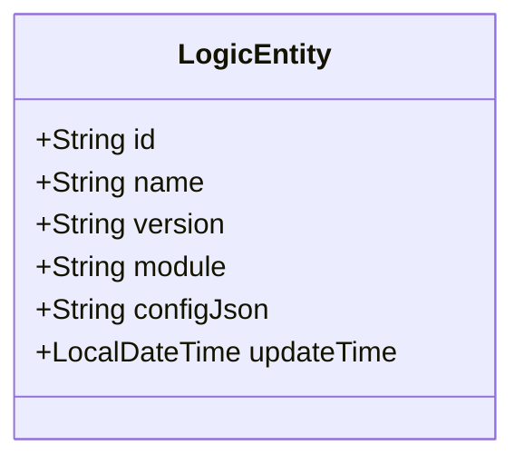
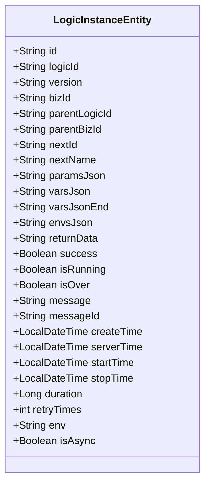
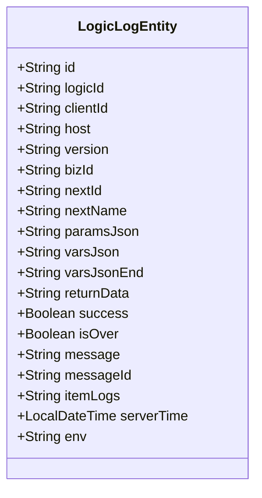
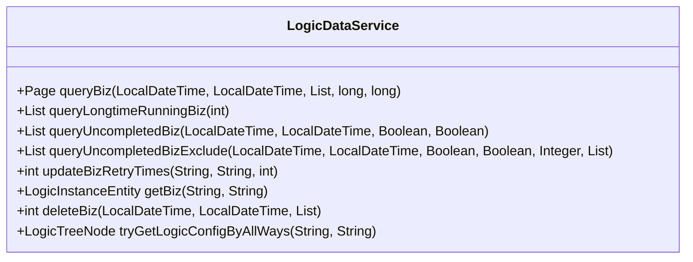
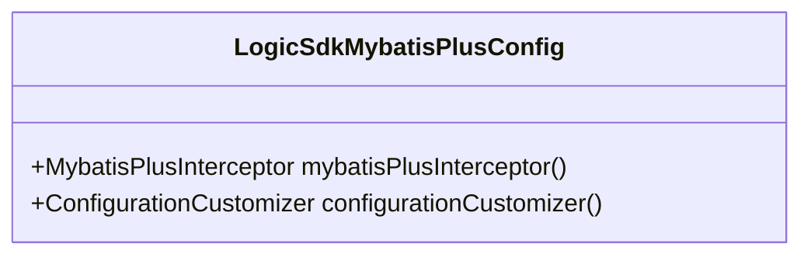

# 数据操作与实体管理

<cite>
**本文档引用文件**  
- [BaseEntity.java](file://logic-sdk/src/main/java/com/aims/logic/sdk/entity/BaseEntity.java)
- [LogicEntity.java](file://logic-sdk/src/main/java/com/aims/logic/sdk/entity/LogicEntity.java)
- [LogicInstanceEntity.java](file://logic-sdk/src/main/java/com/aims/logic/sdk/entity/LogicInstanceEntity.java)
- [LogicLogEntity.java](file://logic-sdk/src/main/java/com/aims/logic/sdk/entity/LogicLogEntity.java)
- [LogicDataService.java](file://logic-sdk/src/main/java/com/aims/logic/sdk/LogicDataService.java)
- [LogicDataServiceImpl.java](file://logic-sdk/src/main/java/com/aims/logic/sdk/service/impl/LogicDataServiceImpl.java)
- [LogicSdkMybatisPlusConfig.java](file://logic-ide/src/main/java/com/aims/logic/ide/configuration/LogicSdkMybatisPlusConfig.java)
</cite>

## 目录
1. [引言](#引言)
2. [核心实体模型设计](#核心实体模型设计)
3. [数据访问接口与实现](#数据访问接口与实现)
4. [MyBatis-Plus集成与多数据源支持](#mybatis-plus集成与多数据源支持)
5. [复杂查询场景示例](#复杂查询场景示例)
6. [数据一致性与缓存策略](#数据一致性与缓存策略)
7. [性能调优建议](#性能调优建议)
8. [结论](#结论)

## 引言
本SDK提供了一套完整的数据访问能力，用于管理逻辑编排系统中的各类实体对象。通过统一的实体模型设计和数据服务接口，实现了对逻辑定义、运行实例、执行日志等核心数据的高效持久化与查询操作。系统基于MyBatis-Plus构建，支持灵活的条件查询、分页排序及批量处理功能，满足复杂业务场景下的数据管理需求。

## 核心实体模型设计

### BaseEntity公共属性封装
`BaseEntity`作为所有实体类的基类，提供了统一的字段继承机制，确保各实体具备一致的基础结构。虽然该类当前未显式定义字段，但其设计为未来扩展预留了空间，并通过Lombok注解实现链式调用支持。

**Section sources**
- [BaseEntity.java](file://logic-sdk/src/main/java/com/aims/logic/sdk/entity/BaseEntity.java#L1-L5)

### LogicEntity逻辑定义实体
`LogicEntity`代表一个逻辑编排的定义，包含其基本信息和配置内容。



**Diagram sources**
- [LogicEntity.java](file://logic-sdk/src/main/java/com/aims/logic/sdk/entity/LogicEntity.java#L1-L28)

**字段说明：**
- `id`: 逻辑ID，使用ASSIGN_ID策略生成
- `name`: 逻辑名称
- `version`: 版本号
- `module`: 所属模块
- `configJson`: 以JSON格式存储的完整逻辑配置
- `updateTime`: 最后更新时间，带时区格式化

**Section sources**
- [LogicEntity.java](file://logic-sdk/src/main/java/com/aims/logic/sdk/entity/LogicEntity.java#L1-L28)

### LogicInstanceEntity运行实例实体
`LogicInstanceEntity`记录每次逻辑执行的实例状态，是运行时追踪的核心数据结构。



**Diagram sources**
- [LogicInstanceEntity.java](file://logic-sdk/src/main/java/com/aims/logic/sdk/entity/LogicInstanceEntity.java#L1-L83)

**关键字段解析：**
- `bizId`: 业务标识，用于外部系统关联
- `paramsJson/varsJson`: 输入参数与运行时变量快照
- `isRunning/isOver`: 实例运行状态标记
- `startTime/stopTime/duration`: 执行耗时统计
- `retryTimes`: 重试次数，支持异常恢复机制
- `parentLogicId/parentBizId`: 支持嵌套调用的父子关系链

**Section sources**
- [LogicInstanceEntity.java](file://logic-sdk/src/main/java/com/aims/logic/sdk/entity/LogicInstanceEntity.java#L1-L83)

### LogicLogEntity执行日志实体
`LogicLogEntity`用于记录逻辑执行过程中的详细日志信息，支持问题排查与审计。



**Diagram sources**
- [LogicLogEntity.java](file://logic-sdk/src/main/java/com/aims/logic/sdk/entity/LogicLogEntity.java#L1-L53)

**日志特性：**
- `itemLogs`: 存储节点级执行日志的JSON字符串
- `serverTime`: 精确到毫秒的时间戳，用于性能分析
- `clientId/host`: 标识请求来源，便于分布式追踪

**Section sources**
- [LogicLogEntity.java](file://logic-sdk/src/main/java/com/aims/logic/sdk/entity/LogicLogEntity.java#L1-L53)

## 数据访问接口与实现

### LogicDataService数据操作契约
`LogicDataService`定义了SDK对外暴露的数据访问接口，涵盖查询、更新、删除等核心操作。



**Diagram sources**
- [LogicDataService.java](file://logic-sdk/src/main/java/com/aims/logic/sdk/LogicDataService.java#L1-L102)

**接口功能说明：**
- `queryBiz`: 支持时间范围与业务ID筛选的分页查询
- `queryLongtimeRunningBiz`: 查询超时未完成的业务实例
- `queryUncompletedBiz`: 多条件组合查询未完成实例
- `updateBizRetryTimes`: 更新指定实例的重试次数
- `getBiz`: 根据逻辑ID和业务ID获取单个实例
- `deleteBiz`: 安全删除机制，需提供时间范围或ID列表
- `tryGetLogicConfigByAllWays`: 多路径尝试获取逻辑配置（备份表→文件→主机）

**Section sources**
- [LogicDataService.java](file://logic-sdk/src/main/java/com/aims/logic/sdk/LogicDataService.java#L1-L102)

### LogicDataServiceImpl具体实现机制
`LogicDataServiceImpl`实现了`LogicDataService`接口，结合JdbcTemplate与业务服务完成数据操作。

```mermaid
sequenceDiagram
participant Client
participant Service as LogicDataServiceImpl
participant JdbcTemplate
participant InsService as LogicInstanceService
participant BizLock
participant LogicBakService
participant ConfigStore as LogicConfigStoreService
Client->>Service : queryBiz(createTimeFrom, createTimeTo, bizIds, pageNum, pageSize)
Service->>JdbcTemplate : 执行动态SQL查询logic_instance表
JdbcTemplate-->>Service : 返回LogicInstanceEntity列表
Service->>JdbcTemplate : 执行count查询
JdbcTemplate-->>Service : 返回总数
Service-->>Client : 构造并返回Page对象
Client->>Service : tryGetLogicConfigByAllWays(logicId, version)
Service->>LogicBakService : getByIdAndVersion(logicId, version)
alt 存在备份配置
LogicBakService-->>Service : 返回LogicBakEntity
Service-->>Client : 解析并返回LogicTreeNode
else
Service->>ConfigStore : readLogicConfigFromFile(logicId)
ConfigStore-->>Service : 返回配置
alt 版本匹配
Service->>LogicBakService : 插入备份记录
Service-->>Client : 返回LogicTreeNode
else
Service->>ConfigStore : readLogicConfigFromHost(logicId, null)
ConfigStore-->>Service : 返回最新配置
alt 版本匹配
Service->>LogicBakService : 插入备份记录
Service-->>Client : 返回LogicTreeNode
else
Service-->>Client : 返回null
end
end
```

**Diagram sources**
- [LogicDataServiceImpl.java](file://logic-sdk/src/main/java/com/aims/logic/sdk/service/impl/LogicDataServiceImpl.java#L1-L165)

**实现特点：**
- 使用`JdbcTemplate`直接执行SQL，提升查询灵活性
- 分页查询采用`LIMIT offset, size`语法
- `tryGetLogicConfigByAllWays`方法实现三级缓存查找策略
- 依赖`bizLock`判断业务实例是否被锁定，防止并发冲突
- 通过`LogicInstanceService`代理部分实例操作，保持职责分离

**Section sources**
- [LogicDataServiceImpl.java](file://logic-sdk/src/main/java/com/aims/logic/sdk/service/impl/LogicDataServiceImpl.java#L1-L165)

## MyBatis-Plus集成与多数据源支持

### MyBatis-Plus配置
系统通过`LogicSdkMybatisPlusConfig`类完成MyBatis-Plus的自动配置，启用分页插件、性能分析等特性。



**Diagram sources**
- [LogicSdkMybatisPlusConfig.java](file://logic-ide/src/main/java/com/aims/logic/ide/configuration/LogicSdkMybatisPlusConfig.java#L1-L30)

**配置要点：**
- 注入`MybatisPlusInterceptor`实现分页拦截
- 自定义`ConfigurationCustomizer`优化SQL执行行为
- 支持自动填充创建/更新时间等字段（需配合注解）

**Section sources**
- [LogicSdkMybatisPlusConfig.java](file://logic-ide/src/main/java/com/aims/logic/ide/configuration/LogicSdkMybatisPlusConfig.java#L1-L30)

### 多数据源配置支持
尽管当前实现主要使用`JdbcTemplate`，但项目结构预留了多数据源扩展能力。通过Spring的`@Primary`数据源配置和动态数据源路由机制，可轻松实现读写分离或跨库查询。

## 复杂查询场景示例

### 分页与条件查询
```java
// 示例：查询最近一小时内的失败实例
LocalDateTime oneHourAgo = LocalDateTime.now().minusHours(1);
Page<LogicInstanceEntity> page = logicDataService.queryBiz(
    oneHourAgo, 
    LocalDateTime.now(), 
    null, 
    1L, 
    20L
);
```

### 关联查询实现
虽然实体间无外键约束，但可通过`logicId`和`bizId`进行逻辑关联：
```java
// 获取实例及其对应的日志
LogicInstanceEntity instance = logicDataService.getBiz(logicId, bizId);
LogicLogEntity log = logicLogService.getByBizId(bizId);
```

### 排序实现
默认按`createTime`降序排列，可通过调整SQL实现自定义排序：
```sql
ORDER BY createTime DESC, duration ASC
```

## 数据一致性与缓存策略

### 数据一致性保障
- **事务控制**：关键操作使用Spring事务管理
- **乐观锁**：通过版本号或时间戳防止并发修改
- **重试机制**：`retryTimes`字段支持自动重试逻辑
- **备份机制**：`tryGetLogicConfigByAllWays`确保配置可追溯

### 缓存策略
- **本地缓存**：使用Caffeine缓存热点数据（如逻辑定义）
- **Redis锁**：`RedisBizLock`防止同一业务并发执行
- **查询缓存**：对高频查询结果进行短期缓存

## 性能调优建议
1. **索引优化**：为`logic_instance`表的`createTime`、`bizId`、`logicId`字段建立复合索引
2. **分页优化**：避免大偏移量分页，采用游标分页（cursor-based pagination）
3. **批量操作**：合并多次更新为批量操作，减少数据库交互次数
4. **JSON字段优化**：对频繁查询的JSON字段提取为独立列，或使用数据库JSON函数
5. **连接池配置**：合理设置HikariCP连接池参数，避免连接泄漏
6. **异步处理**：将日志写入等非关键路径操作异步化

## 结论
本SDK通过精心设计的实体模型和灵活的数据访问接口，提供了强大的数据管理能力。基于MyBatis-Plus和Spring生态的集成，确保了系统的可维护性和扩展性。通过合理的缓存策略和性能优化手段，能够支撑高并发、大数据量的生产环境需求。未来可进一步完善多数据源支持和分布式事务能力，以适应更复杂的部署场景。