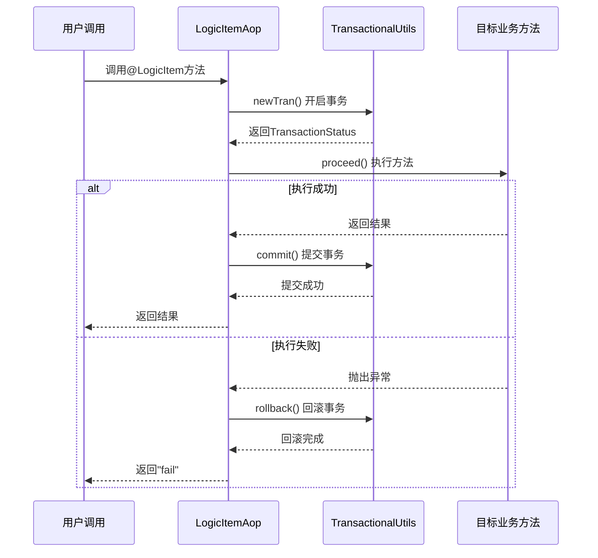
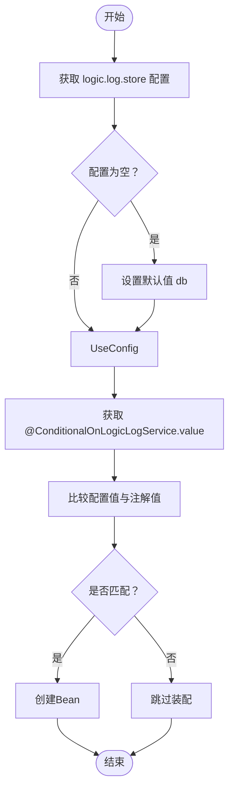
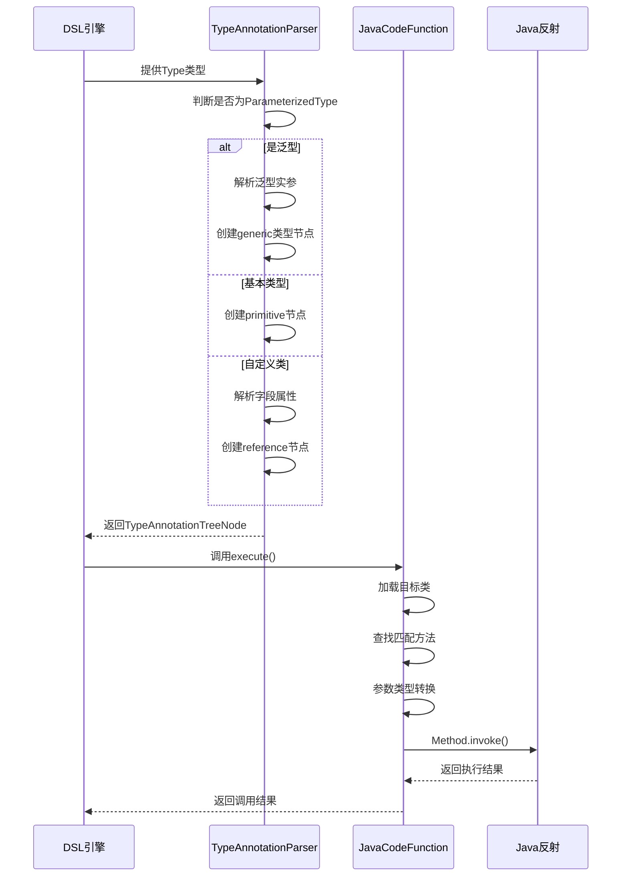

# 注解与AOP机制

<cite>
**本文档引用文件**  
- [LogicItem.java](file://logic-sdk/src/main/java/com/aims/logic/sdk/annotation/LogicItem.java)
- [LogicItemAop.java](file://logic-sdk/src/main/java/com/aims/logic/sdk/aop/LogicItemAop.java)
- [TableName.java](file://logic-sdk/src/main/java/com/aims/logic/sdk/annotation/TableName.java)
- [TableId.java](file://logic-sdk/src/main/java/com/aims/logic/sdk/annotation/TableId.java)
- [ConditionalOnLogicLogService.java](file://logic-sdk/src/main/java/com/aims/logic/sdk/annotation/ConditionalOnLogicLogService.java)
- [LogicLogServiceCondition.java](file://logic-sdk/src/main/java/com/aims/logic/sdk/aop/LogicLogServiceCondition.java)
- [LogicIdeController.java](file://logic-ide/src/main/java/com/aims/logic/ide/controller/LogicIdeController.java)
- [TypeAnnotationParser.java](file://logic-runtime/src/main/java/com/aims/logic/runtime/contract/parser/TypeAnnotationParser.java)
- [JavaCodeFunction.java](file://logic-runtime/src/main/java/com/aims/logic/runtime/runner/functions/impl/JavaCodeFunction.java)
- [TestComponent.java](file://test-case/test-case/src/main/java/com/aims/plugin/demo/TestComponent.java)
</cite>

## 目录
1. [引言](#引言)
2. [核心注解解析](#核心注解解析)
3. [AOP切面实现与执行拦截](#aop切面实现与执行拦截)
4. [持久化注解机制](#持久化注解机制)
5. [条件装配与模块按需加载](#条件装配与模块按需加载)
6. [注解处理器与反射协同机制](#注解处理器与反射协同机制)
7. [自定义注解扩展示例](#自定义注解扩展示例)
8. [AOP代理模式与性能最佳实践](#aop代理模式与性能最佳实践)

## 引言
本文档深入解析SDK中基于注解与面向切面编程（AOP）实现的自动化编程模型。重点阐述`@LogicItem`注解如何标识可执行逻辑节点，以及`LogicItemAop`切面如何实现方法拦截与事务封装。同时分析`@TableName`、`@TableId`等持久化注解在实体映射中的作用机制，并探讨Spring条件装配（`LogicLogServiceCondition`）如何实现功能模块的动态加载。此外，还将说明注解处理器与运行时反射的协同流程，以及AOP代理模式对性能的影响与优化建议。

## 核心注解解析

### @LogicItem 注解详解
`@LogicItem` 是SDK中用于标识可执行逻辑节点的核心注解，应用于方法级别，通过AOP机制实现自动拦截与上下文封装。

该注解定义了多个元数据属性，用于描述逻辑项的元信息：

- `name`: 逻辑项名称，默认为“未命名”
- `type`: 逻辑类型（如java、js），默认为"java"
- `group`: 所属分组，用于分类展示
- `version`: 版本号
- `memo`: 备注说明
- `shape`: 图形化展示形状
- `order`: 排序标识

在IDE中，通过`LogicIdeController`调用`ClassUtils.getMethodsByAnnotation()`方法扫描带有`@LogicItem`注解的方法，实现逻辑节点的自动发现与注册。

**Section sources**
- [LogicItem.java](file://logic-sdk/src/main/java/com/aims/logic/sdk/annotation/LogicItem.java#L7-L23)
- [LogicIdeController.java](file://logic-ide/src/main/java/com/aims/logic/ide/controller/LogicIdeController.java#L229-L253)

## AOP切面实现与执行拦截

### LogicItemAop 切面实现
`LogicItemAop` 是基于Spring AOP实现的环绕通知切面，用于拦截所有标记`@LogicItem`注解的方法调用，实现事务控制与异常处理。

其核心逻辑如下：
1. 使用`@Around("@annotation(com.aims.logic.sdk.annotation.LogicItem)")`定义切点表达式
2. 在方法执行前通过`TransactionalUtils.newTran()`开启事务
3. 执行目标方法（`joinPoint.proceed()`）
4. 成功则提交事务，异常则回滚并返回"fail"

该机制确保了每个逻辑节点的执行具备事务一致性，支持灵活的事务传播行为（如`everyNode`、`everyRequest`等）。



**Diagram sources**
- [LogicItemAop.java](file://logic-sdk/src/main/java/com/aims/logic/sdk/aop/LogicItemAop.java#L0-L23)

**Section sources**
- [LogicItemAop.java](file://logic-sdk/src/main/java/com/aims/logic/sdk/aop/LogicItemAop.java#L0-L23)
- [TransactionalUtils.java](file://logic-sdk/src/main/java/com/aims/logic/sdk/util/TransactionalUtils.java)

## 持久化注解机制

### @TableName 与 @TableId 注解
SDK提供了一套轻量级ORM注解，用于实现Java实体与数据库表的映射关系。

#### @TableName
- 作用目标：类、字段、方法、参数、注解类型
- 功能：指定实体类对应的数据库表名
- 属性：`value` 表示表名

#### @TableId
- 作用目标：字段
- 功能：标识主键字段
- 属性：`type` 指定主键生成策略（如ASSIGN_ID、UUID）

结合`IdType`枚举，支持多种主键生成方式，便于在分布式环境下保证唯一性。

```mermaid
classDiagram
class BaseEntity {
+String id
+String createdBy
+String updatedBy
+Date createTime
+Date updateTime
}
class LogicEntity {
+String code
+String name
+String content
}
class LogicLogEntity {
+String instanceId
+String itemId
+String logContent
+Date timestamp
}
<<entity>> LogicEntity
<<entity>> LogicLogEntity
BaseEntity <|-- LogicEntity
BaseEntity <|-- LogicLogEntity
note right of LogicEntity
@TableName("logic_info")
end
note right of LogicEntity : : id
@TableId(type = IdType.UUID)
end
```

**Diagram sources**
- [TableName.java](file://logic-sdk/src/main/java/com/aims/logic/sdk/annotation/TableName.java#L7-L11)
- [TableId.java](file://logic-sdk/src/main/java/com/aims/logic/sdk/annotation/TableId.java#L7-L11)
- [IdType.java](file://logic-sdk/src/main/java/com/aims/logic/sdk/annotation/IdType.java#L0-L16)

**Section sources**
- [TableName.java](file://logic-sdk/src/main/java/com/aims/logic/sdk/annotation/TableName.java#L7-L11)
- [TableId.java](file://logic-sdk/src/main/java/com/aims/logic/sdk/annotation/TableId.java#L7-L11)
- [IdType.java](file://logic-sdk/src/main/java/com/aims/logic/sdk/annotation/IdType.java#L0-L16)

## 条件装配与模块按需加载

### LogicLogServiceCondition 实现原理
`LogicLogServiceCondition` 是Spring `Condition`接口的实现类，用于根据配置动态决定是否创建特定Bean。

其工作流程如下：
1. 读取配置项 `logic.log.store` 的值（默认为"db"）
2. 获取注解`@ConditionalOnLogicLogService`的`value`属性
3. 比较两者是否相等，决定是否满足装配条件

此机制实现了日志存储服务的可插拔设计，支持多种实现（如db、es），通过配置即可切换。



**Diagram sources**
- [LogicLogServiceCondition.java](file://logic-sdk/src/main/java/com/aims/logic/sdk/aop/LogicLogServiceCondition.java#L0-L35)
- [ConditionalOnLogicLogService.java](file://logic-sdk/src/main/java/com/aims/logic/sdk/annotation/ConditionalOnLogicLogService.java#L4-L9)

**Section sources**
- [LogicLogServiceCondition.java](file://logic-sdk/src/main/java/com/aims/logic/sdk/aop/LogicLogServiceCondition.java#L0-L35)
- [ConditionalOnLogicLogService.java](file://logic-sdk/src/main/java/com/aims/logic/sdk/annotation/ConditionalOnLogicLogService.java#L4-L9)

## 注解处理器与反射协同机制

### 类型解析与运行时反射
SDK通过`TypeAnnotationParser`与`JavaCodeFunction`协同工作，实现复杂类型的运行时解析与调用。

#### 类型解析流程
1. 使用反射获取方法参数的`Type`信息
2. 通过`TypeAnnotationParser.createTypeAnnotationTreeNode()`生成类型树节点
3. 支持泛型、数组、枚举、自定义对象等复杂类型
4. 构建`TypeAnnotationTreeNode`用于后续序列化与反序列化

#### 方法调用流程
1. `JavaCodeFunction`通过类加载器加载目标类
2. 使用`Class.getMethod()`查找匹配方法
3. 参数转换：基本类型、集合、Map、嵌套对象等
4. 反射调用`Method.invoke()`

该机制支持高度动态的函数调用，适用于逻辑编排场景。



**Diagram sources**
- [TypeAnnotationParser.java](file://logic-runtime/src/main/java/com/aims/logic/runtime/contract/parser/TypeAnnotationParser.java#L55-L116)
- [JavaCodeFunction.java](file://logic-runtime/src/main/java/com/aims/logic/runtime/runner/functions/impl/JavaCodeFunction.java#L54-L74)

**Section sources**
- [TypeAnnotationParser.java](file://logic-runtime/src/main/java/com/aims/logic/runtime/contract/parser/TypeAnnotationParser.java#L55-L116)
- [JavaCodeFunction.java](file://logic-runtime/src/main/java/com/aims/logic/runtime/runner/functions/impl/JavaCodeFunction.java#L54-L74)

## 自定义注解扩展示例

### 扩展开发实践
开发者可通过继承SDK注解体系实现自定义逻辑节点。

#### 示例：自定义测试组件
```java
@Component
public class TestComponent {

    @LogicItem(name = "测试同名方法2")
    public String strs() {
        return "测试同名方法2";
    }

    public int ints(int[] ints, boolean trueForSumOrMax, Boolean BoolValue) {
        return Arrays.stream(ints).reduce(0, (trueForSumOrMax | BoolValue) ? Integer::sum : Integer::max);
    }
}
```

该组件在启动时被自动扫描，`strs()`方法作为逻辑节点暴露给IDE，支持在图形化界面中调用。

**Section sources**
- [TestComponent.java](file://test-case/test-case/src/main/java/com/aims/plugin/demo/TestComponent.java#L0-L34)

## AOP代理模式与性能最佳实践

### 代理模式选择
SDK当前使用Spring默认的JDK动态代理（基于接口）或CGLIB（基于类继承）。

#### 性能影响因素
- **JDK代理**：仅支持接口方法，性能较好，内存占用低
- **CGLIB**：支持类方法，但生成代理类耗时较长，内存占用高

#### 最佳实践建议
1. 优先使用接口定义逻辑服务，便于AOP代理
2. 避免在`@LogicItem`方法中进行耗时操作，建议拆分为业务方法
3. 合理配置事务边界，避免过长事务导致锁竞争
4. 对高频调用逻辑节点考虑缓存机制
5. 使用`@ConditionalOnLogicLogService`按需加载模块，减少启动开销

通过合理设计，可在保证功能灵活性的同时，维持良好的运行时性能。