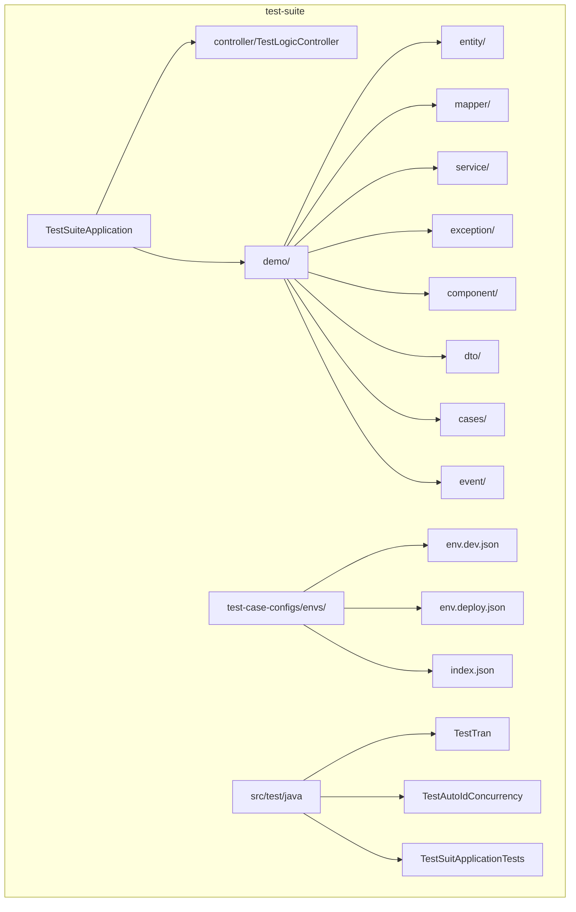
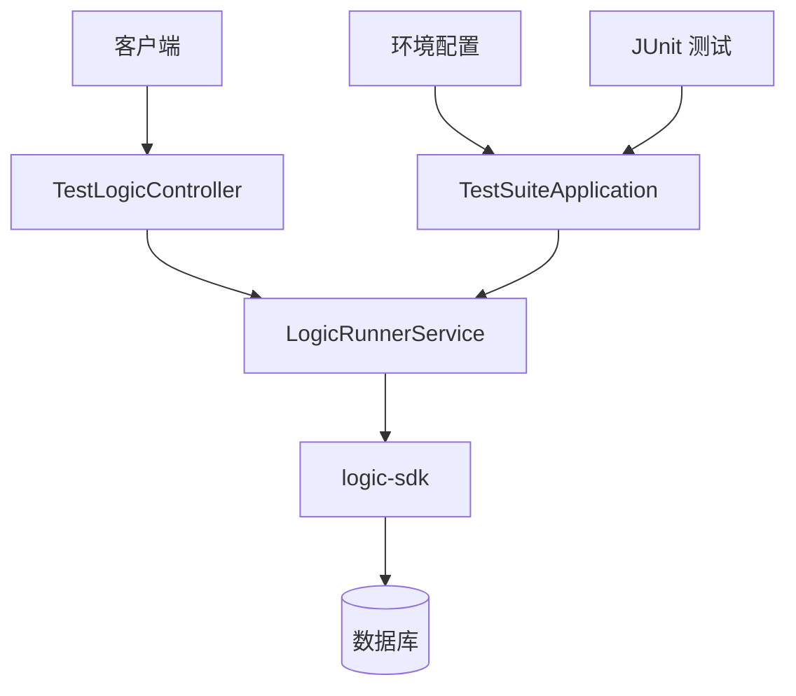
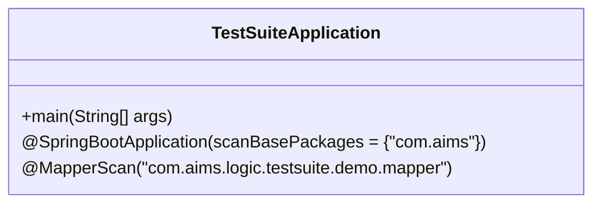
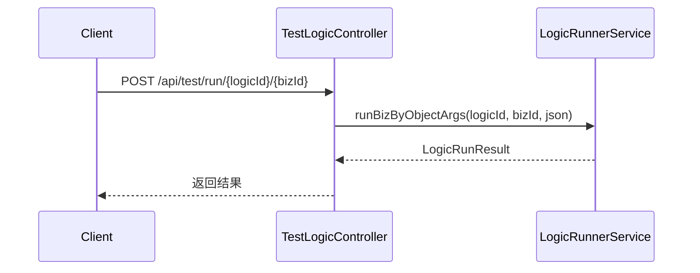
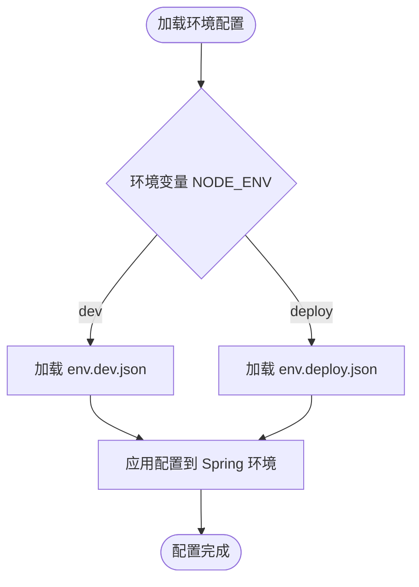
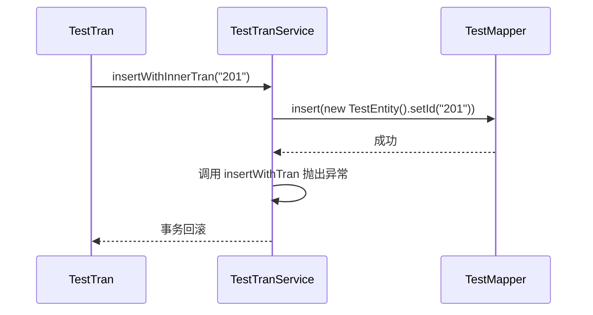
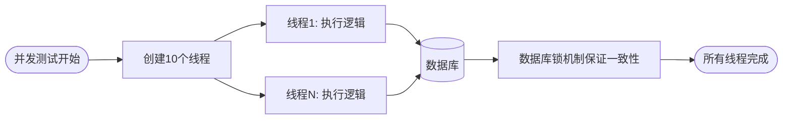
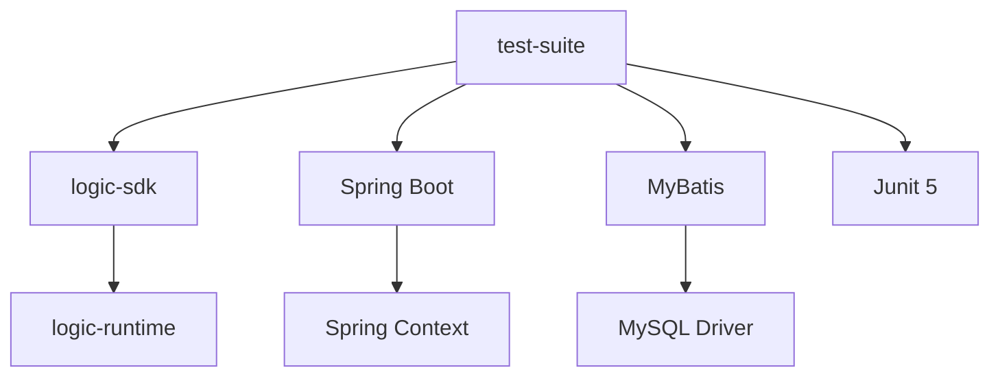

# test-suite 模块

<cite>
**本文档中引用的文件**  
- [TestSuiteApplication.java](file://test-suite/src/main/java/com/aims/logic/testsuite/TestSuiteApplication.java)
- [TestLogicController.java](file://test-suite/src/main/java/com/aims/logic/testsuite/controller/TestLogicController.java)
- [env.dev.json](file://test-suite/test-case-configs/envs/env.dev.json)
- [env.deploy.json](file://test-suite/test-case-configs/envs/env.deploy.json)
- [TestTranService.java](file://test-suite/src/main/java/com/aims/logic/testsuite/demo/TestTranService.java)
- [TestTran2Service.java](file://test-suite/src/main/java/com/aims/logic/testsuite/demo/TestTran2Service.java)
- [TestTran.java](file://test-suite/src/test/java/com/aims/logic/testsuite/TestTran.java)
- [TestAutoIdConcurrency.java](file://test-suite/src/test/java/com/aims/logic/testsuite/TestAutoIdConcurrency.java)
- [TestSuitApplicationTests.java](file://test-suite/src/test/java/com/aims/logic/testsuite/TestSuitApplicationTests.java)
</cite>

## 目录
1. [简介](#简介)
2. [项目结构](#项目结构)
3. [核心组件](#核心组件)
4. [架构概述](#架构概述)
5. [详细组件分析](#详细组件分析)
6. [依赖分析](#依赖分析)
7. [性能考虑](#性能考虑)
8. [故障排除指南](#故障排除指南)
9. [结论](#结论)

## 简介
`test-suite` 模块是一个完整的示例与测试套件，旨在为开发者提供一个可运行的参考实现，帮助其快速理解系统集成方式与使用模式。该模块集成了 `logic-sdk`，通过配置不同环境参数来模拟多种部署场景，并包含丰富的测试案例，涵盖事务处理、异常处理、并发控制等核心功能验证。通过本模块，用户可以学习如何构建逻辑执行环境、暴露测试端点、定义环境配置以及编写有效的测试用例。

## 项目结构
`test-suite` 模块采用标准的 Spring Boot 项目结构，主要包含应用主类、控制器、测试用例、实体、映射器及环境配置文件。其结构清晰地分离了配置、业务逻辑与测试代码，便于维护和扩展。

**Diagram sources**
- [TestSuiteApplication.java](file://test-suite/src/main/java/com/aims/logic/testsuite/TestSuiteApplication.java)
- [TestLogicController.java](file://test-suite/src/main/java/com/aims/logic/testsuite/controller/TestLogicController.java)
- [env.dev.json](file://test-suite/test-case-configs/envs/env.dev.json)
- [env.deploy.json](file://test-suite/test-case-configs/envs/env.deploy.json)

**Section sources**
- [TestSuiteApplication.java](file://test-suite/src/main/java/com/aims/logic/testsuite/TestSuiteApplication.java)
- [TestLogicController.java](file://test-suite/src/main/java/com/aims/logic/testsuite/controller/TestLogicController.java)
- [env.dev.json](file://test-suite/test-case-configs/envs/env.dev.json)

## 核心组件

`test-suite` 模块的核心组件包括 `TestSuiteApplication` 主类、`TestLogicController` 控制器以及位于 `test-case-configs/envs` 中的环境配置文件。这些组件共同构成了一个可执行、可测试的完整系统示例。

**Section sources**
- [TestSuiteApplication.java](file://test-suite/src/main/java/com/aims/logic/testsuite/TestSuiteApplication.java)
- [TestLogicController.java](file://test-suite/src/main/java/com/aims/logic/testsuite/controller/TestLogicController.java)
- [env.dev.json](file://test-suite/test-case-configs/envs/env.dev.json)

## 架构概述

该模块基于 Spring Boot 构建，集成 `logic-sdk` 提供的逻辑执行能力，通过 RESTful 接口暴露测试端点，支持同步与异步调用。环境配置文件驱动不同部署场景的行为，测试用例则覆盖事务、异常、并发等关键路径。

**Diagram sources**
- [TestSuiteApplication.java](file://test-suite/src/main/java/com/aims/logic/testsuite/TestSuiteApplication.java)
- [TestLogicController.java](file://test-suite/src/main/java/com/aims/logic/testsuite/controller/TestLogicController.java)
- [TestTran.java](file://test-suite/src/test/java/com/aims/logic/testsuite/TestTran.java)

## 详细组件分析

### TestSuiteApplication 分析
`TestSuiteApplication` 是模块的启动类，通过 `@SpringBootApplication` 注解启用自动配置，并扫描 `com.aims` 包下的所有组件。它集成了 `logic-sdk`，配置了 MyBatis 的 Mapper 扫描路径，确保所有数据访问组件能被正确注入。

**Diagram sources**
- [TestSuiteApplication.java](file://test-suite/src/main/java/com/aims/logic/testsuite/TestSuiteApplication.java)

**Section sources**
- [TestSuiteApplication.java](file://test-suite/src/main/java/com/aims/logic/testsuite/TestSuiteApplication.java)

### TestLogicController 分析
`TestLogicController` 提供了两个 REST 端点用于执行逻辑测试：同步的 `/api/test/run` 和异步的 `/api/test/run-async`。它依赖 `LogicRunnerService` 来执行具体的业务逻辑，并将结果返回给客户端。

**Diagram sources**
- [TestLogicController.java](file://test-suite/src/main/java/com/aims/logic/testsuite/controller/TestLogicController.java)

**Section sources**
- [TestLogicController.java](file://test-suite/src/main/java/com/aims/logic/testsuite/controller/TestLogicController.java)

### 环境配置分析
`test-case-configs/envs` 目录下的 `env.dev.json` 和 `env.deploy.json` 定义了不同环境的参数。`env.dev.json` 包含开发环境的完整配置，如 IDE 主机列表、事务作用域等；`env.deploy.json` 则为部署环境提供精简配置。

**Diagram sources**
- [env.dev.json](file://test-suite/test-case-configs/envs/env.dev.json)
- [env.deploy.json](file://test-suite/test-case-configs/envs/env.deploy.json)

**Section sources**
- [env.dev.json](file://test-suite/test-case-configs/envs/env.dev.json)
- [env.deploy.json](file://test-suite/test-case-configs/envs/env.deploy.json)

### 测试用例分析

#### 事务测试
模块通过 `TestTranService` 和 `TestTran2Service` 实现了多种事务场景测试。`TestTranService` 中的方法展示了手动事务管理，而 `TestTran2Service` 使用 `@Transactional` 注解实现声明式事务。测试类 `TestTran` 验证了在事务中执行逻辑时的数据一致性与回滚行为。

**Diagram sources**
- [TestTranService.java](file://test-suite/src/main/java/com/aims/logic/testsuite/demo/TestTranService.java)
- [TestTran2Service.java](file://test-suite/src/main/java/com/aims/logic/testsuite/demo/TestTran2Service.java)
- [TestTran.java](file://test-suite/src/test/java/com/aims/logic/testsuite/TestTran.java)

#### 异常处理测试
通过 `ThrowException` 类和 `CustomException` 自定义异常，模块验证了系统在遇到业务异常时的处理能力。`ExceptionHandler` 组件确保异常能被正确捕获并记录日志，同时不影响整体服务稳定性。

#### 并发测试
`TestAutoIdConcurrency` 类使用多线程并发执行逻辑，验证了系统在高并发场景下的数据一致性与性能表现。测试通过 `ExecutorService` 模拟多个客户端同时请求，确保自增 ID 生成和数据库操作的线程安全性。

**Diagram sources**
- [TestAutoIdConcurrency.java](file://test-suite/src/test/java/com/aims/logic/testsuite/TestAutoIdConcurrency.java)

**Section sources**
- [TestTranService.java](file://test-suite/src/main/java/com/aims/logic/testsuite/demo/TestTranService.java)
- [TestTran2Service.java](file://test-suite/src/main/java/com/aims/logic/testsuite/demo/TestTran2Service.java)
- [TestTran.java](file://test-suite/src/test/java/com/aims/logic/testsuite/TestTran.java)
- [TestAutoIdConcurrency.java](file://test-suite/src/test/java/com/aims/logic/testsuite/TestAutoIdConcurrency.java)
- [TestSuitApplicationTests.java](file://test-suite/src/test/java/com/aims/logic/testsuite/TestSuitApplicationTests.java)

## 依赖分析

`test-suite` 模块依赖 `logic-sdk` 提供核心逻辑执行能力，并通过 Spring Boot 集成 MyBatis 进行数据持久化。测试依赖 JUnit 5 和 Spring Test 提供单元与集成测试支持。

**Diagram sources**
- [pom.xml](file://test-suite/pom.xml)

**Section sources**
- [TestSuiteApplication.java](file://test-suite/src/main/java/com/aims/logic/testsuite/TestSuiteApplication.java)

## 性能考虑

模块在设计时考虑了异步执行能力，通过 `@Async` 注解支持非阻塞调用，提升系统吞吐量。并发测试验证了数据库连接池与事务管理器在高负载下的稳定性。建议在生产环境中合理配置线程池大小与数据库连接数。

## 故障排除指南

- **逻辑执行失败**：检查 `logicId` 是否存在，输入参数是否符合预期结构。
- **事务未回滚**：确认 `LogicItemTransactionScope` 配置正确，异常类型是否被事务管理器识别。
- **并发冲突**：检查数据库主键约束与唯一索引，确保业务逻辑处理好竞争条件。
- **环境配置不生效**：确认 `NODE_ENV` 环境变量设置正确，配置文件路径无误。

**Section sources**
- [TestLogicController.java](file://test-suite/src/main/java/com/aims/logic/testsuite/controller/TestLogicController.java)
- [TestTran.java](file://test-suite/src/test/java/com/aims/logic/testsuite/TestTran.java)
- [TestSuitApplicationTests.java](file://test-suite/src/test/java/com/aims/logic/testsuite/TestSuitApplicationTests.java)

## 结论

`test-suite` 模块作为一个完整的示例与测试套件，成功展示了如何集成 `logic-sdk`、配置运行环境、暴露测试端点以及编写覆盖核心功能的测试用例。它为新用户提供了一个可运行的参考实现，有助于快速理解系统的集成方式与使用模式，是学习和验证系统功能的重要资源。