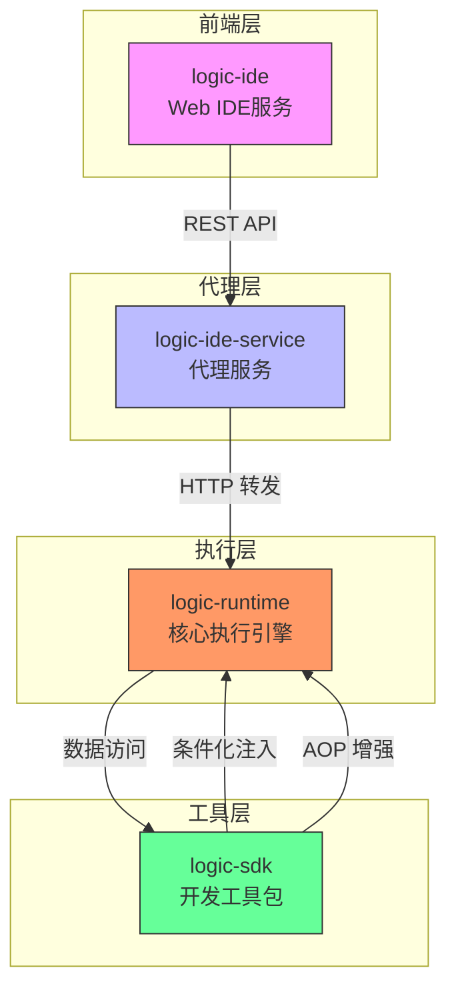

# 模块架构

<cite>
**本文档引用的文件**  
- [LogicRuntimeController.java](file://logic-ide/src/main/java/com/aims/logic/ide/controller/LogicRuntimeController.java)
- [LogicIdeServiceApplication.java](file://logic-ide-service/src/main/java/com/aims/logic/service/LogicIdeServiceApplication.java)
- [GraalvmEngineConfig.java](file://logic-runtime/src/main/java/com/aims/logic/runtime/configuration/GraalvmEngineConfig.java)
- [LogicRunModelEnum.java](file://logic-runtime/src/main/java/com/aims/logic/runtime/contract/dto/LogicRunModelEnum.java)
- [LogicLogServiceConfig.java](file://logic-sdk/src/main/java/com/aims/logic/sdk/config/LogicLogServiceConfig.java)
- [LogicLogServiceCondition.java](file://logic-sdk/src/main/java/com/aims/logic/sdk/aop/LogicLogServiceCondition.java)
- [LogicApiProxyController.java](file://logic-ide-service/src/main/java/com/aims/logic/service/controller/LogicApiProxyController.java)
- [application.yaml](file://logic-ide-service/src/main/resources/application.yaml)
- [LogicRuntimeApplication.java](file://logic-runtime/src/main/java/com/aims/logic/runtime/LogicRuntimeApplication.java)
- [LogicSdkApplication.java](file://logic-sdk/src/main/java/com/aims/logic/sdk/LogicSdkApplication.java)
</cite>

## 目录
1. [引言](#引言)
2. [模块职责划分](#模块职责划分)
3. [模块交互机制](#模块交互机制)
4. [组件调用关系图](#组件调用关系图)
5. [关键入口类与配置文件](#关键入口类与配置文件)
6. [结论](#结论)

## 引言
本文档旨在深入剖析 `logic-solution` 项目的微服务模块架构，重点阐述 `logic-runtime`（核心执行引擎）、`logic-ide`（前端IDE服务）、`logic-sdk`（开发工具包）和 `logic-ide-service`（代理服务）四大模块的职责划分与交互机制。通过分析各模块的关键入口类、配置文件及通信方式，帮助开发者理解系统的分层结构和模块解耦设计。

## 模块职责划分

### logic-runtime（核心执行引擎）
`logic-runtime` 模块是整个系统的核心执行引擎，负责逻辑流程的解析、编排与执行。它提供了基于 GraalVM 的脚本执行能力，支持 JavaScript 等动态语言，并通过 `LogicRunner` 类实现逻辑实例的运行。该模块定义了 `Fn`（函数模式）和 `BizWithTransaction`（Java事务模式）两种执行模型，分别适用于无状态函数调用和有状态业务流程。

**Section sources**
- [LogicRuntimeApplication.java](file://logic-runtime/src/main/java/com/aims/logic/runtime/LogicRuntimeApplication.java)
- [GraalvmEngineConfig.java](file://logic-runtime/src/main/java/com/aims/logic/runtime/configuration/GraalvmEngineConfig.java)
- [LogicRunModelEnum.java](file://logic-runtime/src/main/java/com/aims/logic/runtime/contract/dto/LogicRunModelEnum.java)

### logic-ide（前端IDE服务）
`logic-ide` 模块提供基于 Web 的集成开发环境，允许用户通过图形化界面设计、调试和发布逻辑流程。它包含前端资源文件（HTML、JS）和后端控制器，用于处理用户交互请求。该模块通过 REST API 与 `logic-runtime` 通信，实现逻辑的运行、调试和状态管理。

**Section sources**
- [LogicRuntimeController.java](file://logic-ide/src/main/java/com/aims/logic/ide/controller/LogicRuntimeController.java)

### logic-sdk（开发工具包）
`logic-sdk` 模块为外部应用提供数据服务和 AOP 增强功能。它封装了对逻辑实例、日志、发布记录等实体的 CRUD 操作，并通过条件化配置支持多种日志存储后端（如数据库、Elasticsearch）。该模块还提供了 `LogicItemAop` 切面，用于在逻辑执行前后插入自定义行为。

**Section sources**
- [LogicLogServiceConfig.java](file://logic-sdk/src/main/java/com/aims/logic/sdk/config/LogicLogServiceConfig.java)
- [LogicLogServiceCondition.java](file://logic-sdk/src/main/java/com/aims/logic/sdk/aop/LogicLogServiceCondition.java)

### logic-ide-service（代理服务）
`logic-ide-service` 模块作为代理服务，负责将来自 `logic-ide` 的请求转发至远程 `logic-runtime` 实例。它通过 `LogicApiProxyController` 实现 API 网关功能，支持多租户环境下的路由与负载均衡。该模块还具备动态类加载能力，可在运行时加载外部 JAR 包中的组件。

**Section sources**
- [LogicIdeServiceApplication.java](file://logic-ide-service/src/main/java/com/aims/logic/service/LogicIdeServiceApplication.java)
- [LogicApiProxyController.java](file://logic-ide-service/src/main/java/com/aims/logic/service/controller/LogicApiProxyController.java)

## 模块交互机制

### logic-ide 与 logic-runtime 的 REST API 通信
`logic-ide` 通过 RESTful 接口与 `logic-runtime` 进行通信。例如，`LogicRuntimeController` 中的 `/api/runtime/logic/v1/run-api/{id}` 接口用于触发逻辑执行，接收请求头、请求体和路径参数，并将结果封装为 `ApiResult` 返回。对于需要调试的请求，可通过 `debug` 参数启用调试模式，返回详细的执行日志。

**Section sources**
- [LogicRuntimeController.java](file://logic-ide/src/main/java/com/aims/logic/ide/controller/LogicRuntimeController.java)

### logic-sdk 为运行时提供数据服务与 AOP 增强
`logic-sdk` 通过 Spring 条件化配置机制，根据 `logic.log.store` 配置项动态选择日志服务实现。当配置为 `es` 时，使用 `LogicLogServiceEsImpl`；否则使用 `LogicLogServiceImpl`。此外，`@ConditionalOnLogicLogService` 注解结合 `LogicLogServiceCondition` 实现了运行时的 AOP 增强，确保只有满足条件的 Bean 才会被注册到 Spring 容器中。

**Section sources**
- [LogicLogServiceConfig.java](file://logic-sdk/src/main/java/com/aims/logic/sdk/config/LogicLogServiceConfig.java)
- [LogicLogServiceCondition.java](file://logic-sdk/src/main/java/com/aims/logic/sdk/aop/LogicLogServiceCondition.java)

## 组件调用关系图

**Diagram sources**
- [LogicRuntimeController.java](file://logic-ide/src/main/java/com/aims/logic/ide/controller/LogicRuntimeController.java)
- [LogicApiProxyController.java](file://logic-ide-service/src/main/java/com/aims/logic/service/controller/LogicApiProxyController.java)
- [LogicLogServiceConfig.java](file://logic-sdk/src/main/java/com/aims/logic/sdk/config/LogicLogServiceConfig.java)

## 关键入口类与配置文件

### 入口类
- **logic-runtime**: `LogicRuntimeApplication` —— Spring Boot 主启动类
- **logic-ide**: `LogicIdeApplication` —— IDE 服务主启动类（未在文件中找到具体实现）
- **logic-ide-service**: `LogicIdeServiceApplication` —— 代理服务主启动类，支持动态 JAR 加载
- **logic-sdk**: `LogicSdkApplication` —— SDK 主启动类（未在文件中找到具体实现）

### 配置文件
- **logic-ide-service**: `application.yaml` —— 包含服务端口、日志级别、远程运行时地址等配置
- **logic-runtime**: 依赖环境变量或外部配置注入运行时参数
- **logic-sdk**: 通过 `@Value("${logic.log.store:db}")` 读取日志存储类型配置

**Section sources**
- [LogicRuntimeApplication.java](file://logic-runtime/src/main/java/com/aims/logic/runtime/LogicRuntimeApplication.java)
- [LogicIdeServiceApplication.java](file://logic-ide-service/src/main/java/com/aims/logic/service/LogicIdeServiceApplication.java)
- [application.yaml](file://logic-ide-service/src/main/resources/application.yaml)

## 结论
`logic-solution` 采用清晰的微服务架构，将 IDE、代理、执行引擎和 SDK 解耦为独立模块，提升了系统的可维护性和扩展性。`logic-ide` 通过 REST API 与 `logic-runtime` 交互，`logic-sdk` 提供数据服务与 AOP 增强，而 `logic-ide-service` 作为中间代理实现请求转发与动态加载。整体设计体现了高内聚、低耦合的原则，便于后续功能扩展与技术演进。