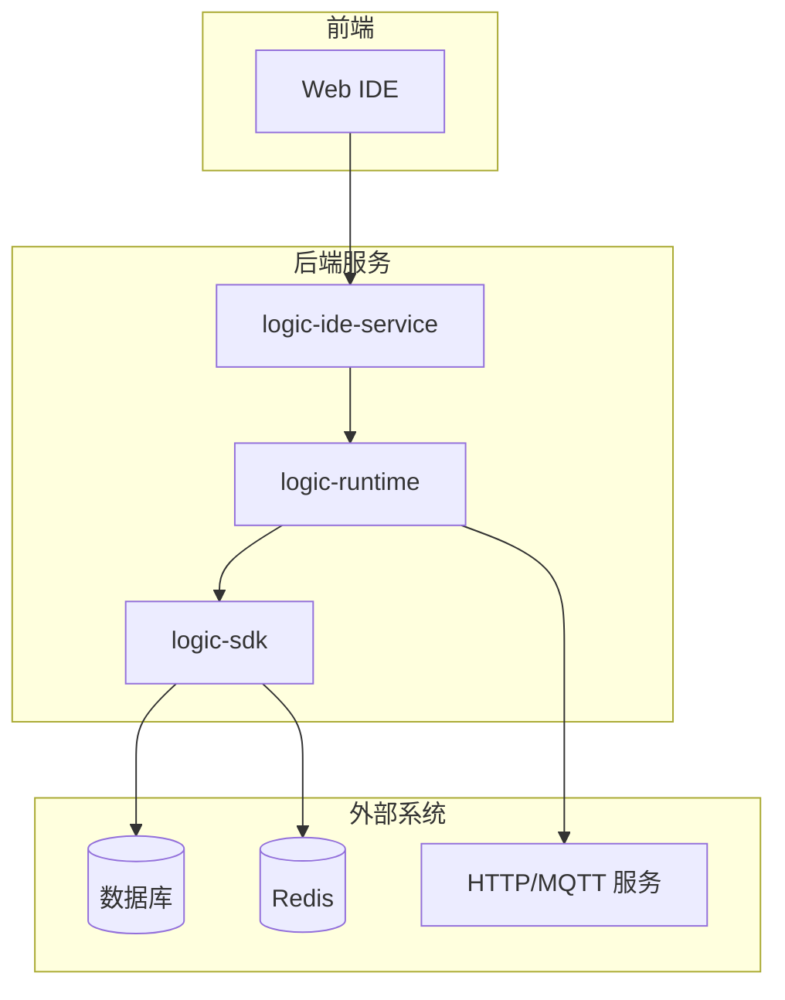
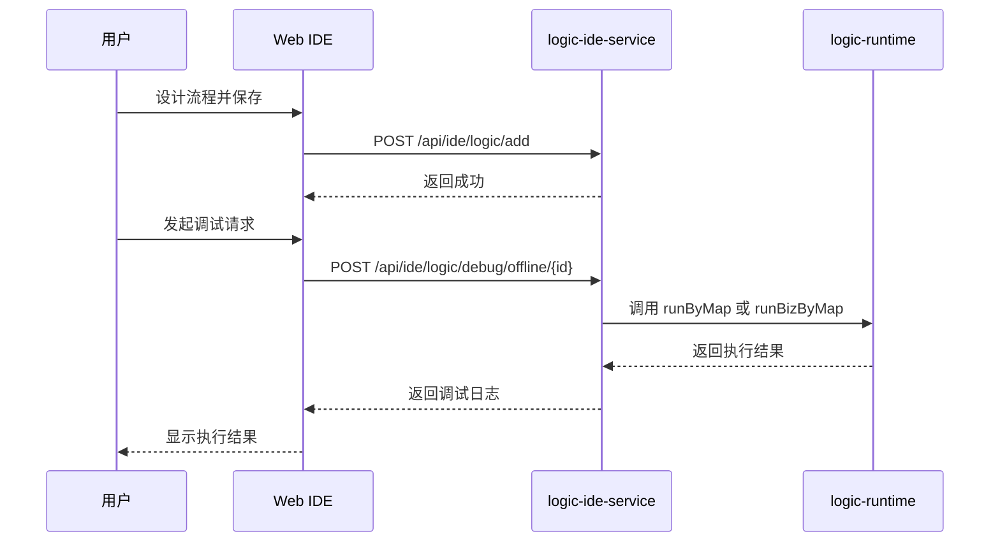

# 系统概述

<cite>
**本文档引用文件**  
- [pom.xml](file://pom.xml)
- [readme.md](file://readme.md)
- [GraalvmEngineConfig.java](file://logic-runtime/src/main/java/com/aims/logic/runtime/configuration/GraalvmEngineConfig.java)
- [LogicIdeController.java](file://logic-ide/src/main/java/com/aims/logic/ide/controller/LogicIdeController.java)
- [HttpFunction.java](file://logic-runtime/src/main/java/com/aims/logic/runtime/runner/functions/impl/HttpFunction.java)
- [JsFunction.java](file://logic-runtime/src/main/java/com/aims/logic/runtime/runner/functions/impl/JsFunction.java)
- [JavaCodeFunction.java](file://logic-runtime/src/main/java/com/aims/logic/runtime/runner/functions/impl/JavaCodeFunction.java)
- [http.json](file://logic-ide/src/main/resources/public/setting/node-form/http.json)
- [mqtt-pub.json](file://logic-ide/src/main/resources/public/setting/node-form/mqtt-pub.json)
</cite>

## 目录
1. [简介](#简介)
2. [项目结构](#项目结构)
3. [技术栈与架构](#技术栈与架构)
4. [核心模块功能](#核心模块功能)
5. [可视化逻辑编排工作流](#可视化逻辑编排工作流)
6. [系统集成能力](#系统集成能力)
7. [执行模型与运行时机制](#执行模型与运行时机制)
8. [扩展性与自定义支持](#扩展性与自定义支持)

## 简介

logic-solution 是一个基于 Java 17 和 Spring Boot 2.7.2 构建的可视化逻辑编排平台，旨在通过图形化界面实现企业级自动化流程的设计、调试、发布与监控。该平台支持拖拽式流程设计，结合 GraalVM JS 引擎实现高性能脚本执行，适用于复杂业务流程的自动化编排。

平台采用微服务架构，由多个独立模块组成，支持无状态与有状态流程执行，具备完整的事务控制、日志追踪和调试能力。通过 REST API 提供对外集成接口，便于嵌入现有系统。

**Section sources**
- [readme.md](file://readme.md#L0-L55)

## 项目结构

logic-solution 采用多模块 Maven 项目结构，各模块职责清晰，便于独立开发与部署：

```
logic-solution/
├── logic-runtime/     # 核心执行引擎
├── logic-sdk/         # SDK 和服务层
├── logic-ide/         # Web IDE 界面
├── logic-ide-service/ # IDE 服务端
└── test-suite/        # 完整示例和测试
```

- **logic-runtime**：核心运行时引擎，负责逻辑流程的解析与执行。
- **logic-sdk**：提供对外服务接口与数据访问能力。
- **logic-ide**：前端可视化编辑器，支持流程设计与调试。
- **logic-ide-service**：IDE 后端服务，提供配置管理与元数据查询。
- **test-suite**：集成测试与示例应用。

**Section sources**
- [readme.md](file://readme.md#L56-L131)

## 技术栈与架构

### 技术栈

- **Java 版本**：Java 17
- **框架**：Spring Boot 2.7.2
- **脚本引擎**：GraalVM Polyglot JS 引擎
- **HTTP 客户端**：OkHttp
- **JSON 处理**：Fastjson2
- **构建工具**：Maven

### 架构模式

平台采用分层微服务架构，各模块通过标准接口通信：



**Diagram sources**
- [pom.xml](file://pom.xml#L0-L29)
- [readme.md](file://readme.md#L0-L55)

**Section sources**
- [pom.xml](file://pom.xml#L0-L29)

## 核心模块功能

### 可视化编排引擎

支持通过拖拽方式设计业务流程，节点类型包括：
- 开始/结束节点
- 条件判断（if/switch）
- 脚本执行（JS/Java）
- 外部调用（HTTP/MQTT）
- 子流程调用

### 运行时执行能力

- 支持同步与异步执行模式
- 提供有状态业务实例（bizId）支持暂停与恢复
- 支持事务边界控制
- 详细的执行日志与调试信息

### 配置管理

通过 `application.yml` 配置核心参数：
```yaml
logic:
  config-dir: ./logic-configs
  log-service: database
  default-tran-scope: everyRequest
```

**Section sources**
- [readme.md](file://readme.md#L56-L131)

## 可视化逻辑编排工作流

### 典型用户工作流

1. **流程设计**：在 Web IDE 中拖拽节点构建流程图
2. **参数配置**：为每个节点设置输入、输出与执行逻辑
3. **本地调试**：使用调试模式验证流程逻辑
4. **发布部署**：将流程发布至运行时环境
5. **执行监控**：查看执行日志与性能指标

### 调试与执行示例

通过 `/api/ide/logic/debug/{model}/{id}` 接口可进行流程调试：
- `model=offline`：离线调试模式
- `model=online`：在线执行模式
- 支持传入 `bizId` 实现有状态流程的断点续执行



**Diagram sources**
- [LogicIdeController.java](file://logic-ide/src/main/java/com/aims/logic/ide/controller/LogicIdeController.java#L150-L190)

**Section sources**
- [LogicIdeController.java](file://logic-ide/src/main/java/com/aims/logic/ide/controller/LogicIdeController.java#L150-L190)

## 系统集成能力

### 外部协议支持

#### HTTP 集成

通过 `HttpFunction` 实现 HTTP 节点功能，支持：
- 自定义请求方法（GET/POST/PUT/DELETE）
- 动态 URL 与请求头（支持 JS 表达式）
- 请求体参数化
- 超时控制

配置示例如下：
```json
{
  "url": "返回URL字符串的JS代码",
  "method": "POST",
  "headers": "返回请求头对象的JS代码",
  "body": "返回body对象的JS代码",
  "timeout": 5000
}
```

**Diagram sources**
- [http.json](file://logic-ide/src/main/resources/public/setting/node-form/http.json#L0-L85)
- [HttpFunction.java](file://logic-runtime/src/main/java/com/aims/logic/runtime/runner/functions/impl/HttpFunction.java#L0-L118)

#### MQTT 集成

支持 MQTT 客户端发布消息，配置参数包括：
- 客户端编号（clientId）
- 发布主题（topic）
- 消息内容（msg）
- 返回值接收参数

**Diagram sources**
- [mqtt-pub.json](file://logic-ide/src/main/resources/public/setting/node-form/mqtt-pub.json#L0-L38)

**Section sources**
- [HttpFunction.java](file://logic-runtime/src/main/java/com/aims/logic/runtime/runner/functions/impl/HttpFunction.java#L0-L118)
- [http.json](file://logic-ide/src/main/resources/public/setting/node-form/http.json#L0-L85)
- [mqtt-pub.json](file://logic-ide/src/main/resources/public/setting/node-form/mqtt-pub.json#L0-L38)

## 执行模型与运行时机制

### 脚本执行引擎

基于 GraalVM Polyglot API 构建 JS 执行环境：

```java
@Configuration
public class GraalvmEngineConfig {
    @Bean(destroyMethod = "close")
    public Engine graalEngine() {
        return Engine.newBuilder()
                .option("engine.WarnInterpreterOnly", "false")
                .build();
    }
}
```

执行上下文注入以下变量：
- `_par`：输入参数
- `_var`：局部变量
- `_global`：全局变量
- `_env`：环境变量
- `_last`：上一节点输出
- `_lastRet`：上一节点返回值

**Diagram sources**
- [GraalvmEngineConfig.java](file://logic-runtime/src/main/java/com/aims/logic/runtime/configuration/GraalvmEngineConfig.java#L0-L15)
- [JsFunction.java](file://logic-runtime/src/main/java/com/aims/logic/runtime/runner/functions/impl/JsFunction.java#L0-L147)

### Java 代码调用机制

支持调用任意 Java 类方法，通过反射实现参数类型自动转换：
- 基本类型与包装类
- 集合类型（List/Map）
- 枚举类型
- 自定义对象

调用流程：
1. 加载目标类
2. 解析方法签名
3. 转换 JS 参数为 Java 对象
4. 反射调用方法
5. 处理异常与返回值

**Diagram sources**
- [JavaCodeFunction.java](file://logic-runtime/src/main/java/com/aims/logic/runtime/runner/functions/impl/JavaCodeFunction.java#L0-L181)

**Section sources**
- [GraalvmEngineConfig.java](file://logic-runtime/src/main/java/com/aims/logic/runtime/configuration/GraalvmEngineConfig.java#L0-L15)
- [JsFunction.java](file://logic-runtime/src/main/java/com/aims/logic/runtime/runner/functions/impl/JsFunction.java#L0-L147)
- [JavaCodeFunction.java](file://logic-runtime/src/main/java/com/aims/logic/runtime/runner/functions/impl/JavaCodeFunction.java#L0-L181)

## 扩展性与自定义支持

### 自定义节点开发

通过实现 `ILogicItemFunctionRunner` 接口可扩展新节点类型：

```java
@Component
public class CustomFunction implements ILogicItemFunctionRunner {
    @Override
    public LogicItemRunResult invoke(FunctionContext ctx, LogicItemTreeNode dsl) {
        // 自定义逻辑实现
        return new LogicItemRunResult().setSuccess(true).setData("custom result");
    }

    @Override
    public String getItemType() {
        return "custom";
    }
}
```

### 注解驱动配置

使用 `@LogicItem` 注解自动注册 Java 方法为可调用节点：

```java
@LogicItem(name = "业务方法", group = "业务模块", type = "java")
public String businessMethod(String input) {
    return "处理结果: " + input;
}
```

**Section sources**
- [readme.md](file://readme.md#L109-L131)
- [LogicIdeController.java](file://logic-ide/src/main/java/com/aims/logic/ide/controller/LogicIdeController.java#L250-L350)