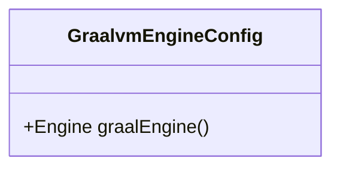
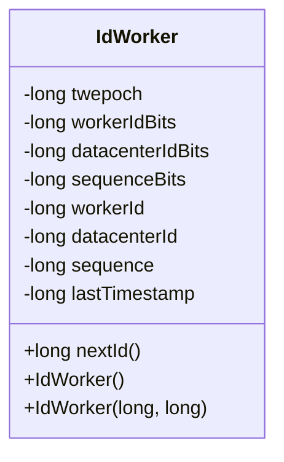
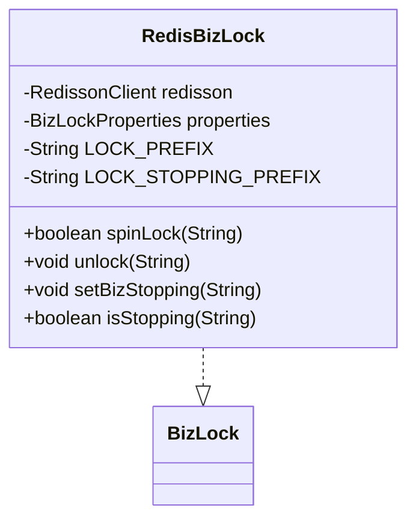

# 性能优化

<cite>
**本文档引用的文件**
- [GraalvmEngineConfig.java](file://logic-runtime/src/main/java/com/aims/logic/runtime/configuration/GraalvmEngineConfig.java)
- [IdWorker.java](file://logic-runtime/src/main/java/com/aims/logic/runtime/util/IdWorker.java)
- [RedisBizLock.java](file://logic-sdk/src/main/java/com/aims/logic/sdk/util/lock/RedisBizLock.java)
- [CaffeineCacheConfig.java](file://logic-runtime/src/main/java/com/aims/logic/runtime/configuration/CaffeineCacheConfig.java)
- [BizLockProperties.java](file://logic-sdk/src/main/java/com/aims/logic/sdk/util/lock/BizLockProperties.java)
</cite>

## 目录
1. [引言](#引言)
2. [JavaScript执行引擎性能调优](#javascript执行引擎性能调优)
3. [分布式ID生成性能分析](#分布式id生成性能分析)
4. [高并发锁性能优化](#高并发锁性能优化)
5. [缓存与数据库连接池最佳实践](#缓存与数据库连接池最佳实践)
6. [性能测试方法与基准参考](#性能测试方法与基准参考)
7. [总结](#总结)

## 引言
本指南深入分析logic-solution系统的性能瓶颈，并提供针对性的优化策略。重点涵盖JavaScript执行引擎调优、分布式ID生成、高并发锁机制、缓存策略及数据库连接池配置等核心性能维度，旨在提升系统整体吞吐量与响应效率。

## JavaScript执行引擎性能调优

`GraalvmEngineConfig`类配置了GraalVM JavaScript执行引擎的核心参数。通过`Engine.newBuilder()`构建器初始化引擎实例，并禁用解释器模式警告（`engine.WarnInterpreterOnly=false`），确保JavaScript代码在运行时能够充分利用GraalVM的即时编译（JIT）能力，从而显著提升脚本执行性能。

该配置通过Spring的`@Bean`注解将`Engine`实例注册为单例Bean，实现上下文级别的引擎复用，避免频繁创建和销毁引擎带来的资源开销。`destroyMethod = "close"`确保应用关闭时正确释放引擎资源。

**图示来源**
- [GraalvmEngineConfig.java](file://logic-runtime/src/main/java/com/aims/logic/runtime/configuration/GraalvmEngineConfig.java#L6-L14)

**本节来源**
- [GraalvmEngineConfig.java](file://logic-runtime/src/main/java/com/aims/logic/runtime/configuration/GraalvmEngineConfig.java#L6-L14)

## 分布式ID生成性能分析

`IdWorker`类基于Snowflake算法实现高性能分布式ID生成。其ID结构为64位长整型，由时间戳（41位）、数据中心ID（5位）、工作机器ID（5位）和序列号（12位）组成，保证全局唯一性且趋势递增。

该实现具备以下性能优势：
- **高吞吐**：单机每秒可生成数十万ID。
- **低延迟**：同步方法`nextId()`确保线程安全，避免锁竞争过度。
- **自适应**：构造函数支持手动指定workerId和datacenterId，或通过MAC地址与JVM进程ID自动推导，适应不同部署环境。

时间回拨保护机制（`tilNextMillis`）确保在系统时钟异常时仍能安全生成ID，避免重复。

**图示来源**
- [IdWorker.java](file://logic-runtime/src/main/java/com/aims/logic/runtime/util/IdWorker.java#L25-L163)

**本节来源**
- [IdWorker.java](file://logic-runtime/src/main/java/com/aims/logic/runtime/util/IdWorker.java#L25-L163)

## 高并发锁性能优化

`RedisBizLock`利用Redisson客户端实现基于Redis的分布式业务锁，适用于高并发场景下的资源协调。

核心优化点包括：
- **灵活配置**：支持单机与集群模式的Redis连接配置。
- **自旋重试**：`spinLock`方法实现可配置的重试次数与等待间隔，平衡获取锁的及时性与系统负载。
- **安全释放**：`unlock`操作前校验锁持有线程，防止误释放；采用先解锁后异步清理元数据的策略，降低延迟。
- **状态管理**：通过`biz_stopping`标记位安全控制业务流程的停止操作，避免竞态条件。

锁键值采用`biz_lock:{logicId}:{bizId}`格式，确保业务实例级别的互斥。

**图示来源**
- [RedisBizLock.java](file://logic-sdk/src/main/java/com/aims/logic/sdk/util/lock/RedisBizLock.java#L14-L162)
- [BizLockProperties.java](file://logic-sdk/src/main/java/com/aims/logic/sdk/util/lock/BizLockProperties.java)

**本节来源**
- [RedisBizLock.java](file://logic-sdk/src/main/java/com/aims/logic/sdk/util/lock/RedisBizLock.java#L14-L162)

## 缓存与数据库连接池最佳实践

### 本地缓存配置
`CaffeineCacheConfig`类预留了基于Caffeine的本地缓存配置入口。Caffeine作为高性能Java缓存库，支持LRU等淘汰策略和基于访问/写入时间的过期机制。建议根据实际业务场景启用并配置合理的`maximumSize`和`expireAfterAccess`参数，以有效减轻数据库压力。

### 数据库连接池
虽然项目中未直接展示连接池配置，但作为最佳实践，应使用HikariCP等高性能连接池，并合理设置：
- **最小/最大连接数**：根据负载动态调整。
- **连接超时与空闲超时**：避免资源浪费。
- **预编译语句缓存**：提升SQL执行效率。

### 批量处理
对于大批量数据操作，应优先采用批量插入/更新（如MyBatis的`foreach`批量操作或JDBC的`addBatch`），显著减少网络往返次数和事务开销。

**本节来源**
- [CaffeineCacheConfig.java](file://logic-runtime/src/main/java/com/aims/logic/runtime/configuration/CaffeineCacheConfig.java#L10-L21)

## 性能测试方法与基准参考

建议采用以下方法进行性能验证：
1. **基准测试**：使用JMH对`IdWorker.nextId()`、`RedisBizLock.spinLock()`等核心方法进行微基准测试，量化单操作延迟与吞吐。
2. **集成压测**：通过JMeter或Gatling模拟高并发业务场景，测试端到端响应时间与系统瓶颈。
3. **监控指标**：集成Prometheus+Grafana，监控QPS、P99延迟、缓存命中率、数据库连接池使用率等关键指标。
4. **对比测试**：在优化前后进行相同场景的压力测试，对比性能提升效果。

## 总结
通过对GraalVM引擎、Snowflake ID生成器、Redis分布式锁及本地缓存的精细化调优，logic-solution系统能够在高并发、低延迟的业务场景下保持卓越性能。结合合理的数据库连接池与批量处理策略，并辅以科学的性能测试方法，可构建稳定高效的企业级应用。