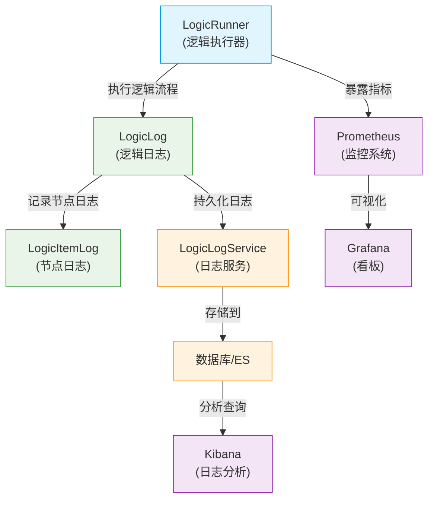
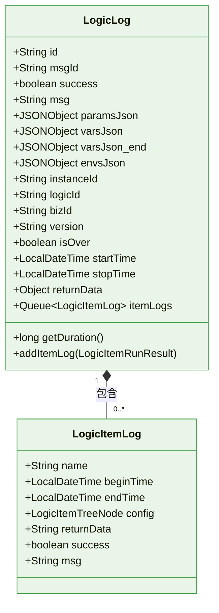
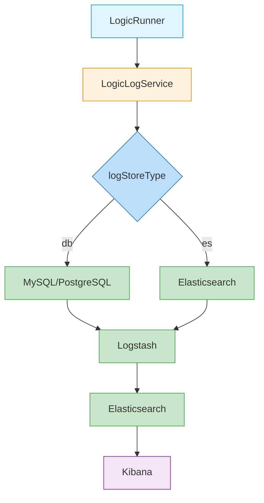

# 监控与指标

<cite>
**本文档引用文件**  
- [LogicRunner.java](file://logic-runtime/src/main/java/com/aims/logic/runtime/runner/LogicRunner.java)
- [LogicLog.java](file://logic-runtime/src/main/java/com/aims/logic/runtime/contract/logger/LogicLog.java)
- [LogicItemLog.java](file://logic-runtime/src/main/java/com/aims/logic/runtime/contract/logger/LogicItemLog.java)
- [LogicLogService.java](file://logic-sdk/src/main/java/com/aims/logic/sdk/service/LogicLogService.java)
- [LogicLogServiceImpl.java](file://logic-sdk/src/main/java/com/aims/logic/sdk/service/impl/LogicLogServiceImpl.java)
- [LogicLogServiceEsImpl.java](file://logic-sdk/src/main/java/com/aims/logic/sdk/service/impl/es/LogicLogServiceEsImpl.java)
- [LogicLogServiceConfig.java](file://logic-sdk/src/main/java/com/aims/logic/sdk/config/LogicLogServiceConfig.java)
- [LogicRunnerService.java](file://logic-runtime/src/main/java/com/aims/logic/runtime/service/LogicRunnerService.java)
- [LogicRunResult.java](file://logic-runtime/src/main/java/com/aims/logic/runtime/contract/dto/LogicRunResult.java)
</cite>

## 目录
1. [引言](#引言)
2. [执行指标收集机制](#执行指标收集机制)
3. [日志系统设计与集成](#日志系统设计与集成)
4. [监控系统集成方案](#监控系统集成方案)
5. [关键业务指标与告警策略](#关键业务指标与告警策略)
6. [监控看板配置示例](#监控看板配置示例)
7. [总结](#总结)

## 引言
本文档系统阐述 `logic-solution` 框架的可观测性设计，重点说明如何通过 `LogicRunner` 和 `LogicLogService` 收集逻辑执行过程中的关键性能指标（KPI），包括执行时间、节点调用次数、错误率等。同时，介绍与 Prometheus、Grafana 等主流监控系统的集成方法，以及日志级别、格式规范和 ELK 栈的集成方案，为系统运维和性能优化提供全面支持。

## 执行指标收集机制

`logic-solution` 的执行指标收集由 `LogicRunner` 和 `LogicLog` 两大核心组件协同完成，实现了对逻辑流程执行全过程的精细化监控。

### 核心组件与数据流

**图示来源**
- [LogicRunner.java](file://logic-runtime/src/main/java/com/aims/logic/runtime/runner/LogicRunner.java)
- [LogicLog.java](file://logic-runtime/src/main/java/com/aims/logic/runtime/contract/logger/LogicLog.java)
- [LogicLogService.java](file://logic-sdk/src/main/java/com/aims/logic/sdk/service/LogicLogService.java)

**本节来源**
- [LogicRunner.java](file://logic-runtime/src/main/java/com/aims/logic/runtime/runner/LogicRunner.java#L1-L290)
- [LogicLog.java](file://logic-runtime/src/main/java/com/aims/logic/runtime/contract/logger/LogicLog.java#L1-L171)

### 关键性能指标（KPI）定义

以下表格详细说明了 `LogicRunner` 收集的核心性能指标及其数据来源。

| 指标名称 | 指标描述 | 数据来源 | 计算方式/说明 |
| :--- | :--- | :--- | :--- |
| **逻辑流程总执行时间** | 从逻辑开始执行到结束的总耗时（毫秒）。 | `LogicLog` | `getDuration()` 方法，通过 `startTime` 和 `stopTime` 计算得出。 |
| **节点调用次数** | 每个逻辑节点在一次执行流程中被调用的次数。 | `LogicLog` | 通过 `itemLogs` 队列的大小或遍历 `itemLogs` 统计。 |
| **节点执行时间** | 每个逻辑节点自身的执行耗时（毫秒）。 | `LogicItemLog` | `endTime` 减去 `beginTime` 的时间差。 |
| **逻辑执行错误率** | 执行失败的逻辑实例占总执行实例的比例。 | `LogicRunResult` | `success` 字段为 `false` 的实例数 / 总实例数。 |
| **业务实例成功率** | 在有状态执行模式下，以 `bizId` 为单位的业务流程成功率。 | `LogicLog` | 基于 `bizId` 聚合 `success` 字段进行统计。 |
| **平均执行时间** | 在指定时间段内，所有逻辑执行实例的平均耗时。 | `LogicLog` | 所有实例的 `duration` 之和 / 实例总数。 |
| **最长执行时间** | 在指定时间段内，所有逻辑执行实例中的最大耗时。 | `LogicLog` | 所有实例 `duration` 的最大值。 |

**本节来源**
- [LogicLog.java](file://logic-runtime/src/main/java/com/aims/logic/runtime/contract/logger/LogicLog.java#L1-L171)
- [LogicItemLog.java](file://logic-runtime/src/main/java/com/aims/logic/runtime/contract/logger/LogicItemLog.java#L1-L53)
- [LogicRunResult.java](file://logic-runtime/src/main/java/com/aims/logic/runtime/contract/dto/LogicRunResult.java#L1-L75)

## 日志系统设计与集成

`logic-solution` 的日志系统采用分层设计，确保日志的完整性、可追溯性和灵活性。

### 日志级别与格式规范

日志系统遵循标准的 SLF4J + Logback 框架，日志级别定义如下：
- **DEBUG**: 记录详细的执行信息，如参数、变量的声明和变化，用于深度调试。
- **INFO**: 记录逻辑执行的初始化、关键节点进入等信息，用于追踪执行流程。
- **WARN**: 记录非致命的异常或潜在问题，如 JWT 解析失败。
- **ERROR**: 记录导致逻辑执行失败的严重错误。

日志格式采用 JSON 结构化输出，便于机器解析和后续处理。核心日志实体 `LogicLog` 和 `LogicItemLog` 的结构如下：

**图示来源**
- [LogicLog.java](file://logic-runtime/src/main/java/com/aims/logic/runtime/contract/logger/LogicLog.java#L1-L171)
- [LogicItemLog.java](file://logic-runtime/src/main/java/com/aims/logic/runtime/contract/logger/LogicItemLog.java#L1-L53)

**本节来源**
- [LogicLog.java](file://logic-runtime/src/main/java/com/aims/logic/runtime/contract/logger/LogicLog.java#L1-L171)
- [LogicItemLog.java](file://logic-runtime/src/main/java/com/aims/logic/runtime/contract/logger/LogicItemLog.java#L1-L53)

### ELK 栈集成方案

系统通过 `LogicLogService` 接口实现日志的持久化存储，支持灵活的后端存储切换，天然适配 ELK（Elasticsearch, Logstash, Kibana）技术栈。

#### 集成架构

**图示来源**
- [LogicLogServiceConfig.java](file://logic-sdk/src/main/java/com/aims/logic/sdk/config/LogicLogServiceConfig.java#L1-L31)
- [LogicLogService.java](file://logic-sdk/src/main/java/com/aims/logic/sdk/service/LogicLogService.java#L1-L14)
- [LogicLogServiceImpl.java](file://logic-sdk/src/main/java/com/aims/logic/sdk/service/impl/LogicLogServiceImpl.java#L1-L21)
- [LogicLogServiceEsImpl.java](file://logic-sdk/src/main/java/com/aims/logic/sdk/service/impl/es/LogicLogServiceEsImpl.java)

**本节来源**
- [LogicLogServiceConfig.java](file://logic-sdk/src/main/java/com/aims/logic/sdk/config/LogicLogServiceConfig.java#L1-L31)
- [LogicLogService.java](file://logic-sdk/src/main/java/com/aims/logic/sdk/service/LogicLogService.java#L1-L14)
- [LogicLogServiceImpl.java](file://logic-sdk/src/main/java/com/aims/logic/sdk/service/impl/LogicLogServiceImpl.java#L1-L21)
- [LogicLogServiceEsImpl.java](file://logic-sdk/src/main/java/com/aims/logic/sdk/service/impl/es/LogicLogServiceEsImpl.java)

#### 配置说明
通过在 `application.yml` 中配置 `logic.log.store` 参数，即可切换日志存储后端：
- `logic.log.store: db`：日志存储到关系型数据库（默认）。
- `logic.log.store: es`：日志直接写入 Elasticsearch，实现更高效的全文检索和实时分析。

## 监控系统集成方案

`logic-solution` 的指标数据可以通过多种方式与 Prometheus 集成，实现全面的系统监控。

### Prometheus 集成方法

1.  **直接暴露指标端点**：在 `logic-runtime` 服务中，通过 Spring Boot Actuator 创建一个自定义的 `/actuator/metrics/logic` 端点。该端点查询 `LogicLog` 的持久化存储（数据库或 ES），聚合计算出 KPI 指标，并以 Prometheus 兼容的文本格式输出。
2.  **使用 Micrometer**：将 `LogicLog` 中的关键数据（如执行时间、成功/失败计数）通过 Micrometer 库注册为 `Timer` 和 `Counter` 指标。Spring Boot Actuator 会自动将这些指标暴露在 `/actuator/prometheus` 端点，供 Prometheus 抓取。

### Grafana 集成方法
1.  **数据源配置**：在 Grafana 中添加 Prometheus 作为数据源，指向 `logic-runtime` 服务的 `/actuator/prometheus` 或自定义指标端点。
2.  **看板创建**：基于暴露的指标，创建监控看板，实时展示逻辑执行的健康状况。

## 关键业务指标与告警策略

为确保系统稳定运行，建议对以下关键业务指标设置告警阈值。

| 指标 | 告警阈值 | 告警级别 | 告警说明 |
| :--- | :--- | :--- | :--- |
| **逻辑流程平均执行时间** | > 5000ms (5秒) | 警告 (WARN) | 表明系统处理能力下降，需关注。 |
| **逻辑流程最长执行时间** | > 30000ms (30秒) | 严重 (CRITICAL) | 存在严重性能瓶颈或死循环，需立即排查。 |
| **逻辑执行错误率** | > 5% (5分钟内) | 警告 (WARN) | 错误率上升，可能存在代码缺陷或外部依赖问题。 |
| **逻辑执行错误率** | > 20% (5分钟内) | 严重 (CRITICAL) | 系统出现大面积故障，需紧急处理。 |
| **业务实例成功率** | < 95% (1小时内) | 警告 (WARN) | 特定业务流程出现问题，需针对性分析。 |
| **待处理业务实例积压** | > 1000 | 严重 (CRITICAL) | 系统处理能力严重不足，可能导致服务不可用。 |

## 监控看板配置示例

一个典型的 Grafana 监控看板应包含以下面板：

1.  **总体概览**：显示总执行次数、成功率、平均/最长执行时间的实时数值。
2.  **执行时间趋势图**：折线图展示过去24小时的平均执行时间和最长执行时间变化趋势。
3.  **错误率热力图**：热力图展示不同时间段的错误率分布。
4.  **节点性能分析**：柱状图展示调用次数最多的前10个节点及其平均执行时间。
5.  **实例状态分布**：饼图展示当前所有业务实例的运行状态（成功、失败、运行中）。

## 总结
`logic-solution` 通过 `LogicRunner` 和 `LogicLogService` 构建了一套完善的可观测性体系。该体系能够精确收集逻辑执行的各项关键性能指标，并通过灵活的日志存储策略和标准化的监控接口，无缝集成 Prometheus、Grafana 和 ELK 等主流监控分析工具。通过合理配置告警阈值和监控看板，运维团队可以实时掌握系统运行状态，快速定位和解决问题，保障业务的稳定高效运行。