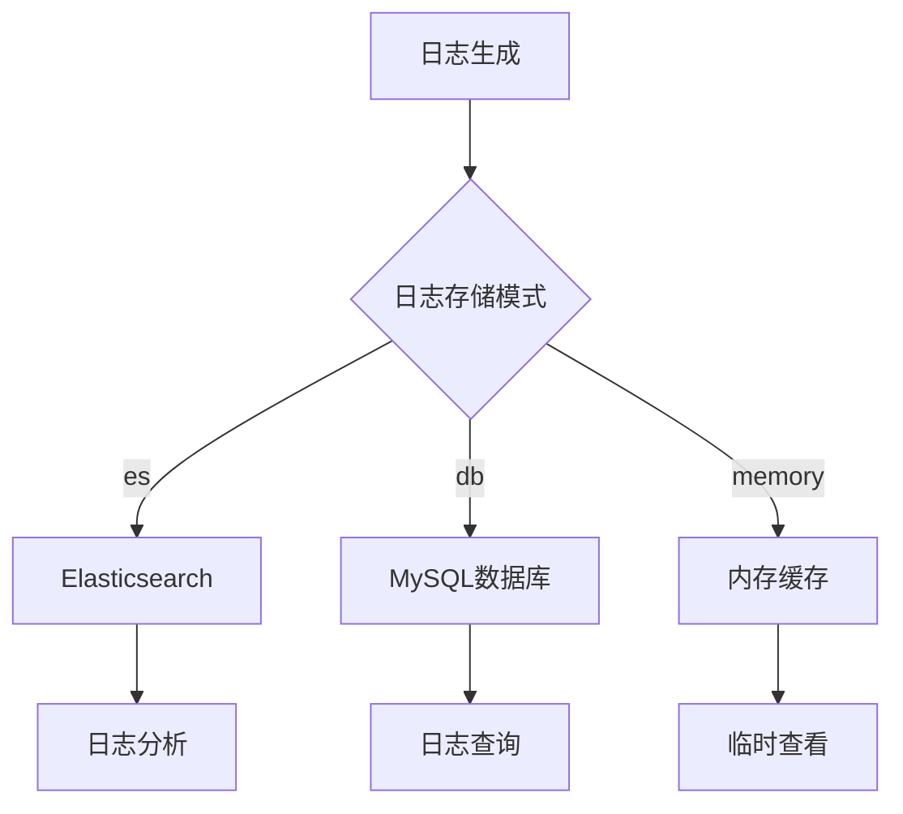
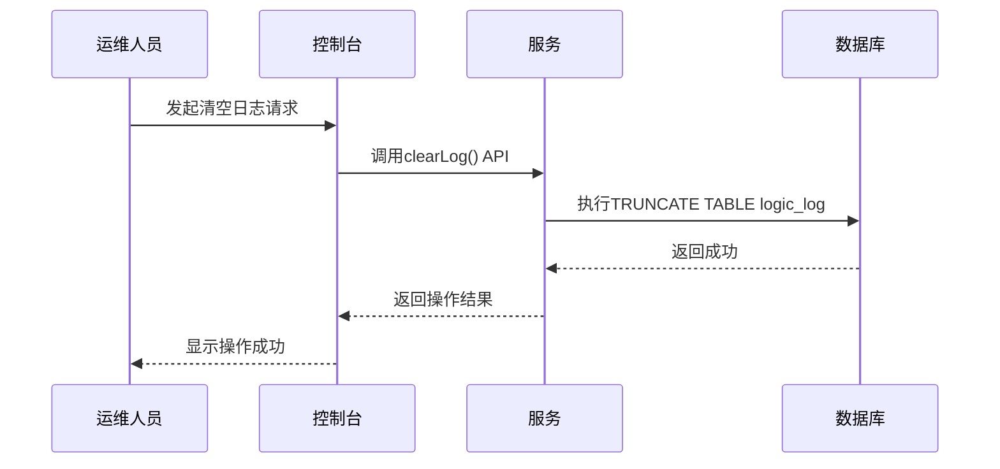
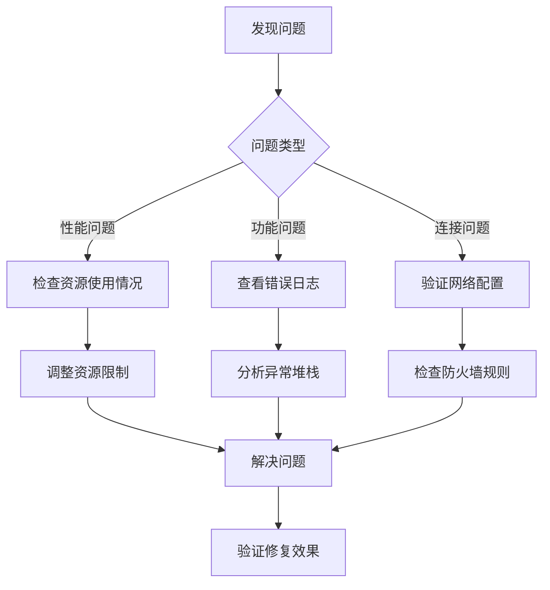

# 部署与运维

<cite>
**本文档引用文件**   
- [readme.md](file://readme.md)
- [application-k8s.yaml](file://test-suite/src/main/resources/application-k8s.yaml)
- [application.yaml](file://test-suite/src/main/resources/application.yaml)
- [application-dev.yaml](file://test-suite/src/main/resources/application-dev.yaml)
- [pom.xml](file://test-suite/pom.xml)
- [LogicLogService.java](file://logic-sdk/src/main/java/com/aims/logic/sdk/service/LogicLogService.java)
- [LoggerHelperServiceImpl.java](file://logic-sdk/src/main/java/com/aims/logic/sdk/service/impl/LoggerHelperServiceImpl.java)
- [LogicLogServiceEsImpl.java](file://logic-sdk/src/main/java/com/aims/logic/sdk/service/impl/es/LogicLogServiceEsImpl.java)
- [IdWorker.java](file://logic-runtime/src/main/java/com/aims/logic/runtime/util/IdWorker.java)
- [LogicInstanceEntity.java](file://logic-sdk/src/main/java/com/aims/logic/sdk/entity/LogicInstanceEntity.java)
- [LogicRunnerService.java](file://logic-runtime/src/main/java/com/aims/logic/runtime/service/LogicRunnerService.java)
- [LogicIdeController.java](file://logic-ide/src/main/java/com/aims/logic/ide/controller/LogicIdeController.java)
- [remote-logic-manager.json](file://logic-ide/src/main/resources/public/setting/pages/remote-logic-manager.json)
</cite>

## 目录
1. [简介](#简介)
2. [Docker部署策略](#docker部署策略)
3. [Kubernetes部署配置](#kubernetes部署配置)
4. [监控与日志管理](#监控与日志管理)
5. [高可用性与灾难恢复](#高可用性与灾难恢复)
6. [版本升级与回滚](#版本升级与回滚)
7. [安全加固与合规性](#安全加固与合规性)
8. [日常维护与故障排除](#日常维护与故障排除)

## 简介

logic-solution 是一个基于 Java 17 和 Spring Boot 的可视化逻辑编排引擎，支持通过拖拽式界面设计业务流程，并提供强大的运行时执行能力。本部署与运维文档旨在为运维团队提供全面的部署策略、运维实践和最佳操作指南，确保系统稳定、高效运行。

**Section sources**
- [readme.md](file://readme.md)

## Docker部署策略

### 镜像构建

根据项目根目录下的 `Dockerfile` 示例，构建 logic-solution 的 Docker 镜像：

```dockerfile
FROM openjdk:17-jdk-slim

COPY target/logic-solution-*.jar app.jar
COPY logic-configs ./logic-configs

EXPOSE 8080
ENTRYPOINT ["java", "-jar", "app.jar"]
```

构建步骤：
1. 确保 Maven 项目已成功打包：`mvn clean package`
2. 将生成的 JAR 文件和 `logic-configs` 配置目录复制到 Docker 构建上下文
3. 执行 `docker build -t logic-solution:latest .` 命令构建镜像

### 容器运行

运行容器时，建议使用以下最佳实践：

```bash
docker run -d \
  --name logic-solution \
  -p 8888:8888 \
  -v /host/configs:/app/logic-configs \
  -v /host/logs:/app/logs \
  -e SPRING_PROFILES_ACTIVE=k8s \
  -e LOGIC_CONFIG_DIR=/app/logic-configs \
  --restart unless-stopped \
  logic-solution:latest
```

**关键参数说明：**
- `-v`：挂载配置和日志目录，实现配置持久化和日志收集
- `-e`：设置环境变量，指定 Spring 配置文件和配置目录
- `--restart`：设置容器重启策略，确保服务高可用

**Section sources**
- [readme.md](file://readme.md)

## Kubernetes部署配置

### 配置文件分析

`application-k8s.yaml` 文件定义了 Kubernetes 环境下的核心配置：

```yaml
server:
  port: 8888
spring:
  datasource:
    driver-class-name: com.mysql.cj.jdbc.Driver
    url: jdbc:mysql://dev.aimstek.cn:32150/logic_test_0_9?useUnicode=true&characterEncoding=gbk&autoReconnect=true&failOverReadOnly=false
    username: root
    password: 12#$qwER
logic:
  log:
    store: es
    item-queue-size: 30
    es:
      host: http://es.xuanwu-factory.dev.aimstek.cn
      index: logic-log-lk-local
  config-dir: /Users/lk/Documents/Dev/aims/xuanwu-logic/logic-solution/test-suite/test-case-configs
  scan-package-names: com.aims.logic.testsuite
```

### 部署建议

1. **数据库连接**：使用 Kubernetes Secrets 管理数据库凭证，避免在配置文件中明文存储
2. **Elasticsearch 集成**：将日志存储模式设置为 `es`，利用 Elasticsearch 实现高效的日志查询和分析
3. **配置管理**：通过 ConfigMap 管理 `application-k8s.yaml` 配置，并使用环境变量覆盖关键参数
4. **资源限制**：为 Pod 设置合理的 CPU 和内存限制，防止资源耗尽

```yaml
apiVersion: apps/v1
kind: Deployment
metadata:
  name: logic-solution
spec:
  replicas: 3
  selector:
    matchLabels:
      app: logic-solution
  template:
    metadata:
      labels:
        app: logic-solution
    spec:
      containers:
      - name: logic-solution
        image: logic-solution:latest
        ports:
        - containerPort: 8888
        envFrom:
        - configMapRef:
            name: logic-solution-config
        - secretRef:
            name: logic-solution-secrets
        volumeMounts:
        - name: configs
          mountPath: /app/logic-configs
        resources:
          requests:
            memory: "512Mi"
            cpu: "250m"
          limits:
            memory: "1Gi"
            cpu: "500m"
      volumes:
      - name: configs
        configMap:
          name: logic-solution-configs
```

**Section sources**
- [application-k8s.yaml](file://test-suite/src/main/resources/application-k8s.yaml)
- [application.yaml](file://test-suite/src/main/resources/application.yaml)

## 监控与日志管理

### 监控指标收集

系统提供以下关键监控指标：
- **实例执行状态**：通过 `LogicInstanceEntity` 中的 `startTime`、`stopTime` 和 `duration` 字段监控执行耗时
- **重试次数**：`retryTimes` 字段记录实例重试情况，用于识别异常流程
- **异步执行状态**：`isAsync` 字段标识异步执行实例，便于监控异步任务

### 日志管理

#### 日志存储策略

系统支持多种日志存储模式：
- **数据库存储**：默认模式，日志持久化到 `logic_log` 表
- **Elasticsearch 存储**：高性能模式，支持全文搜索和快速分析
- **内存存储**：开发模式，不持久化日志



**Diagram sources **
- [application-k8s.yaml](file://test-suite/src/main/resources/application-k8s.yaml)
- [LogicLogService.java](file://logic-sdk/src/main/java/com/aims/logic/sdk/service/LogicLogService.java)

#### 日志清理

系统提供日志清理功能：
- **清空所有日志**：调用 `clearLog()` 方法清空 `logic_log` 表
- **删除历史日志**：调用 `deleteLogBeforeDays(int days)` 方法删除指定天数前的日志



**Diagram sources **
- [LoggerHelperServiceImpl.java](file://logic-sdk/src/main/java/com/aims/logic/sdk/service/impl/LoggerHelperServiceImpl.java)
- [remote-logic-manager.json](file://logic-ide/src/main/resources/public/setting/pages/remote-logic-manager.json)

## 高可用性与灾难恢复

### 高可用性部署

1. **多副本部署**：在 Kubernetes 中设置至少 3 个副本，确保单节点故障不影响服务
2. **负载均衡**：使用 Service 或 Ingress 实现流量分发
3. **健康检查**：配置 Liveness 和 Readiness 探针，确保 Pod 健康状态

### 灾难恢复计划

1. **数据备份**：
   - 定期备份 MySQL 数据库中的 `logic_log` 和 `logic_instance` 表
   - 备份 `logic-configs` 目录下的所有配置文件
2. **恢复流程**：
   - 从备份中恢复数据库
   - 重新部署应用并挂载配置文件
   - 验证系统功能完整性

**Section sources**
- [LogicInstanceEntity.java](file://logic-sdk/src/main/java/com/aims/logic/sdk/entity/LogicInstanceEntity.java)
- [LogicLogService.java](file://logic-sdk/src/main/java/com/aims/logic/sdk/service/LogicLogService.java)

## 版本升级与回滚

### 版本升级流程

1. **准备阶段**：
   - 在测试环境验证新版本功能
   - 备份当前生产环境的配置和数据
2. **升级阶段**：
   - 使用蓝绿部署或滚动更新策略
   - 监控新版本的运行状态和错误日志
3. **验证阶段**：
   - 执行核心业务流程验证
   - 确认监控指标正常

### 回滚流程

1. **触发条件**：
   - 新版本出现严重功能缺陷
   - 系统性能显著下降
   - 关键业务流程中断
2. **回滚操作**：
   - 立即切换到旧版本镜像
   - 恢复备份的配置文件
   - 验证系统功能恢复

**Section sources**
- [readme.md](file://readme.md)
- [CHANGELOG.md](file://CHANGELOG.md)

## 安全加固与合规性

### 安全加固建议

1. **访问控制**：
   - 使用 HTTPS 加密通信
   - 配置防火墙规则，限制访问端口
2. **敏感信息保护**：
   - 数据库密码等敏感信息使用 Kubernetes Secrets 管理
   - 避免在日志中记录敏感数据
3. **输入验证**：
   - 对所有 API 输入进行严格验证
   - 防止 SQL 注入和 XSS 攻击

### 合规性考虑

1. **日志审计**：
   - 确保所有关键操作都有日志记录
   - 日志保留策略符合公司合规要求
2. **数据隐私**：
   - 遵守相关数据保护法规
   - 对个人身份信息进行脱敏处理

**Section sources**
- [application-k8s.yaml](file://test-suite/src/main/resources/application-k8s.yaml)
- [readme.md](file://readme.md)

## 日常维护与故障排除

### 日常维护任务

1. **监控检查**：
   - 每日检查系统运行状态和资源使用情况
   - 审查错误日志，及时发现潜在问题
2. **日志管理**：
   - 定期清理过期日志，释放存储空间
   - 备份重要日志用于审计和分析
3. **配置更新**：
   - 根据业务需求更新 `logic-configs` 配置
   - 测试配置变更的影响

### 故障排除指南

#### 常见问题及解决方案

| 问题现象 | 可能原因 | 解决方案 |
|---------|--------|---------|
| 实例执行超时 | 网络延迟或资源不足 | 检查网络连接，增加 Pod 资源限制 |
| 日志无法写入 | 数据库连接失败 | 检查数据库连接配置，验证数据库状态 |
| 配置加载失败 | 配置文件路径错误 | 验证 `logic.config-dir` 配置，检查文件权限 |
| 实例重试失败 | 重试次数达到上限 | 检查业务逻辑，优化异常处理机制 |

#### 故障诊断流程



**Diagram sources **
- [LoggerHelperServiceImpl.java](file://logic-sdk/src/main/java/com/aims/logic/sdk/service/impl/LoggerHelperServiceImpl.java)
- [LogicRunnerService.java](file://logic-runtime/src/main/java/com/aims/logic/runtime/service/LogicRunnerService.java)

**Section sources**
- [LogicRunnerService.java](file://logic-runtime/src/main/java/com/aims/logic/runtime/service/LogicRunnerService.java)
- [LogicIdeController.java](file://logic-ide/src/main/java/com/aims/logic/ide/controller/LogicIdeController.java)
- [IdWorker.java](file://logic-runtime/src/main/java/com/aims/logic/runtime/util/IdWorker.java)