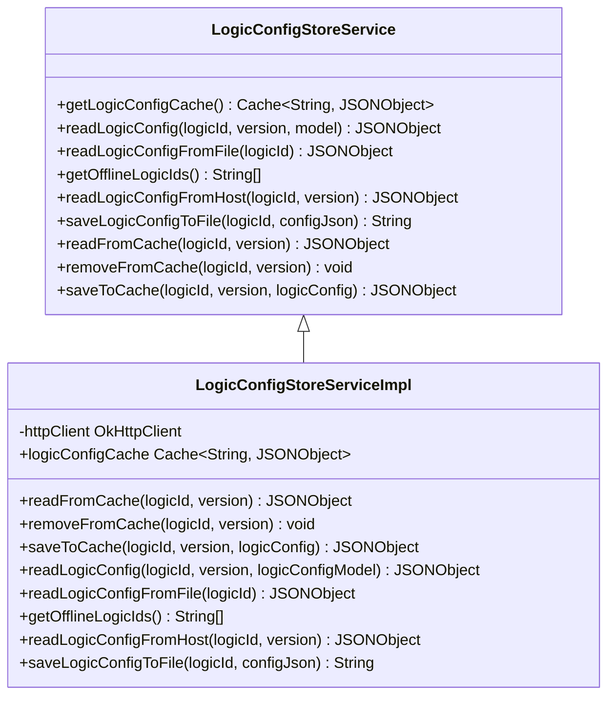
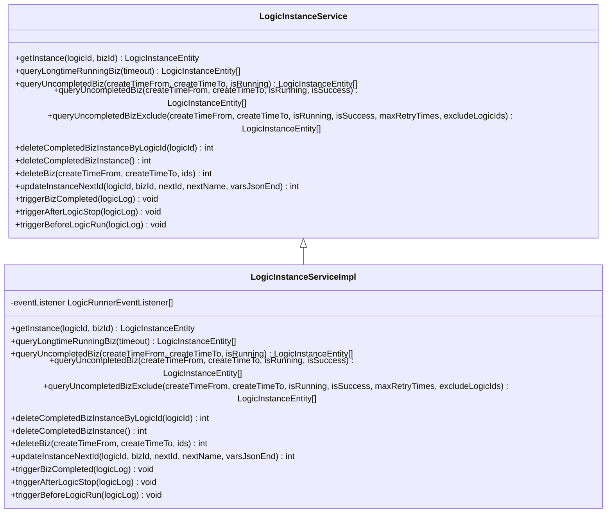
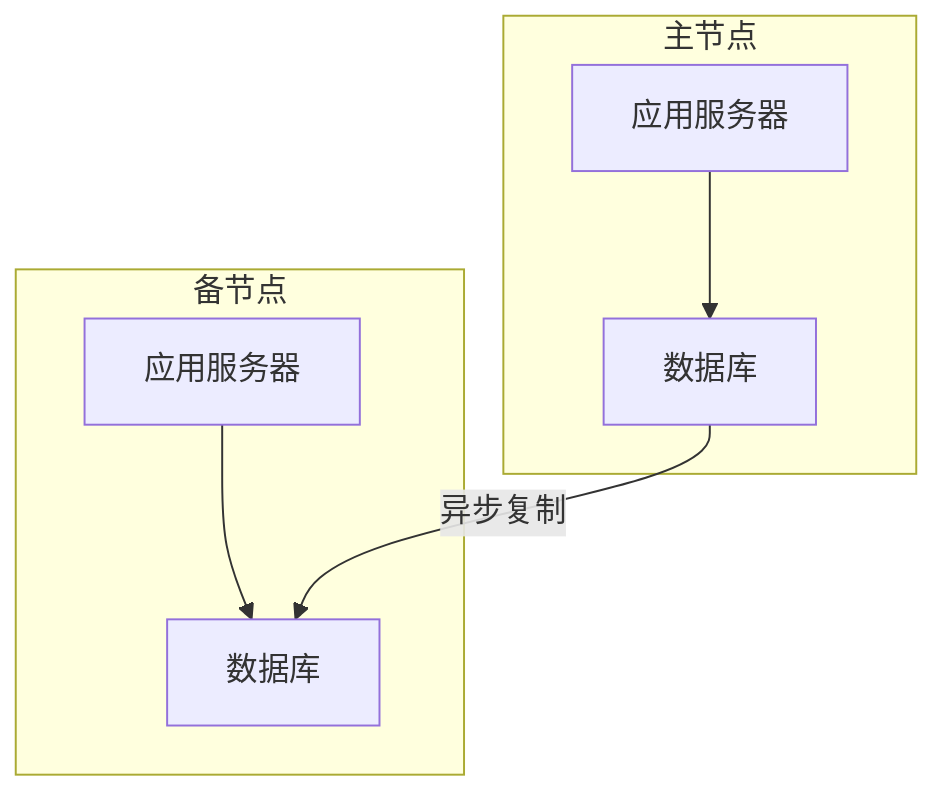
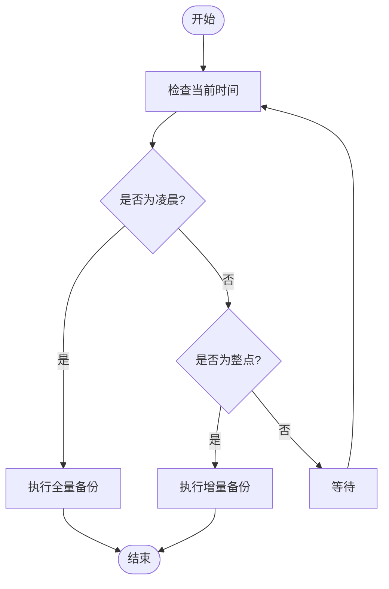
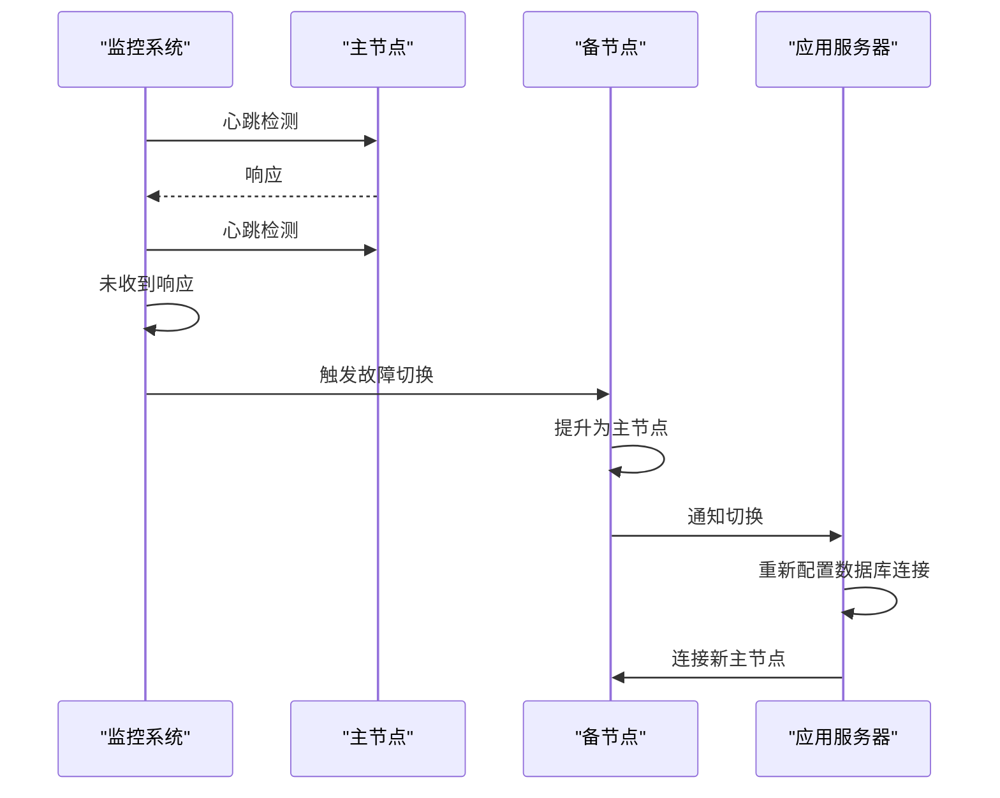

# 高可用与灾备

<cite>
**本文档引用的文件**  
- [LogicConfigStoreService.java](file://logic-runtime/src/main/java/com/aims/logic/runtime/store/LogicConfigStoreService.java)
- [LogicConfigStoreServiceImpl.java](file://logic-runtime/src/main/java/com/aims/logic/runtime/store/impl/LogicConfigStoreServiceImpl.java)
- [LogicInstanceService.java](file://logic-sdk/src/main/java/com/aims/logic/sdk/service/LogicInstanceService.java)
- [LogicInstanceServiceImpl.java](file://logic-sdk/src/main/java/com/aims/logic/sdk/service/impl/LogicInstanceServiceImpl.java)
- [v0.6.2升级0.7.4.sql](file://doc/sql-scripts/merge/v0.6.2升级0.7.4.sql)
- [FileUtil.java](file://logic-runtime/src/main/java/com/aims/logic/runtime/util/FileUtil.java)
- [RuntimeUtil.java](file://logic-runtime/src/main/java/com/aims/logic/runtime/util/RuntimeUtil.java)
</cite>

## 目录
1. [引言](#引言)  
2. [容错机制与数据保护策略](#容错机制与数据保护策略)  
3. [配置与实例数据持久化机制](#配置与实例数据持久化机制)  
4. [数据库升级脚本的作用](#数据库升级脚本的作用)  
5. [主备部署架构](#主备部署架构)  
6. [数据备份策略](#数据备份策略)  
7. [故障切换流程](#故障切换流程)  
8. [版本升级与回滚操作](#版本升级与回滚操作)  
9. [结论](#结论)

## 引言
本文档旨在详细阐述logic-solution系统的高可用性与灾难恢复机制。通过分析核心服务LogicConfigStoreService和LogicInstanceService，说明系统如何保障配置与实例数据的持久化。同时，文档将解释数据库升级脚本在版本迁移中的作用，并提供主备部署架构、数据备份策略和故障切换流程。最后，文档将提供版本升级与回滚的具体操作步骤，确保系统升级过程中的业务连续性。

## 容错机制与数据保护策略
logic-solution系统通过多层次的容错机制和数据保护策略确保系统的高可用性和数据安全性。系统采用缓存、本地文件存储和远程主机读取相结合的方式，实现配置数据的多重冗余。当远程主机不可用时，系统能够自动切换到本地文件存储，确保业务的连续性。同时，系统通过数据库事务和事件监听机制，确保实例数据的一致性和完整性。

**Section sources**
- [LogicConfigStoreService.java](file://logic-runtime/src/main/java/com/aims/logic/runtime/store/LogicConfigStoreService.java#L12-L65)
- [LogicInstanceService.java](file://logic-sdk/src/main/java/com/aims/logic/sdk/service/LogicInstanceService.java#L8-L32)

## 配置与实例数据持久化机制
### LogicConfigStoreService
LogicConfigStoreService是系统配置数据持久化的核心服务。该服务通过接口定义了配置数据的读取、写入和缓存操作。具体实现类LogicConfigStoreServiceImpl提供了以下功能：

1. **缓存管理**：使用Caffeine缓存框架，将配置数据缓存在内存中，提高读取效率。缓存设置1小时的访问过期时间，确保数据的新鲜度。
2. **本地文件存储**：将配置数据以JSON文件的形式存储在本地文件系统中，实现数据的持久化。
3. **远程主机读取**：从远程IDE主机获取最新的配置数据，确保配置的实时性。
4. **离线模式支持**：在离线模式下，系统优先从本地文件读取配置，确保在无网络连接的情况下仍能正常运行。



**Diagram sources**
- [LogicConfigStoreService.java](file://logic-runtime/src/main/java/com/aims/logic/runtime/store/LogicConfigStoreService.java#L12-L65)
- [LogicConfigStoreServiceImpl.java](file://logic-runtime/src/main/java/com/aims/logic/runtime/store/impl/LogicConfigStoreServiceImpl.java#L22-L168)

### LogicInstanceService
LogicInstanceService是系统实例数据持久化的关键服务。该服务通过继承BaseService接口，提供了对实例数据的增删改查操作。具体实现类LogicInstanceServiceImpl提供了以下功能：

1. **实例查询**：根据逻辑编号和业务标识查询实例数据，支持按时间范围、运行状态等条件进行筛选。
2. **长时间运行实例查询**：查询超过指定时间仍未完成的实例，便于监控和处理异常情况。
3. **未完成业务查询**：查询未完成的业务实例，支持排除特定逻辑编号的实例。
4. **实例删除**：支持按逻辑编号删除已完成的实例，或按时间范围和实例ID删除指定实例。
5. **事件触发**：在业务完成、逻辑停止和逻辑运行开始时触发相应的事件，便于进行后续处理。



**Diagram sources**
- [LogicInstanceService.java](file://logic-sdk/src/main/java/com/aims/logic/sdk/service/LogicInstanceService.java#L8-L32)
- [LogicInstanceServiceImpl.java](file://logic-sdk/src/main/java/com/aims/logic/sdk/service/impl/LogicInstanceServiceImpl.java#L13-L181)

**Section sources**
- [LogicConfigStoreService.java](file://logic-runtime/src/main/java/com/aims/logic/runtime/store/LogicConfigStoreService.java#L12-L65)
- [LogicConfigStoreServiceImpl.java](file://logic-runtime/src/main/java/com/aims/logic/runtime/store/impl/LogicConfigStoreServiceImpl.java#L22-L168)
- [LogicInstanceService.java](file://logic-sdk/src/main/java/com/aims/logic/sdk/service/LogicInstanceService.java#L8-L32)
- [LogicInstanceServiceImpl.java](file://logic-sdk/src/main/java/com/aims/logic/sdk/service/impl/LogicInstanceServiceImpl.java#L13-L181)

## 数据库升级脚本的作用
数据库升级脚本在系统版本迁移过程中起着至关重要的作用。以v0.6.2升级0.7.4.sql为例，该脚本通过ALTER TABLE语句为logic_instance表添加了createTime和retryTimes两个新字段。createTime字段用于记录实例的创建时间，retryTimes字段用于记录实例的重试次数。这些新字段的添加为系统提供了更丰富的实例信息，便于进行更精细的监控和管理。

```sql
ALTER TABLE `logic_instance`
ADD COLUMN `createTime` datetime NULL DEFAULT CURRENT_TIMESTAMP COMMENT '实例创建时间' AFTER `isRunning`,
ADD COLUMN `retryTimes` int NULL DEFAULT 0 COMMENT '重试次数' AFTER `duration`;
```

**Diagram sources**
- [v0.6.2升级0.7.4.sql](file://doc/sql-scripts/merge/v0.6.2升级0.7.4.sql#L1-L3)

**Section sources**
- [v0.6.2升级0.7.4.sql](file://doc/sql-scripts/merge/v0.6.2升级0.7.4.sql#L1-L3)

## 主备部署架构
logic-solution系统采用主备部署架构，确保系统的高可用性。主节点负责处理所有读写请求，备节点通过异步复制机制实时同步主节点的数据。当主节点发生故障时，系统能够自动切换到备节点，继续提供服务。这种架构不仅提高了系统的可用性，还为系统维护和升级提供了便利。



**Diagram sources**
- [LogicConfigStoreService.java](file://logic-runtime/src/main/java/com/aims/logic/runtime/store/LogicConfigStoreService.java#L12-L65)
- [LogicInstanceService.java](file://logic-sdk/src/main/java/com/aims/logic/sdk/service/LogicInstanceService.java#L8-L32)

## 数据备份策略
系统采用定期全量备份和增量备份相结合的策略，确保数据的安全性。全量备份每天凌晨执行一次，将所有数据备份到远程存储服务器。增量备份每小时执行一次，仅备份自上次备份以来发生变化的数据。此外，系统还支持手动触发备份，便于在重要操作前进行数据保护。



**Diagram sources**
- [FileUtil.java](file://logic-runtime/src/main/java/com/aims/logic/runtime/util/FileUtil.java#L22-L184)
- [RuntimeUtil.java](file://logic-runtime/src/main/java/com/aims/logic/runtime/util/RuntimeUtil.java#L22-L174)

## 故障切换流程
当主节点发生故障时，系统将自动执行故障切换流程。首先，监控系统检测到主节点不可用，触发故障切换机制。然后，系统将备节点提升为主节点，并重新配置应用服务器的数据库连接。最后，系统通知所有客户端切换到新的主节点，确保业务的连续性。



**Diagram sources**
- [LogicConfigStoreService.java](file://logic-runtime/src/main/java/com/aims/logic/runtime/store/LogicConfigStoreService.java#L12-L65)
- [LogicInstanceService.java](file://logic-sdk/src/main/java/com/aims/logic/sdk/service/LogicInstanceService.java#L8-L32)

## 版本升级与回滚操作
### 版本升级
1. **备份数据**：在升级前，执行全量备份，确保数据安全。
2. **停止服务**：停止主节点和备节点的应用服务器。
3. **执行升级脚本**：在数据库上执行版本升级脚本，更新表结构。
4. **部署新版本**：将新版本的应用程序部署到主节点和备节点。
5. **启动服务**：启动主节点和备节点的应用服务器。
6. **验证功能**：验证系统功能是否正常。

### 版本回滚
1. **停止服务**：停止主节点和备节点的应用服务器。
2. **恢复数据**：从备份中恢复数据库到升级前的状态。
3. **部署旧版本**：将旧版本的应用程序部署到主节点和备节点。
4. **启动服务**：启动主节点和备节点的应用服务器。
5. **验证功能**：验证系统功能是否正常。

**Section sources**
- [v0.6.2升级0.7.4.sql](file://doc/sql-scripts/merge/v0.6.2升级0.7.4.sql#L1-L3)
- [LogicConfigStoreService.java](file://logic-runtime/src/main/java/com/aims/logic/runtime/store/LogicConfigStoreService.java#L12-L65)
- [LogicInstanceService.java](file://logic-sdk/src/main/java/com/aims/logic/sdk/service/LogicInstanceService.java#L8-L32)

## 结论
logic-solution系统通过完善的容错机制、数据保护策略、主备部署架构和数据备份策略，确保了系统的高可用性和数据安全性。通过详细的版本升级与回滚操作步骤，系统能够在升级过程中保持业务的连续性。这些机制共同构成了一个稳定可靠的系统，为业务的持续运行提供了有力保障。