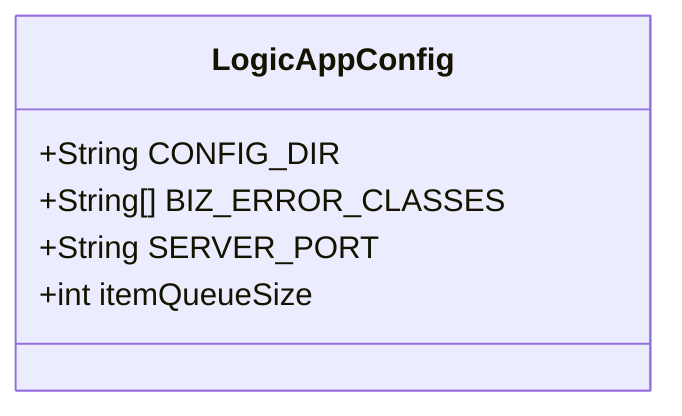
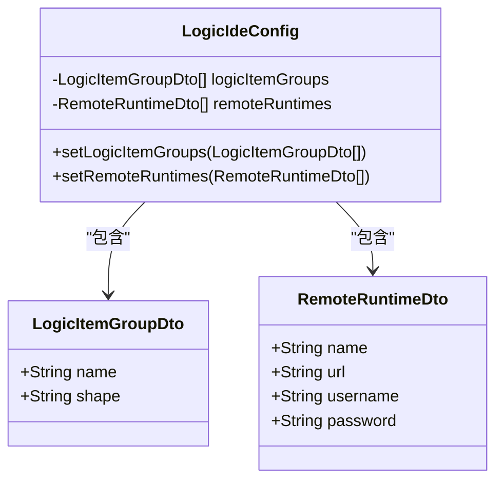

# 应用配置

<cite>
**Referenced Files in This Document**   
- [LogicAppConfig.java](file://logic-runtime/src/main/java/com/aims/logic/runtime/env/LogicAppConfig.java)
- [LogicIdeConfig.java](file://logic-ide/src/main/java/com/aims/logic/ide/configuration/LogicIdeConfig.java)
- [application.yaml](file://test-suite/src/main/resources/application.yaml)
</cite>

## 目录
1. [引言](#引言)
2. [核心配置类概述](#核心配置类概述)
3. [LogicAppConfig 详解](#logicappconfig-详解)
4. [LogicIdeConfig 详解](#logicideconfig-详解)
5. [配置加载与覆盖机制](#配置加载与覆盖机制)
6. [配置项类型安全与校验](#配置项类型安全与校验)
7. [配置调试技巧](#配置调试技巧)
8. [结论](#结论)

## 引言
本文档旨在为开发者提供关于 `LogicAppConfig` 和 `LogicIdeConfig` 两个核心配置类的全面指南。文档详细阐述了这些配置类中定义的运行时参数和IDE相关设置的含义、使用场景以及如何在Spring Boot环境中通过配置文件或环境变量进行覆盖。同时，文档还介绍了配置的自动装配机制、默认值设定逻辑、类型安全性以及调试技巧，帮助开发者高效地管理和调试应用配置。

## 核心配置类概述
在本系统中，`LogicAppConfig` 和 `LogicIdeConfig` 是两个关键的配置类，分别负责运行时环境和IDE集成环境的配置管理。

- **LogicAppConfig**: 位于 `logic-runtime` 模块中，是一个Spring `@Configuration` 类，用于定义应用运行时所需的各种参数，如配置目录、日志服务、缓存类型等。它通过 `@Value` 注解从外部配置源（如 `application.yaml`）注入值，并为系统提供全局的运行时配置。
- **LogicIdeConfig**: 位于 `logic-ide` 模块中，是一个Spring `@ConfigurationProperties` 类，用于管理IDE相关的配置，如逻辑项分组、远程运行时连接信息等。它通过 `@Component` 和 `@ConfigurationProperties` 注解实现自动装配和类型安全的配置绑定。

这两个类共同构成了系统配置的基础，确保了应用在不同环境下的灵活性和可配置性。

**Section sources**
- [LogicAppConfig.java](file://logic-runtime/src/main/java/com/aims/logic/runtime/env/LogicAppConfig.java)
- [LogicIdeConfig.java](file://logic-ide/src/main/java/com/aims/logic/ide/configuration/LogicIdeConfig.java)

## LogicAppConfig 详解
`LogicAppConfig` 类定义了应用运行时的核心参数，这些参数直接影响应用的行为和性能。

### 核心字段与使用场景
- **`CONFIG_DIR` (配置目录)**: 通过 `@Value("${logic.config-dir:./logic-configs}")` 注解定义，指定了应用加载逻辑配置文件（如JSON）的根目录。默认值为 `./logic-configs`。此配置允许开发者在不同环境中指定不同的配置文件路径，例如在测试环境中指向 `test-case-configs` 目录。
- **`BIZ_ERROR_CLASSES` (业务异常类)**: 通过 `@Value("${logic.biz-error-classes:LogicBizException}")` 注解定义，是一个字符串列表，用于指定哪些异常类应被视为业务异常，而非系统错误。这有助于在日志记录和错误处理时进行区分。
- **`SERVER_PORT` (服务器端口)**: 通过 `@Value("${server.port:8080}")` 注解定义，指定了应用监听的HTTP端口。虽然Spring Boot有默认的 `server.port`，但在此处显式定义可以确保配置的一致性。
- **`itemQueueSize` (日志项队列大小)**: 通过 `@Value("${logic.log.item-queue-size:30}")` 注解定义，指定了日志处理队列的大小，用于控制内存中缓存的日志条目数量，防止内存溢出。

这些字段通过 `@Value` 注解实现了外部化配置，使得应用无需重新编译即可适应不同的部署环境。



**Diagram sources**
- [LogicAppConfig.java](file://logic-runtime/src/main/java/com/aims/logic/runtime/env/LogicAppConfig.java#L7-L21)

**Section sources**
- [LogicAppConfig.java](file://logic-runtime/src/main/java/com/aims/logic/runtime/env/LogicAppConfig.java#L7-L21)

## LogicIdeConfig 详解
`LogicIdeConfig` 类专注于IDE集成环境的配置，为开发者提供丰富的自定义选项。

### IDE相关配置项
- **`logicItemGroups` (逻辑项分组)**: 一个 `List<LogicItemGroupDto>` 类型的列表，用于在IDE界面中对逻辑组件进行分类和组织。每个 `LogicItemGroupDto` 包含分组名称和形状等信息，便于用户识别。
- **`remoteRuntimes` (远程运行时)**: 一个 `List<RemoteRuntimeDto>` 类型的列表，用于配置IDE可以连接的远程运行时实例。这使得开发者可以在本地IDE中调试和管理部署在远程服务器上的逻辑应用。

该类使用了 `@ConfigurationProperties(prefix = "logic")` 注解，这意味着所有配置项都以 `logic.` 为前缀。例如，`logicItemGroups` 的配置在 `application.yaml` 中应写为 `logic.logic-item-groups`。此外，`@Getter` 注解由Lombok提供，自动生成了所有字段的getter方法，而自定义的setter方法则确保了当传入 `null` 值时，列表会被安全地初始化为空列表，避免了潜在的 `NullPointerException`。



**Diagram sources**
- [LogicIdeConfig.java](file://logic-ide/src/main/java/com/aims/logic/ide/configuration/LogicIdeConfig.java#L10-L24)

**Section sources**
- [LogicIdeConfig.java](file://logic-ide/src/main/java/com/aims/logic/ide/configuration/LogicIdeConfig.java#L10-L24)

## 配置加载与覆盖机制
系统采用Spring Boot的标准配置机制，允许通过多种方式加载和覆盖配置。

### 配置文件覆盖
开发者可以在 `application.yaml` 文件中定义配置项来覆盖 `LogicAppConfig` 和 `LogicIdeConfig` 中的默认值。例如，在 `test-suite` 模块的 `application.yaml` 中，可以看到以下覆盖：
```yaml
logic:
  config-dir: /Users/lk/Documents/Dev/aims/xuanwu-logic/logic-solution/test-suite/test-case-configs
  log:
    item-queue-size: 30
    es:
      host: http://es.xuanwu-factory.dev.aimstek.cn
      index: logic-log-cbb-154
  biz-error-classes: com.aims.logic.testsuite.demo.exception.CustomException
```
此配置将 `config-dir` 指向了测试用例的专用目录，并指定了自定义的业务异常类。

### 环境变量覆盖
除了配置文件，还可以通过环境变量来覆盖配置。例如，设置环境变量 `LOGIC_CONFIG_DIR=/custom/path` 将会覆盖 `logic.config-dir` 的值。这是Spring Boot `@Value` 注解支持的特性，为容器化部署提供了极大的灵活性。

### 自动装配机制
`LogicIdeConfig` 的自动装配依赖于 `@ConfigurationProperties` 机制。Spring Boot的 `ConfigurationPropertiesBindingPostProcessor` 会在应用启动时扫描所有带有此注解的Bean，并根据前缀 `logic` 将 `application.yaml` 中的属性自动绑定到对应的字段上。`LogicAppConfig` 则通过 `@Value` 注解在字段级别进行注入。

**Section sources**
- [application.yaml](file://test-suite/src/main/resources/application.yaml)

## 配置项类型安全与校验
本系统通过不同的机制确保了配置项的类型安全。

- **`LogicAppConfig`**: 使用 `@Value` 注解，其类型安全依赖于Spring的类型转换服务。例如，`itemQueueSize` 被声明为 `int`，Spring会自动将配置字符串转换为整数。如果转换失败，应用将在启动时抛出异常。
- **`LogicIdeConfig`**: 使用 `@ConfigurationProperties` 提供了更强的类型安全。它不仅支持复杂类型（如 `List` 和自定义DTO），还可以与JSR-303 Bean Validation注解（如 `@Valid` 和 `@NotNull`）结合使用，实现配置值的校验。虽然当前代码中未显示校验注解，但这是该机制的标准用法。

这种设计模式确保了配置数据在进入业务逻辑之前是类型正确且有效的。

## 配置调试技巧
为了帮助开发者诊断配置问题，可以采用以下技巧：

1.  **日志输出**: 如 `AfterApplicationRunner` 类所示，可以在应用启动后，通过 `@Autowired` 注入 `LogicAppConfig` 或 `LogicIdeConfig` 实例，并将其内容序列化为JSON打印到日志中，从而直观地查看最终生效的配置值。
2.  **使用Spring Boot Actuator**: 如果集成了Actuator，可以通过 `/actuator/env` 端点查看所有生效的配置属性及其来源，这是调试配置覆盖问题的最有效工具。
3.  **断点调试**: 在IDE中启动应用时，可以在配置类的字段上设置断点，观察Spring注入的值。

**Section sources**
- [LogicAppConfig.java](file://logic-runtime/src/main/java/com/aims/logic/runtime/env/LogicAppConfig.java#L7-L21)
- [LogicIdeConfig.java](file://logic-ide/src/main/java/com/aims/logic/ide/configuration/LogicIdeConfig.java#L10-L24)

## 结论
`LogicAppConfig` 和 `LogicIdeConfig` 是系统配置的核心，分别服务于运行时和开发环境。通过合理利用Spring Boot的 `@Value` 和 `@ConfigurationProperties` 机制，系统实现了配置的外部化、类型安全和灵活覆盖。开发者应熟练掌握这些配置类的使用方法，以便在不同场景下高效地定制和调试应用。遵循本文档的指导，可以确保配置管理的清晰性和可靠性。