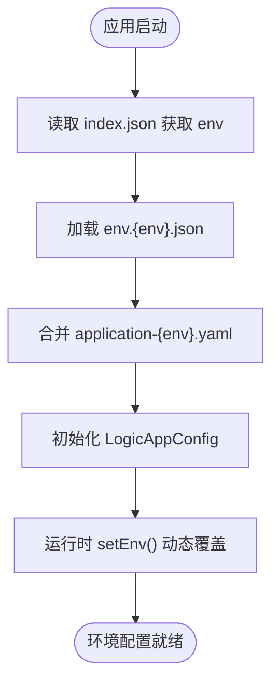
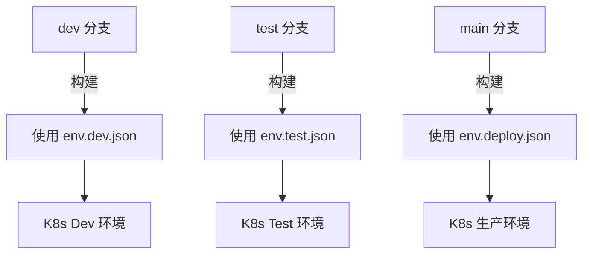

# 环境配置

<cite>
**本文档中引用的文件**  
- [env.dev.json](file://logic-sdk/logic-configs/envs/env.dev.json)
- [env.test.json](file://logic-sdk/logic-configs/envs/env.test.json)
- [index.json](file://logic-sdk/logic-configs/envs/index.json)
- [env.deploy.json](file://test-suite/test-case-configs/envs/env.deploy.json)
- [application.yaml](file://test-suite/src/main/resources/application.yaml)
- [application-dev.yaml](file://test-suite/src/main/resources/application-dev.yaml)
- [LogicAppConfig.java](file://logic-runtime/src/main/java/com/aims/logic/runtime/env/LogicAppConfig.java)
- [LogicRunnerServiceImpl.java](file://logic-sdk/src/main/java/com/aims/logic/sdk/LogicRunnerServiceImpl.java)
</cite>

## 目录
1. [简介](#简介)
2. [环境变量配置文件结构](#环境变量配置文件结构)
3. [环境注册表 index.json](#环境注册表-indexjson)
4. [环境配置加载机制与优先级](#环境配置加载机制与优先级)
5. [多环境参数定义](#多环境参数定义)
6. [多环境切换与 CI/CD 集成](#多环境切换与-cicd-集成)
7. [测试用例中的环境配置应用](#测试用例中的环境配置应用)
8. [敏感信息安全管理](#敏感信息安全管理)
9. [结论](#结论)

## 简介
本项目通过 JSON 配置文件实现多环境变量管理，支持开发、测试、部署等多种运行环境。环境配置系统由 `env.dev.json`、`env.test.json` 等环境专属文件和 `index.json` 环境注册表构成，结合 Spring Boot 配置文件与 Java 配置类实现灵活的环境加载机制。系统广泛应用于逻辑引擎运行时、IDE 服务及测试套件中，确保不同环境下的服务地址、数据库连接等参数正确加载。

## 环境变量配置文件结构
环境变量配置文件采用 JSON 格式，定义当前环境的全局参数，包括服务地址、日志级别、请求头过滤规则等。

### 开发环境配置 (env.dev.json)
```json
{
  "NODE_ENV": "dev",
  "LOGIC_CONFIG_MODEL": "offline",
  "WMS_HOST": "http://192.168.154.61:31008",
  "WMS_HOST_AGG": "http://192.168.154.61:31001",
  "GETAWAY": "http://192.168.154.61:31001",
  "IDE_HOST": "http://localhost:4052",
  "JWT": {},
  "LOG": "error",
  "HEADER_FILTERS": [
    { "key": "wms" },
    { "key": "host" },
    { "key": "x-client-id" }
  ],
  "REQUEST_CLIENT_FLAG": "x-client-id"
}
```

### 测试环境配置 (env.test.json)
```json
{
  "NODE_ENV": "test",
  "LOGIC_CONFIG_MODEL": "offline",
  "WMS_HOST": "http://192.168.44.87:31008",
  "WMS_HOST_AGG": "http://192.168.44.87:31001",
  "FORM_HOST": "http://192.168.44.70:5001",
  "LOG": "error"
}
```

**Section sources**
- [env.dev.json](file://logic-sdk/logic-configs/envs/env.dev.json)
- [env.test.json](file://logic-sdk/logic-configs/envs/env.test.json)

## 环境注册表 index.json
`index.json` 文件作为环境注册表，指定当前激活的环境标识，系统根据该值加载对应的环境配置文件。

### 核心字段说明
- **envId**: 环境唯一标识（如 `dev`, `test`, `deploy`）
- **envName**: 环境名称（如 “开发环境”, “测试环境”）
- **host**: 主机地址，用于服务发现和反向代理
- **NODE_ENV**: 运行环境标识，影响日志输出和调试行为
- **LOGIC_CONFIG_MODEL**: 配置模型，控制逻辑编排的加载方式

示例：
```json
{
  "env": "dev"
}
```
该配置表示当前使用 `env.dev.json` 作为环境变量源。

**Section sources**
- [index.json](file://logic-sdk/logic-configs/envs/index.json)

## 环境配置加载机制与优先级
系统通过多层配置机制实现环境变量的动态加载与覆盖。

### 加载优先级规则
1. **Spring Boot 配置文件** (`application.yaml`, `application-dev.yaml`)：提供基础服务配置（如数据库、端口）
2. **环境变量 JSON 文件** (`env.dev.json`, `env.test.json`)：覆盖运行时服务地址、日志级别等
3. **Java 配置类** (`LogicAppConfig.java`)：通过 `@Value` 注解注入默认值，支持外部覆盖
4. **运行时动态设置**：通过 `LogicRunnerServiceImpl.setEnv()` 方法在代码中动态修改环境变量

### 配置加载流程


**Diagram sources**
- [index.json](file://logic-sdk/logic-configs/envs/index.json)
- [env.dev.json](file://logic-sdk/logic-configs/envs/env.dev.json)
- [application.yaml](file://test-suite/src/main/resources/application.yaml)
- [LogicAppConfig.java](file://logic-runtime/src/main/java/com/aims/logic/runtime/env/LogicAppConfig.java)

**Section sources**
- [LogicAppConfig.java](file://logic-runtime/src/main/java/com/aims/logic/runtime/env/LogicAppConfig.java)
- [LogicRunnerServiceImpl.java](file://logic-sdk/src/main/java/com/aims/logic/sdk/LogicRunnerServiceImpl.java)

## 多环境参数定义
环境配置文件用于定义与环境相关的各类参数：

### 数据库连接
通过 `application.yaml` 定义不同环境的数据库连接：
```yaml
spring:
  datasource:
    url: jdbc:mysql://localhost:3306/logic_dev
    username: root
    password: 12#$qwER
```

### 消息队列与外部 API
在 `env.dev.json` 中定义服务地址：
- `WMS_HOST`: 仓储服务地址
- `GETAWAY`: 网关服务地址
- `FORM_HOST`: 表单服务地址

### 自定义运行时参数
- `DEFAULT_TRAN_SCOPE`: 默认事务作用域
- `PUBLISHED_IDE_HOSTS`: 已发布 IDE 主机列表，用于远程调用
- `HEADER_FILTERS`: 请求头过滤规则，用于安全控制

**Section sources**
- [application.yaml](file://test-suite/src/main/resources/application.yaml)
- [env.dev.json](file://test-suite/test-case-configs/envs/env.dev.json)

## 多环境切换与 CI/CD 集成
### 环境切换策略
通过修改 `index.json` 中的 `env` 字段实现环境切换：
```json
{ "env": "test" }  // 切换到测试环境
```

### CI/CD 集成实践
1. **构建阶段**：根据 Git 分支自动选择配置文件
   - `dev` 分支 → `env.dev.json`
   - `test` 分支 → `env.test.json`
   - `main` 分支 → `env.deploy.json`
2. **部署阶段**：通过 Kubernetes ConfigMap 挂载对应环境的 `index.json`
3. **配置管理**：敏感信息通过外部密钥管理服务注入，避免硬编码



**Diagram sources**
- [index.json](file://test-suite/test-case-configs/envs/index.json)
- [env.deploy.json](file://test-suite/test-case-configs/envs/env.deploy.json)

## 测试用例中的环境配置应用
`test-suite` 模块通过独立的配置目录 `test-case-configs/envs` 管理测试专用环境变量。

### 测试配置特点
- 包含 `env.dev.json` 和 `env.deploy.json`，用于不同测试场景
- 配置文件中定义 `TT`、`ARR` 等测试专用变量
- 通过 `application-dev.yaml` 指定测试数据库 `logic_dev`

### 配置加载验证
测试用例通过 `LogicRunnerServiceImpl.getEnv()` 验证环境变量是否正确加载，确保测试在预期环境中运行。

**Section sources**
- [env.dev.json](file://test-suite/test-case-configs/envs/env.dev.json)
- [env.deploy.json](file://test-suite/test-case-configs/envs/env.deploy.json)
- [application-dev.yaml](file://test-suite/src/main/resources/application-dev.yaml)

## 敏感信息安全管理
### 安全处理原则
1. **禁止硬编码**：密码、密钥等敏感信息不得出现在 JSON 配置文件中
2. **外部化管理**：使用外部密钥管理服务（如 HashiCorp Vault、AWS KMS）
3. **运行时注入**：通过环境变量或配置中心动态注入敏感信息

### 当前配置分析
- 数据库密码 `12#$qwER` 出现在 `application.yaml` 中，存在安全风险
- JWT 配置为空对象 `{}`，表明认证配置需在运行时注入
- 建议将 `password` 字段替换为 `${DB_PASSWORD}` 占位符，由 CI/CD 流程注入

**Section sources**
- [application.yaml](file://test-suite/src/main/resources/application.yaml)

## 结论
本项目通过 `env.{env}.json` 和 `index.json` 实现了灵活的多环境配置管理，结合 Spring Boot 配置文件和 Java 配置类，支持从静态配置到运行时动态设置的完整生命周期。建议进一步强化敏感信息管理，将数据库密码等敏感数据外置化，提升系统安全性。同时，可通过统一配置中心实现跨服务的配置同步与动态更新。