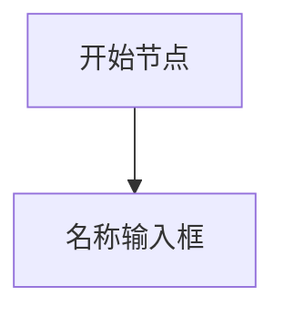
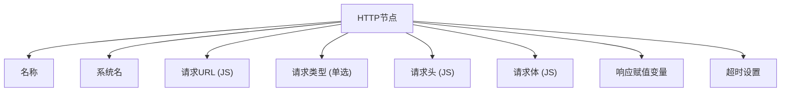
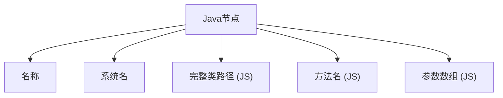
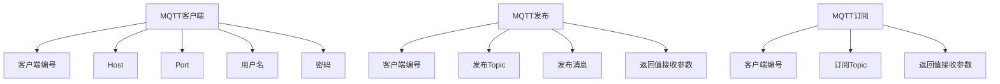
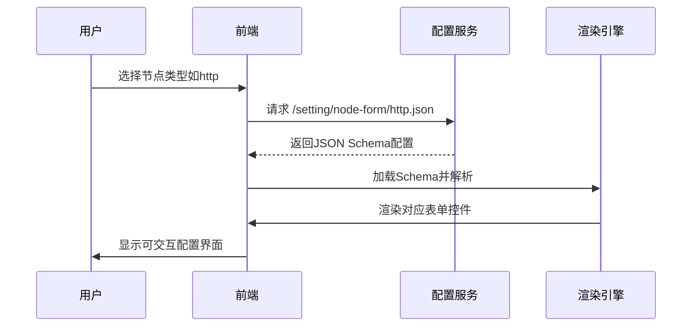

# 节点配置

<cite>
**本文档引用文件**  
- [start.json](file://logic-ide/src/main/resources/public/setting/node-form/start.json)
- [end.json](file://logic-ide/src/main/resources/public/setting/node-form/end.json)
- [http.json](file://logic-ide/src/main/resources/public/setting/node-form/http.json)
- [js.json](file://logic-ide/src/main/resources/public/setting/node-form/js.json)
- [java.json](file://logic-ide/src/main/resources/public/setting/node-form/java.json)
- [switch.json](file://logic-ide/src/main/resources/public/setting/node-form/switch.json)
- [switch-case.json](file://logic-ide/src/main/resources/public/setting/node-form/switch-case.json)
- [switch-def.json](file://logic-ide/src/main/resources/public/setting/node-form/switch-def.json)
- [mqtt-client.json](file://logic-ide/src/main/resources/public/setting/node-form/mqtt-client.json)
- [mqtt-pub.json](file://logic-ide/src/main/resources/public/setting/node-form/mqtt-pub.json)
- [mqtt-sub.json](file://logic-ide/src/main/resources/public/setting/node-form/mqtt-sub.json)
- [forms/start.json](file://logic-ide/src/main/resources/public/setting/forms/start.json)
- [forms/end.json](file://logic-ide/src/main/resources/public/setting/forms/end.json)
- [forms/js.json](file://logic-ide/src/main/resources/public/setting/forms/js.json)
- [forms/switch.json](file://logic-ide/src/main/resources/public/setting/forms/switch.json)
</cite>

## 目录
1. [简介](#简介)
2. [配置文件结构与JSON Schema规范](#配置文件结构与json-schema规范)
3. [节点类型与表单配置映射](#节点类型与表单配置映射)
4. [核心节点配置详解](#核心节点配置详解)
5. [动态表单渲染机制](#动态表单渲染机制)
6. [自定义节点配置模板创建指南](#自定义节点配置模板创建指南)
7. [配置验证与错误提示机制](#配置验证与错误提示机制)
8. [总结](#总结)

## 简介
本文档全面介绍可视化编排系统中各类节点的配置机制。基于 `setting/forms` 和 `setting/node-form` 目录下的 JSON 配置文件，解析 `start`、`end`、`http`、`js`、`java`、`switch`、`mqtt` 等节点类型的表单结构。说明配置文件中字段的语义，如 `type`、`title`、`properties`、`default` 等 JSON Schema 标准字段的使用方式。解释动态表单渲染机制如何根据节点类型加载对应的配置界面，并提供自定义节点配置模板的创建指南。

## 配置文件结构与JSON Schema规范

### JSON Schema核心字段语义
节点配置文件遵循标准 JSON Schema 规范，核心字段定义如下：

- **type**: 定义数据类型，如 `"object"` 表示对象结构，`"string"` 表示字符串。
- **title**: 字段在界面上显示的中文标签名称。
- **properties**: 对象包含的子字段集合，每个子字段可独立定义类型、标题和控件。
- **default** 或 **defaultValue**: 字段默认值，若用户未输入则使用该值。
- **widget**: 指定渲染控件类型，如 `"textArea"`、`"js"`（代码编辑器）、`"radio"`（单选框）等。
- **props**: 控件属性配置，如 `rows`（行数）、`height`（高度）、`options`（选项列表）等。
- **extra**: 字段辅助说明文本，用于提示用户输入格式或用途。
- **column**: 表单布局列数，控制字段排列方式（单列或双列）。

这些字段共同构成可被前端动态解析并渲染为可视化表单的元数据结构。

**Section sources**
- [start.json](file://logic-ide/src/main/resources/public/setting/node-form/start.json#L1-L13)
- [http.json](file://logic-ide/src/main/resources/public/setting/node-form/http.json#L1-L85)

## 节点类型与表单配置映射

系统通过节点类型自动加载对应配置表单，映射关系如下：

| 节点类型 | 配置文件路径 | 用途 |
|--------|-------------|------|
| start | `node-form/start.json` | 流程起点配置 |
| end | `node-form/end.json` | 流程终点配置 |
| http | `node-form/http.json` | HTTP请求节点配置 |
| js | `node-form/js.json` | JavaScript脚本节点配置 |
| java | `node-form/java.json` | Java类调用节点配置 |
| switch | `node-form/switch.json` | 条件分支主节点配置 |
| switch-case | `node-form/switch-case.json` | 分支case条件配置 |
| switch-def | `node-form/switch-def.json` | 默认分支配置 |
| mqtt-client | `node-form/mqtt-client.json` | MQTT客户端连接配置 |
| mqtt-pub | `node-form/mqtt-pub.json` | MQTT消息发布配置 |
| mqtt-sub | `node-form/mqtt-sub.json` | MQTT消息订阅配置 |

该机制实现了“配置即界面”的低代码设计理念，无需修改前端代码即可扩展新节点类型。

**Section sources**
- [node-form](file://logic-ide/src/main/resources/public/setting/node-form/)
- [forms](file://logic-ide/src/main/resources/public/setting/forms/)

## 核心节点配置详解

### Start节点配置
`start.json` 定义流程起始节点的基本信息，仅包含名称字段：
- **name**: 节点显示名称，使用 `textArea` 多行输入框。



**Diagram sources**
- [start.json](file://logic-ide/src/main/resources/public/setting/node-form/start.json#L1-L13)

### End节点配置
`end.json` 支持返回值处理脚本定义：
- **name**: 节点名称
- **script**: 返回值处理脚本，使用 JS 编辑器，支持 `return` 新结构体覆盖默认返回格式。

**Section sources**
- [end.json](file://logic-ide/src/main/resources/public/setting/node-form/end.json#L1-L22)

### HTTP节点配置
`http.json` 提供完整的HTTP请求配置能力：
- **url**: 请求地址，需返回字符串的JS代码块
- **method**: 请求方法，支持 `POST`、`GET`、`PUT`、`DELETE` 单选
- **headers**: 请求头对象，JS代码块生成
- **body**: 请求体参数，JS代码块生成
- **returnAccept**: 指定将响应数据赋值给哪个局部变量（如 `_var.repData`）
- **timeout**: 超时时间（毫秒），默认5000



**Diagram sources**
- [http.json](file://logic-ide/src/main/resources/public/setting/node-form/http.json#L1-L85)

### JS节点配置
`js.json` 用于执行自定义JavaScript逻辑：
- **name**: 节点名称
- **script**: JS脚本编辑区，支持变量赋值、简单逻辑处理

**Section sources**
- [js.json](file://logic-ide/src/main/resources/public/setting/node-form/js.json#L1-L22)

### Java节点配置
`java.json` 用于调用指定Java类的方法：
- **url**: 完整类路径（JS代码块返回字符串）
- **method**: 方法名（JS代码块返回字符串）
- **body**: 参数数组（JS代码块返回数组）



**Diagram sources**
- [java.json](file://logic-ide/src/main/resources/public/setting/node-form/java.json#L1-L43)

### Switch节点配置
`switch.json` 实现条件分支逻辑：
- **condition**: 条件表达式，可直接填写变量或表达式（如 `_par.outType`）

`switch-case.json` 定义每个分支的匹配值：
- **case**: 匹配值，自动转为字符串比较

`switch-def.json` 为默认分支，仅含名称字段。

**Section sources**
- [switch.json](file://logic-ide/src/main/resources/public/setting/node-form/switch.json#L1-L22)
- [switch-case.json](file://logic-ide/src/main/resources/public/setting/node-form/switch-case.json#L1-L18)
- [switch-def.json](file://logic-ide/src/main/resources/public/setting/node-form/switch-def.json#L1-L13)

### MQTT节点配置
MQTT相关节点提供物联网通信能力：
- **mqtt-client**: 配置客户端连接信息（clientId、host、port、用户名、密码）
- **mqtt-pub**: 发布消息配置（topic、msg、return接收参数）
- **mqtt-sub**: 订阅消息配置（topic、return接收参数）



**Diagram sources**
- [mqtt-client.json](file://logic-ide/src/main/resources/public/setting/node-form/mqtt-client.json#L1-L39)
- [mqtt-pub.json](file://logic-ide/src/main/resources/public/setting/node-form/mqtt-pub.json#L1-L38)
- [mqtt-sub.json](file://logic-ide/src/main/resources/public/setting/node-form/mqtt-sub.json#L1-L29)

## 动态表单渲染机制

系统采用基于 JSON Schema 的动态表单渲染引擎，工作流程如下：



前端框架根据 `widget` 类型动态加载相应组件（文本框、代码编辑器、单选框等），并通过 `props` 控制样式与行为，实现高度灵活的界面生成能力。

**Diagram sources**
- [http.json](file://logic-ide/src/main/resources/public/setting/node-form/http.json#L1-L85)
- [js.json](file://logic-ide/src/main/resources/public/setting/node-form/js.json#L1-L22)

## 自定义节点配置模板创建指南

要创建新的节点配置模板，请遵循以下步骤：

1. **确定节点类型名称**（如 `custom-processor`）
2. 在 `setting/node-form/` 目录下创建 `custom-processor.json`
3. 按照 JSON Schema 格式定义表单结构：
   - 使用 `"type": "object"` 作为根类型
   - 在 `properties` 中定义字段及其类型、标题、控件
   - 可选配置 `column` 布局和 `displayType`
4. 示例模板结构：

```json
{
  "type": "object",
  "properties": {
    "name": {
      "title": "名称",
      "type": "string",
      "widget": "textArea",
      "props": { "rows": 1 }
    },
    "configParam": {
      "title": "自定义参数",
      "type": "string",
      "widget": "input",
      "extra": "请输入有效值"
    }
  },
  "column": 1
}
```

5. 前端将自动识别并渲染该节点的配置界面。

**Section sources**
- [node-form](file://logic-ide/src/main/resources/public/setting/node-form/)

## 配置验证与错误提示机制

系统内置基于 JSON Schema 的验证机制，确保用户输入符合预期格式：

- **类型校验**：强制检查字段类型（字符串、数字等）
- **必填校验**：所有字段默认为必填，除非明确允许 null
- **脚本语法校验**：JS 类型字段在提交时进行基础语法检查
- **错误提示展示**：
  - 字段级错误：在输入框下方显示红色提示文字
  - 提交失败：弹出错误摘要，定位具体问题字段
  - `extra` 字段内容作为帮助文本始终可见

此外，`forms/*.json` 文件中定义了表单提交事件（`onEvent.submitSucc`），用于广播保存成功消息，实现跨组件通信。

**Section sources**
- [forms/start.json](file://logic-ide/src/main/resources/public/setting/forms/start.json#L1-L1)
- [forms/end.json](file://logic-ide/src/main/resources/public/setting/forms/end.json#L1-L1)
- [forms/js.json](file://logic-ide/src/main/resources/public/setting/forms/js.json#L1-L1)
- [forms/switch.json](file://logic-ide/src/main/resources/public/setting/forms/switch.json#L1-L1)

## 总结

本文档系统性地解析了可视化编排平台中节点配置的实现机制。通过标准化的 JSON Schema 配置文件，实现了节点表单的动态渲染与扩展。各类节点（start、end、http、js、java、switch、mqtt）均通过独立的 JSON 文件定义其配置结构，支持丰富的控件类型与灵活的布局方式。动态渲染机制结合验证提示体系，保障了配置的准确性与用户体验的一致性。开发者可参照现有模板快速创建新的节点类型，满足不断变化的业务需求。