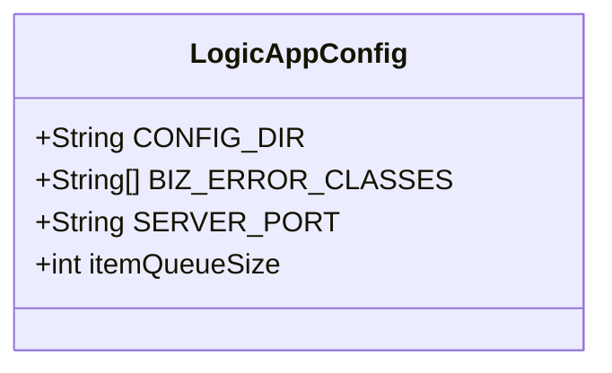
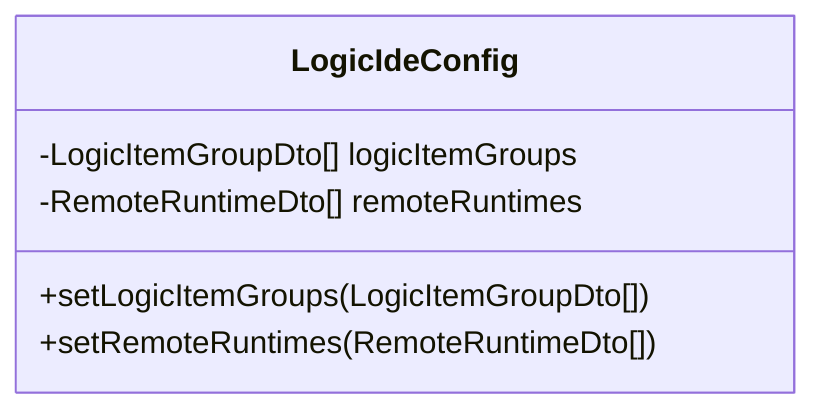
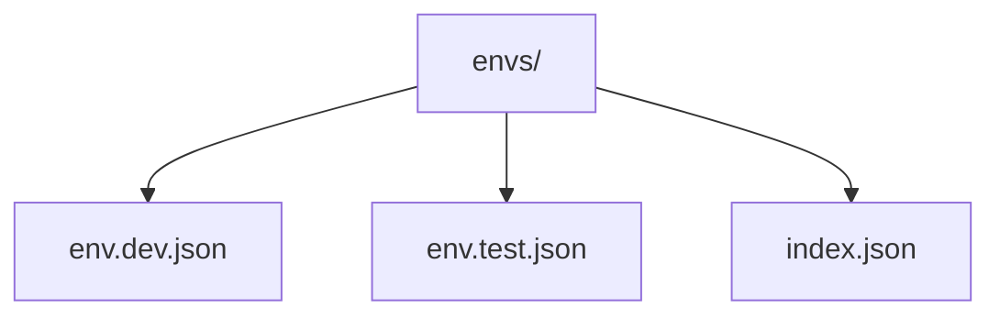
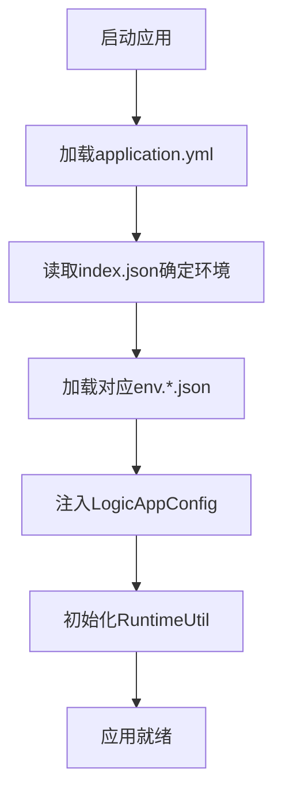
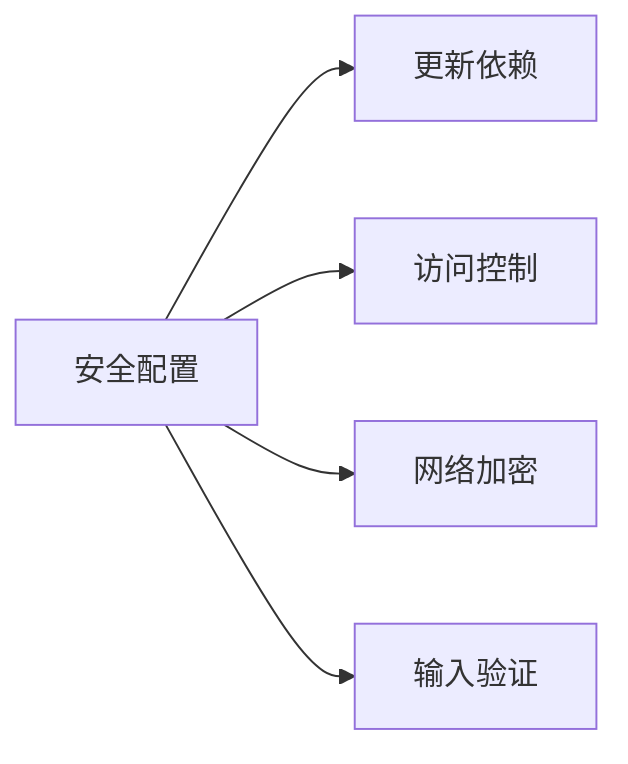

# 配置指南

<cite>
**Referenced Files in This Document**   
- [LogicAppConfig.java](file://logic-runtime/src/main/java/com/aims/logic/runtime/env/LogicAppConfig.java)
- [LogicIdeConfig.java](file://logic-ide/src/main/java/com/aims/logic/ide/configuration/LogicIdeConfig.java)
- [env.dev.json](file://logic-sdk/logic-configs/envs/env.dev.json)
- [env.test.json](file://logic-sdk/logic-configs/envs/env.test.json)
- [index.json](file://logic-sdk/logic-configs/envs/index.json)
- [SECURITY.md](file://SECURITY.md)
</cite>

## 目录
1. [简介](#简介)
2. [核心配置类](#核心配置类)
3. [环境变量配置](#环境变量配置)
4. [配置加载顺序与优先级](#配置加载顺序与优先级)
5. [部署环境配置示例](#部署环境配置示例)
6. [性能调优配置](#性能调优配置)
7. [安全配置最佳实践](#安全配置最佳实践)
8. [监控与管理配置](#监控与管理配置)
9. [结论](#结论)

## 简介
本配置指南旨在为运维人员和开发人员提供关于logic-solution系统的全面配置说明。文档详细介绍了系统的核心配置类`LogicAppConfig`和`LogicIdeConfig`，解释了环境变量配置文件的结构和用途，并提供了不同部署环境的配置示例。此外，本文档还涵盖了配置的加载顺序、性能调优建议、安全最佳实践以及监控管理指导，帮助用户更好地理解和管理系统的配置。

## 核心配置类

### LogicAppConfig 应用配置
`LogicAppConfig`是logic-solution运行时的核心配置类，负责定义应用程序的基本行为和参数。该类位于`logic-runtime`模块中，通过Spring的`@Configuration`注解进行声明，并使用`@Value`注解从外部配置源注入值。

**主要配置参数：**
- **CONFIG_DIR**: 指定逻辑配置文件的存储目录，默认值为`./logic-configs`。此目录包含所有逻辑流程的定义文件。
- **BIZ_ERROR_CLASSES**: 定义业务异常类的列表，默认包含`LogicBizException`。这些类在运行时被识别为业务异常，不会触发系统级错误处理。
- **SERVER_PORT**: 指定应用服务器的监听端口，默认值为`8080`。此配置允许系统在不同端口上运行，避免端口冲突。
- **itemQueueSize**: 设置逻辑项日志队列的大小，默认值为`30`。该参数影响日志处理的性能和内存使用。



**Diagram sources**
- [LogicAppConfig.java](file://logic-runtime/src/main/java/com/aims/logic/runtime/env/LogicAppConfig.java#L7-L21)

**Section sources**
- [LogicAppConfig.java](file://logic-runtime/src/main/java/com/aims/logic/runtime/env/LogicAppConfig.java#L7-L21)

### LogicIdeConfig IDE配置
`LogicIdeConfig`是logic-ide模块的配置类，用于定义Web IDE的特定设置。该类使用Spring Boot的`@ConfigurationProperties`注解，通过`logic`前缀绑定配置属性。

**主要配置参数：**
- **logicItemGroups**: 定义逻辑项分组的列表，用于在IDE界面中组织和展示不同的逻辑组件。
- **remoteRuntimes**: 配置远程运行时实例的列表，支持开发者连接到不同的运行环境进行调试和部署。



**Diagram sources**
- [LogicIdeConfig.java](file://logic-ide/src/main/java/com/aims/logic/ide/configuration/LogicIdeConfig.java#L10-L24)

**Section sources**
- [LogicIdeConfig.java](file://logic-ide/src/main/java/com/aims/logic/ide/configuration/LogicIdeConfig.java#L10-L24)

## 环境变量配置

### 环境配置文件结构
logic-solution使用JSON格式的环境配置文件来管理不同环境的变量。这些文件位于`logic-sdk/logic-configs/envs/`目录下，主要包括：

- **env.dev.json**: 开发环境配置
- **env.test.json**: 测试环境配置
- **index.json**: 环境选择配置



**Diagram sources**
- [env.dev.json](file://logic-sdk/logic-configs/envs/env.dev.json)
- [env.test.json](file://logic-sdk/logic-configs/envs/env.test.json)
- [index.json](file://logic-sdk/logic-configs/envs/index.json)

### 配置文件详解
**env.dev.json** 包含开发环境的详细配置：
- `NODE_ENV`: 环境标识，值为`dev`
- `LOGIC_CONFIG_MODEL`: 配置模式，值为`offline`
- `WMS_HOST`: WMS服务地址
- `IDE_HOST`: IDE服务地址，开发环境通常指向本地
- `LOG`: 日志级别，设置为`error`
- `HEADER_FILTERS`: 请求头过滤规则

**env.test.json** 包含测试环境的配置，与开发环境类似，但服务地址指向测试服务器。

**index.json** 是环境选择文件，通过`env`字段指定当前激活的环境，如`"env": "dev"`表示使用开发环境配置。

**Section sources**
- [env.dev.json](file://logic-sdk/logic-configs/envs/env.dev.json)
- [env.test.json](file://logic-sdk/logic-configs/envs/env.test.json)
- [index.json](file://logic-sdk/logic-configs/envs/index.json)

## 配置加载顺序与优先级
logic-solution的配置系统遵循Spring Boot的标准配置加载顺序，同时结合自定义逻辑实现环境感知。配置加载优先级从高到低如下：

1. **命令行参数**: 通过`--`传递的参数具有最高优先级
2. **环境变量**: 操作系统级别的环境变量
3. **application.yml**: 项目根目录下的YAML配置文件
4. **环境特定配置**: 根据`index.json`中指定的环境加载对应的`env.*.json`文件
5. **默认配置**: 在`LogicAppConfig`和`LogicIdeConfig`中定义的默认值

系统通过`AfterApplicationRunner`在应用启动后加载配置，并将`LogicAppConfig`实例注入到`RuntimeUtil`中，供全局使用。



**Section sources**
- [LogicAppConfig.java](file://logic-runtime/src/main/java/com/aims/logic/runtime/env/LogicAppConfig.java)
- [index.json](file://logic-sdk/logic-configs/envs/index.json)
- [AfterApplicationRunner.java](file://logic-ide/src/main/java/com/aims/logic/ide/configuration/AfterApplicationRunner.java)

## 部署环境配置示例

### 开发环境配置
```json
{
  "NODE_ENV": "dev",
  "LOGIC_CONFIG_MODEL": "offline",
  "WMS_HOST": "http://192.168.154.61:31008",
  "IDE_HOST": "http://localhost:4052",
  "LOG": "error"
}
```

### 测试环境配置
```json
{
  "NODE_ENV": "test",
  "LOGIC_CONFIG_MODEL": "offline",
  "WMS_HOST": "http://192.168.44.87:31008",
  "FORM_HOST": "http://192.168.44.70:5001",
  "LOG": "error"
}
```

### 生产环境建议配置
```json
{
  "NODE_ENV": "prod",
  "LOGIC_CONFIG_MODEL": "online",
  "WMS_HOST": "https://wms.production.com",
  "IDE_HOST": "https://ide.production.com",
  "LOG": "warn",
  "SECURITY_ENABLED": true
}
```

**Section sources**
- [env.dev.json](file://logic-sdk/logic-configs/envs/env.dev.json)
- [env.test.json](file://logic-sdk/logic-configs/envs/env.test.json)

## 性能调优配置
为了优化logic-solution的性能，建议根据实际部署环境调整以下配置：

- **itemQueueSize**: 在高并发场景下，可适当增加日志队列大小以避免日志丢失，但需注意内存消耗。
- **LOGIC_CONFIG_MODEL**: 生产环境建议设置为`online`模式，以启用远程配置同步和热更新功能。
- **线程池配置**: 虽然未在当前分析中直接体现，但建议根据CPU核心数配置合适的线程池大小。
- **缓存策略**: 利用`CaffeineCacheConfig`优化频繁访问的数据查询性能。

**Section sources**
- [LogicAppConfig.java](file://logic-runtime/src/main/java/com/aims/logic/runtime/env/LogicAppConfig.java)
- [CaffeineCacheConfig.java](file://logic-runtime/src/main/java/com/aims/logic/runtime/configuration/CaffeineCacheConfig.java)

## 安全配置最佳实践
根据`SECURITY.md`文档，以下是配置logic-solution的安全最佳实践：

1. **保持依赖更新**: 定期更新到最新的稳定版本，以获取安全补丁。
2. **安全配置**: 遵循文档中的安全指南，特别是在生产环境中。
3. **访问控制**: 实施适当的认证和授权机制，限制对敏感功能的访问。
4. **网络安全性**: 在生产环境中使用HTTPS，并配置安全的网络策略。
5. **输入验证**: 对所有输入数据进行验证，防止注入攻击和其他安全威胁。



**Section sources**
- [SECURITY.md](file://SECURITY.md)

## 监控与管理配置
为了有效监控和管理logic-solution系统，建议配置以下方面：

- **日志级别**: 根据环境调整`LOG`参数，开发环境可使用`debug`，生产环境建议使用`warn`或`error`。
- **远程运行时**: 通过`remoteRuntimes`配置多个运行时实例，便于集中管理和监控。
- **健康检查**: 虽然未在当前分析中直接体现，但建议配置Spring Boot Actuator进行系统健康监控。
- **性能指标**: 结合`LogicAppConfig`中的参数，监控系统性能瓶颈。

**Section sources**
- [LogicIdeConfig.java](file://logic-ide/src/main/java/com/aims/logic/ide/configuration/LogicIdeConfig.java)
- [env.dev.json](file://logic-sdk/logic-configs/envs/env.dev.json)

## 结论
本配置指南全面介绍了logic-solution系统的各项配置选项，从核心配置类到环境变量，从性能调优到安全实践。通过合理配置这些参数，运维人员可以确保系统在不同环境中稳定、高效、安全地运行。建议在实际部署时，根据具体需求参考本文档进行配置，并定期审查和更新配置以适应系统演进。